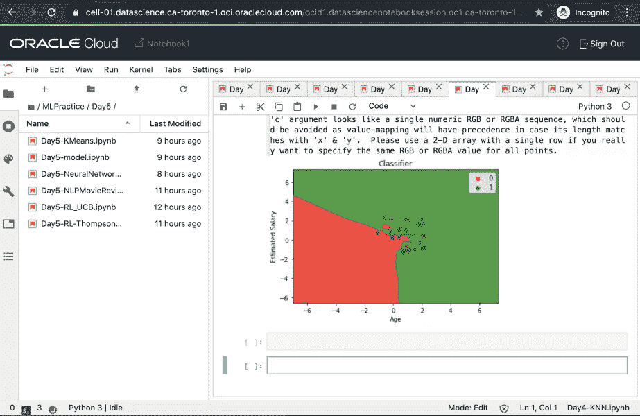
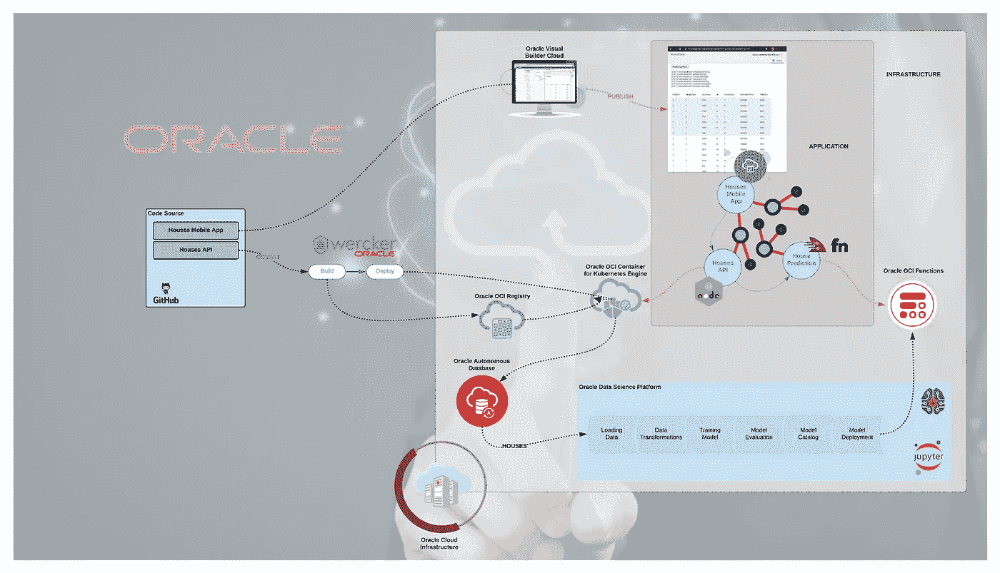
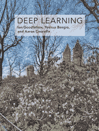
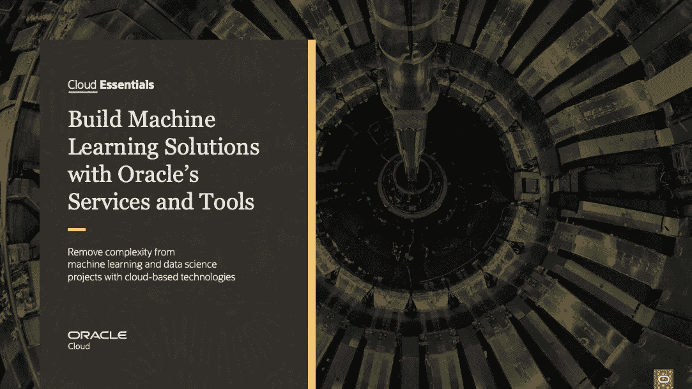
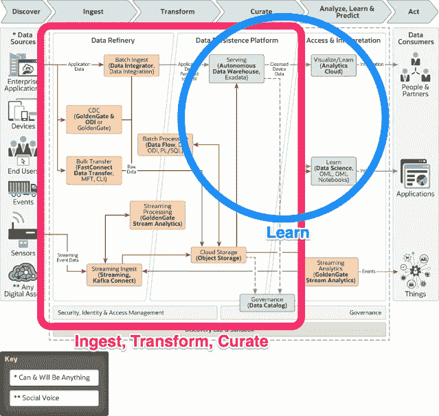

# 机器之旅与深度学习

> 原文：<https://medium.com/mlearning-ai/a-journey-into-machine-and-deep-learning-4bbf45956bd6?source=collection_archive---------3----------------------->

上周，我每天都在凌晨 3:45 醒来。这并不是因为我是一名失眠患者，而是因为我约好了在 4:00 参加我职业生涯中最有趣的一堂课，这是一门我在过去一年中一直热衷的课程。我已经有一段时间没有参加这样的激励课程了。这是一种很好的感觉去学习一些新的东西。本课程名为“使用 Python 为数据科学实现机器学习”( **Oracle** University)。

> 这不仅是关于我的旅程，但这可能是你的旅程或你的下一个旅程。

上图是我在本次培训中使用的 [Oracle OCI 数据科学平台](https://www.oracle.com/ca-en/data-science/cloud-infrastructure-data-science.html)上的 Jupyter 笔记本的屏幕截图。

Cloud Native Demo — L. Dessemon

就在一年前，OCI 数据科学平台宣布成立。为了参加在魁北克举行的云创新日，我决定利用我的 Cloud Native 演示来演示此平台的案例。这是一个基本的房地产管理应用程序。我们的 Data Science 平台发布后，我决定在应用程序中添加价格预测功能。演示效果良好，ML 部分的工作并不轻松，我更希望有更好的理解。我就是这样踏上这个领域的旅程的。

我决定尽可能多地阅读有关这个问题的资料。我在 Coursera 上开设了不同的课程。这是一本很好的书 [*Deep Learning*](https://www.amazon.ca/-/fr/Ian-Goodfellow/dp/0262035618/ref=sr_1_1?__mk_fr_CA=%C3%85M%C3%85%C5%BD%C3%95%C3%91&crid=2W1D1DMAXK3VK&dchild=1&keywords=goodfellow+deep+learning&qid=1613746624&sprefix=deep+learning+goodfell%2Cstripbooks%2C229&sr=8-1) ，作者是这一领域的三位专家(伊恩·古德费勒、约斯华·本吉奥和艾伦·库维尔)，这是我唯一一本想作为印刷本的关于这个主题的综合性书籍。这本书也是一个很好的来源，以刷新/学习背后的数学机器学习。

想象一下，您必须分析大量数据(万亿字节、千兆字节等)。如果提取几个八位字节的数据，并基于这些数据进行分析，您可能会发现一些明显的要应用的规则。规则如 *IF … THEN … ELSE IF … THEN …*

随着数据量的爆炸式增长，使用预定义规则分析数据几乎是一项不可能完成的任务，因为规则总是会丢失。这就是传统编程的局限性。

你可以把一个模型(由传统编程或机器学习(Machine Learning)产生)看作一个具有许多参数的函数的模板。

在传统编程中，你自己设置这些参数；您还要编写如何组合它们并产生准确结果的逻辑代码。通过机器学习，你可以通过实验和重复自动找到这些参数的值；您还会发现这些参数应该如何组合，以及它们在结果中扮演什么角色。通过深度学习，你可以后退一步，从一个更抽象的表示中发现那些参数应该是什么。实际上，在许多情况下，只要你能够推理和验证模型的输出，你就不必真的看到所有这些发现的内幕。

这并不意味着您不必编写任何代码；你的问题可以被潜在地分解成子问题，在这些子问题中 ML 是适用的，胶合将不得不“传统地”编码。

一石二鸟，我的 ML 之旅强化了我向我的客户解释他们如何使用**甲骨文云从他们的数据**中学习的方式。

如果你想了解**甲骨文云基础设施数据科学**和**甲骨文机器学习**，以及**甲骨文如何简化机器学习**，请阅读[这个](https://www.oracle.com/a/ocom/docs/build-machine-learning-solutions-cloud-essentials.pdf)。

[https://www.oracle.com/a/ocom/docs/build-machine-learning-solutions-cloud-essentials.pdf](https://www.oracle.com/a/ocom/docs/build-machine-learning-solutions-cloud-essentials.pdf)

O racle 提供了一个参考架构来利用数据进行商业分析和机器学习。这是一个很好的起点，可以帮助您了解更多关于使用 Oracle 云接收、转换和管理数据的信息。从一个商业问题到使用机器学习方法的解决方案， **80%的工作在数据探索**上，剩下的 **20%在使用 ML** 的解决方案上。Oracle 提供一整套云服务来接收、转换和管理数据。此外，要学习的云服务提供了一套工具，用于在开始学习之前准备数据。

-[Data Integrator](https://www.blogger.com/blog/post/edit/5041756810449327294/3875649403715026930#):Oracle Cloud Infrastructure Data Integration 是一款完全托管、无服务器的本机云服务，可帮助您完成常见的提取、加载和转换(ETL)任务，例如从不同来源获取数据、清理、转换和重塑数据，然后高效地将其加载到 Oracle Cloud infra structure 上的目标数据源。

-[golden gate](https://www.blogger.com/blog/post/edit/5041756810449327294/3875649403715026930#):Oracle golden gate 复制数据的速度比传统数据移动解决方案快 6 倍，可实现高可用性、灾难恢复和零宕机迁移，从而提供业务连续性。

-[ODI](https://www.blogger.com/blog/post/edit/5041756810449327294/3875649403715026930#):Oracle Data Integrator 是一个全面的数据集成平台，涵盖了所有的数据集成需求

- [数据流](https://www.blogger.com/blog/post/edit/5041756810449327294/3875649403715026930#):Oracle Cloud infra structure(OCI)数据流是一个完全托管的 Apache Spark 服务，可在无需部署或管理基础设施的情况下对超大型数据集执行处理任务。

- [FastConnect 数据传输](https://www.blogger.com/blog/post/edit/5041756810449327294/3875649403715026930#) : FastConnect 允许客户通过专用的私有高带宽连接直接连接到他们的 Oracle 云基础架构(OCI)虚拟云网络。— OCI 对象存储。

- [流媒体](https://www.blogger.com/blog/post/edit/5041756810449327294/3875649403715026930#):流媒体服务是一个面向开发者和数据科学家的实时、无服务器、兼容 Apache Kafka 的事件流媒体平台。

- [Kafka Connect](https://www.blogger.com/blog/post/edit/5041756810449327294/3875649403715026930#) :你可以使用 Kafka Connect，只需一个设置文件就可以进行大量的连接，而不是创建一堆代码。你可以用一种简单的方式与 JDBC、HDFS、Object Store 和许多其他网站建立联系。

# 下一步是什么？

使用培训期间使用的相同数据集，我继续使用 [Oracle AutoML](https://blogs.oracle.com/datascience/how-does-automl-impact-machine-learning) Pipeline 和 [Oracle 加速数据科学(ADS) SDK](https://docs.oracle.com/en-us/iaas/tools/ads-sdk/latest/index.html) 进行实验。
下周，我将参加一个为期 5 天的课程，学习如何在数据科学领域实施**深度学习**,我很兴奋，也很高兴能继续我的 ML/DL 之旅。一年后，我不再是新手了；-)

接下来会有更多的文章。