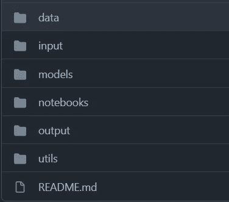
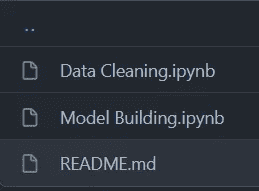

# 一个面向所有人的机器学习项目结构！

> 原文：<https://medium.com/mlearning-ai/a-machine-learning-project-structure-for-everyone-e48a81d0bb63?source=collection_archive---------6----------------------->

## 一个机器学习的项目结构，可以用来尽快从数据到测试:)

自从我第一次接触到程序员的绝对经典书籍《干净的代码》以来，我就对存在好代码和坏代码的概念着迷，并且 ***代码腐烂*** 是一个实际问题。那时我开始注意我写的代码有多干净。这对我来说真是一次大开眼界的经历。在我开始机器学习的同时阅读这本书让我思考如何在我的数据科学和机器学习项目中实际应用和实施这些原则。

大约 6 个月的尝试和测试各种想法的结果就是我即将提供给你的:终极机器学习项目结构！(是的，我对一个项目结构很感兴趣)。该结构的灵感主要来自 Abhishek Thakur 的**[**处理(几乎)任何机器学习问题**](https://store.pothi.com/book/abhishek-thakur-approaching-almost-any-machine-learning-problem-colour-version/)**。我的意思是，web 开发框架有自己预定义的目录结构。大部分 app 开发框架都有自己的。为什么我们不能成为乐趣的一部分？[🙂](https://emojipedia.org/slightly-smiling-face/)****

# ******为什么要用？******

****我可以一整天都谈论编码标准，但老实说，这有点超出了本文的范围。所以为了保持精确，你需要使用它，原因很简单，它会让你的机器学习工作流程**更快**和**更高效**，同时**因为它的构造方式降低了**出错的风险。我认为这是一个绝对的胜利；).****

# ****谁需要它？****

****考虑到数据和 ML 已经成为一个多么流行的词，每个人都在学习这种东西。因此，会有一个领域的人饱和的时候。在这种情况下，能力和效率开始变得越来越重要，以这种方式组织你的项目可以帮助你变得更有效率，使你的代码变得非常**可重用**(这对行业来说是好事)，并且可以帮助你显著提高项目的质量。****

# ******在哪里？******

****它是作为一个公共的 [**GitHub 库**](https://github.com/ashwiniyer176/ML-Project-Template) 提供的，你可以使用、派生以及贡献。我将接受这个库的拉请求，所以请随意试验，并对它做更多有用的补充。****

# ****什么时候用？****

****你可以用它做任何事情，从基本的**大学作业**到实际的**文件夹项目**。因为它只是一个文件夹结构，所以它也可以被集成到基于 web 开发的项目中，使它变得非常通用。****

## ****现在是百万美元的问题:****

# ****怎么用？****

********

****Root directory of the project****

****您可以看到有 6 个文件夹(截至 2022 年 2 月)。****

## ****数据****

****顾名思义，这个文件夹包含您的**未接触过的原始数据**。这些可能是。csv 文件，图像，音频文件。txt 文件或上述格式的任意组合。这个想法是你在这里存储你的**未处理的数据**。****

## ******输入******

****因此，你已经阅读了你的数据集，删除了丢失的值，执行了一些复杂的功能工程，可能很难重现，或者可能已经为你的文本数据集做了**单词嵌入**，它们都在这里。这个文件夹中的任何东西都被认为是你的 ML 模型或神经网络的**输入**，因此你所有的**清理过的**、**处理过的数据**都保存在这里。您也可以将它们作为**训练**、**测试**和**验证**分割保存在该文件夹中，因为这通常是将数据输入 ML 模型的方式。****

## ******型号******

****该文件夹包含您认为需要保存的**序列化模型文件**。这些可能是给你带来出色性能的各种模型，神经网络的**权重**或你的神经网络的**检查点**，它们都在这里。****

## ****笔记本电脑****

****理想情况下，这是您交互最多的文件夹。这个文件夹包含你所有相关的 **Jupyter 笔记本**。作为模板，我已经提供了两个，为了方便和无错误的机器学习，我建议你遵循这两个笔记本:****

********

****root/notebooks directory****

1.  ******数据清理:**这是你工作的开始。您从 ***root/data*** 文件夹中读取数据，执行所有您需要的数据清理，并在将它们分割用于训练、测试和验证后，将清理后的数据集保存在 ***root/input*** 中。****
2.  ******建模:**这是处理建模、评估和交叉验证的笔记本。**不要修改你在这个笔记本上的数据！**这可能导致模型性能的差异，即一个模型可能有 5 列，而另一个模型可能有 6 列。如果您希望删除一列或以任何方式更改您的数据，请在**数据清理笔记本**中这样做，然后再次运行。****

## ******输出******

****这个文件夹是从竞争的角度构建的，但它在正常情况下也会被证明是有用的。任何图、submission.csv 文件、设计文件等。哪一个可以算**工作成果**到此为止。****

## ******实用工具******

****这是一个**可选文件夹**，您可能需要也可能不需要。许多机器学习由你必须不断重写的**样板代码**组成，尤其是在建模阶段。现在可能会有一些包来处理这个问题，但是如果你有为简单的任务，比如制作支线剧情等，制作你自己的自定义函数的习惯。(我广泛这样做是因为**干:不要重复自己**)，那么你可以简单的保存那些。这个文件夹中的 py 脚本。或者，如果您真的不想做，您可以使用我在这里提供的对您有利的代码。****

# ****结论****

****总之，我想说的是，我们都可以使用更高一点的生产率、更高一点的效率和更快一点的工作方式。当这个工作流程实际上提高了你的项目的标准时，为什么不试试呢？我绝不说这是完美的。它仍然是一项正在进行的工作，而且很可能永远都是，但是我真的相信这段旅程是值得的。你永远不知道，有时候一个小小的优势可能会让事情变得对你有利！****

**** [## Mlearning.ai 提交建议

### 如何成为 Mlearning.ai 上的作家

medium.com](/mlearning-ai/mlearning-ai-submission-suggestions-b51e2b130bfb) 

🟠 [**成为作家**](/mlearning-ai/mlearning-ai-submission-suggestions-b51e2b130bfbv)****