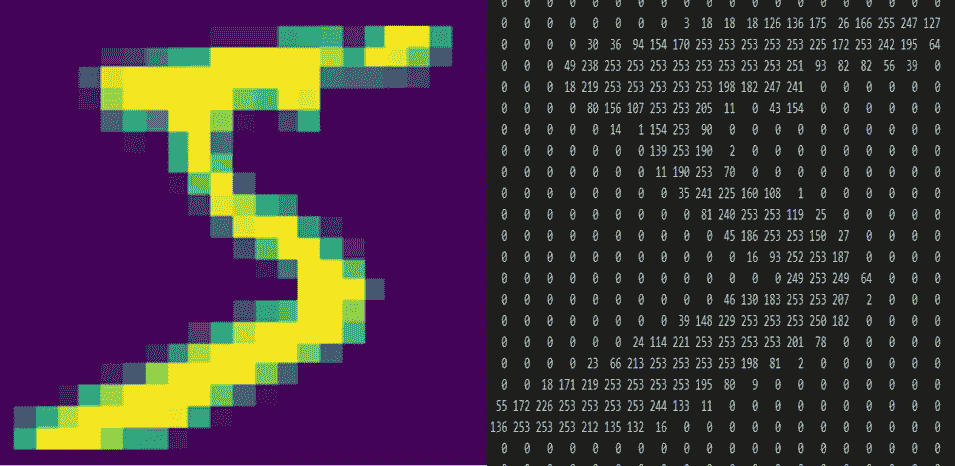
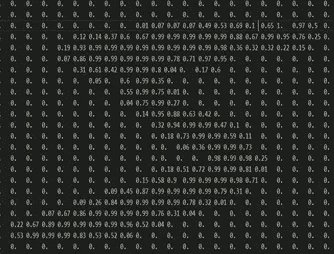
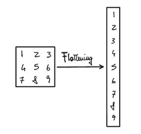
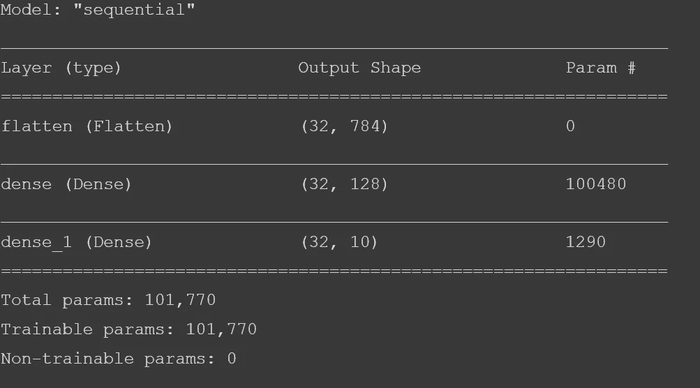
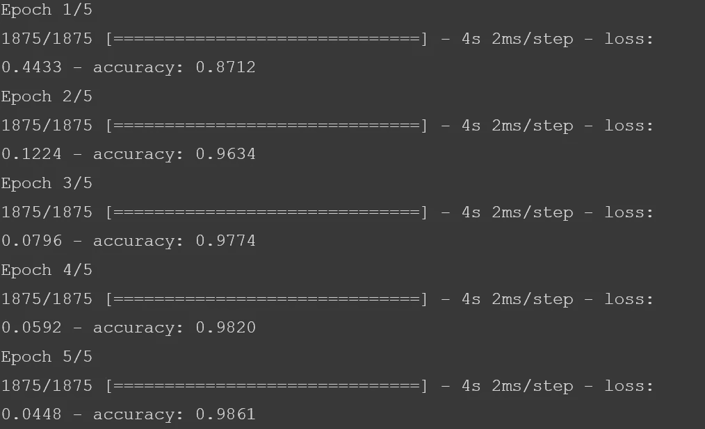
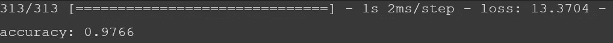

# 更复杂的神经网络

> 原文：<https://medium.com/mlearning-ai/a-more-complex-neural-network-4d05d2fabf1?source=collection_archive---------9----------------------->

## 一种用于图像分类的简单神经网络

## 介绍

在[之前的文章中，](https://lucabar1995.medium.com/developing-the-first-neural-network-with-tensorflow-5fade1a23395)我展示了如何创建最简单的神经网络，只有 1 个输入节点、1 个隐藏节点和 1 个输出节点，在这种情况下，神经网络会稍微复杂一些，并将用于图像分类。

# 图像分类

图像识别是检测图像中的对象并识别它们或将它们分类的能力。

自从我们出生以来，我们每天都被训练成千上万的图像，甚至没有意识到这一点，因此，对我们来说，区分狗和猫或任何其他动物是很容易的。然而，计算机要模仿这一过程并不那么容易。
计算机将图像视为一组数字，代表每个像素有多暗，它们试图寻找模式来识别和区分图像中的关键特征。

# 用于图像分类的神经网络模型的实现

**在这里，我们将训练一个神经网络来识别手写数字**，来自一个叫做 MNIST 的公共数据集。在 TensorFlow 库中，tf.keras dataset API 中直接提供了一些数据集，如 MNIST 手写数字数据集，通常用作机器学习程序的 hello world。

**手写数字数据集包含 70.000 个** (60.000 个用于训练，10.000 个用于测试)**灰度图像，分为 10 个不同的类别**，因此每个图像都有自己的标签，以低分辨率(28×28 像素)表示从 0 到 9 的数字图像。

首先我们需要导入 TensorFlow 库:

```
# Import
import tensorflow as tf
import numpy as np
import matplotlib.pyplot as plt
```

现在我们可以加载数据集，如前所述，它被分为测试和训练图像，每个图像都有自己的标签，因此我们需要将这些数据保存在 4 个变量中:

```
mnist = tf.keras.datasets.mnist
(train_images, train_labels), (test_images, test_labels) = mnist.load_data()
```

## 数据可视化

可视化我们的数据并理解它包含的内容对于每个机器学习应用程序来说始终是重要的一步。

首先，我们可以使用 **shape 属性打印数组**的**维度。**

```
train_images.shape(60000, 28, 28)
```

因此，我们确认图像为 60k，尺寸为 28x28 像素。现在让我们尝试打印训练图像的第一个值:

```
import matplotlib.pyplot as pltplt.imshow(training_images[0])print(training_labels[0])print(training_images[0])
```



Example of a training image(left) and how it is read by the computer as an array showing pixels intensity(right).

正如我们所看到的，数字中表示像素强度的值介于 0 和 255 之间，但是**在使用神经网络时，我们需要对数据进行归一化，并使值介于 0 和 1 之间**。

```
training_images = training_images / 255.0test_images = test_images / 255.0
```



Example of number 5 image after normalization.

## 模型创建

现在让我们来设计模型。

与前一篇文章中构建的模型相比，将会稍微复杂一些，但是很多事情都是如此

```
model = tf.keras.models.Sequential([tf.keras.layers.Flatten(),tf.keras.layers.Dense(128, activation=tf.nn.relu),tf.keras.layers.Dense(10, activation=tf.nn.softmax)])
```

在这里我们首先将模型定义为顺序的，这意味着它将是一个具有一系列层的神经网络。第一层叫做**展平**，它允许我们将一个矩阵“展平”成一维数组。



Example of Array flattening.

感谢扁平化层，我们现在可以转换每一个图像…这个数组作为我们的**密集**层的输入，它代表网络中的一层神经元。每个密集层都需要一个**激活函数**，来告诉它们做什么。

> 现在你可能会问我“为什么你在上一篇文章中没有谈到激活功能？”。实际上，当我们使用密集层时，如果没有指定激活函数，其默认值是**“线性”激活** : `a(x) = x.`

在这种情况下，因为模型的第一层需要在训练期间学习什么是数字，所以我们使用 **ReLU** 作为激活函数。数学上，ReLU 函数对所有的*x*0 的值返回 *x* ，对所有的 *x* ≤ 0 的值返回 0。

该输出将是该数字所属类别的估计，将是第二密集层的输入，该第二密集层将使用 **softmax** 激活函数，该函数将给出具有最高概率的类别作为输出。

定义好模型后，我们需要用 **model.compile()** 编译模型，这个函数用来配置模型的损耗、优化器和度量。

```
model.compile(optimizer = tf.keras.optimizers.Adam(),loss = ‘sparse_categorical_crossentropy’,metrics=[‘accuracy’])
```

使用命令 **model.summary** 我们可以查看模型的概要:层、输入/输出的形状以及它处理的参数数量:

```
model.summary()
```



从模型摘要的输出可以看出，**这个简单的模型有超过 101k 的可训练参数！**

## 模特培训

**现在该训练模特了**。在此阶段，模型将尝试使训练数据符合训练标签，或者换句话说，找出训练数据与其标签之间的关系，以便在向模型提供新图像时，它可以预测该图像属于哪个类别。

```
model.fit(training_images, training_labels, epochs=5)
```



正如我们所看到的，这个简单的神经网络在对训练数据进行分类时获得了 98.6%的准确率！仅在 5 个时期内就达到了这种高精度，因此我们没有过度拟合该模型，尽管处理了 60，000 幅图像，训练还是非常快。

现在让我们看看它是如何使用调用**模型处理看不见的数据的。评估**，将测试集及其标签作为参数传递，它将报告这个**“新”数据的准确性。**

```
model.evaluate(test_images, test_labels)
```



不出所料，看不见的数据的准确性稍差**，但 97.6%仍是一个好结果。**

# 对模型的思考

因此，我们所做的是将原始像素输入到神经网络中，该网络用于建立图像识别。凭借 97.6%的准确率，数字识别器在字母位于图像正中间的简单图像上确实工作得很好，但当数字没有完全位于图像中心时，识别器无法工作。哪怕是最轻微的位置变化都会毁掉一切。

> **换句话说，模型学会了识别居中的数字，而不是组成数字的特征。**

这就是卷积的强大之处。卷积是一种过滤器，它通过图像，对图像进行处理，并提取显示图像共性的特征。

# 下一步是什么？

在下一篇文章[中，我将解释我们在图像识别方面面临的挑战，以及为什么全连接神经网络不是这项任务的最佳模型。](/mlearning-ai/the-importance-of-convolutions-45d16210f15)

## 完整代码

在这里你可以看到完整的代码或者通过 Google Colab 试试看: