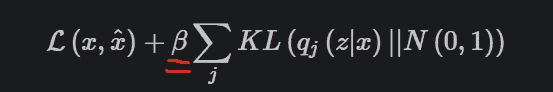
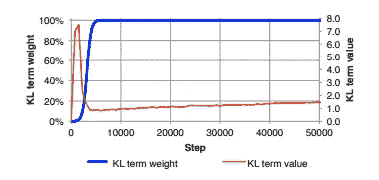
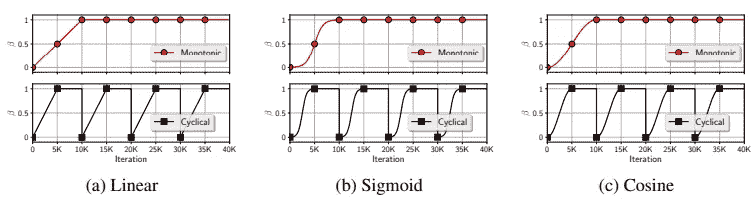

# VAE 的必备训练技巧(变分自动编码器)

> 原文：<https://medium.com/mlearning-ai/a-must-have-training-trick-for-vae-variational-autoencoder-d28ff53b0023?source=collection_archive---------0----------------------->

[http://www.quickmeme.com/meme/35m30c](http://www.quickmeme.com/meme/35m30c)

这个诀窍被称为[循环退火时间表](https://aclanthology.org/N19-1021.pdf)，正如杜克大学和微软研究院在雷蒙德的一篇论文中所描述的。

VAE 是自然语言处理任务中常见的一种强大的深度生成模型。虽然 VAE 的概念不是本文的重点，但对 VAE 的简要介绍有助于理解这个技巧。在训练 VAE 模型时，我们使用训练数据本身作为标签，并将数据抑制到低维空间中。在 VAE 我们有两个部分:编码器和解码器。编码器将数据编码到低维空间中，而解码器从潜在表示中重构原始数据。通过这样做，我们迫使模型以紧凑的方式表达我们的训练数据，并在潜在空间中将相似的数据分组在一起。空间中相邻点之间的相似性取决于目标函数的设计。在自然语言处理领域，一个好的表示意味着很多，因为一个单词或句子通常是在非常高的维度上描述的，因此建模具有挑战性。有了**意味深长的**和**紧凑的**表象，我们就能在下游任务中表现得更好。例如，在药物发现中，研究人员必须在 10⁶⁰的化学空间中搜索新分子的大小，但现在他们可以缩小搜索空间，并在所需的区域中导航。

VAE 的所有训练技巧都服务于一个目的:以较小的信息损失更好地表示原始数据。

在目标函数中有两个分量:重建损失和 kull back-lei bler 发散项的损失(KL 损失)。前者表明 VAE 能多好地从潜在空间重建输入序列，而后者测量两个数据分布彼此有多相似。在实际应用中，我们通常计算潜在分布和标准正态分布之间的 KL 散度。正如我们在下面的函数中看到的，系数β控制着 KL 散度在总损失中的权重。

[https://www.jeremyjordan.me/variational-autoencoders/](https://www.jeremyjordan.me/variational-autoencoders/)

这里我们有一个臭名昭著的 KL 消失问题:KL 项在训练期间变得非常小(接近于零)。当解码器以自回归方式工作时，就会发生这种情况。而 KL 消失问题将导致数据分布符合标准正态分布的不太有趣(如果不是无意义的话)的表示。

缓解 KL-消失问题的一种方法是对 KL 项应用退火程序。

传统的方法是单调退火。通过从小系数β开始，我们迫使模型集中于重建输入序列，而不是最小化 KL 损失。随着 Beta 的增加，模型逐渐强调数据分布的形状，最终 Beta 达到 1 或预先指定的值。

[https://arxiv.org/pdf/1511.06349.pdf](https://arxiv.org/pdf/1511.06349.pdf)

杜克大学和微软研究院的研究人员提出了循环退火计划，其中传统的退火重复多次。这个时间表有助于建立一个更好地组织的潜在空间，并在计算中增加微不足道的额外成本。论文中的官方演示如下所示，

[https://aclanthology.org/attachments/N19-1021.Supplementary.pdf](https://aclanthology.org/attachments/N19-1021.Supplementary.pdf)

正如我们所见，有三种方法可以增加 KL 项的权重:线性，Sigmoid 和余弦。根据经验，我发现他们在训练中大致相同，下游任务的表现提高了两位数的百分比。官方 GitHub 回购的论文是[这里](https://github.com/haofuml/cyclical_annealing/blob/master/plot/plot_schedules.ipynb)。

参考:

循环退火程序:一种减轻 KL 消失的简单方法

https://aclanthology.org/N19-1021.pdf

# 无关的想法

试着把 ELBO 想成一个双目标优化。然后，我们可以将技巧应用于任何多目标优化问题(特别是当损失函数的一个组件导致模型绕过所有其他损失组件时)。