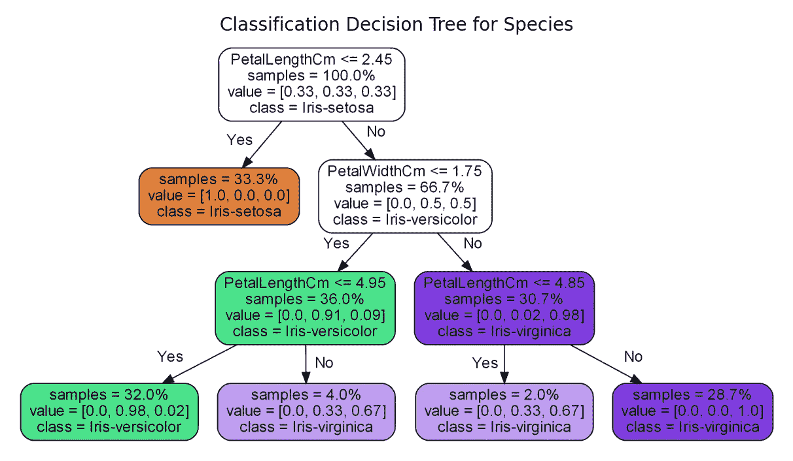
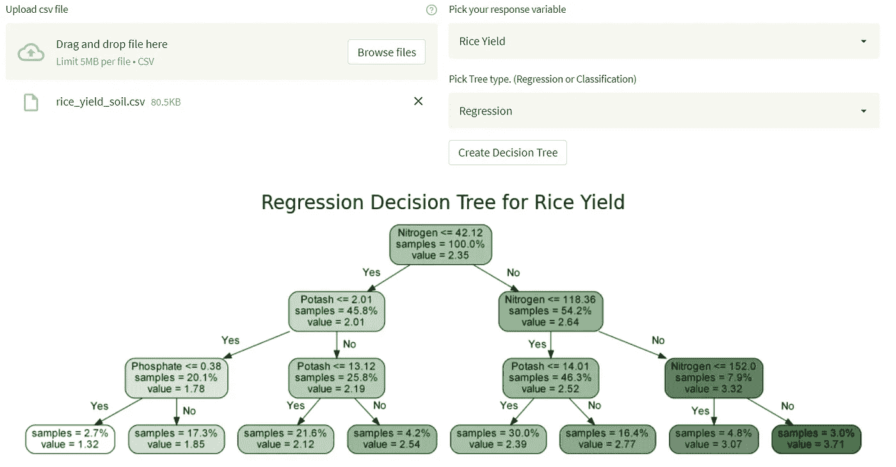

# 一个简洁的网络应用程序，用决策树来绘制你的数据

> 原文：<https://medium.com/mlearning-ai/a-neat-web-app-to-map-out-your-data-with-a-decision-tree-b9f77c5600c7?source=collection_archive---------7----------------------->

TL；博士制作机器学习驱动的带有拖放界面的决策树这里:[createdecisiontree.com](https://joseph-foley-display-dtree-webapp-createdecisiontree-bac-6w6lye.streamlitapp.com)

我作为一名数据科学家已经工作了大约四年，我开始意识到我是多么幸运，因为我有这个巨大的工具包来帮助我从数据中获得洞察力。这个领域最近的一个趋势是关于[民主化机器学习](https://towardsdatascience.com/democratize-artificial-intelligence-48643394440f)。其中一部分是为了让我们使用的工具和算法更容易被那些没有我们技术背景的人使用。

Making ML more accessible means more people can contribute to its impact. Photo by [Canva](https://www.pexels.com/@canvastudio). From [Pexels](https://www.pexels.com/photo/a-group-of-professionals-sharing-ideas-3153207/).

在我的所有角色中，当涉及到机器学习时，有一件事一直吸引着利益相关者的注意力。那就是卑微的决策树。当谈到机器学习时，它不是最先进的模型，但当它以图形方式呈现时，它揭示了关于数据的各种见解。

Image by Author

如果不清楚我们如何解释这些树，请不要担心，我们很快会用一些用例来说明。

一段时间以来，我一直想创造一些东西，让任何人都可以用一些数据为自己创建这些树。由于我的背景不是创建图形用户界面或网站，我真的不知道如何才能做到这一点。直到我遇到一个名为 [Streamlit](https://streamlit.io/) 的 Python 库。这个强大的库允许只具备 Python 基础知识的人相对容易地创建交互式 web 应用程序。他们的网站声明“不需要前端经验”——所以我知道这是为我准备的！

Image by [Andrea Piacquadio](https://www.pexels.com/@olly). From [Pexels](https://www.pexels.com/photo/amazed-formal-male-looking-at-laptop-screen-3760809/)

在对 Streamlit 进行了一些修补，并花了一些时间在 AWS 上配置了一些东西之后，我设法启动了[createdecisiontree.com](https://joseph-foley-display-dtree-webapp-createdecisiontree-bac-6w6lye.streamlitapp.com)。只要你有表格 csv 格式的数据，你就可以把它拖放到站点上来制作一个 ML 决策树。当然，你首先需要给树一个目标！

## **示例用例**

**分类**

决策树处理的两个主要任务是分类和回归。我们来看一个分类的例子。假设一家电信公司希望了解他们的哪些客户可能会流失(客户停止购买他们的服务)。有两个类需要考虑。**是** —他们会流失，**否—** 他们不会流失**。**

现在假设每个客户都有各种记录，比如他们的任期、合同期限、产生的费用以及他们订阅的产品。他们可以使用他们的历史数据来显示这些信息，以及谁已经和没有搅拌，以创建一个分类决策树。在[createdecisiontree.com](https://joseph-foley-display-dtree-webapp-createdecisiontree-bac-6w6lye.streamlitapp.com)上，他们指定他们希望树预测什么(变动),然后将树类型设置为分类。

有很多东西需要考虑，所以让我们从算法决定进行第一次分裂的顶部节点开始。我们认为，客户在公司工作的时间是超过还是少于 16.5 个月非常重要。如果少于 16.5 个月(“是”路径)，我们会看到下一个最重要的划分是客户是否有光纤。你会注意到那个节点的颜色变浅了。它仍然是红色的(class = No ),因此表明客户不会流失，但由于它更轻，仍然在这条路径上的人更有可能流失(从每个节点的“值”中可以看出，在顶部节点中为 46%对 27%)。

接下来，如果客户没有光纤(“否”路径)，我们将被引导到一个绿色节点，class = Yes。仍在这条路上的客户现在更有可能流失(68%的客户流失，32%的客户不流失)。因此，根据该树，与该公司合作 16 个月或更短时间且没有光纤的客户更有可能流失。最后，我们看到，如果客户花费少于 120 英镑，客户流失的可能性会进一步增加。

这是非常有用的信息！树中的其他路径也揭示了影响客户流失的因素。

**回归**

回归呢？如果我们想看到特定变量对一个数量或连续值的影响，那么我们会使用回归树。

我们可以用回归来预测不同营养成分土壤中的作物产量。回归决策树可以让我们对我们可能为此进行的任何实验有有用的了解。

这些种类的树只有一种颜色，颜色越深，我们测量的东西的价值就越大。

我们的树告诉我们，土壤中氮含量越高，产量越高。我们看到，当氮浓度较低时(顶部节点上的“是”路径)，树认为钾浓度有利于决定作物产量。如果钾碱含量低(又是“是”路径)，那么树会根据磷酸盐浓度分割数据。

虽然这棵树或多或少在说，每种养分越多，产量越高，但它也揭示了这些养分的关键浓度水平。这将引导我们进一步研究这些水平。

## 包扎

作为一个把机器学习作为日常工作的人，我确实觉得有必要说，当谈到它们的预测能力时，这些树并不令人惊讶。它们有一些问题，使它们稍微不可靠，例如过度拟合(这是我不会在这里讨论的主题)。

然而，它们非常善于揭示数据中隐藏的、你可能没有意识到的洞察力。这就是我使用它们的目的，为了更好地理解我正在处理的数据。现在，由于 Python 社区开发的一些非常酷的工具，我很高兴能够提供这个 web 应用程序，这样任何拥有装满数据的 csv 的人都可以使用它来生成决策树。

看看这里:[createdecisiontree.com](https://joseph-foley-display-dtree-webapp-createdecisiontree-bac-6w6lye.streamlitapp.com)

 [## Mlearning.ai 提交建议

### 如何成为 Mlearning.ai 上的作家

medium.com](/mlearning-ai/mlearning-ai-submission-suggestions-b51e2b130bfb)