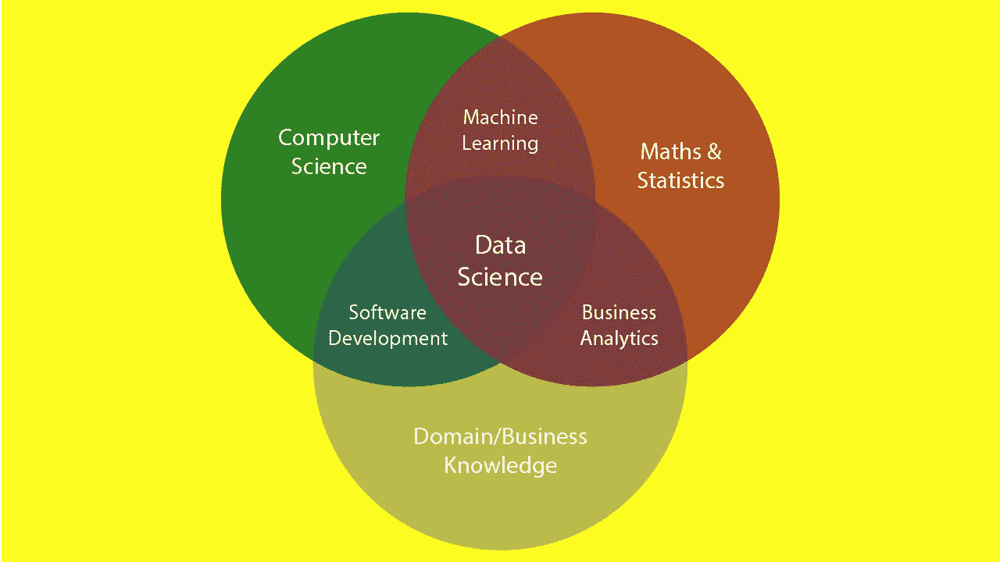

# 数据科学的非技术性介绍

> 原文：<https://medium.com/mlearning-ai/a-non-technical-introduction-to-data-science-69505f16ddf4?source=collection_archive---------5----------------------->

> 数据科学家:比任何科学家都更擅长解释分析结果的商业含义，比任何 MBA 都更擅长分析科学的人詹妮弗·普里斯特利博士

# 介绍

数据科学课程无处不在，但它通常是从技术角度出发的。本文从非技术角度介绍了数据科学，帮助您走上正确的道路。

打个比喻，数据科学是应用统计学和计算机科学的微妙结合。数据科学家使用统计技术和计算机算法的组合来寻找数据集中的模式，然后使用他们的领域知识来解释这些模式的意义以及它们如何应用到现实世界中。目的是获得决策的洞察力。

在过去的几年里，对数据科学领域感兴趣的人数大幅增加，这要归功于众多的出版物，比如《T2》中关于为什么数据科学是“21 世纪最性感的工作”的文章。

本文旨在帮助读者步入数据科学的世界。以下部分将向您概述数据科学职业。

# 数据科学职业概述

在我们深入探讨之前，让我们简要地看一下人们选择开始从事数据科学职业的主要原因:

*   对数据科学家的需求很大
*   薪水比大多数工人高得多
*   数据科学家通常有在世界上任何地方或任何行业工作的自由
*   由于数据科学家的短缺，竞争很小，求职很容易。

数据科学行业有几个不同的角色，个人可以进入:机器学习专家，数据可视化专家，数据科学家和数据工程师是你可以进入的许多角色中的几个。根据你的工作经验和背景，进入一个角色会比另一个更容易。例如，软件开发人员会发现进入数据工程角色更容易。

虽然数据科学的职业可能很有趣，也很容易找到，但未来的数据科学家应该考虑在规划下一步之前提升他们在统计和编程方面的技能。既然你已经了解了什么是数据科学，以及为什么人们选择从事 it 行业，那么下一节将向你介绍机器学习的核心组成部分之一——统计学。

# 统计学是数据科学的要求

> *“对假设有效性的唯一相关测试是将其预测与经验进行比较。”—米尔顿·弗里德曼*

机器学习的先决条件和核心组成部分之一是统计学。统计学帮助你理解人工智能发挥作用的基本概念。统计学基础对于从数据中发现见解和得出结论至关重要。统计学的概念和技术在数据分析中被广泛用于操纵数据。

我列出了几个你需要知道的话题:

*   数据类型
*   人口和抽样
*   可能性
*   集中趋势测量
*   离差的度量
*   变量和变量选择
*   不同类型的分布
*   中心极限定理
*   假设检验
*   回归

网上有很多免费资源可以让你快速掌握上述主题，所以花点时间学习它们吧。在下一节中，我还将讨论作为数据科学核心组成部分之一的编程。

# 编程是数据科学的要求

数据科学领域的一个有趣部分是机器学习，它指的是数据科学家利用的允许计算机从数据中学习的一系列技术。

实现机器学习需要编码，有能力实现的程序员将对算法(模型)如何工作有很强的理解，并将轻松地优化这些算法。

机器学习很有趣，因为它的目标是训练计算机自己学习。

数据科学家通常选择一种编程语言来工作。有可用的用这种语言编写的包，可以让你轻松地完成工作。

Python 是最受欢迎的数据科学编程语言之一，它附带了大量的包和社区支持，几乎没有任何需要完成的数据科学项目是不能用 python 实现的。我建议你继续学习 python。

其他用于数据科学的编程语言包括 Julia、R、JavaScript、SQL 等。

没有领域知识，统计技术的应用和数据科学的编程将是不完整的，我将在下一节简要讨论这一点。

# 对领域知识的需求

简单地说，在这种情况下，领域知识指的是数据科学方法所应用的环境或领域的一般背景知识。当您构建预测算法时，理解您的数据集至关重要。

数据科学家花费大约 85%的时间来理解和清理数据。这是因为了解您的数据可以为您节省大量时间和资源。

在大多数情况下，领域知识可能不是绝对必要的，但是它可以让您对数据有一定的洞察力，这进一步让您在建模时更有优势。

拥有领域知识的数据科学家可以轻松地将知识转化为计算机程序和活动数据，这反过来又可以转变程序，并确保它专门用于特定领域，使其对最终用户非常有价值。

# 那么接下来呢？

没有人开始真的很好，我们在工作中逐步学习。你不应该把你的开始和已经有 10 年经验的人相比，那对你的追求和你正在建立的东西是不公平的。给自己成长的时间。

有很多人对数据工作没有热情，但他们最终还是从事了数据科学方面的职业。

开始吧，加入数据科学家和机器学习实践者的在线社区，如 [Kaggle](http://kaggle.com) ，从初级活动开始，扩展您的学习流程，构建、部署并获得反馈！

通过部署机器学习模型，获得其预测能力的优势。从商业角度来看，这是最重要的步骤之一，但也是最没人教的一步。

好了，快乐学习。

*如果你觉得这些信息有用，请随意分享，这样其他有抱负的数据科学家也可以受益。*

*如果您有任何问题，请随时联系我们！*

在 [Twitter](http://twitter.com/inspiredbash) 或 [LinkedIn](http://linkedin.com/in/anakobe) 上与我联系！

 [## Mlearning.ai 提交建议

### 如何成为 Mlearning.ai 上的作家

medium.com](/mlearning-ai/mlearning-ai-submission-suggestions-b51e2b130bfb)