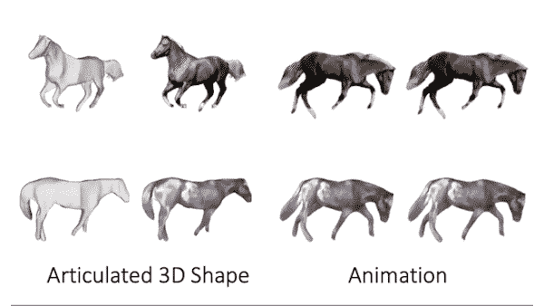

# 从单张照片学习 3D 的新模型

> 原文：<https://medium.com/mlearning-ai/a-novel-model-that-learns-3d-from-a-single-photo-ce4683955b15?source=collection_archive---------2----------------------->

## [文本转 3D 的下一步](https://open.substack.com/pub/mlearning/p/new-3d-generation-method-2faster?r=z7zu8&utm_campaign=post&utm_medium=web)

## 结合几项新改进的力量

[New 3D generation method — 2×faster](https://open.substack.com/pub/mlearning/p/new-3d-generation-method-2faster?r=z7zu8&utm_campaign=post&utm_medium=web)

3D 数字内容正被用于游戏、娱乐、建筑和机器人领域。购物、网络会议、社交网络、教育等。，都受到影响。高质量的 3D 需要创意、艺术和建模技能…