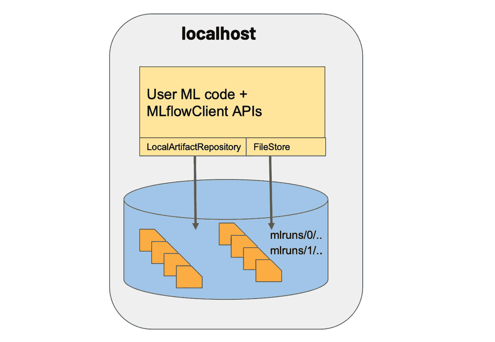
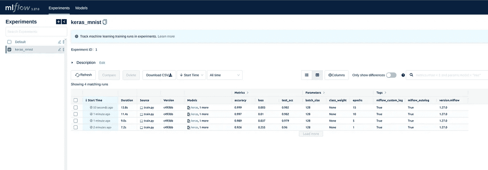
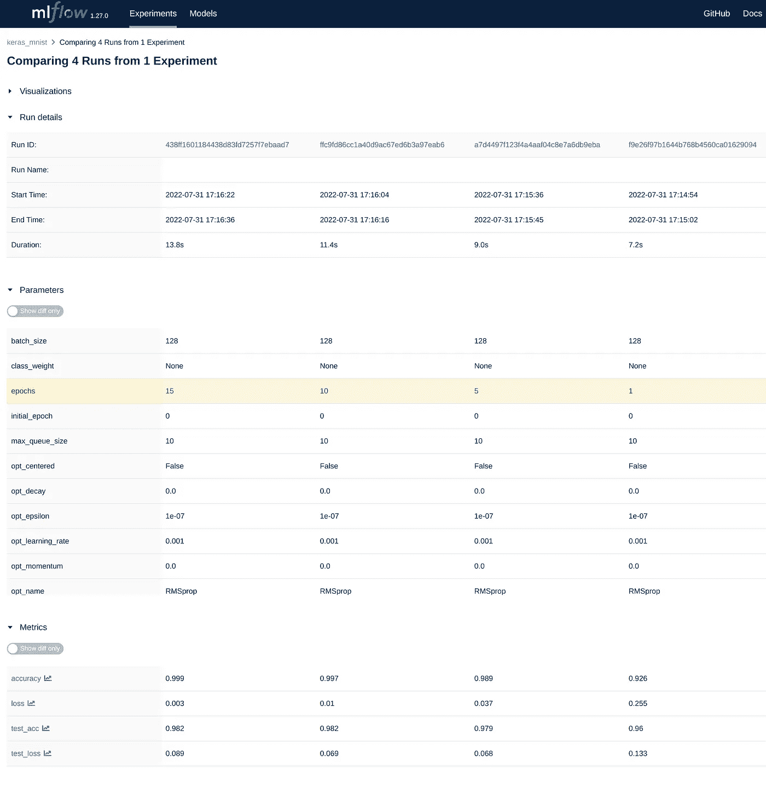

# 管理 ML 生命周期的止痛药。第一部分

> 原文：<https://medium.com/mlearning-ai/a-pain-killer-for-managing-ml-lifecycle-part-1-70adb7c19c3a?source=collection_archive---------7----------------------->

在本文中，我们将了解 mlflow 及其组件之一——跟踪。


Photo by [Fatos Bytyqi](https://unsplash.com/@fatosi?utm_source=medium&utm_medium=referral) on [Unsplash](https://unsplash.com?utm_source=medium&utm_medium=referral)

> 自动化的目标不是让人们失去工作，而是让所有普通的费力的任务自动化，这样我们人类就可以做创造性的工作。

# 介绍

机器学习(ML)开发带来了许多超越传统软件开发生命周期的新的复杂性。与传统的软件开发不同，ML 工程师希望尝试多种算法、工具和参数来获得最佳结果，他们需要跟踪这些信息来重现工作。此外，ML 工程师需要使用许多不同的系统来生产模型。

# 关于读者

面向熟悉机器学习算法基础和在生产中运行机器学习应用的数据科学家和软件/机器学习工程师。读者应该熟悉 Bash、Python 和一些面向对象编程的基础知识，这将有助于更好地掌握代码。

# MLflow 之旅

## **什么是 MLflow？**

MLflow 是一个管理端到端机器学习生命周期的开源平台。它提供了四个主要功能——跟踪、项目、模型和模型注册。我们将在后面的章节中了解每个组件。

## 为什么是 MLflow？

MLflow 与库无关。你可以用任何机器学习库和任何编程语言来使用它，因为所有的函数都可以通过 [REST API](https://mlflow.org/docs/latest/rest-api.html#rest-api) 和 [CLI](https://mlflow.org/docs/latest/cli.html#cli) 来访问。

MLflow 内置了与大多数著名的、大量使用的机器学习库的集成。


Source: from mlflow.org

## MLflow 的组件:

1.  跟踪—实验跟踪(记录和查询)
2.  项目—可重复运行(打包格式可在任何平台上运行)
3.  模型—打包模型(格式支持各种部署工具)
4.  注册表—用于存储、注释、发现和管理的中央存储库。

## MLflow 跟踪:跟踪实验/运行

MLflow 跟踪组件是一个 API 和 UI，用于在运行机器学习代码时记录参数、代码版本、指标和输出文件，并在以后可视化结果。MLflow Tracking 允许您使用 [Python](https://mlflow.org/docs/latest/python_api/index.html#python-api) 、 [REST](https://mlflow.org/docs/latest/rest-api.html#rest-api) 、 [R API](https://mlflow.org/docs/latest/R-api.html#r-api) 和[Java API](https://mlflow.org/docs/latest/java_api/index.html#java-api)API 来记录和查询实验。

在本练习中，我们将使用(Tensorflow) Keras 模型，该模型使用 MNIST 数据集进行模型训练。

在这个简单的场景中，MLflow 客户端使用以下接口来记录 MLflow 实体和工件:

*   一个**localaartifactrepository**的实例(用来存储工件)
*   一个**文件存储**的实例(用于保存 MLflow 实体)



Image sourced from mlflow.org

**项目结构:**

```
- src  
    - train.py        # model training code
    - utils.py        # utility functions
- requirements.txt
- Makefile
- README.md
```

这个结构可以在 [github 仓库中看到。](https://github.com/venkatkollimarla/tf-keras-with-mlflow)

我们先来看看 train.py，了解一下 mlflow 是怎么回事

我们从记录包的版本开始:

```
print(" Versions:")    
print(" MLflow Version:", mlflow.__version__)    
print(" TensorFlow version:", tf.__version__)    
print(" Keras version:", keras.__version__)    
print(" Python Version:", platform.python_version())    
print(" Operating System:",platform.system()+"-"+platform.release())    
print(" Tracking URI:", mlflow.tracking.get_tracking_uri())
```

接下来，我们调用 main()函数，该函数从命令行接受选项，并调用其他函数来执行模型训练:

如您所见，我们在运行培训文件时记录从命令行收到的选项，为了处理命令行参数/选项，我们使用了一个名为[的 python 包，单击](https://pypi.org/project/click/)。

我们为我们使用的每一种包设置了自动日志。MLflow 有自己的 ML 库风格，这里我们使用 keras，tensorflow 来做这个练习。

我们可以设置一个实验，使用:

```
mlflow.set_experiment("Keras_TF_MLflow")
```

将给定的实验设置为活动实验。实验必须通过实验名称指定名称，或者通过实验 id 指定 ID。实验名称和 ID *不能同时指定*。

什么是跑步？

Run 是项目中的一段代码。可以将运行记录到本地文件、数据库或跟踪服务器(远程)。要远程记录运行，我们需要设置 URI(例如: **MLFLOW_TRACKING_URI** 环境变量或通过 API**ml flow . set _ TRACKING _ uri()**)到跟踪服务器的 URI 或调用。

## **每次运行记录以下信息:**

> **开始&结束时间:**运行的开始和结束时间
> 
> **神器**它是任何格式的输出文件。我们可以制作图像、模型和数据文件作为人工制品。
> 
> **代码版本:**用于运行的 Git 提交散列。
> 
> **度量**是键-值对(键:度量，值:数值)。运行更新这些指标和 MLflow 记录，并可视化指标历史记录。
> 
> **参数**这些是您选择的变量和跟踪信息的键值对。
> 
> **Source:** 启动运行的文件名，或项目名

我们可以从 MLflow python API 开始实验:

```
# start mlflow experiment
with mlflow.start_run() as run:
    print("MLflow:")
    print("run_id:",run.info.run_id)
    print("experiment_id:",run.info.experiment_id)
```

对于每次运行/实验，MLflow 都会生成一个名为 run_id 的唯一 id。

在当前运行下设置标记:标记使您能够以不同的方式对 MLflow 运行进行分类，例如，通过版本、环境或任何有用的附加信息。

```
mlflow.set_tag("version.mlflow", mlflow.__version__)
mlflow.set_tag("version.keras", keras.__version__)
mlflow.set_tag("version.tensorflow", tf.__version__)
```

现在，调用 train()函数:模型训练代码

```
train(run, model_name, data_path, epochs, batch_size, mlflow_custom_log)
```

在训练代码中，我们记录参数、工件和度量。

```
# logging parameters
mlflow.log_param("epochs", epochs)# log metrics
mlflow.log_metric("test_acc", test_acc)
mlflow.log_metric("test_loss", test_loss)# logging artifacts
# write model as json file
with open("model.json", "w") as f:
    f.write(model.to_json())
mlflow.log_artifact("model.json")
```

MLflow 的美妙之处在于可以通过 python API 访问所有自动记录的信息，例如，我们可以获取结束运行时自动记录的参数和指标。

```
tags = {k: v for k, v in run.data.tags.items() if not k.startswith("mlflow.")}artifacts = [f.path for f in MlflowClient().list_artifacts(run.info.run_id, "model")]print("run_id: {}".format(run.info.run_id))print("artifacts: {}".format(artifacts))print("params: {}".format(run.data.params))print("metrics: {}".format(run.data.metrics))print("tags: {}".format(tags))
```

## 自动记录信息的输出:

```
**run_id**: 438ff1601184438d83fd7257f7ebaad7**artifacts**: ['model/MLmodel', 'model/conda.yaml', 'model/data', 'model/python_env.yaml', 'model/requirements.txt']**params**: {'shuffle': 'True', 'initial_epoch': '0', 'validation_split': '0.0', 'opt_name': 'RMSprop', 'opt_rho': '0.9', 'use_multiprocessing': 'False', 'opt_decay': '0.0', 'opt_momentum': '0.0', 'opt_centered': 'False', 'epochs': '15', 'validation_steps': 'None', 'opt_epsilon': '1e-07', 'batch_size': '128', 'sample_weight': 'None', 'class_weight': 'None', 'workers': '1', 'opt_learning_rate': '0.001', 'max_queue_size': '10', 'validation_freq': '1', 'steps_per_epoch': 'None', 'validation_batch_size': 'None'}**metrics**: {'loss': 0.0031751864589750767, 'test_acc': 0.9819999933242798, 'test_loss': 0.08936446905136108, 'accuracy': 0.9991833567619324}**tags**: {'mlflow_custom_log': 'True', 'mlflow_autolog': 'True', 'version.mlflow': '1.27.0', 'version.tensorflow': '2.9.1', 'keras_autolog': 'True', 'version.keras': '2.9.0', 'tensorflow_autolog': 'False'}
```

当您通过`python train.py`运行 train.py 时，您应该会看到如下所示的输出:

```
Versions:
  MLflow Version: 1.27.0
  TensorFlow version: 2.9.1
  Keras version: 2.9.0
  Python Version: 3.9.12
  Operating System: Linux - 5.15.0-41-generic
  Tracking URI: file:///home/user/Documents/mlflow/tf-keras-with-mlflow/mlruns
Options:
  experiment_name: None
  model_name: None
  data_path: None
  epochs: 5
  batch_size: 128
  mlflow_autolog: False
  keras_autolog: False
  tensorflow_autolog: False
  mlflow_custom_log: True
MLflow:
  run_id: 09eacfb5b55b4b5c80d04a5ad8df9202
  experiment_id: 0
Data:
  x_train.shape: (60000, 28, 28)
  y_train.shape: (60000,)
  x_test.shape: (10000, 28, 28)
  y_test.shape: (10000,)
Data after reshape:
  x_train.shape: (60000, 784)
  y_train.shape: (60000, 10)
  x_test.shape: (10000, 784)
  y_test.shape: (10000, 10)
2022-07-31 15:03:07.332176: I tensorflow/stream_executor/cuda/cuda_gpu_executor.cc:975] successful NUMA node read from SysFS had negative value (-1), but there must be at least one NUMA node, so returning NUMA node zero
2022-07-31 15:03:07.332385: I tensorflow/stream_executor/cuda/cuda_gpu_executor.cc:975] successful NUMA node read from SysFS had negative value (-1), but there must be at least one NUMA node, so returning NUMA node zero
2022-07-31 15:03:07.348190: I tensorflow/stream_executor/cuda/cuda_gpu_executor.cc:975] successful NUMA node read from SysFS had negative value (-1), but there must be at least one NUMA node, so returning NUMA node zero
2022-07-31 15:03:07.348375: I tensorflow/stream_executor/cuda/cuda_gpu_executor.cc:975] successful NUMA node read from SysFS had negative value (-1), but there must be at least one NUMA node, so returning NUMA node zero
2022-07-31 15:03:07.348546: I tensorflow/stream_executor/cuda/cuda_gpu_executor.cc:975] successful NUMA node read from SysFS had negative value (-1), but there must be at least one NUMA node, so returning NUMA node zero
2022-07-31 15:03:07.348706: I tensorflow/stream_executor/cuda/cuda_gpu_executor.cc:975] successful NUMA node read from SysFS had negative value (-1), but there must be at least one NUMA node, so returning NUMA node zero
2022-07-31 15:03:07.349508: I tensorflow/core/platform/cpu_feature_guard.cc:193] This TensorFlow binary is optimized with oneAPI Deep Neural Network Library (oneDNN) to use the following CPU instructions in performance-critical operations:  AVX2 FMA
To enable them in other operations, rebuild TensorFlow with the appropriate compiler flags.
2022-07-31 15:03:07.488034: I tensorflow/stream_executor/cuda/cuda_gpu_executor.cc:975] successful NUMA node read from SysFS had negative value (-1), but there must be at least one NUMA node, so returning NUMA node zero
2022-07-31 15:03:07.488245: I tensorflow/stream_executor/cuda/cuda_gpu_executor.cc:975] successful NUMA node read from SysFS had negative value (-1), but there must be at least one NUMA node, so returning NUMA node zero
2022-07-31 15:03:07.488431: I tensorflow/stream_executor/cuda/cuda_gpu_executor.cc:975] successful NUMA node read from SysFS had negative value (-1), but there must be at least one NUMA node, so returning NUMA node zero
2022-07-31 15:03:07.488602: I tensorflow/stream_executor/cuda/cuda_gpu_executor.cc:975] successful NUMA node read from SysFS had negative value (-1), but there must be at least one NUMA node, so returning NUMA node zero
2022-07-31 15:03:07.488772: I tensorflow/stream_executor/cuda/cuda_gpu_executor.cc:975] successful NUMA node read from SysFS had negative value (-1), but there must be at least one NUMA node, so returning NUMA node zero
2022-07-31 15:03:07.488939: I tensorflow/stream_executor/cuda/cuda_gpu_executor.cc:975] successful NUMA node read from SysFS had negative value (-1), but there must be at least one NUMA node, so returning NUMA node zero
2022-07-31 15:03:07.977196: I tensorflow/stream_executor/cuda/cuda_gpu_executor.cc:975] successful NUMA node read from SysFS had negative value (-1), but there must be at least one NUMA node, so returning NUMA node zero
2022-07-31 15:03:07.977385: I tensorflow/stream_executor/cuda/cuda_gpu_executor.cc:975] successful NUMA node read from SysFS had negative value (-1), but there must be at least one NUMA node, so returning NUMA node zero
2022-07-31 15:03:07.977514: I tensorflow/stream_executor/cuda/cuda_gpu_executor.cc:975] successful NUMA node read from SysFS had negative value (-1), but there must be at least one NUMA node, so returning NUMA node zero
2022-07-31 15:03:07.977634: I tensorflow/stream_executor/cuda/cuda_gpu_executor.cc:975] successful NUMA node read from SysFS had negative value (-1), but there must be at least one NUMA node, so returning NUMA node zero
2022-07-31 15:03:07.977751: I tensorflow/stream_executor/cuda/cuda_gpu_executor.cc:975] successful NUMA node read from SysFS had negative value (-1), but there must be at least one NUMA node, so returning NUMA node zero
2022-07-31 15:03:07.977871: I tensorflow/core/common_runtime/gpu/gpu_device.cc:1532] Created device /job:localhost/replica:0/task:0/device:GPU:0 with 6111 MB memory:  -> device: 0, name: NVIDIA GeForce RTX 3070 Ti, pci bus id: 0000:2d:00.0, compute capability: 8.6
2022-07-31 15:03:07.986639: I tensorflow/stream_executor/cuda/cuda_gpu_executor.cc:975] successful NUMA node read from SysFS had negative value (-1), but there must be at least one NUMA node, so returning NUMA node zero
2022-07-31 15:03:07.986787: I tensorflow/core/common_runtime/gpu/gpu_device.cc:1532] Created device /job:localhost/replica:0/task:0/device:GPU:1 with 4557 MB memory:  -> device: 1, name: NVIDIA GeForce RTX 3070 Ti, pci bus id: 0000:2e:00.0, compute capability: 8.6
Model: "sequential"
_________________________________________________________________
 Layer (type)                Output Shape              Param #   
=================================================================
 dense (Dense)               (None, 512)               401920    

 dense_1 (Dense)             (None, 10)                5130      

=================================================================
Total params: 407,050
Trainable params: 407,050
Non-trainable params: 0
_________________________________________________________________
Epoch 1/5
2022-07-31 15:03:09.168737: I tensorflow/stream_executor/cuda/cuda_blas.cc:1786] TensorFloat-32 will be used for the matrix multiplication. This will only be logged once.
469/469 [==============================] - 1s 1ms/step - loss: 0.2549 - accuracy: 0.9264
Epoch 2/5
469/469 [==============================] - 1s 1ms/step - loss: 0.1036 - accuracy: 0.9700
Epoch 3/5
469/469 [==============================] - 1s 1ms/step - loss: 0.0682 - accuracy: 0.9793
Epoch 4/5
469/469 [==============================] - 1s 1ms/step - loss: 0.0497 - accuracy: 0.9851
Epoch 5/5
469/469 [==============================] - 1s 1ms/step - loss: 0.0373 - accuracy: 0.9889
model.type: <class 'keras.engine.sequential.Sequential'>
313/313 [==============================] - 0s 959us/step - loss: 0.0702 - accuracy: 0.9782test_acc: 0.9782000184059143
test_loss: 0.07024893909692764313/313 [==============================] - 0s 736us/steppredictions: 
[[3.1528469e-10 1.1598875e-10 3.0181579e-06 ... 9.9999166e-01
  5.4656804e-09 6.9436197e-08]
 [2.1681883e-10 6.6627585e-08 9.9999988e-01 ... 8.6149736e-18
  3.7009340e-09 6.4560381e-17]
 [3.4180054e-08 9.9791569e-01 1.2183580e-04 ... 7.6266791e-04
  1.1498076e-03 2.7741667e-06]
 ...
 [3.5684854e-12 1.1527137e-09 2.4483357e-10 ... 1.7940902e-05
  1.3565266e-05 3.1980551e-05]
 [1.9024797e-11 3.4837304e-12 3.3940390e-12 ... 8.4827475e-12
  1.7171697e-05 1.2332011e-12]
 [2.7282201e-10 4.8090130e-15 3.1331862e-10 ... 1.3495739e-16
  2.8885052e-12 4.3286051e-13]]run_id: 438ff1601184438d83fd7257f7ebaad7
artifacts: ['model/MLmodel', 'model/conda.yaml', 'model/data', 'model/python_env.yaml', 'model/requirements.txt']
params: {'shuffle': 'True', 'initial_epoch': '0', 'validation_split': '0.0', 'opt_name': 'RMSprop', 'opt_rho': '0.9', 'use_multiprocessing': 'False', 'opt_decay': '0.0', 'opt_momentum': '0.0', 'opt_centered': 'False', 'epochs': '15', 'validation_steps': 'None', 'opt_epsilon': '1e-07', 'batch_size': '128', 'sample_weight': 'None', 'class_weight': 'None', 'workers': '1', 'opt_learning_rate': '0.001', 'max_queue_size': '10', 'validation_freq': '1', 'steps_per_epoch': 'None', 'validation_batch_size': 'None'}
metrics: {'loss': 0.0031751864589750767, 'test_acc': 0.9819999933242798, 'test_loss': 0.08936446905136108, 'accuracy': 0.9991833567619324}
tags: {'mlflow_custom_log': 'True', 'mlflow_autolog': 'True', 'version.mlflow': '1.27.0', 'version.tensorflow': '2.9.1', 'keras_autolog': 'True', 'version.keras': '2.9.0', 'tensorflow_autolog': 'False'}
```

## 使用 MLflow 用户界面(UI)

在终端中运行命令`mlflow ui`

> 如果 mlflow 跟踪 ui 未启动，请尝试其他端口，因为使用的默认端口是 5000，它也可能被其他进程使用。
> 
> `**mlflow ui --port 5001 --host 0.0.0.0**`

在浏览器中导航至: [http://0.0.0.0:5001](http://0.0.0.0:5001)

您将看到类似于以下内容的 UI 启动:



每次运行都将显示为一个新行，带有运行时间戳。通过点击日期，您可以查看所有的指标、参数和工件。您可以在`csv`中下载跟踪数据。

通过选择运行并单击 compare，我们可以看到每次运行的执行情况。



Comparing multiple runs of an experiment

## 人们可能想要探索的事情:

1.  在远程服务器中存储跟踪方面
2.  查询以编程方式运行

# 关闭

在本文中，我们看到了 MLflow 跟踪功能如何帮助我们自动运行模型训练来捕获各种训练方面，以及我们如何通过内置的 UI 访问所有自动记录的信息并比较多次运行。

在我们的下一篇文章中，我们将讨论 MLflow 项目组件，以及它如何帮助我们以可重用和可复制的方式打包数据科学代码。

[](/mlearning-ai/mlearning-ai-submission-suggestions-b51e2b130bfb) [## Mlearning.ai 提交建议

### 如何成为 Mlearning.ai 上的作家

medium.com](/mlearning-ai/mlearning-ai-submission-suggestions-b51e2b130bfb)