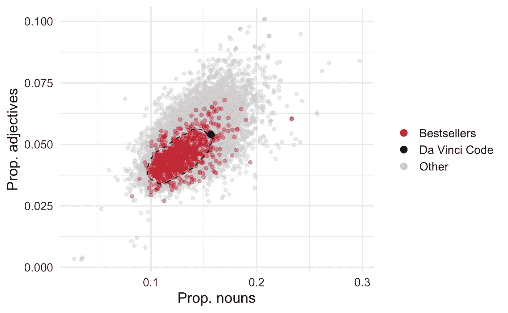
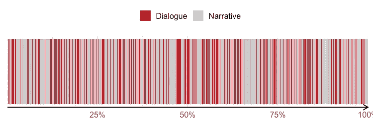
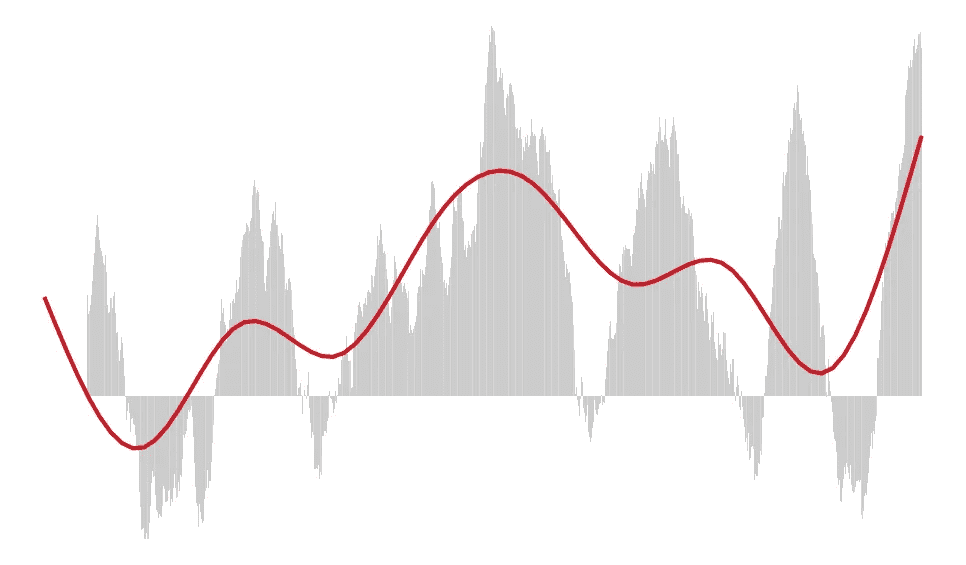
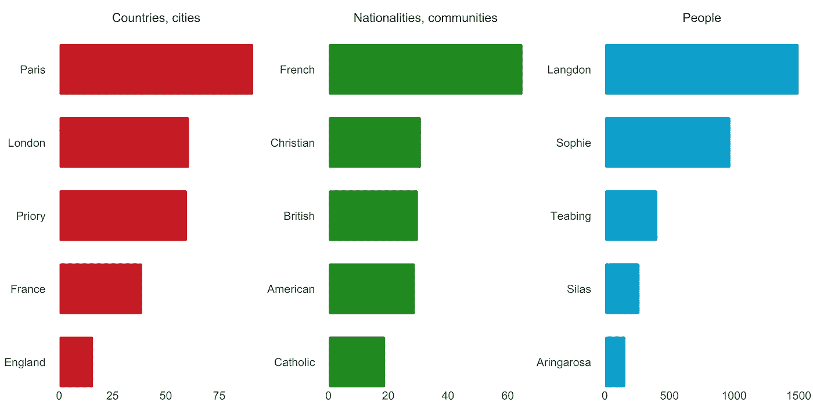
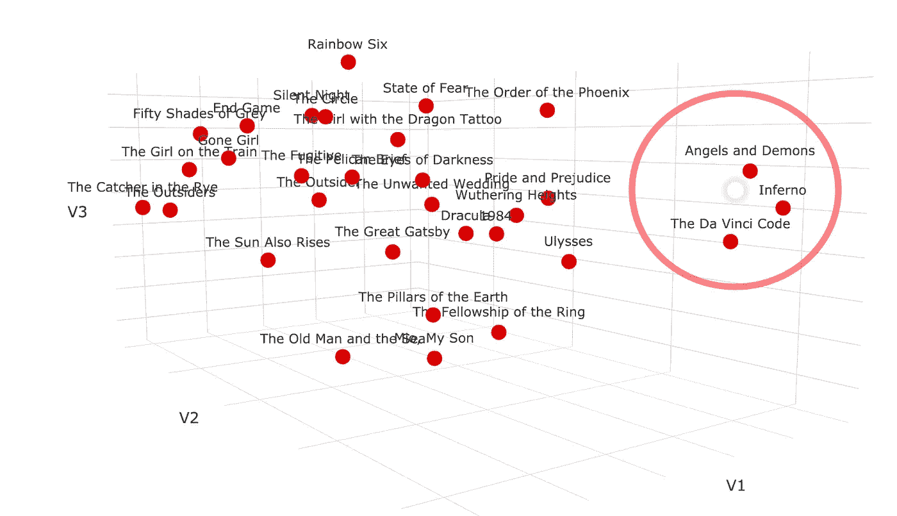
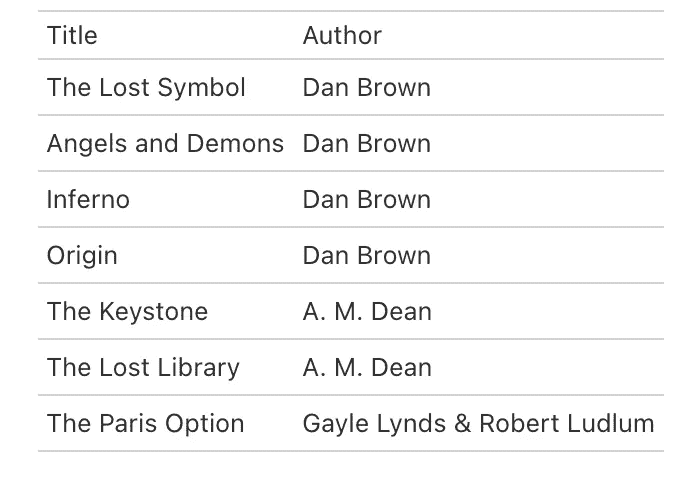

# AI 在出版界的地位？

> 原文：<https://medium.com/mlearning-ai/a-place-for-ai-and-data-science-in-publishing-a1e93d8d7be8?source=collection_archive---------3----------------------->

## 计算机如何帮助作者和编辑做出更好的决定

出版业可能很艰难，竞争也很激烈。只有一小部分手稿真正通过出版商出版，成为畅销书的更少。因此，大多数有抱负的小说家将不得不习惯于他们的手稿被出版商一次又一次地拒绝。另一方面，对于出版商来说，很容易想象保持和筛选源源不断的新手稿可能会带来另一种挑战。这有时可能类似于大海捞针。

在数据科学的*自然语言处理* (NLP) 领域快速发展的时代，许多行业都受益于 NLP 研究人员和实践者近年来取得的巨大进步。如今，利用 NLP 技术进行语言处理的技术和应用随处可见，在本文中，我将介绍一些与图书出版业相关的技术。这些可以被应用于探索个别的小说作品，或者对成百上千的书籍进行分析比较。随着 NLP 实践者使用的方法变得越来越复杂，作家和出版商可能会受益于为小说世界量身定制的计算机辅助方法。

# 风格

量化写作风格，也被称为*风格测量法*，在法律语言学、历史和文学研究等领域有许多应用。一个常见的用例是作者归属，其中使用写作风格的统计模式来揭示给定文档最可能的作者。在文体学中使用的相同技术可以应用于探索和比较小说中的写作风格。在语言和文学领域的专业知识将非常有助于形成良好的假设，并知道在哪里寻找特定的文体模式。我们可以测量的一些例子包括可读性分数和句子长度，词汇多样性，即词汇的大小，特定单词的用法，主动和被动语态的用法，标点符号等等。

在这里，我们来看看作者是如何利用不同的词类，并将《达芬奇密码》与一系列畅销书和其他不太成功的小说进行比较。在我们的例子中，我们放大了形容词，这是一类常用来描述实体品质的词。为什么人们会对形容词感兴趣？正如马克·吐温在 1880 年写给布瑟的信中所说:

> 不要让绒毛、花朵和赘言爬进来。当你抓住一个形容词时，杀死它。不，我的意思不是完全杀死它们，而是杀死大部分——然后剩下的就有价值了。当它们靠得很近时就会变弱。当他们相距很远的时候，他们给予力量。

比较名词和形容词的使用与书中总字数的比例，我们看到达芬奇密码被放在虚线之外，这包括了 80%的畅销书。此外，尽管畅销书和非畅销书明显重叠，但前者的形容词相对较少，名词也较少。

值得注意的是，这样的比较只是说明了畅销书作家写作的一些小方面。他们并不一定认为有抱负的小说家必须努力吸收不同词类的用法，才能获得成功，卖出更多的书。也就是说，留意风格的各种元素更有可能提高作者被发表的机会。

# 对话

一些小说作家让他们的主角经常在整个文本中进行对话，而其他作家可能更喜欢依赖叙事。下图实际上是一个条形图，每个条形代表一个句子。我们可以看到，在《达芬奇密码》中，似乎有相当多的对话或多或少地均匀分布在故事中。

# 情节

一套被称为*情感分析*的技术可以通过定位文本中积极和消极情绪的变化来说明故事情节如何随着时间的推移而展开。在下图中，每个条形代表一小块文本。条形的高度代表情绪效价，其中高条形表示积极的语言。因此，低谷和高峰很可能揭示故事中涉及冲突和解决的部分。平滑的红线显示整体趋势。

# 主题

获取文档中重复出现主题的概述的一种有用技术叫做*主题建模。*这类算法假设文本由一组潜在主题组成，而每个主题又由一组特定的单词组成。有了主题模型，我们就可以找到单词-主题和主题-文本的概率分布关系。应该注意的是，因为主题模型是由单词和共现模式定义的，它们不一定有助于确定一本书的主要主题。另一个限制是，每个主题必须在特定主题出现概率最高的单词的基础上进行解释，这就是这些主题被称为*潜在主题的原因。此外，为了获得合理的结果，通常需要收集大量的文档。*

为了探索《达芬奇密码》中的关键主题，我们应用了一个在相对较小的语料库上训练的模型，该语料库包括来自近 1000 本畅销书的所有名词。条形图显示了最流行的主题及其(解释的)标签。在这种情况下，我们根据*排他性*和*语义一致性*来评估每个主题的质量，过滤掉两个不清楚的主题，并减去主题在语料库中的平均分布，以获得下面的主题。

# 命名实体

快速了解小说背景的一个有用的方法是通过一种叫做*命名实体识别* (NER)的技术。通常基于非常大的语言模型，NER 可以提供关于地点、国家、组织和角色的信息，这些信息共同构成了场景。

类似地，设计了许多算法来提取关键词，这有助于理解故事是关于什么的。例如， *RAKE 算法*(快速关键词提取)从达芬奇密码中返回诸如“神圣女性”、“圣殿骑士”和“圣杯”等关键词。

# 类似的书

了解一本书的另一种完全不同的方式，可能对作者和出版商都有用，就是把它与语义内容相似的书联系起来看。NLP 提供了各种方法来对具有相似内容的文本进行分组，这也可以用于生成基于内容的产品推荐和搜索引擎。在前一种情况下，产品描述、评论或其他元数据通常用于查找语义相关的项目。同样的方法可以用来寻找相似的书。使用诸如 *word2vec* 和 *tf-idf、*之类的方法，文本可以被表示为向量，从这些向量可以使用例如余弦或欧几里德距离来计算相似性。

应用这些方法，我们可以看到哪些书与达芬奇密码最相似。在下图中，我们将 word2vec 模型(结合一种称为 t-SNE 的技术，用于可视化高维数据)应用于现代畅销书和经典小说的混合集。我们清楚地看到，《达芬奇密码》和丹·布朗的其他书形成了一个集群。

如果我们想要生成图书推荐，我们可以将该模型应用于更大的语料库，并返回与目标图书最相似的标题。根据该模型，下表显示了 23，000 多本小说中语义上与《达芬奇密码》最相似的七本书。

# 预测畅销书？

正如我们已经看到的，现代 NLP 技术允许我们收集大量关于书籍的不同信息，给定一些标准，这些书籍可以被标记为畅销书或非畅销书。这就引出了一个问题，我们是否可以建立一个模型来预测新提交的手稿的潜在成功。答案是肯定的。至少在某种程度上。经过大量书籍的训练，复杂的机器学习算法可能会在书籍中找到微妙的统计模式，将畅销书与其他小说区分开来。事实上，在他们的书《畅销书代码》中，作者马修·乔克斯(Matthew Jockers)和朱迪·阿彻(Jodie Archer)解释了他们如何成功地建立了一个在测试数据中高度准确地挑选畅销书的模型。

当然，预测模型的成功取决于这种模式或特征的存在。真正的挑战在于聪明和创造性的特征工程——即提取正确的信息片段，并使它们可用于模型。然而，领域专业知识和全面的探索性分析对于提出具有预测价值的良好特性非常重要。

# 得力的助手

对于人类读者来说，在几分钟内阅读，或者更确切地说，处理十几本书，同时还能记住一个人能想到的每一个细节的能力是一项不可能完成的任务。虽然作者和编辑可能不会很快被计算机算法取代，但我相信利用 NLP 技术的工具可能会通过帮助他们的工作和决策过程而使他们的生活变得更容易。

对于作者来说，了解自己的手稿在成功书籍的背景下的写作风格，情节结构以及避免哪些陷阱，肯定对他们有很大的价值。这些类型的见解将从本质上允许作者对他们的手稿进行各种类型的改进。

类似地，对于每天都要处理大量投稿的出版商来说，这里讨论的一些技术可能有助于他们快速获得新手稿的详细概述。正如我们所见，NLP 和更通用的基于人工智能/机器学习的工具可以帮助编辑和其他读者快速了解一本书的内容，其主题，背景，情节的强度和节奏，与写作风格有关的各种元素，类似的书籍，以及至少是手稿是否有可能成为畅销小说的第一个指标。