# 一个强大的无代码预测工具，将改变你的生活

> 原文：<https://medium.com/mlearning-ai/a-powerful-no-code-forecasting-tool-that-will-change-your-life-9906cd4b087b?source=collection_archive---------2----------------------->

## 并且终身免费。

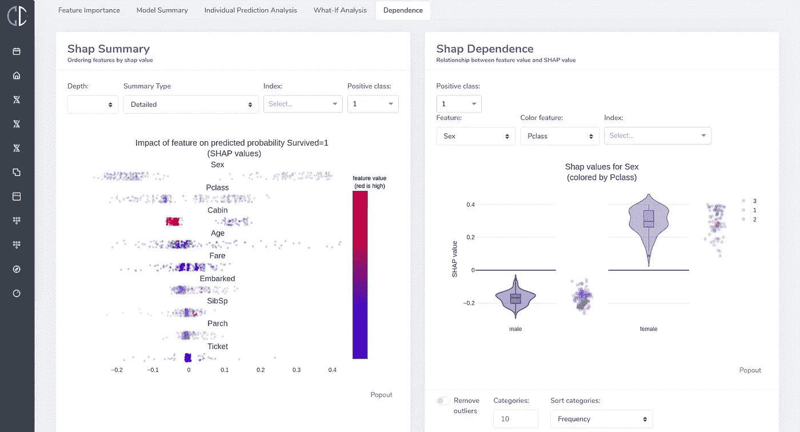

# 介绍

在我的 [**上一篇文章**](/p/b0373c84bc9f) 中，我讨论了 [**CyberDeck**](https://cyberdeck.ai/) ，这个免费的、端到端的、无代码的数据科学工具如何被用来在几分钟内解决一个端到端的机器学习问题。

那篇文章让差不多 1500 个用户在 24 小时内来到这个平台并注册！

为了真正证明这一点，我还编写了代码来进行并排比较，看使用该工具到底节省了多少时间，而不是花费数周时间编写数千行代码！

在本文中，我将对多种类型的时间序列预测问题进行**编码与使用 CyberDeck 的比较。**

我们将从简单的单步多变量问题开始(**预测单个商店和所有商品的销售额**)，然后进入最困难的预测问题，即多变量、多步时间序列问题(**预测多个商店和多个商品的销售额**)。

准备好了吗？我们走吧！

# 问题陈述—数据科学需要大量编码！

数据科学是最美好的事物之一。这是因为从无中提取有意义信息的能力本身就是一个奇迹。但是作为一名数据科学家也有其自身的缺陷。换句话说，数据科学的主要挑战之一是代码编写。

例如，人们经常编写数百行代码来实现从数据中提取有价值信息的壮举。但即便如此，这也是不可扩展的。因为随着数据的变化，代码也在变化。

所以我们不得不再次编写数百行代码，即使流程/管道保持不变。但是，如果我们可以建立一个一站式平台，只需点击一下鼠标，就可以完成常规的数据科学工作，从数据处理和 EDA 一直到建模，会怎么样呢？

一个无代码的数据科学工具在这里肯定会派上用场！

# 解决方案—无代码的端到端数据科学工具

我们自己也面临这个问题。因此，我们正在为数据科学家开发一个**免费的**一站式社区平台，命名为**“cyber deck”**。

然而，我们见过的每一个类似的平台都要花很多钱。但不是这个。这是不公开的。但是，如果我们从这个社区的金矿中得到积极的反馈，我们将在这个月底尝试性地把它变成现实！

**有了这个平台，可以进行数据处理、** [**探索性数据分析**](https://cyberdeck.ai/data-analysis-tool-for-eda-statistics/) **、** [**仪表板**、](https://cyberdeck.ai/cyberdeck-dashboarding/)、**、**、[、**autol**、**、**、](https://cyberdeck.ai/cyberdeck-titanic-demo-no-code-data-science-tool/)[、T21【Auto 时序】、**、**、](https://cyberdeck.ai/time-series-forecasting-without-coding/)[、 Auto Clustering 、](https://cyberdeck.ai/cyberdeck-auto-clustering/)，并生成

**在我们深入讨论问题陈述之前，这里有一些关于 CyberDeck 的有用资源。**

1.  **[**赛博平台网站**](https://cyberdeck.ai/)**
2.  **[**端到端汽车演示**](https://youtu.be/bj9nCRkT8nM)**
3.  **[**编码与在海量数据上使用赛博甲板**](https://cyberdeck.ai/cyberdeck-titanic-demo-no-code-data-science-tool/)**
4.  **[**签约预发布**](https://cyberdeck.ai/)**
5.  **[**样书**](https://cyberdeck.ai/contact/)**
6.  **[**关于赛博甲板**](https://cyberdeck.ai/about/)**
7.  **[**赛博甲板——我们做什么**](https://cyberdeck.ai/portfolio/)**

**今天只需点击 [**注册**](https://cyberdeck.ai/)**按钮并填写表格，我们将在当天内给您回复。****

****让我们直接进入完美的无代码数据科学工具，这就是**赛博甲板！******

# ****更简单的问题-商店的总销售额预测(多变量、单步时间序列问题)****

****对于第一个问题，我们将尝试预测特定商店的总销售额。数据是这样的。****

****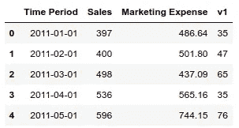****

****Monthly Sales Data****

****我们有一家商店的月度销售数据。我们还有每月的营销费用和另一个变量 v1。我们将使用这些变量作为外生变量来预测未来的销售。****

******A)探索性数据分析******

****对于任何类型的数据科学问题，最好先进行全面的探索性数据分析(EDA)。让我们开始吧！****

******1)绘制时间序列数据******

******带编码******

```
**def plot_ts(df, target, ts_column):
    fig = px.line(df, x=ts_column, y=target)
    fig.update_layout(xaxis_title=df.index.name,
                      # yaxis_title=col_name,
                      paper_bgcolor='rgba(0,0,0,0)',
                      plot_bgcolor='rgba(0,0,0,0)',
                      font={'color': 'grey'}
                      )
    fig.update_xaxes(showgrid=False, zeroline=False)
    fig.update_yaxes(showgrid=False, zeroline=False)return figplot_ts(df, ['Sales', 'Marketing Expense'], 'Time Period')**
```

****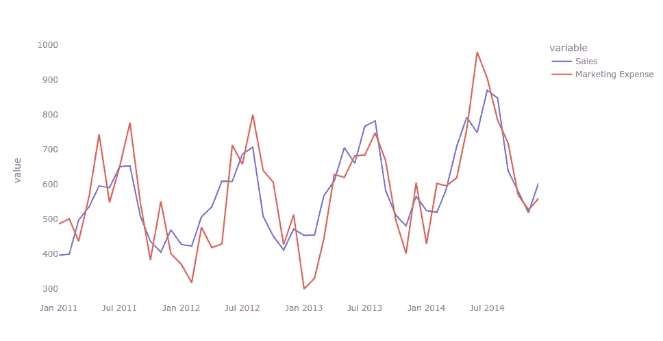****

******带赛博甲板******

******读取数据******

****转至 TS-EDA(时间序列 EDA)并加载文件。单击“读取文件”****

****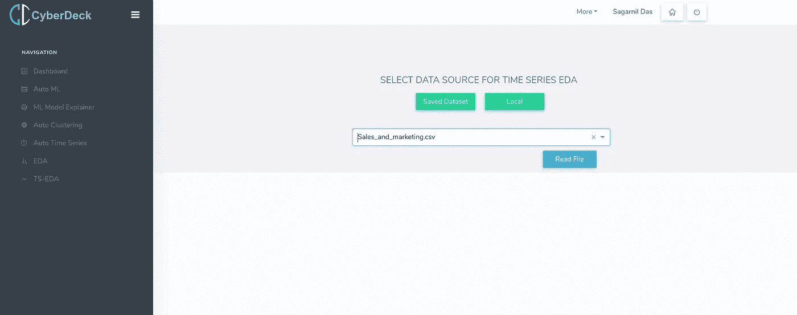****

******运行 EDA******

****选择您的日期栏。选择数据中是否缺少时间戳。如果缺少时间戳，我们的专有算法将为您修复它们。****

****最后点击**“运行 EDA”。**基本完成！****

****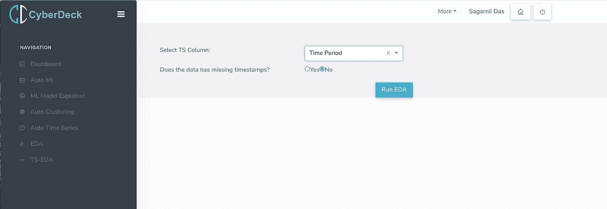****

****应用程序会立即向您显示四个部分:时间序列图、分解、相关性和平稳性。****

****在第一个选项卡中，只需选择您想要查看时间序列图的列，瞧！它在那里！****

****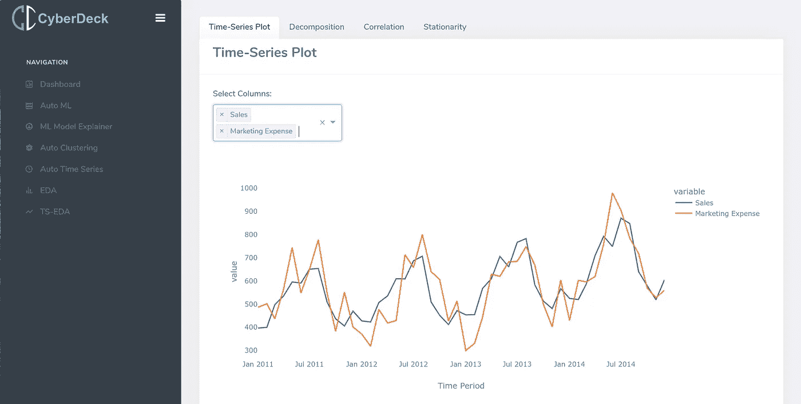****

******2)创建直方图******

******带编码******

```
**def ts_histogram(df, target):
    fig = px.histogram(df, x=target, marginal="box",  
                       hover_data=df.columns)
    return fig**
```

******带赛博平台******

****如果您在同一部分向下滚动，也可以通过单击绘制任意列的直方图。****

****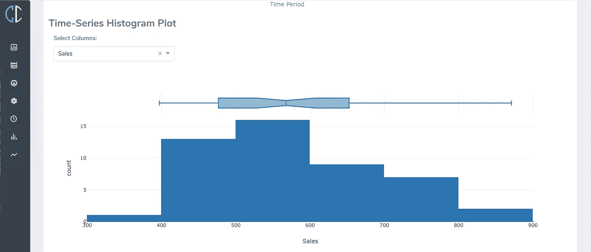****

******3)展示汇总统计******

******带编码******

****这将需要很长的编码时间，我甚至不会尝试它！但让我们看看赛博甲板。****

****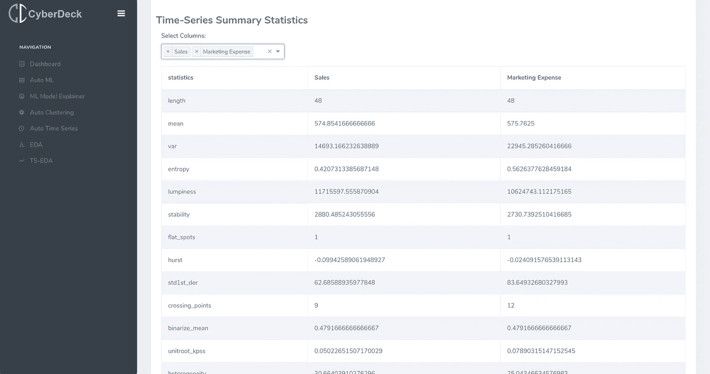****

****而这只是其中的一半！您可以向下滚动页面的剩余一半。****

****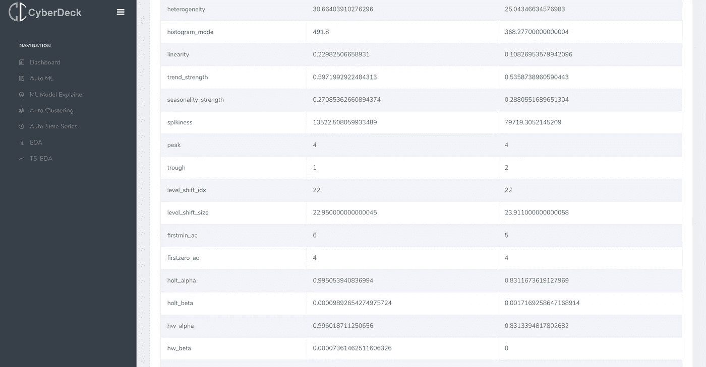****

****现在想象一下，尝试为所有这数百个变量编写代码！不客气！****

******4)时间序列分解******

******带编码******

```
**def plot_seasonal_decompose(df, target, ts_column, model='additive', period=None):
    series = df[[ts_column, target]]
    series.set_index(ts_column, inplace=True)
    series.index = pd.to_datetime(series.index)
    result = seasonal_decompose(series, model=model)
    fig = make_subplots(rows=4, cols=1,
                        subplot_titles=("Actual Data", "Trend Component", "Seasonal Component", "Residual Component"))fig.append_trace(go.Scatter(
        x=series.index,
        y=result.observed
    ), row=1, col=1)fig.append_trace(go.Scatter(
        x=series.index,
        y=result.trend
    ), row=2, col=1)fig.append_trace(go.Scatter(
        x=series.index,
        y=result.seasonal
    ), row=3, col=1)
    fig.append_trace(go.Scatter(
        x=series.index,
        y=result.resid
    ), row=4, col=1)fig.update_layout(title_text="Time-Series Decomposition", showlegend=False)
    return figplot_seasonal_decompose(df, 'Sales', 'Time Period')**
```

****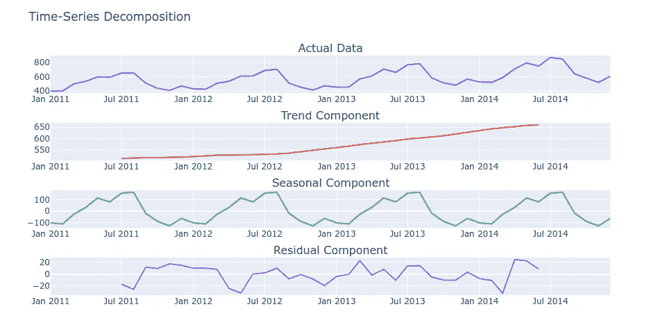****

******带赛博甲板******

****为此，我们进入**分解**页签，选择需要的栏目(销售)，完成！****

****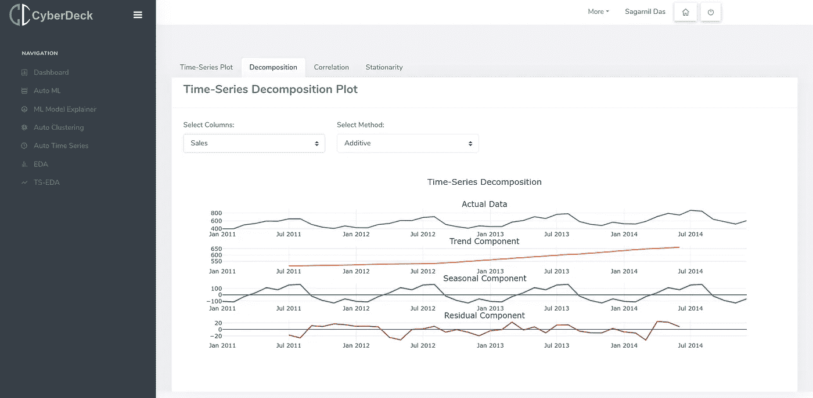****

******5)绘制 ACF 和 PACF 图******

******带编码******

```
**def plot_acf(df, colname, nlag=10):
    df_acf = pd.DataFrame(acf(df[colname], nlags=nlag, alpha=None))
    df_acf.columns = ['Auto-Correlation']
    fig = px.bar(df_acf, y='Auto-Correlation', x=df_acf.index, title="Auto-Correlation Plot")
    return figdef plot_pacf(df, colname, nlag=10, method='yw'):
    df_pacf = pd.DataFrame(pacf(df[colname], nlags=nlag, alpha=None))
    df_pacf.columns = ['Partial Auto-Correlation']
    fig = px.bar(df_pacf, y=['Partial Auto-Correlation'], x=df_pacf.index, title="Partial Auto-Correlation Plot")
    return figplot_acf(df, 'Sales')
plot_pacf(df, 'Sales')**
```

****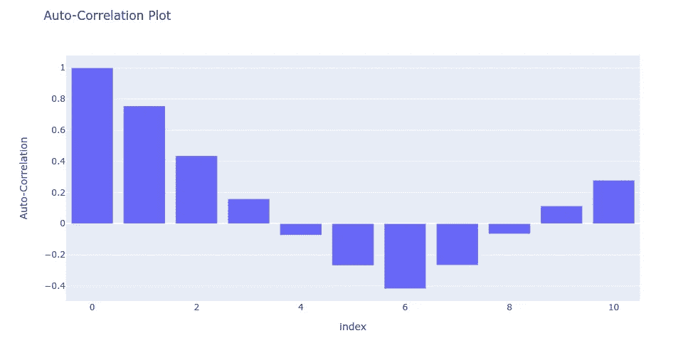********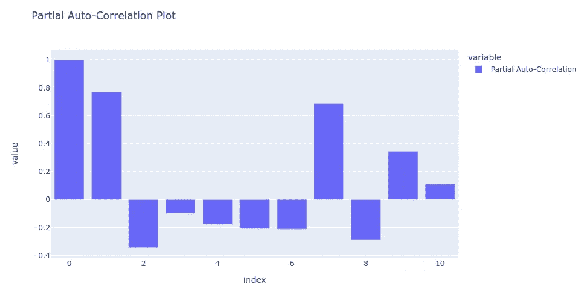****

******带赛博甲板******

****进入**关联**页签，选择需要的栏目，完成！****

****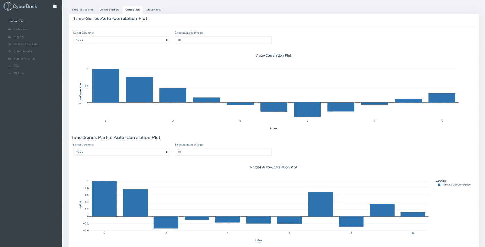****

******6)时间序列平稳性检验******

******带编码******

```
**def ts_test_stationarity(df, colname, maxlag=31, regression='c', autolag='BIC',
                         window=None, verbose=True):
    """
    Check unit root stationarity of a time series array or an entire dataframe.
    Note that you must send in a dataframe as df.values.ravel() - otherwise ERROR.
    Null hypothesis: the series is non-stationary.
    If p >= alpha, the series is non-stationary.
    If p < alpha, reject the null hypothesis (has unit root stationarity).
    Original source: [http://www.analyticsvidhya.com/blog/2016/02/time-series-forecasting-codes-python/](http://www.analyticsvidhya.com/blog/2016/02/time-series-forecasting-codes-python/)
    Function: [http://statsmodels.sourceforge.net/devel/generated/statsmodels.tsa.stattools.adfuller.html](http://statsmodels.sourceforge.net/devel/generated/statsmodels.tsa.stattools.adfuller.html)
    window argument is only required for plotting rolling functions. Default=4.
    """
    # os.remove('output.txt')
    timeseries = df[colname].values
    if len(timeseries) <= int(1.5 * maxlag):
        maxlag = 5  ## set it to a low number
    # set defaults (from function page)
    if type(timeseries) == pd.DataFrame:
        print('modifying time series dataframe into an array to test', file=open("output.txt", "a"))
        timeseries = timeseries.values.ravel()
    if regression is None:
        regression = 'c'
    if verbose:
        print('Running Augmented Dickey-Fuller test with paramters:', file=open("output.txt", "a"))
        print('    maxlag: {}'.format(maxlag), 'regression: {}'.format(regression), 'autolag: {}'.format(autolag),
              file=open("output.txt", "a"))
    alpha = 0.05# Perform Augmented Dickey-Fuller test:
    try:
        ### Use Statsmodels for tests ###########
        dftest = smt.adfuller(timeseries, regression=regression, autolag=autolag)
        dfoutput = pd.Series(dftest[0:4], index=['Test Statistic',
                                                 'p-value',
                                                 '#Lags Used',
                                                 'Number of Observations Used',
                                                 ], name='Dickey-Fuller Augmented Test')
        for key, value in dftest[4].items():
            dfoutput['Critical Value (%s)' % key] = value
        if verbose:
            print('Results of Augmented Dickey-Fuller Test:', file=open("output.txt", "a"))
            pretty_print_table(dfoutput)
            print(dfoutput, file=open("output.txt", "a"))
        if dftest[1] >= alpha:
            print(' this series is non-stationary. Trying test again after differencing...',
                  file=open("output.txt", "a"))
            timeseries = pd.Series(timeseries).diff(1).dropna().values
            dftest = smt.adfuller(timeseries, regression=regression, autolag=autolag)
            dfoutput = pd.Series(dftest[0:4], index=['Test Statistic',
                                                     'p-value',
                                                     '#Lags Used',
                                                     'Number of Observations Used',
                                                     ], name='Dickey-Fuller Augmented Test')
            for key, value in dftest[4].items():
                dfoutput['Critical Value (%s)' % key] = value
            if verbose:
                print('After differencing=1, results of Augmented Dickey-Fuller Test:',
                      file=open("output.txt", "a"))
                pretty_print_table(dfoutput)
                print(dfoutput, file=open("output.txt", "a"))
            if dftest[1] >= alpha:
                print(' this series is not stationary', file=open("output.txt", "a"))
                return False
            else:
                print(' this series is stationary', file=open("output.txt", "a"))
                return True
        else:
            print(' this series is stationary', file=open("output.txt", "a"))
            return True
    except:
        print('Error: Stationary test failed. Data must be np.array. Check your input and try stationary test again')
        return**
```

******带赛博甲板******

****转到“**平稳性**”选项卡，选择该列，瞧！****

****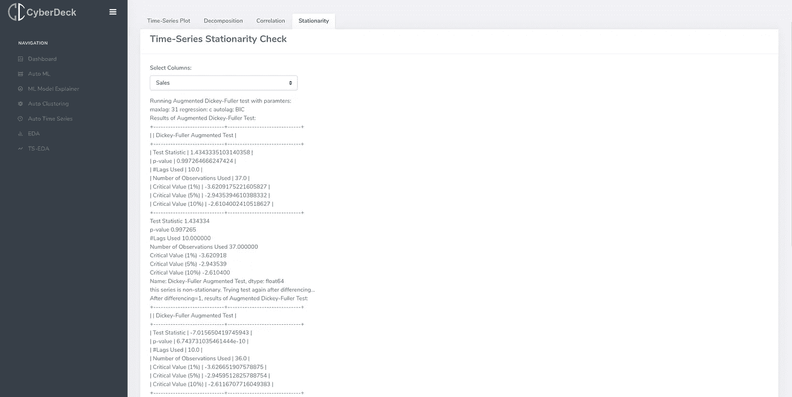****

******7。绘制时间序列差异图******

******带编码******

```
**def plot_ts_difference(df, target, ts_column, diff):
    df_diff = df[[ts_column, target]]
    if diff == 1:df_diff['diff_1'] = np.append(np.nan, np.diff(df_diff[target]))
    else:
        df_diff['diff_{}'.format(diff)] = np.append([np.nan] * diff, np.diff(df_diff[target], n=diff))diff_col = [col for col in df_diff.columns if 'diff_' in col]fig = px.line(df_diff, x=ts_column, y=[target, diff_col[0]])
    return figplot_ts_difference(df, 'Sales', 'Time Period', 2)**
```

****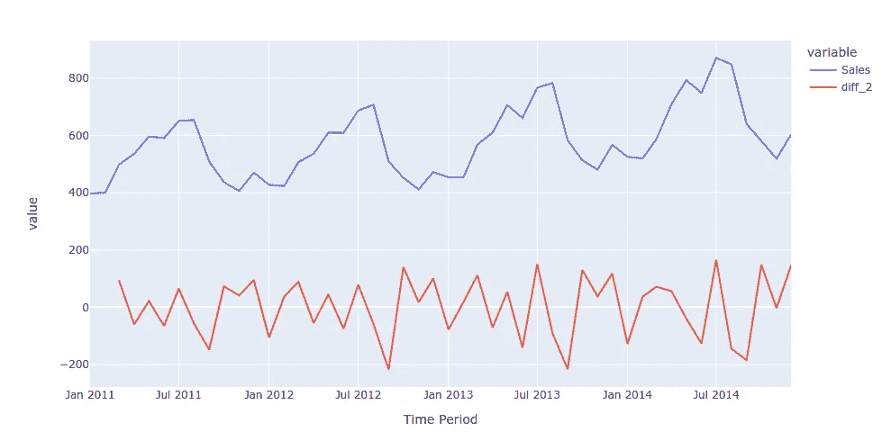****

******带赛博甲板******

****在**平稳性**选项卡中，向下滚动到下一个图。选择所需的列，以及您想要查看的滞后数，然后完成！****

****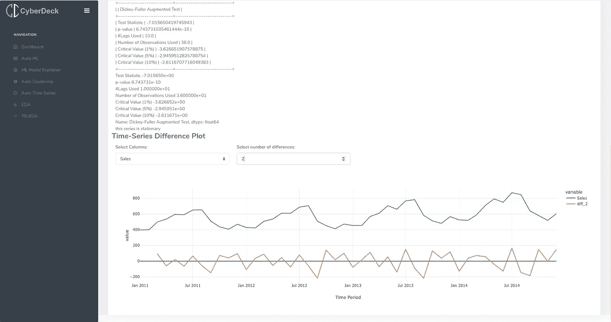****

****你看到了吗，只需点击几下，我们就节省了多少行代码？咻！****

****现在 EDA 完成了，让我们继续实际的预测。****

******B)时间序列模型训练和预测******

****如果我们想培养单一的模型，那么它不应该需要很长时间。但是您如何知道哪种模型最适合相应的用例呢？****

****所以你需要训练多个模型，对吗？****

****假设我们从小处着手，采用 **ARIMA、风险值和先知******

****但是这些模型有如此多的参数可以调整，对吗？你怎么知道哪种组合效果最好？****

****好了，让我们试着为一个基于排行榜的系统编码。****

******带编码******

```
**def arima_leaderboard(backtester_errors, kats_ts, p, d, q, seasonal_p, seasonal_d, seasonal_q, trend,
                      time_varying_regression, train_percentage, seasonal_period, exog, target, ts_freq):
    print('ts_freq {}'.format(ts_freq))
    train_percentage = int(exog.shape[0] * train_percentage / 100)
    exog_train = exog[:train_percentage]
    exog_test = exog[train_percentage:]
    kats_ts_train = kats_ts[:train_percentage]
    kats_ts_test = kats_ts[train_percentage:]if time_varying_regression is True:
        mle_regression = False
    else:
        mle_regression = Truefor i in range(p + 1):
        for j in range(d + 1):
            for k in range(q + 1):
                # for l in range(seasonal_p + 1):
                #     for m in range(seasonal_d + 1):
                #         for n in range(seasonal_q + 1):
                # try:params = ARIMAParams(p=i, d=j, q=k,
                                     trend=trend,
                                     # seasonal_order=(l, m, n, seasonal_period),
                                     time_varying_regression=time_varying_regression, mle_regression=mle_regression,
                                     exog=exog_train)
                #                             ALL_ERRORS = ['mape', 'smape', 'mae', 'mase', 'mse', 'rmse']
                model = ARIMAModel(kats_ts_train, params)
                model.fit()
                fcst = model.predict(exog_test.shape[0], exog=exog_test)
                fcst = fcst['fcst']

                ts_test = kats_ts_test.to_dataframe()
                ts_test = ts_test[target]
                backtester_arima_errors = timeseries_evaluation_metrics_function(ts_test, fcst)backtester_errors[
                    'arima_({},{},{})'.format(i, j, k)] = {}
                for error, value in backtester_arima_errors.items():
                    backtester_errors['arima_({},{},{})'.format(i, j, k)][error] = value
                # except:
                #     passreturn backtester_errorsdef prophet_leaderboard(backtester_errors, kats_ts, growth, yearly_seasonality, weekly_seasonality,
                        daily_seasonality, seasonality_mode, train_percentage, seasonal_period, exog, target, ts_freq):
    train_percentage = int(exog.shape[0] * train_percentage / 100)
    growth_list = []
    seasonality_mode_list = []
    exog_train = exog[:train_percentage]
    exog_test = exog[train_percentage:]
    kats_ts_train = kats_ts[:train_percentage]
    kats_ts_test = kats_ts[train_percentage:]if growth == 'both':
        growth_list.append(['linear', 'logistic'])
        growth_list = growth_list[0]
    else:
        growth_list.append(growth)if yearly_seasonality == 'auto':
        yearly_seasonality = 'auto'
    elif yearly_seasonality == 'True':
        yearly_seasonality = True
    else:
        yearly_seasonality = Falseif weekly_seasonality == 'auto':
        weekly_seasonality = 'auto'
    elif weekly_seasonality == 'True':
        weekly_seasonality = True
    else:
        weekly_seasonality = Falseif daily_seasonality == 'auto':
        daily_seasonality = 'auto'
    elif daily_seasonality == 'True':
        daily_seasonality = True
    else:
        daily_seasonality == Falseif seasonality_mode == 'both':
        seasonality_mode_list.append(['additive', 'multiplicative'])
        seasonality_mode_list = seasonality_mode_list[0]
    else:
        seasonality_mode_list.append(seasonality_mode)print(growth_list)
    print(seasonality_mode_list)for i in growth_list:
        for j in seasonality_mode_list:
            print(i)
            print(j)params = ProphetParams(growth=i, yearly_seasonality=yearly_seasonality,
                                   weekly_seasonality=weekly_seasonality,
                                   daily_seasonality=daily_seasonality, seasonality_mode=j)m = ProphetModel(kats_ts_train, params)
            # m.add_regressor(exog_train)
            m.fit()
            fcst = m.predict(steps=exog_test.shape[0], exog=exog_test, freq=ts_freq)
            fcst = fcst['fcst']
            ts_test = kats_ts_test.to_dataframe()
            ts_test = ts_test[target]
            backtester_prophet_errors = timeseries_evaluation_metrics_function(ts_test, fcst)backtester_errors['prophet_{}_{}'.format(i, j)] = {}
            for error, value in backtester_prophet_errors.items():
                backtester_errors['prophet_{}_{}'.format(i, j)][error] = valuereturn backtester_errorsdef var_leaderboard(backtester_errors, kats_ts, target, ts_freq, train_percentage):
    train_percentage = int(len(kats_ts) * train_percentage / 100)
    kats_ts_train = kats_ts[:train_percentage]
    kats_ts_test = kats_ts[train_percentage:]params = VARParams()m = VARModel(kats_ts_train, params)
    m.fit()
    fcst = m.predict(steps=len(kats_ts_test))
    fcst = fcst[target].to_dataframe()
    fcst = fcst['fcst']
    ts_test = kats_ts_test.to_dataframe()
    ts_test = ts_test[target]
    backtester_VAR_errors = timeseries_evaluation_metrics_function(ts_test, fcst)backtester_errors['VAR'] = {}
    for error, value in backtester_VAR_errors.items():
        backtester_errors['VAR'][error] = valuereturn backtester_errorsdef multivariate_leaderboard(kats_ts, kats_ts_var, exog, p, d, q, seasonal_p, seasonal_d, seasonal_q, trend,
                             time_varying_regression,
                             growth, yearly_seasonality, weekly_seasonality, daily_seasonality, seasonality_mode,
                             seasonal_period, train_percentage, ts_freq, target
                             ):
    backtester_errors = {}prophet_dict = prophet_leaderboard(backtester_errors, kats_ts, growth, yearly_seasonality, weekly_seasonality,
                                       daily_seasonality, seasonality_mode, train_percentage, seasonal_period, exog,
                                       target, ts_freq)
    var_dict = var_leaderboard(prophet_dict, kats_ts_var, target, ts_freq, train_percentage)try:
        arima_dict = arima_leaderboard(var_dict, kats_ts, p, d, q, seasonal_p, seasonal_d, seasonal_q, trend,
                                       time_varying_regression, train_percentage, seasonal_period, exog, target,
                                       ts_freq)
    except:
        passtry:
        leaderboard = pd.DataFrame.from_dict(arima_dict).T
    except:
        leaderboard = pd.DataFrame.from_dict(var_dict).Tleaderboard['model_name'] = leaderboard.index
    leaderboard = leaderboard[['model_name', 'mape', 'smape', 'mae', 'mase', 'mse', 'rmse']]return leaderboard################## Forecast ###############################def arima_forecast(kats_ts, p, d, q, trend, time_varying_regression,
                   exog, exog_predict, target, forecast_period, ts_freq):
    if time_varying_regression is True:
        mle_regression = False
    else:
        mle_regression = True
    params = ARIMAParams(p=p, d=d, q=q,
                         trend=trend,
                         # seasonal_order=(seasonal_p, seasonal_d, seasonal_q, seasonal_period),
                         time_varying_regression=time_varying_regression,
                         mle_regression=mle_regression,
                         exog=exog)
    #                             ALL_ERRORS = ['mape', 'smape', 'mae', 'mase', 'mse', 'rmse']
    m = ARIMAModel(kats_ts, params)
    m.fit()
    fcst = m.predict(exog_predict.shape[0], exog=exog_predict)
    # sarimax = sm.tsa.statespace.SARIMAX(kats_ts.to_dataframe()[target], order=(p, d, q),
    #                                     seasonal_order=(seasonal_p, seasonal_d, seasonal_q, seasonal_period), exog=exog,
    #                                     enforce_stationarity=False, enforce_invertibility=False).fit()
    # #                             fcst = model.predict(steps = 10, exog = exog_test)
    # fcst = sarimax.predict(start=len(kats_ts), end=len(kats_ts)+ forecast_period-1, exog=exog_predict)[1:]
    # print('fcst {}'.format(fcst))return fcstdef prophet_forecast(kats_ts, growth, yearly_seasonality, weekly_seasonality, daily_seasonality, seasonality_mode,
                     ts_freq, exog, exog_predict):
    params = ProphetParams(growth=growth, yearly_seasonality=yearly_seasonality, weekly_seasonality=weekly_seasonality,
                           daily_seasonality=daily_seasonality, seasonality_mode=seasonality_mode)m = ProphetModel(kats_ts, params)m.fit()# make prediction for next 30 month
    fcst = m.predict(steps=exog_predict.shape[0], exog=exog_predict, freq=ts_freq)return fcstdef var_forecast(kats_ts_var, target, ts_freq, forecast_period):
    params = VARParams()
    m = VARModel(kats_ts_var, params)
    m.fit()
    fcst = m.predict(steps=forecast_period)
    fcst = fcst[target].to_dataframe()return fcstdef multivariate_forecast_var(kats_ts_var, target, ts_freq, forecast_period):
    fcst = var_forecast(kats_ts_var, target, ts_freq, forecast_period)
    kats_ts_var_df = kats_ts_var.to_dataframe()
    time_range = pd.date_range(start=kats_ts_var_df.iloc[len(kats_ts_var_df) - 1]['time'], periods=forecast_period,
                               freq=ts_freq)
    fcst['time'] = time_range
    return fcstdef multivariate_forecast(leaderboard, row_selected, kats_ts, trend, time_varying_regression,
                          yearly_seasonality, weekly_seasonality, daily_seasonality,
                          holt_trend, damped, seasonal,
                          alpha,
                          seasonal_period, forecast_period, ts_freq, exog, exog_predict, ts_col, target):
    model_name = leaderboard.iloc[row_selected]['model_name']
    model_name_split = model_name[0].split('_')if model_name_split[0] == 'prophet':
        growth = 'linear'
        seasonality_mode = model_name_split[2]fcst = prophet_forecast(kats_ts, growth, yearly_seasonality, weekly_seasonality, daily_seasonality,
                                seasonality_mode, ts_freq, exog, exog_predict)
        kats_ts_df = kats_ts.to_dataframe()
        print(kats_ts_df)
        time_range = pd.date_range(start=kats_ts_df.iloc[len(kats_ts_df) - 1][ts_col], periods=forecast_period,
                                   freq=ts_freq)
        fcst[ts_col] = time_rangeelif model_name_split[0] == 'arima':
        cleanString = model_name_split[1].replace('(', ' ').replace(')', ' ').replace(',', ' ')
        param_list = [int(s) for s in cleanString.split() if s.isdigit()]
        p = param_list[0]
        d = param_list[1]
        q = param_list[2]
        # seasonal_p = param_list[3]
        # seasonal_d = param_list[4]
        # seasonal_q = param_list[5]fcst = arima_forecast(kats_ts, p, d, q, trend, time_varying_regression,
                              exog, exog_predict, target, forecast_period, ts_freq)
        kats_ts_df = kats_ts.to_dataframe()
        print(kats_ts_df)
        time_range = pd.date_range(start=kats_ts_df.iloc[len(kats_ts_df) - 1][ts_col], periods=forecast_period,
                                   freq=ts_freq)
        # fcst = pd.DataFrame()
        # fcst['predicted'] = fcst1
        # fcst['predicted_lower'] = 0
        # fcst['predicted_upper'] = 0
        fcst[ts_col] = time_rangeelse:
        fcst = Nonereturn fcstdef fit_plot_var(kats_ts_var, target, ts_freq, forecast_period, df):
    y_pred = multivariate_forecast_var(kats_ts_var, target, ts_freq, forecast_period)
    y_pred.index = y_pred['time']
    y_pred.drop('time', axis=1, inplace=True)
    y_pred.columns = ["predicted", "predicted_lower", "predicted_upper"]
    df_plt = pd.merge(df[target], y_pred[["predicted", "predicted_lower", "predicted_upper"]], left_index=True,
                      right_index=True, how='outer')
    # df_plt = pd.merge(df_plt, y_pred["predicted"], left_index=True, right_index=True, how='outer')
    # df_plt = pd.merge(df_plt, y_pred["predicted"], left_index=True, right_index=True, how='outer')
    df_plt.columns = ['Actual', "predicted", "predicted_lower", "predicted_upper"]fig = px.line(df_plt, x=df_plt.index, y=['Actual', "predicted", "predicted_lower", "predicted_upper"],
                  color_discrete_sequence=px.colors.qualitative.D3)fig.update_layout(xaxis_title=df_plt.index.name,
                      yaxis_title='value',
                      paper_bgcolor='rgba(0,0,0,0)',
                      plot_bgcolor='rgba(0,0,0,0)',
                      font={'color': 'grey'}
                      )fig.update_xaxes(showgrid=False, zeroline=False)
    fig.update_yaxes(showgrid=False, zeroline=False)return fig, df_pltdef fit_plot(leaderboard, row_selected, kats_ts, trend, time_varying_regression,
             yearly_seasonality, weekly_seasonality, daily_seasonality,
             holt_trend, damped, seasonal,
             alpha,
             seasonal_period, forecast_period, ts_freq, exog, exog_predict, ts_col, df, target):
    y_pred = multivariate_forecast(leaderboard, row_selected, kats_ts, trend, time_varying_regression,
                                   yearly_seasonality, weekly_seasonality, daily_seasonality,
                                   holt_trend, damped, seasonal,
                                   alpha,
                                   seasonal_period, forecast_period, ts_freq, exog, exog_predict, ts_col, target)
    # print('y pred {}'.format(y_pred))
    y_pred.index = y_pred[ts_col]
    # print('y pred {}'.format(y_pred))
    y_pred.drop(ts_col, axis=1, inplace=True)
    y_pred.drop('time', axis=1, inplace=True)
    # print('y pred {}'.format(y_pred))
    y_pred.columns = ["predicted", "predicted_lower", "predicted_upper"]
    df_plt = pd.merge(df[target], y_pred[["predicted", "predicted_lower", "predicted_upper"]], left_index=True,
                      right_index=True, how='outer')
    # df_plt = pd.merge(df_plt, y_pred["predicted"], left_index=True, right_index=True, how='outer')
    # df_plt = pd.merge(df_plt, y_pred["predicted"], left_index=True, right_index=True, how='outer')
    df_plt.columns = ['Actual', "predicted", "predicted_lower", "predicted_upper"]fig = px.line(df_plt, x=df_plt.index, y=['Actual', "predicted", "predicted_lower", "predicted_upper"],
                  color_discrete_sequence=px.colors.qualitative.D3)fig.update_layout(xaxis_title=df_plt.index.name,
                      yaxis_title='value',
                      paper_bgcolor='rgba(0,0,0,0)',
                      plot_bgcolor='rgba(0,0,0,0)',
                      font={'color': 'grey'}
                      )fig.update_xaxes(showgrid=False, zeroline=False)
    fig.update_yaxes(showgrid=False, zeroline=False)return fig, df_plt**
```

****我的天啊！****

****告诉我，你会花多少时间来编码这个？****

****现在让我们用 CyberDeck 来看看这个。****

******使用 CyberDeck******

****转到侧边栏中的**“自动时间序列”**模块。载入数据。****

****在下一步中，您必须主要选择三样东西:****

****I)日期栏****

****ii)您要预测的列****

****iii)切换数据中是否存在任何缺失的时间戳(如果是，那么我们的专有算法将智能地处理它)。****

********

****你现在都准备好了。如果您想进行额外的定制，您可以点击**时序参数**按钮，这将弹出该窗口。****

****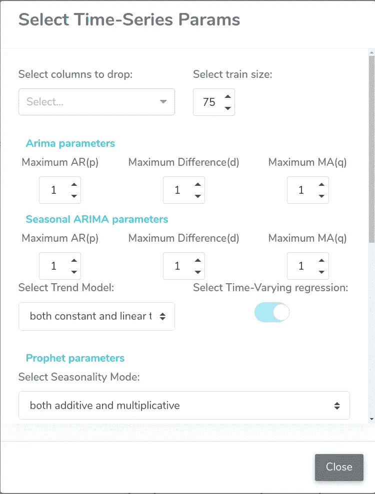********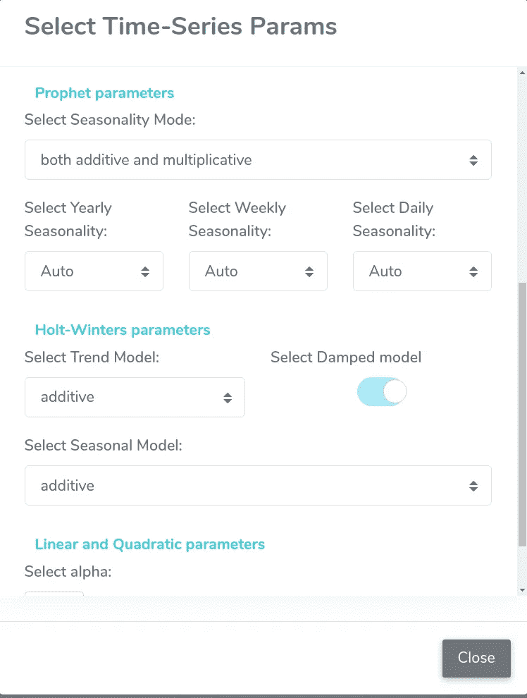****

****在这里，您可以选择各种预处理步骤，如列车大小，ARIMA，萨里玛，先知参数，等等。但是现在，我将让一切保持默认值。****

****现在只需点击“**生成排行榜**”按钮。一旦你这样做了，大量的模型将在后台运行，并向你展示排行榜。****

****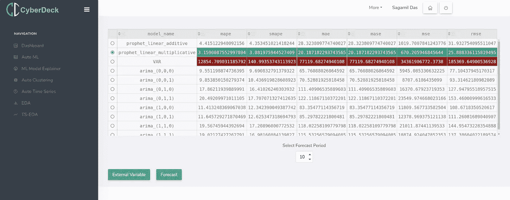****

****因此，我们看到先知线性乘法模型效果最好。****

****我们将选择这种模式。现在我们需要指定需要预测的月份数。我将选择 12 个月，然后单击**预测按钮。******

****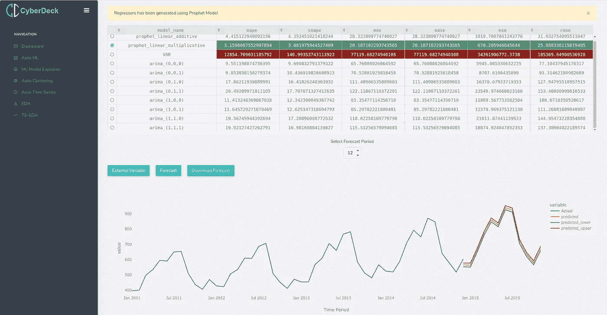****

****瞧啊。预测是为未来 12 个月以及 95%的置信区间生成的。****

****用户现在只需点击**下载预测**按钮即可下载预测。****

****咻！那真是一段旅程，不是吗？你可以上去看看，为了解决这个端到端的用例，我点击了多少次，而为了做同样的事情，我必须写多少行代码！****

# ****更难的问题— **同时预测多家商店和多种商品的销售额**(多变量、多步骤时间序列问题)****

****现在你已经掌握了 CyberDeck，我将带你了解预测问题领域中最困难的问题，即多变量、多步时间序列问题。****

****这些类型的问题在相同的数据中嵌入了多个时间序列。让我来解释一下。我们先来看看数据集。****

****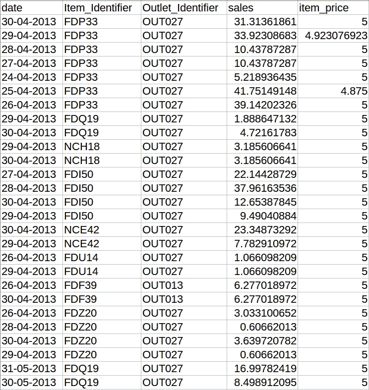****

****因此，如果你看到这里，我们有一个多商店和多种商品的零售数据集。所以你想想，每家店每天都会卖出多件商品。****

****这意味着每个商店-商品组合将有一个单独的时间序列嵌入到这个单一的数据集中。****

****所以让我们看看如何使用 CyberDeck 解决这个问题。****

****注意:我们已经为此建立了一个完全独立的模块，因为这是一个需要解决的大问题。如果我们看到足够多的用户需求，我们会很乐意让它成为主应用的一部分。****

****对于本文的这一部分，我将不编写代码，原因有二:****

1.  ****那会使文章变得不必要地冗长。到目前为止，您很可能已经明白了这一点。****
2.  ****我们这里有一些专有的东西。****

****让我们开始吧！****

******步骤 1 —读取数据******

****我们选择上面的数据集并点击**阅读。******

****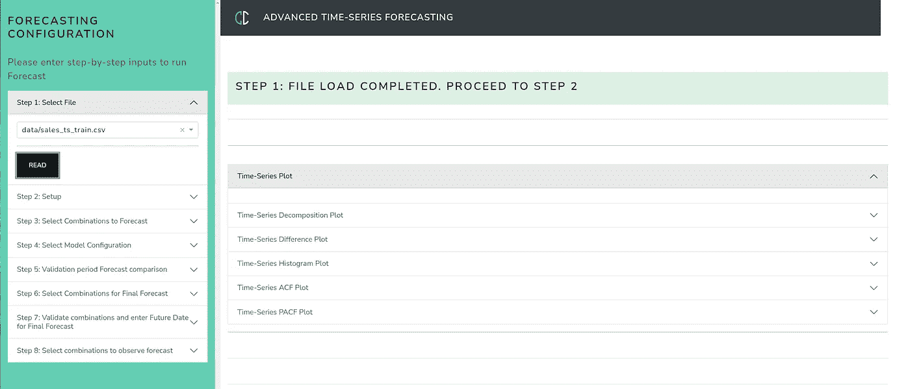****

******步骤 2——设置实验******

****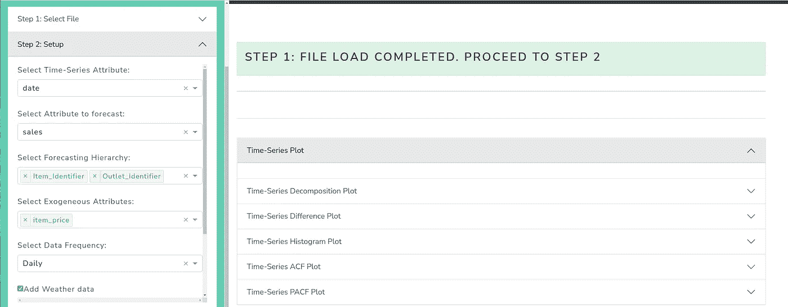****

****我们选择实验属性。****

****a)时间序列属性—日期****

****b)归因于预测—销售(这是我们想要预测的)****

****c)预测层级——项目标识符和经销店标识符(这是将进行最终预测的级别)。请注意，如果我们想要项目/经销店级别的预测，那么我们会选择其中之一。****

****d)外生变量——商品价格(这是我们从数据本身获得的额外信号)。****

****e)数据频率——每天****

****f)添加天气数据—对(如果您选中此框，根据位置，我们将自动获取天气数据，并将其用作来自第三方供应商的附加信号)。整洁不是吗！****

****g)最大培训日期—这没有显示在图片中，因为我需要向下滚动一点。但这实际上是问你希望培训在什么时间段进行？这个数据集的时间范围从 2013 年 4 月到 2015 年 8 月。因此，我们将在 2015 年 5 月之前开展培训。这将允许我们在使用模型预测未来之前，验证我们的模型在 2015 年 6 月、7 月和 8 月的表现。****

******步骤 3 —选择商店和商品的组合进行预测******

****当我设置好参数并点击**应用**后，它会自动显示平均销售额最高的 10 个商品-商店组合。****

****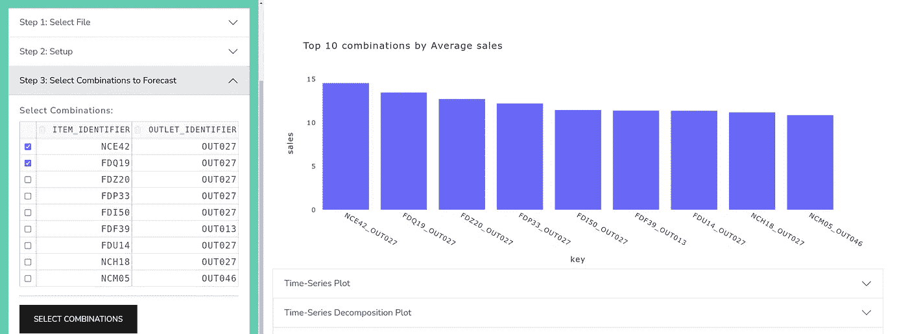****

****现在，它将要求您选择需要预测的多个项目标识和经销店标识组合。****

****在边栏中，我可以选择所有的选项。但出于演示目的，我将选择最上面的两个项目-商店组合，并单击“**选择组合**”。****

******步骤 4 —自动 EDA******

****一旦我完成了组合，我就可以自动看到各种有用的 EDA 图。****

******a)时间序列图******

****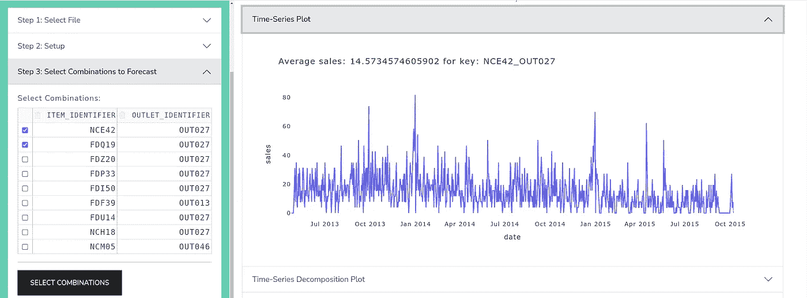****

******b)时间序列分解图，了解趋势、季节性等******

****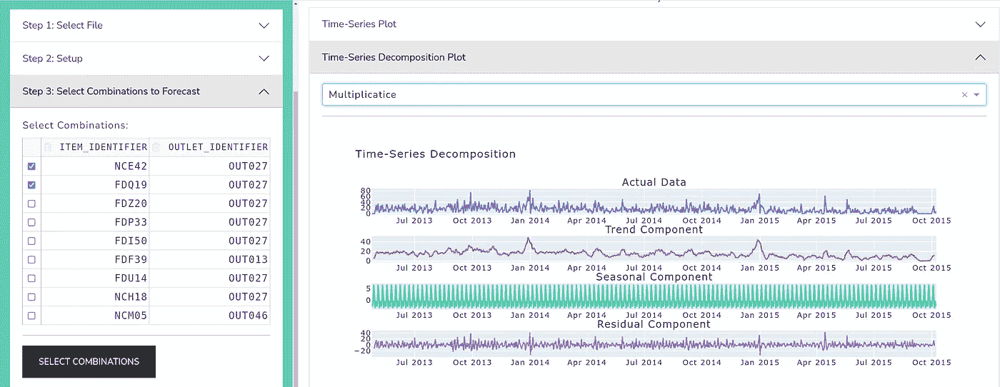****

******c)时序差异图******

********

******d)时间序列直方图******

****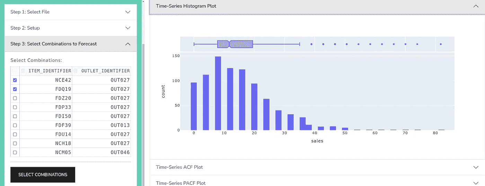****

******e)时间序列自相关图******

****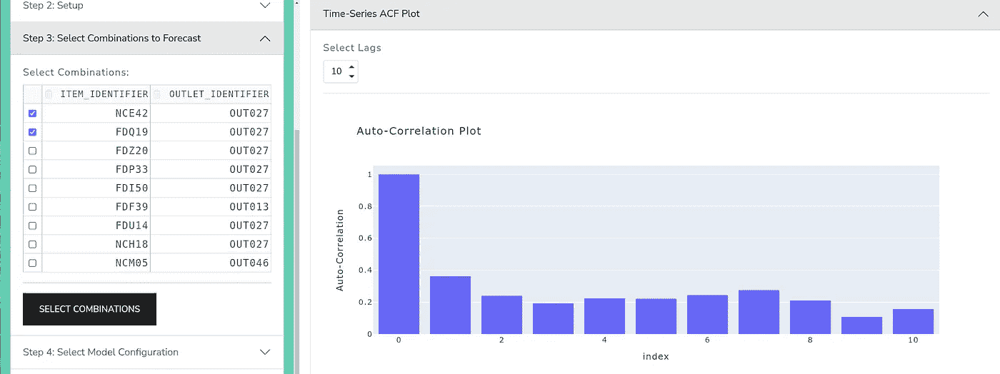****

******f)时间序列部分自相关图******

********

******步骤 5 —选择型号配置******

****为了简单起见，我们保留了三个模型预设。****

****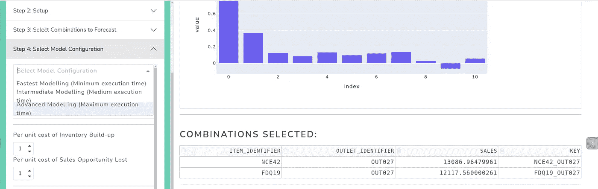****

1.  ******最快的建模** —这将是最快的训练，但精确度最低。****
2.  ******中级建模** —这将是速度和性能之间的平衡****
3.  ******高级建模** —这将是最慢的，但精度将是最高的。****

****我们发现这种方法最适合那些没有数据科学背景的人，因为他们真的不关心 ARIMA、先知等。****

****但是对于那些有数据科学背景的人来说，有一个**高级选项**按钮，在这里你可以定制你需要的精确模型。****

****让我用多张截图展示给你，因为它们不适合一张。****

****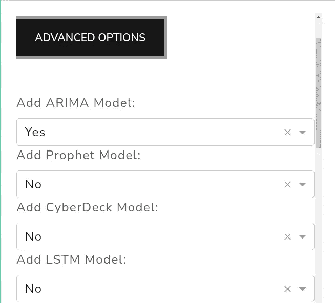********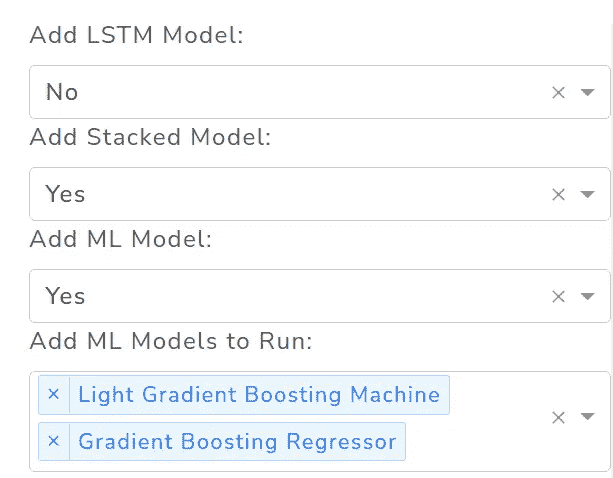****

****所以你看，你有这么多种模型来试验，并根据性能最终确定其中的一种。****

****在这个实验中，我将使用以下模型:****

****ARIMA，预言家，CyberDeck 模型(这是我们的专有模型，正如你将看到的，它比预言家表现得更好！)、堆叠模型、LightGBM 和梯度增强。****

****最后但同样重要的是，我们必须再选择两个参数:****

****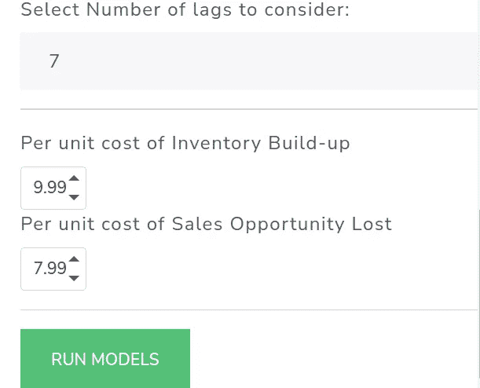****

****a)滞后数量 —我们需要指定建模需要多少滞后。这是日常数据。所以我会有一个 7 的滞后。****

******b)定制的业务指标—** 你是否曾经很难向业务部门解释 MAE、MSE、RMSE、RMSLE、R2 等？这又是自然的。它们是机器学习指标！****

****但是，如果企业有一些金钱方面的衡量标准，不是更好吗？这就是这里可能发生的事情。****

****对于每一个过度预测，对企业的影响将是额外的库存增加。对于每一个预测不足，对业务的影响将是失去销售机会。****

****这就是为什么您可以指定这两个单位成本。模型培训完成后，您将能够在排行榜上看到基于您刚刚创建的自定义定义的指标。****

****一些模型在 RMSE 方面可能令人惊讶，但在这个新的定制指标方面可能不是最好的。你知道吗，企业几乎总是会选择这个指标，而不是 RMSE 或 RMSLE。****

****这里，我们说每单位库存增加的成本是 9.99 美元，失去销售机会的成本是 7.99 美元。****

****现在，我们点击**运行模式**按钮！我们等着。****

******步骤 6 —验证期预测对比******

****模型训练完成后，我们现在可以选择我们选择的每个项目-商店组合，并通过与实际数据进行比较，查看模型在验证期(即 2015 年 6 月、7 月和 8 月)的表现。****

****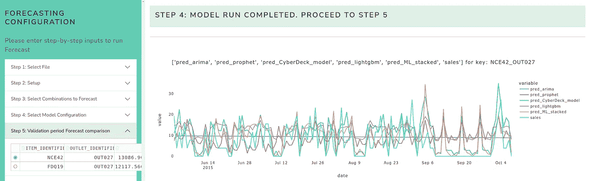****

****因为这是在同一个图表中显示我们运行的所有模型，所以很难理解。所以让我一次选择原始数据和一个算法。****

******ARIMA******

****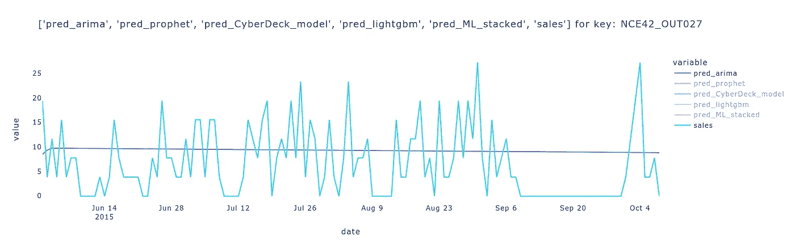****

****似乎 ARIMA 根本没能捕捉到数据中的模式。****

******先知******

****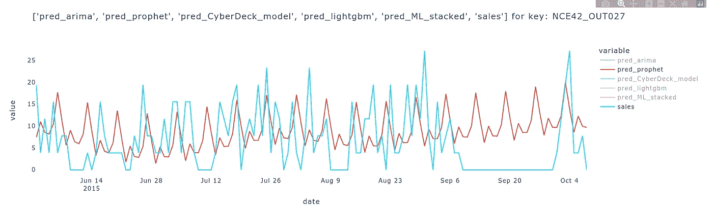****

****先知几乎像一个外交政治家！它捕获了数据集中的整体模式，但无法捕获更细微的差别。它很安全！****

******CyberDeck 模型******

****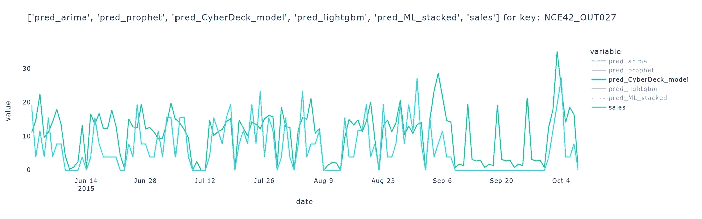****

****现在，你看看这个！CyberDeck 模型不仅能够捕捉总体趋势，还能成功捕捉所有重要的波峰和波谷！****

******LightGBM******

****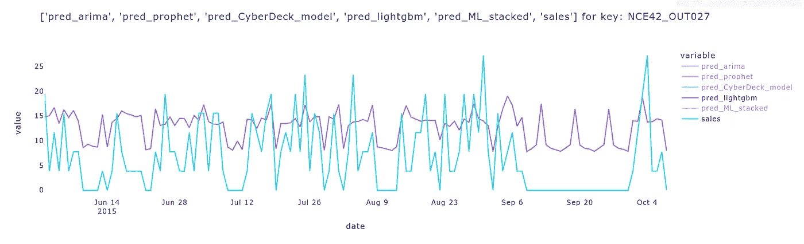****

****LightGBM 也像先知一样稳扎稳打！****

******堆叠模型******

****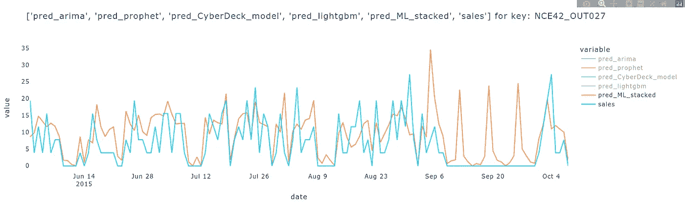****

****堆叠模型也表现得很好，能够捕捉到重要的波峰和波谷以及整体趋势。****

****在这个图的下面，你还会看到一个排行榜，就像这样。****

****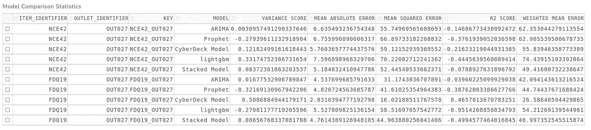****

****最后一列—“**加权平均误差**”是货币损失方面的指标。这是根据您在步骤 5 中提供的单位库存损失和销售机会损失生成的。****

****现在，您可以在这里手动选择要完成的模型，也可以进入下一步。****

******第 7 步—选择最终预测的组合******

****在这里，您可以根据您的优化指标自动选择模型。****

****在这里，我想向您展示，您的误差指标是如何彻底改变我们定义为最佳模型的。****

****让我们将**方差得分**作为第一度量，将**加权平均误差**作为第二度量。****

****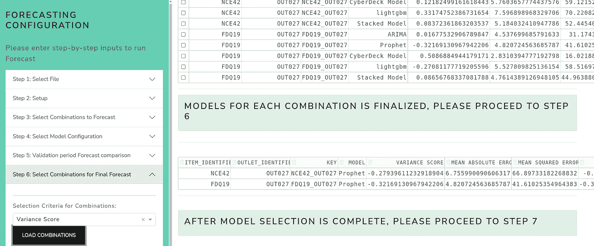****

****因此，我们看到，如果我们把**方差得分**作为我们的误差度量，它说在两个项目-出口组合中，**先知模型**效果最好。****

****现在让我们把**加权平均误差**作为优化度量。****

****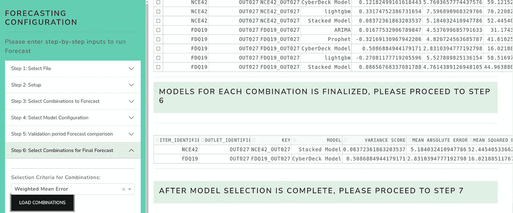****

****现在我们看到一个完全不同的故事。我们看到**堆叠模型**最适合第一个商店-物品组合，而 **CyberDeck 模型**最适合第二个商店-物品组合。****

****所以如果你更在乎方差得分，两者选预言家！****

****但是如果你更在乎你口袋里的钱，那就选择 Stacked 和 CyberDeck 模型吧！****

******LOL！！******

******第 8 步——预测未来的最终培训！******

****因此，我们将为第一种组合选择堆叠模型，为第二种组合选择 CyberDeck 模型。****

****现在我们预先知道了，产品的价格在未来的每一天会是怎样的。因此，我们可以提供一个包含上述商品-商店组合价格的外部文件。****

****我们还将提供直到我们想要的预测日期。****

****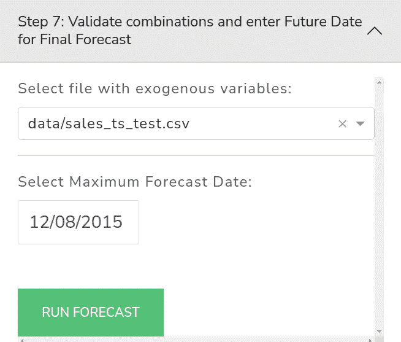****

****我们需要 2015 年 12 月 8 日之前的天气预报。这就是我们选择的。我们还在这里提供了截至 12 月 8 日的外生价格值作为文件。****

****现在我们点击**运行预测**按钮。****

******第 9 步—生成最终预测******

****现在，一切都完成了，我们准备得到我们的最终预测。****

****为此，我们只需像这样选择我们想要获得预测的商品-销售点组合。****

****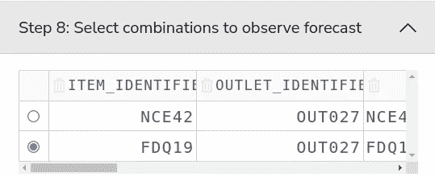****

****我们在主窗格中得到预测！****

****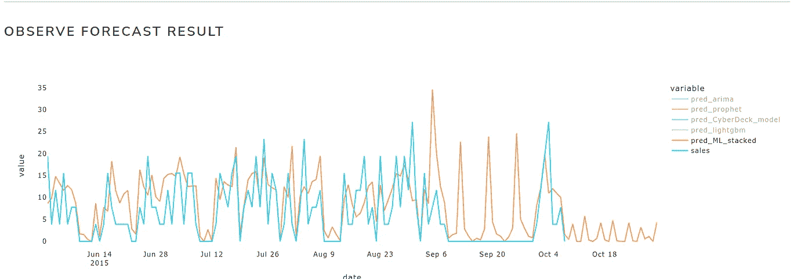****

****First Outlet Item Combination****

********

****Second Outlet Item Combination****

****咻！那真是一段旅程，不是吗？****

****但是希望现在你已经明白了，刚才在几分钟之内向你展示了两个端到端的项目，而这需要几个月的时间来编码！****

# ****d)结论****

****这标志着 CyberDeck 平台第二次演示的结束，这是一个无代码的数据科学工具，我们现在正在积极地构建。**我们计划让它成为数据科学家的社区产品，由数据科学家**开发。所以如果你认为这个产品可以让你的生活变得轻松一点，那么别忘了 [**注册这个端到端的数据科学平台**](https://cyberdeck.ai/) ，把你几个月的编码转换成几分钟的点击！****

****暂时就这样吧！请继续关注，直到我们为 CyberDeck 带来下一个演示！****

# ****有用的资源****

1.  ****[**报名预发布**](https://cyberdeck.ai/)****
2.  ****[**今天请求试玩**](https://cyberdeck.ai/contact/)****
3.  ****[**Youtube 频道**](https://www.youtube.com/channel/UCZHaCJcsGJ6ed9eV1Ml9bNQ?sub_confirmation=1)****
4.  ****[**博客**](https://cyberdeck.ai/blog/)****
5.  ****[**CyberDeck 探索 COVID 数据，预测死亡人数**](https://www.kaggle.com/sagarnildass/eda-ml-clustering-covid-with-the-click-of-a-mouse)****
6.  ****[**cyber deck Wiki**](https://cyberdeck.ai/wiki/)****

****[](/mlearning-ai/mlearning-ai-submission-suggestions-b51e2b130bfb) [## Mlearning.ai 提交建议

### 如何成为 Mlearning.ai 上的作家

medium.com](/mlearning-ai/mlearning-ai-submission-suggestions-b51e2b130bfb)****