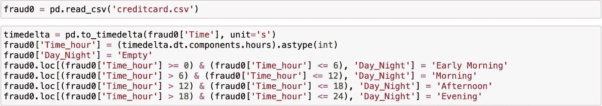
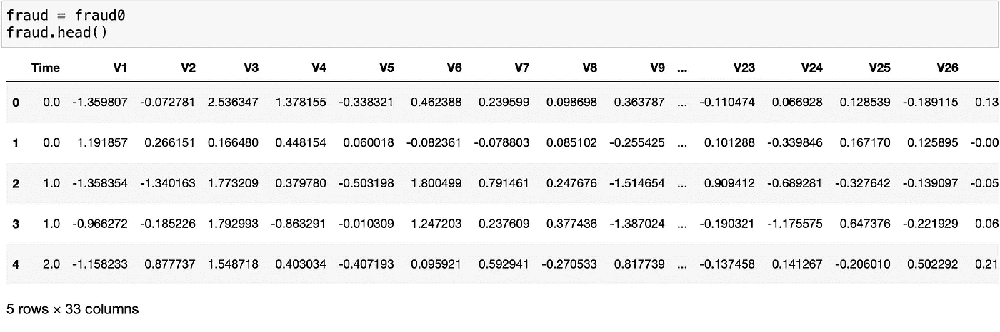
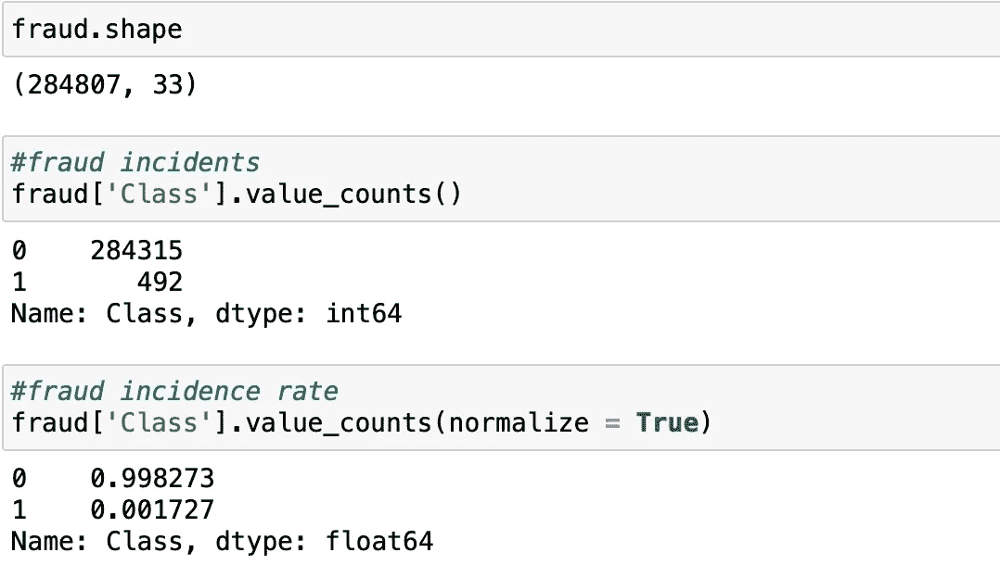
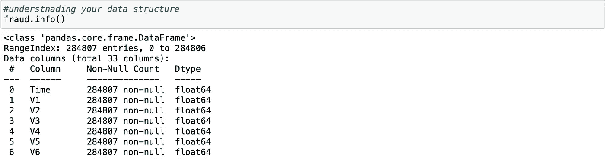
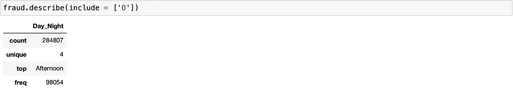
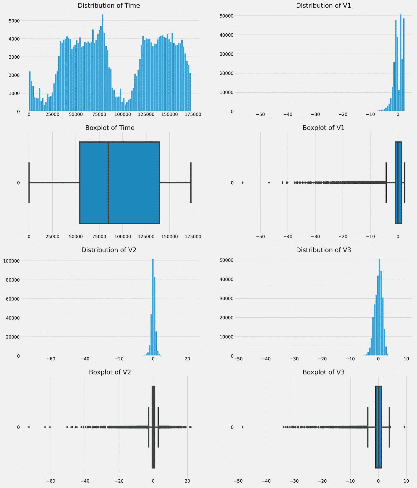
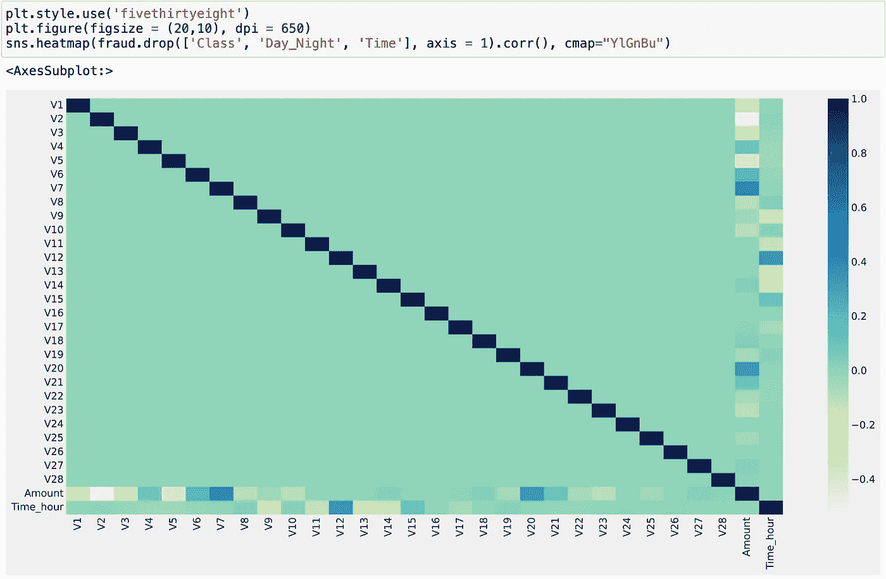
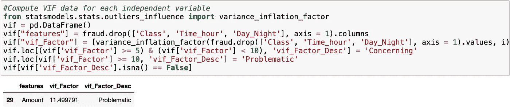

# 探索性数据分析实用指南

> 原文：<https://medium.com/mlearning-ai/a-practical-guide-to-exploratory-data-analysis-fabbac2bcad?source=collection_archive---------3----------------------->

## *用信用卡诈骗的例子*

# 探索性数据分析

探索性数据分析或简称 EDA 是一个了解数据特征的过程。它帮助您处理数据，揭示特征之间的关系，发现模式和检测异常，从而帮助您实现最终目标。以下是你在探索结束时应该知道的一系列事情:

*   数据结构
*   特征关系
*   极端值
*   假定

## **一个小小的警告**

大约 10 年前，当我还在上学的时候，我的教授告诉我们，在做任何事情之前，应该首先做 EDA。他当时说得有道理，因为我们看到和使用的数据集不超过 100 个要素。今天，EDA 对于理解您的数据仍然很重要，但通常不是您想要做的第一步。因为大多数情况下，您将最终处理初始数据集中的数千个(如果不是数百万个)要素，并且生成可视化结果将会令人不知所措。所以我强烈建议任何处理大数据(特性> 100)的人在进入 EDA 之前先做变量选择。

# 探索数据之前先探索自己

太多的人直接跳到 EDA 或模型开发，甚至不知道他们为什么这样做。所以在你探索数据之前，问问自己 5 个为什么，这样你就清楚地知道你在做什么。我交谈过的人中有一半不知道他们为什么要做他们正在做的事情，那时我知道结果不会令人印象深刻。所以记住这些问题。

*   **为什么:**你为什么要构建这个数据集？你的最终目标是什么？
*   **何时:**您的数据有多长时间限制？应该考虑季节性吗？在此期间是否有可能扭曲结果的欺诈攻击？
*   你打算做什么来实现你的最终目标？
*   **哪里:**这些数据从哪里来？单一或多重来源？他们可靠吗？
*   **谁:**谁是利益相关者？你的观众是谁？你的顾客是谁？

# 信用卡欺诈数据集

我正在使用的数据集来自 Kaggle，你可以在这里下载。值得花些时间来讨论这个数据集，因为我将在整个欺诈检测系列中使用它。 ***本练习中用到的所有代码都是*** [***这里的***](https://github.com/xiaojun-xu/Medium/blob/main/a%20practical%20guide%20to%20exploratory%20data%20analysis.ipynb)

在提供的数据集中，我们有 31 个不同的属性，其中 30 个是预测特征，1 个是目标( ***类*** )。在这 30 个预测特征中，有 28 个由于保密原因是 PCA 派生的(***【V1】—v 28***)，只有 ***【时间】*** 和 ***数量*** 是原始的。所有的都是数字。但是，我觉得一个没有分类变量的数据集是不够的，可能会错过机器学习的很多重要方面，因此我增加了一个分类变量***【Day _ Night】***，它是从特征 ***时间*** 中派生出来的。 ***Day_Night*** 包括四个等级:*清晨、上午、下午*和*傍晚*。

Image by Author

# 数据结构

当我得到一个数据集时，我总是做的第一件事就是快速浏览一下，这样我就知道数据被正确地导入了。此外，当我看到面前的具体数据集时，它让我感到安心。

Image by Author

接下来，我将检查观察和特征的数量，确保没有遗漏任何东西。基于形状，我们有 284，807 个 ob 和 33 个特征。这与我最初设计的 post + 2 特性一致。这种维度检查还可以让你了解你可能面临的问题，计算能力消耗和可能的维度诅咒。在欺诈世界中，不平衡的数据集总是问题所在，问题是我们谈论的不平衡有多严重。在这个数据集中，我们有 0.17%的欺诈交易，我认为相当糟糕。有 3 种通用方法可以用来解决这个问题，(1)成本敏感，(2)重采样和(3)集合模型。稍后我会试着写一篇关于如何处理不平衡数据的文章。

Image by Author

在*熊猫*方法*的帮助下。info()* ，你可以得到你的数据的一个基本结构信息列表，无论一个特性是否有缺失值或者你正在处理的数据类型。如果你有缺失的值，试着用适当的方法估算它们。很多有监督的机器学习模型对缺失值不满意。幸运的是，所提供的数据没有任何缺失值。然后检查数据类型是否与您认为的一致，有时时间戳采用的是*浮点*或*字符串*格式。然后，您需要将您的数据类型转换为合适的类型。

Image by Author

## 特征统计

使用 dataframe 上的方法 *describe()* ，您将找到数字变量的基本统计数据。这将给你 ***的含义*** 、 ***标准差*** 和 ***百分位数*** ，就像一个箱线图。请注意， ***表示*** 全为 0，而 ***标准差*** 按降序排列，这都是因为 PCA。在普通数据集中，您不会得到这种分布良好的要素。你可以通过查看 ***的含义******STD***以及 ***max*** 和 ***min*** 得到一个感觉，仅此就足以告诉你关于异常值的信息。

Image by Author

## 处理分类变量

如果您指定您的参数为 *include = ['O']* ，它将返回您的分类变量的信息。大多数机器学习模型无法处理分类变量，我们需要为每个级别创建虚拟变量。这将迅速膨胀你的数据集，并导致一个叫做**维度诅咒**的问题。因此，在创建虚拟变量之前，最好将它们分组。我在学校学到的是，你可以把低频率水平分成一个组，这将有助于消除维数灾难。但在实际业务中，你应该根据欺诈率对级别进行分组。你也可以删除一元变量而不遗漏，因为它们现在不提供任何信息。把有缺失的一元变量当作二元变量，因为正如我的教授告诉我们的，缺失本身就是信息。

Image by Author

# 关系和异常值

## 单变量的

我喜欢看每个变量的单变量分布和箱线图，因为它们讲述了一个故事。时间分布表明，晚上的交易量比白天少得多。从统计学上讲，这种形状是双峰的，在最终的全局最小值中不太理想。分布 *V1* 告诉我们它是向左倾斜的，而 *V1* 的箱线图表明有很多异常值。这可能会降低未来模型的准确性。您可以使用 **box-cox 变换**找到合适的幂，使您的分布正常。

Image by Author

## 多变量的

**关联热图**让您直观了解每个变量之间的关系。较深或较浅的颜色表明两个变量的相关性较高。皮尔逊相关> |0.8|表示强相关，其中> |0.5|和< |0.8|表示中度相关，< |0.5|表示弱相关。因为变量 ***V1-V28*** 是 PCA 导出的，我们知道它们彼此正交，因此相关性为 0。

如果我们有相关变量，您可以删除一个变量，基于(1)它有多少个其他相关变量，您可以删除相关性更高的变量，(2)基于变量重要性或两者的预测能力，较高的变量留在数据集中。通常我的丢弃阈值是> |0.90 |，因为即使> |0.8|被认为是强相关的，我仍然认为有一些独特的信息没有被其他变量捕获。

Image by Author

然而，皮尔逊相关只讲述了故事的一部分，如果你有**多重共线性**呢？也就是说，一个变量与其他变量的线性组合相关。我们可以使用**方差膨胀因子**来检查多重共线性。你可以从 *statsmodels* 包中*variance _ inflation _ factor*来计算它。VIF > 5 有问题，VIF > 10 有问题。

Image by Author

# 结论

EDA 有比我刚才介绍的更多的内容。但是一旦你完成了上面列出的所有项目，你应该对你的数据有一些基本的了解，以及你能从中得到什么。希望这篇文章能有所帮助。

谢谢，

# 参考

 [## 信用卡欺诈检测

### 标记为欺诈或真实的匿名信用卡交易

www.kaggle.com](https://www.kaggle.com/datasets/mlg-ulb/creditcardfraud) 

McClave 和 t . Sincich(2018 年)。**检测异常值的方法:箱线图和 z 分数**。在*统计*(第 13 版。，第 111–118 页)。论文，皮尔森。

McClave 和 t . Sincich(2018 年)。**相关系数和确定系数**。在*统计*(第 13 版。，第 645–649 页)。论文，皮尔森。

詹姆斯，g .，威滕，d .，哈斯蒂，t .，，蒂布拉尼，R. (2021)。**共线性**。在*统计学习介绍:应用于 R* (第 99-103 页)。论文，斯普林格。

 [## Mlearning.ai 提交建议

### 如何成为 Mlearning.ai 上的作家

medium.com](/mlearning-ai/mlearning-ai-submission-suggestions-b51e2b130bfb)