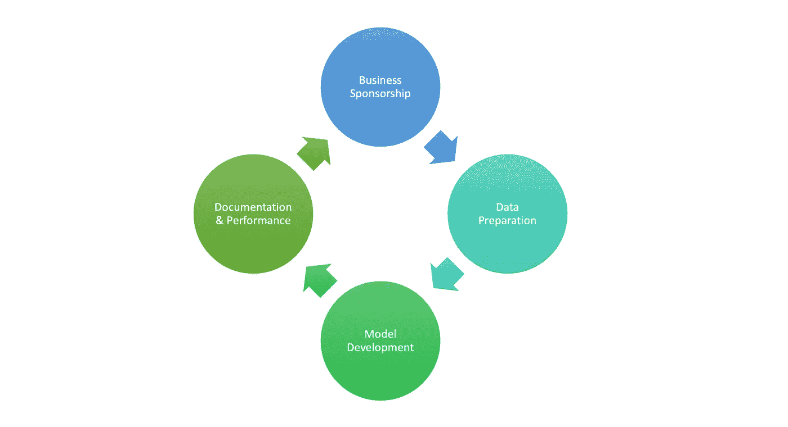

# 机器学习生命周期实用指南

> 原文：<https://medium.com/mlearning-ai/a-practical-guide-to-machine-learning-lifecycle-76614d5ae6b3?source=collection_archive---------8----------------------->

## 以信用卡诈骗为例

Image By Author

# 机器学习

机器学习已经成为过去十年的流行语，它的受欢迎程度并没有下降。随着越来越多来自不同领域的专业人士或新毕业生进入这一领域，我觉得不仅从 ML 的角度，而且从商业的角度有一个全面的指导将是非常有用的。在过去的几年里，我在开发机器学习模型方面学到了很多，甚至更多的是通过业务理解。经历所有的挑战对我来说是一场斗争，我希望那里的任何人都不必经历它们。在这篇文章中，我想尽我最大的努力通过将两者结合在一个概述中并强调一些经常被忽略的部分来谈论 ML。我将尽可能全面地列出以下要点:

## 商业赞助

*   问题陈述
*   利益相关者
*   时间表

## 数据准备

*   y 明确定义
*   数据理解
*   数据收集
*   数据清理
*   数据就绪

## 模型开发

*   电子设计自动化(Electronic Design Automation)
*   特征选择
*   模特培训
*   模型验证

## 文档和绩效跟踪

*   证明文件
*   绩效跟踪

# 1.商业赞助

## 问题陈述

如果你的任务是建立一个机器学习模型，很有可能有一个问题正在等待解决。理解问题就解决了一半。不要等问题来找你，积极主动地问问题，答案会随之而来。如果你不知道该问什么，你总是可以从业务开始。你的部门是什么，要达到什么目标，你的合作伙伴是谁或者你的上下游业务是什么。这些将有助于你了解全局。一旦你了解了大局，然后询问项目。这将使你更容易理解这项任务。

## 利益相关者

您的利益相关者是请求者、用户和工程师，基本上是每个会受到模型结果影响的人。这将使您能够与每个团队进行清晰而全面的沟通，管理他们的期望，并从您的合作伙伴那里获得最准确和真实的反馈。

## 时间表

一旦你理解了任务并确定了合适的涉众，评估你需要多少时间来开发模型。更新你的利益相关者以符合期望。我认为制定时间表的最大原因不是为了按时交付项目(如果你能做到的话)，而是为了在意外事件发生时调整和重新调整你的利益相关者。在实际项目中，这些意想不到的事情会一次又一次地发生，比任何人想象的都要频繁。

# 2.数据准备

## Y —明确定义

虽然当你在银行、保险或零售等传统行业时，这不是什么大问题，但在初创企业中，这可能是个大问题。以我目前在一家初创公司的工作为例，信用损失可能与第一方欺诈混合在一起，而第一方欺诈又可能与第三方欺诈混合在一起。是的，你仍然可以对混合在一起的不良行为者建模，这只会损害你的模型的准确性，因为在每种欺诈类型中，用户行为的代表性不足。在建立模型之前，你可以参考我的关于如何建立一个反欺诈团队的指南

 [## 从头开始组建反欺诈团队的完整指南

### 你需要知道的一切

beat-fraud-with-ml.medium.com](https://beat-fraud-with-ml.medium.com/a-complete-guide-to-build-a-fraud-team-from-scratch-b2d33f42b1a6) 

一旦你清楚地定义了你的欺诈类型，并正确地记录在数据库中，你将会更容易处理建模。然而，在定义 Y 时，仍然会面临一些被忽略的约束，它们是时间约束、数据约束和业务约束。我们将详细讨论它们。

**时间约束**

当我使用新的应用程序时，身份欺诈受害者每天都来报告身份被盗，其中一些人在开户后 5 天内报告，一些人可能长达 30 天，还有一些极端情况下，受害者在 10 年后报告身份被盗。是的，在受害者意识到他们被欺骗之前，已经过去了 3650 多天。你明白了，这里的问题是我们如何做出一个合理的时间截止来统计哪一个是欺诈，哪一个不是。其中一个解决方案是，您可以使用加速度图来查看欺诈率在哪里逐渐减少到一个几乎没有增加的点。

**数据绑定约束**

这可能来自贵公司刚刚签约的新供应商，也可能来自刚刚开发和实施的新功能，在这两种情况下，数据在数据集的定义时间内都不可用。在一些奇怪的情况下，您的企业只是发送了几个选定的案例以降低成本，导致数据集不完整。您可以采取的一个解决方案是将供应商数据留给下一次迭代，或者您可以选择一个对您的模型影响最小的时期。

**业务约束**

业务绑定约束更多地关注业务流程，业务流程转化为数据绑定约束。让我们以客户获取为例，客户资格通常在欺诈检查之前，因此如果这些申请因获取原因被拒绝，您不需要首先考虑它们是欺诈。

总而言之，正确定义目标变量以及所有考虑的约束是非常重要的，最终可能会对模型性能产生很大影响。

## 数据理解

就像 Y 一样，理解独立变量的业务流程也很重要。为什么需要了解你的数据？你不就是把尽可能多的数据输入模型，让模型为你工作吗？不幸的是，无论听起来有多智能，机器学习都无法知道什么过程优先。所以为了让模型帮助你，你需要首先帮助模型决定过程。

例如，交易欺诈通常发生在政策检查之后，如 CVV 检查、到期日期检查。如果这些都没有通过，你甚至不需要考虑一个交易是不是欺诈。

## **数据收集**

数据是新的石油，谁拥有最多的数据，谁就是这个时代的冠军。因此，在构建模型的下一个迭代之前，尽量收集更多的数据。翻翻你公司的文档，和你的合作伙伴谈谈他们用的是什么数据和供应商，无论用什么方法都可以让你得到更多的数据。

拥有更多数据的想法最好是建立在它会给你带来新信息的前提下。因为你不知道哪个特性会给你带来额外的信息，所以你倾向于尽可能多地收集，并通过特性选择来转储其中的大部分。因此，如果你能在第一时间收集高质量的数据，你可能不需要大数据，这就是新趋势“小数据”。

## 数据清理

不幸的是，数据并不像你想象的那么干净，特别是在创业公司，MVP/agile 是打造下一个独角兽的必由之路。收集完数据后，您需要确保数据的完整性。确保模型的完整性、一致性和准确性，这对于一个成功的模型至关重要。主要检查内容:

*   缺少值(取决于型号)
*   复制
*   盖
*   数据一致性(大写、数据类型、长度等。)

## 数据就绪

对我来说，数据清理和数据准备的区别在于，数据清理是为了修复数据的损坏，而数据准备是为了提高模型的性能。传统上，数据清理和数据准备是一起完成的，但是随着大数据和数据工程师的出现，这两个过程最好分开。让数据工程师做集成和清理工作，建模师做准备工作。原因是数据工程师清理的数据面向所有团队，而 modeler 将数据用于特定的业务任务。我们可以将数据就绪性分为两个部分:数字和分类

**数字**

*   分布的变换(用 box-cox 检查)
*   极端值

**直言不讳**

*   电平缩减
*   虚拟变量创建
*   转换离散数值

# 3.模型开发

## 电子设计自动化(Electronic Design Automation)

EDA 是一个了解数据特征的过程，你可以查看我关于 EDA 的文章了解详情。

 [## 探索性数据分析实用指南

### 以信用卡诈骗为例

medium.com](/mlearning-ai/a-practical-guide-to-exploratory-data-analysis-fabbac2bcad) 

## 特征选择

特征选择是在数据收集期间收集了太多数据的结果，并且绝大多数数据实际上对模型的性能没有贡献。从数学上讲，收集的要素越多，新要素与现有要素形成线性组合的可能性就越大(**多重共线性**)。第二个原因是模型过度拟合，第三个原因是由于技术进步在处理大量特征方面速度缓慢，因此正在开发新的机器学习芯片来处理更多的特征和数据。

首先也是最重要的，不要一头扎进机器学习特征选择检查无意义的变量，比如 id、键、**一元**特征和原因代码特征等等。这些都是唾手可得的水果，你会看到很多。通过去除这些，你的下一轮特征选择将会更加准确和有意义。

接下来你会被网上所有关于特征选择的文章弄糊涂，**向前，向后，逐步，决策树，RFE，L1 正则化等等。**忘记所有这些理论上的选择，坚持使用 **GBM 的**变量重要性，根据经验保留***95%****累计，去掉底部的 5%。*

*最后，通过多次迭代再次运行变量重要性和相关性测试，如果相关系数大于阈值( ***经验性地*** > 0.6)并且对应的对应变量不太重要，则丢弃它。*

*通过列出的特征选择步骤，他们将减少大约 70% - 80%的特征。下一步，当你有了最终的特征列表，你就可以输入到你要训练的模型中。*

## *模型假设*

*模型假设经常会被忽略，但是了解这一点将有助于了解将来会面临什么样的问题，以及如何预防。有两种类型的假设，模型假设和数据假设*

***模型的假设***

*模型的假设来自于模型本身，像 linger 回归需要有 5 个假设保持为真来验证结果。*

***数据假设***

*有时我称之为外部假设，因为它们中的许多受到外部因素的影响。例如，宏观经济是稳定的，对历史数据的模型可预测性是未来数据的反映，属性保持稳定。*

## *模特培训*

*现在，您已经拥有了最终的功能列表，是时候调整模型了。在学术上，您可以使用数据来拟合多个模型，并根据模型性能选择最佳模型。实际上，您仍然可以，但是大多数时候，我们已经知道神经网络或 GBM 优于逻辑回归或决策树。所以我们可以开门见山，直奔你认为最好的那个。但有时您可以使用逻辑回归来形成基线，并观察 GBM 可以为您带来多大的提升。*

*由于复杂性(数据+特征)，当我们拟合超参数空间时，我们可以将空间分割成子空间，每次拟合一个子空间，而其他子空间是固定的。当一个子空间被优化时，我们可以迭代下一个子空间，直到所有的子空间都被拟合。*

## *模型评估*

*在模型拟合之后，我们将需要在不同的数据集上测试模型的良好性。一个关于验证，两个关于过期数据集(如果可用)。这些都是为了确保您的模型在加班时保持稳定，不会恶化。*

# *4.文档和性能跟踪*

## *性能跟踪*

*在数据假设的前面，我们谈到了经济、数据和模式是稳定的，但是我们如何跟踪这些呢？我们可以用**种群稳定指数**对其进行跟踪。我们还可以跟踪单个特征，以及其重要性对模型性能的影响。这些都非常重要，因为很可能您的企业的所有应用决策、交易决策、收购决策都是基于这些模型结果做出的。一件事下来，一切都会出错。所以你已经花了这么多时间和精力开发这个模型，不要让外部因素毁了它。*

## *证明文件*

*最后，拥有一个好的文档可以让你和你的利益相关者有效的沟通，并且是你所有工作的来源。将所有细节提交给权利方，还可以让您(如果您可以在金融部门)正确接受审计，以获得质量保证和敏感信息。让文档成为您的朋友，从长远来看，您将从中受益。*

# ***结论***

*这是我从过去几年的经历中学到的。还有其他的指南也很棒，但是不那么详细和实用，这就是我写这篇文章的原因。希望这能对阅读这篇文章的人有所帮助。最后，机器学习一直在变化和发展，因为它成为大多数公司的通用解决方案。MLOps 就是为了简化整个工作流程而开发的，但是核心步骤不会有太大的变化。希望这会有所帮助！*

* [## Mlearning.ai 提交建议

### 如何成为移动人工智能的作者

medium.com](/mlearning-ai/mlearning-ai-submission-suggestions-b51e2b130bfb)*