# 使用 Pandas 进行时间序列数据分析的实用指南

> 原文：<https://medium.com/mlearning-ai/a-practical-guide-to-time-series-data-analysis-using-pandas-2720950031?source=collection_archive---------3----------------------->

## 了解如何使用 Pandas 分析时间序列数据集。


Photo by [Niels Kehl](https://unsplash.com/@photographybyniels?utm_source=medium&utm_medium=referral) on [Unsplash](https://unsplash.com?utm_source=medium&utm_medium=referral)

数据分析师和数据科学家花大部分时间清理和预处理他们的数据。这一步包括获取正确的数据、理解数据、探索数据的模式，以及在构建任何模型之前清理或预处理数据。

在本文中，我将解释数据分析师如何使用 Pandas 分析数据，Pandas 是一个广泛使用的 Python 数据分析库。

我将浏览一个由昆汀·考德隆【1】制作的数据集。这是一个时间序列数据集，描述了到某个日期为止意式浓缩咖啡机制作的咖啡总数**。**

你可以在这里找到数据集:[https://github.com/QCaudron/pydata_pandas](https://github.com/QCaudron/pydata_pandas)

在继续之前，请确保将以下库下载并导入到您的笔记本中:

*   熊猫
*   Matplotlib
*   Numpy

此外，在继续之前，确保你知道熊猫的基本知识。如果你想了解熊猫，你可以使用[文档](https://pandas.pydata.org/docs/)或者看看科里·斯查费写的关于熊猫的[系列教程](https://www.youtube.com/watch?v=ZyhVh-qRZPA&list=PL-osiE80TeTsWmV9i9c58mdDCSskIFdDS)。

# 导入和理解数据

一旦有了 CSV 格式的数据集，就可以使用 pandas 中的`.read_csv()`方法将文件读入数据框。这允许用户导入 CSV 文件并将其转换为数据框。Pandas 提供了许多不同的方法来通过读取不同的文件类型创建数据帧，函数列表可以在[这里](https://pandas.pydata.org/pandas-docs/stable/user_guide/io.html)找到。

导入数据后，您可以查看数据的外观，并对数据有所了解。您可以使用打印出列名列表的`df.columns`方法来查看列。

此外，您可以使用`df.describe()`获得数据的描述性统计摘要。在这里，您可以看到行数、列的平均值、标准偏差、最小值、最大值和每列的百分比。这是一个非常方便的工具，因为不用为所有列重复生成这些值，只需调用一次函数就可以获得所有值。

# 清理数据

我们在现实世界中得到的大多数数据集并不干净，包含一些缺失值或随机垃圾值。因此，分析师花大部分时间清理数据，并将其转换成有用和有意义的东西。

在本节中，我将解释以下任务:

*   列的数据类型不正确
*   处理缺失值

## 不正确的数据类型

一旦理解了数据，就知道列应该是什么数据类型。您可以使用`dtypes`检查数据类型。这将为数据集中的每一列返回一个具有数据类型的 series 对象。具有*对象*数据类型的列是字符串，其他数据类型是众所周知的整型和浮点型。

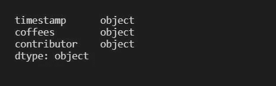

Source : Image by Author

正如您在数据集中看到的，coffees 列是一个对象数据类型，但这没有意义，因为 coffees 应该只是 coffees 的数量，并且应该是 int 或 float。因此，我们将进一步研究这个列，看看它为什么显示 object 数据类型。

如果您打印前 5 行，您将在 coffees 列中看到“testing”的值。这是一个字符串，这就是为什么数据类型是 object。因此，您可以删除该行，并使用`pd.to_numeric()`方法将该列转换为正确的数据类型。

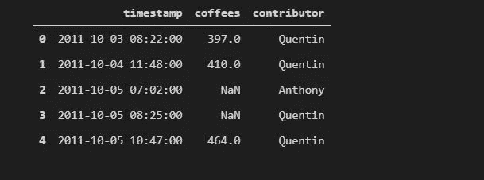

Source : Image by Author

另外，*时间戳*列应该是日期时间类型，而不是字符串，因为它允许我们对它应用日期时间函数。当导入 CSV 文件时，pandas 将 datetime 列作为字符串读取，您需要使用`pd.to_datetime()`方法将其转换为 datetime。

## 处理缺失值

有许多不同的方法来处理数据集中的缺失值。您使用的方法将取决于您的问题陈述和您拥有的数据集。但是，使用的主要技术是估算一些值，如平均值或中值来代替缺失值，或者删除包含缺失值的行。您也可以删除缺少值的列。参考文档以了解如何处理丢失的值。

在这里，我可以使用`df[‘coffees’].isnull().sum()`检查 coffees 列中缺失值的数量。在检查和查找丢失的值时，您应该了解为什么会丢失值。这里，机器坏了几次，因此值丢失了。因此，我们可以使用`.dropna()`方法删除空值行。

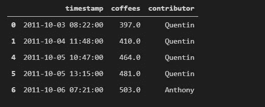

Source : Image by Author

# 可视化和分析数据

对于可视化时间序列数据，总是建议使用折线图来了解一段时间内的趋势。因此，您可以使用这个时间序列数据集做同样的事情。Pandas 有一种简便的方法可以使用`df.plot()`方法立即绘制图表。你可以在这里看文档[。](https://pandas.pydata.org/docs/reference/api/pandas.DataFrame.plot.html)

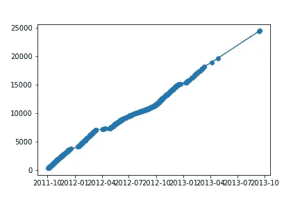

Source : Image by Author

我们可以看到，在线图中，数据最终是以非常不规则的间隔记录的，我们可以将其从数据集中删除。这将导致更加统一的时间序列图。

我们也可以先用`value_counts()`法，再用`plot()`法和夸尔`kind = ‘bar’`一起看每个人的贡献数。Value_counts()就像对列上的数据进行分组，然后对其应用`count()`方法。它只返回列中每个唯一值的计数。

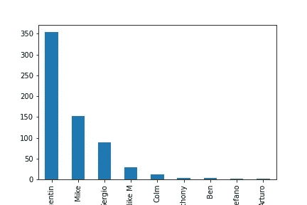

Source : Image by Author

另一个有用的图表是查看每天有多少贡献。为此，我们首先必须从时间戳列中获取工作日名称。由于数据类型现在是 datetime，我们可以应用`.dt.day_name()`来获取日期名称。然后，我们可以根据新的工作日列对其进行分组，获得一个计数，然后绘制一个条形图。

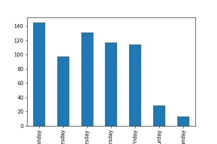

Source : Image by Author

# 分析时间序列

处理时序数据时最重要的提示之一是将 datetime 列设置为数据集的索引。这有助于我们快速分析事物，并允许我们使用时间戳作为索引来索引数据帧。学习基本时间序列的一个有用的资源是伊恩·奥兹瓦尔德【3】的 [pydata 演讲](https://www.youtube.com/watch?v=8upGdZMlkYM&t=1997s)。

现在，我们可以使用以下代码将时间戳列指定为数据帧的索引:

```
data.index = data[‘timestamp’]# Let’s drop the timestamp column, as we no longer need itdata.drop(columns=’timestamp’, inplace=True)data.head()
```

现在，我们可以观察到的一个重要现象是，时间戳不是一个固定的时间间隔，即数据不是在每天的特定时间记录的。相反，每天可能有多条记录。因此，为了使我们的分析更容易，我们可以转换数据集，这样我们每天只获得 1 个值，最好是在每天的午夜。然后，我们可以对可能为 NaN 的值进行插值，并进一步进行分析。

我们现在将创建一个从开始到时间戳列结束的`date_range()`。这将返回每天午夜的日期范围。然后我们可以把它和这个原始索引结合起来。然后，我们可以将数据框`reindex()`到我们创建的这个新索引。

```
# pd.date_range, with daily frequency, and normalisationmidnights = pd.date_range(data.index[0], data.index[-1], freq='D', normalize=True)new_index = midnights.union(data.index)# .reindex() the dataframe to get an upsampled dataframeupsampled_data = data.reindex(new_index)
upsampled_data.head(10)
```

`reindex()`的作用是匹配索引处的值。如果该索引有一行数据，它将返回数据，如果索引不匹配，它将返回 NaNs。

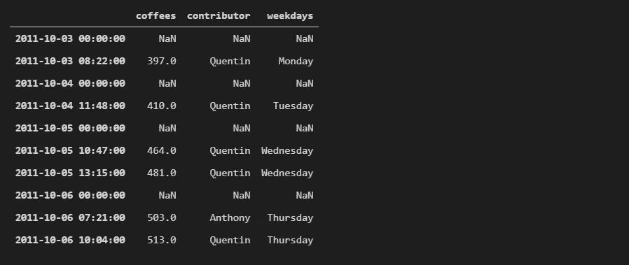

Source : Image by Author

我们现在可以通过内插最近的时间值来填充 NaN 值。例如，如果 3 月 3 日上午 8:22 有一个值，3 月 4 日上午 11:48 有一个值，那么 3 月 4 日上午 12:00 的值(因为我们将日期标准化为午夜)将最接近后者的值。这就是插值的基本工作原理。阅读此[讨论](https://stackoverflow.com/questions/30530001/python-pandas-time-series-interpolation-and-regularization)以了解更多关于时序插值。

```
# .interpolate the upsampled_data using the time methodupsampled_data = upsampled_data.interpolate(method=’time’)upsampled_data.head(10)
```

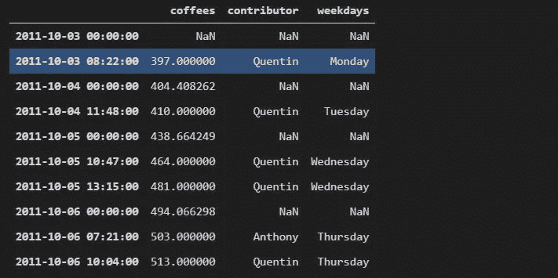

Source : Image by Author

现在，我们可以在每天午夜对数据进行重新采样。这确保了我们在读数之间有一个固定的间隔。

```
# .resample() the upsampled dataframe,# using .asfreq() to get only exactly daily valuesdaily_data = upsampled_data.resample('D').asfreq()# Drop the contributor column, we no longer need itdaily_data = daily_data.drop(columns='contributor')daily_data.head()
```

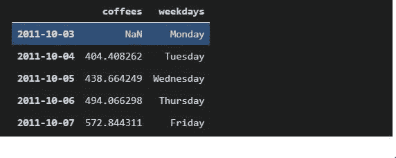

Source : Image by Author

因此，如您所见，我们现在每天都有一个索引，并且还对值进行了插值。这有助于我们从数据集中获得更有意义的见解。

# 进一步分析

现在，我们可以看看每天生产多少咖啡。coffees 栏是截至该日期的咖啡数量。但是为了得到每天制作的咖啡数量，我们可以从下一行中减去当前行。这可以使用`.diff()`方法来完成。此外，我们在这里使用`.shift()`,因为如果我们查看周一和周二之间的`.diff()`,这些咖啡被归因于周二。然而，我们想说的是“这么多咖啡是在周一的某个时候做的”，所以我们将整个系列上移一个。

```
# Use .diff() on the coffees column; follow up with .shift()coffees_made = daily_data['coffees'].diff().shift(-1)# Add this as a column to the dataframedaily_data["coffees_made_today"] = coffees_made
```

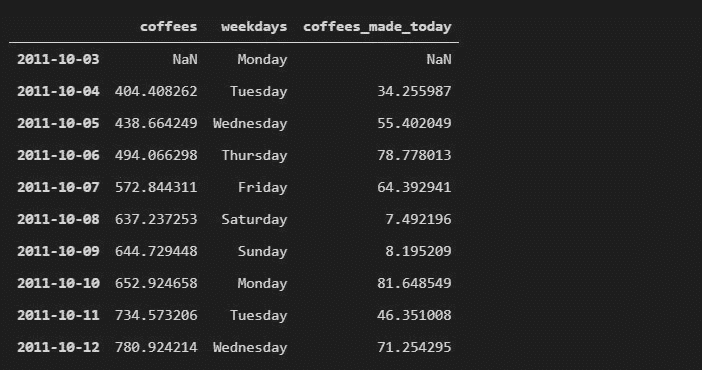

Source : Image by Author

现在，我们可以按工作日分组，得到每天咖啡的平均产量。这有助于了解哪一天制作的咖啡最普通。由于这台机器在数学系，我预测咖啡在周末会最少，因为它通常对人们来说是关闭的，而大多数咖啡会在有人过来做演讲的研讨会上。

```
# .groupby weekdays, take the mean, and grab the coffees_made_today columncoffees_by_day = daily_data.groupby('weekdays')['coffees_made_today'].mean()# Plot a bar chartcoffees_by_day.plot(kind='bar')
```

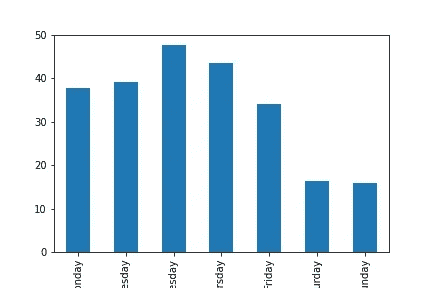

Source : Image by Author

正如你从图表中看到的，在一个普通的周末制作的咖啡数量最少，而在周三研讨会日制作的咖啡数量最多。

# 结论

这只是对数据分析师如何处理时间序列数据的简单介绍。还有更多内容，你应该看看昆汀·考德隆的这篇全面深入的教程[。](https://www.youtube.com/watch?v=F7sCL61Zqss&t=371s)

你可以在我的 Github 上找到完整的代码:[https://github.com/hemantrattey/pydata_pandas](https://github.com/hemantrattey/pydata_pandas)

请随时给我同样的反馈。

感谢你的阅读，我希望它能激励你继续前进，做你自己的分析。

过来打个招呼。在推特上对我说。

# 参考

[1] Pydata : [熊猫数据分析简介](https://www.youtube.com/watch?v=F7sCL61Zqss&t=371s)

[2] Q. Caudron : Github 知识库，【https://github.com/QCaudron/pydata_pandas 

[3] Pydata : [伊恩·奥兹瓦尔德:对熊猫时代系列和 Seaborn 的温柔介绍| PyData 伦敦 2019](https://www.youtube.com/watch?v=8upGdZMlkYM&t=1997s)