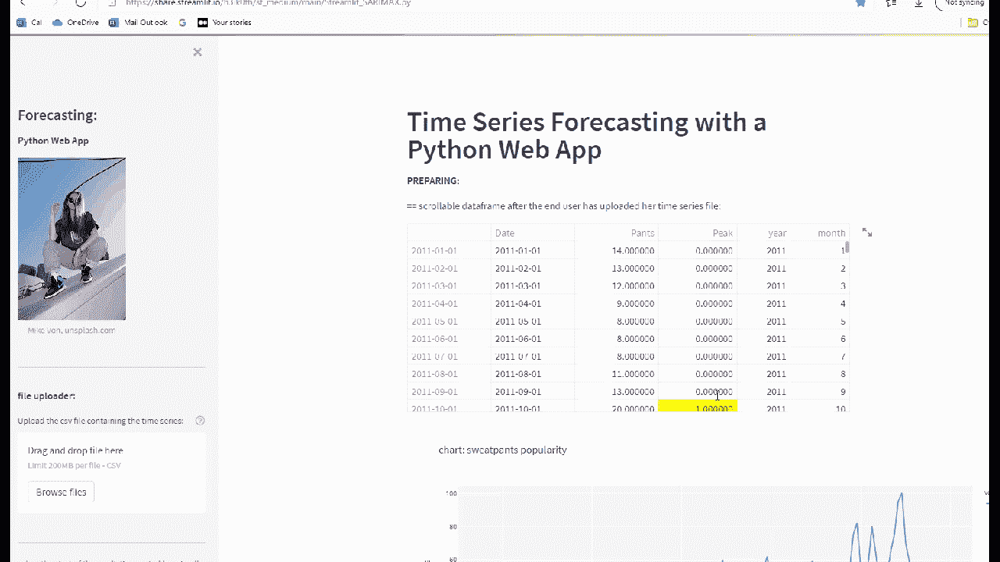

# 几分钟内完成 Python 数据科学 Web 应用程序

> 原文：<https://medium.com/mlearning-ai/a-python-data-science-web-app-in-minutes-17ee93eab61d?source=collection_archive---------1----------------------->

## 如何使用 Streamlit 为最终用户构建 SARIMAX 预测应用程序

我们将一步一步地构建一个预测模型，并将其部署为一个 web 应用程序，面向虚拟初创公司 UpJetBaggies 的最终用户，只需添加几行 Python 代码。

