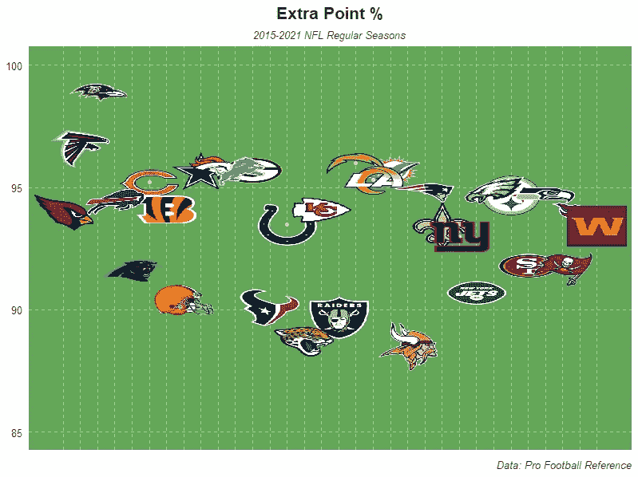
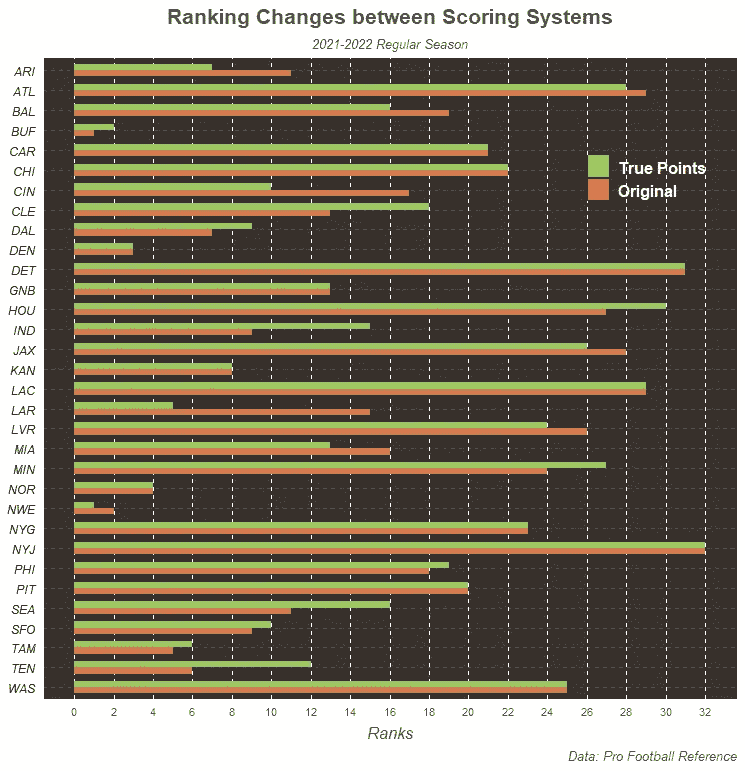
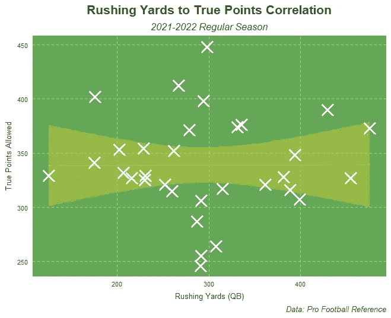
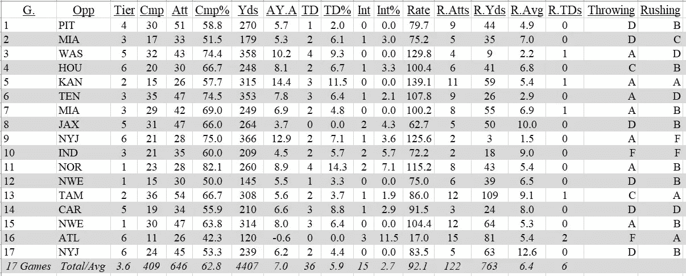
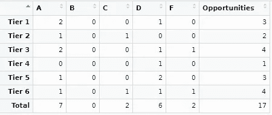
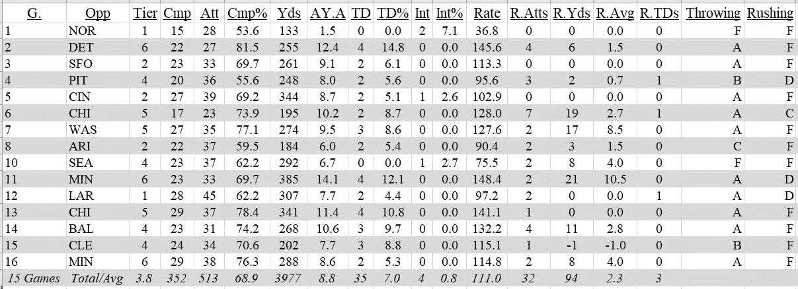
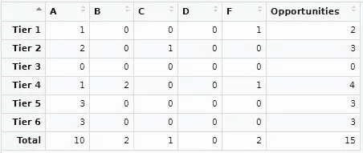
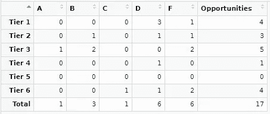

# 美国橄榄球联盟的“高质量开局”统计

> 原文：<https://medium.com/mlearning-ai/a-quality-start-statistic-in-the-nfl-5c3091adec61?source=collection_archive---------8----------------------->

字母等级可以快速评估球员在防守层的表现。

Photo by [Dave Adamson](https://unsplash.com/@aussiedave?utm_source=medium&utm_medium=referral) on [Unsplash](https://unsplash.com?utm_source=medium&utm_medium=referral)

棒球比赛中的优质开局是衡量投手成功的最简单的标准。

> 你投了 6 局吗？(弄 18 个玩家出来？仔细检查两遍阵容？)
> 
> 你允许少于 4 次的得分吗？(不要期待完美，孩子。)
> 
> 真的吗？干得好，你的质量开始+1。

这让我思考；为什么足球没有类似的统计？

嗯，很难找到一个可靠的性能基准。

本质上有 8 个进攻位置，5 个防守位置，他们都(有点)共享统计数据。就进攻而言，四分卫获得冲刺码，跑卫记录接球，后卫带球并能接住传球(有争议)，然后进攻线球员很大程度上只是通过他们做错了什么来衡量，但如果四分卫没有转移阻挡任务，这并不是他们的错……我想你明白了。

棒球和橄榄球都有战争(胜于替补)统计数据，每个组织对如何计算都有不同的看法。从本质上说，WAR 试图计算一名球员对球队获胜的贡献，与一名“替补级别”(基线)球员相比。战争有助于将玩家分成对各自团队有用的群体。

我正在尝试做一些不同的事情:

我想知道玩家在分级竞争中的表现如何，作为相互比较的基础。

我们开始工作吧！

**在这篇文章中，我将只关注四分卫，因为剖析和批评他们是最有趣的。我对其他职位有想法，但这暂时超出了本文的范围。**

首先，我所有的统计数据都来自于[职业足球参考](https://www.pro-football-reference.com/)的可爱的人们。

感谢所有让我的生活更轻松的努力工作！

现在，当我提到这个微不足道的，微小的，呃，极其重要的方面时，不要失去理智…我比较防守的唯一标准是“允许得分”。

> 就这样？！

好吧，好吧-先不要关闭标签，窗口，或你的手机。

**听我说完:**

当我只对 QB 位置上的进攻中坚分子感兴趣时，我看不出有必要让我的防守排名系统过于复杂；

*你为积分贡献了多少？*

就这些，我想知道的就这些。

每一项战争统计数据都告诉我们，你是任何球队中最有价值的球员，但是你和其他闪亮的球员相比如何呢？

如果你现在还不知道，我(短暂地)打了防守。

无论如何，我的允许点数和我在 PFR 发现的不同；在以下情况下，防守方应对另一方的所有得分负责:

*   踢回
*   平底船返回
*   营业额回报
*   额外加分

想象一下，你是一名首发防守球员，坐在场边，喝一些能量饮料，关注自己的事情，然后你转身看着某人在你自己的四分卫拦截时得分，而他们本应该知道得更好。

或者，在几天前的训练中，当你*刚刚*向他们展示如何结束时，你的替补错过了一次特殊球队的反击？

你感觉如何？恼火？恼怒吗？我敢说，烦吗？

自 2015 年以来，额外积分已经转化为全联盟平均约 93.7%的分数，这一年制定了一项新规则，使商业广告前的休息变得更加困难。在你问之前，是的，是维京人拉低了联盟平均水平(很明显)。

**感谢* ***NFLfastR*** *开发者更方便地访问 NFL 标志！*

另外，踢球者表演的首发出场了吗？

> 是的，但同时，不。

我认为没有必要保留这些不必要的防守瑕疵，所以我去除了它们，并建立了一个新的防守质量指标，我称之为“允许的真实得分”。

在 2021–2022 赛季，在我应用了这个新的指标后，20 支球队的防守排名发生了变化。我相信这些数字是对每个防御单位能力的更准确的评估。

**防御层**

我根据允许的真实要点将防御分为不同的层次，如下所示:

*   第 1 层= 1–5 层
*   第 2 层= 6–10 层
*   第 3 层= 11–15 层
*   第 4 层= 16–20
*   第 5 层= 21–26 岁
*   第 6 层= 27–32

如果出现平局，平局的队伍按照数字顺序对应于下一个排名，在评估所有平局之后，随后的队伍被分配以下数字。

例如，如果两个队并列第 5 名，那么下一个队将排在第 7 名。如果三个队并列第 17 名，那么下一个队将排在第 20 名。这意味着一些层级可能只有 3 到 4 个团队，甚至 6 到 7 个团队。

**你会问，哪些统计数据？**

对于每一层，我取了他们相对于传球者关于这些统计数据的平均值的四分位数范围:

*   传球码
*   每次传球尝试的调整码数
*   完成百分比
*   尝试触地百分比
*   尝试拦截百分比
*   QB 评级

以下是 2021-2022 赛季所有级别的产品系列:

玩家根据他们在比赛日面对的防守等级，为他们得分的每一部分赢得分数。因此，如果一个传球者投出超过该层允许的最大码数，他们就能得到 5 分。如果一名球员的 QB 评分在中间值和 75%基准之间，他们获得 3 分。如果他们的完成百分比低于最低要求，他们就不能获得任何分数。拦截是一件坏事，我想我们都同意，所以它们以相反的方式工作。

下面，我们列出了在质量起点统计中获得每个等级所需的分数:

**通过** **等级**

*   a = 25–30 分
*   b = 19–24 分
*   c = 13–18 分
*   d = 6–12 分
*   F = ≤ 5 分

**争夺 QB 的困境**

考虑 QB 冲击的影响有点困难。正如你在下面看到的，QB 冲刺码与 2021-2022 年防守允许的真实得分没有相关性。然而，我不想忽视 QBs 的影响，所以我为玩家游戏的这一方面创建了一个单独的评分系统。

为了将点数归因于 rushing stats，我比较了一个玩家在一场比赛中的总码数和一个 QB 在每场比赛中的平均码数。无论目标 QB 超过均值多少倍，分数都会增加。例如，QBs 的平均每场比赛距离约为 17 码。乔希·艾伦在 2021 年第一周对阵匹兹堡钢人队的比赛中跑了 44 码，因此他将因超过平均值的两倍而获得 2 分。如果 QB 冲向 QB 在一场游戏中的平均收入，则“冲平均”会得到一分。每一次抢跑都得一分。

**冲成绩**

*   A = ≥ 5 分
*   b = 3-4 分
*   C = 2 分
*   D = 1 分
*   F = 0 分

**给我看看统计数据！**

好吧，好吧，别急。需要注意的一点是，什么才算是“开始”。首先，玩家必须从游戏一开始就是指定的首发。这意味着防守一周都在准备面对他们。其次，他们一定是在游戏中抢走了 QB 50%以上的快照。有时候，如果首发球员表现不佳，或者他们的季后赛席位已经确定，教练只想给替补球员一些上场时间，那么他们就会在中场休息时被换下。这些情况并不常见，但是我觉得这两个标准可以解释大多数情况，并且给了首发球员一个公平的机会去注册他们的数据，即使他们受伤了。

现在，让我们来看看 2021-2022 NFL 赛季首发球员的一些比赛日志示例:

**平衡 QB 的结果:乔希·艾伦**

布法罗比尔队的乔希·艾伦有一双强壮的手臂，他的移动能力经常被依赖。他是这种质量起点分析的绝佳范例:

联盟 MVP 评选结果:亚伦·罗杰斯

下面是一个 MVP 级别的球员如何利用这个系统得分:

**新秀首发结果:特雷沃·劳伦斯**

这是一个挣扎中的团队的新秀可以通过这个指标来表示的:

**NFL 中质量起点统计的目的**

如果我是一个足球队的总经理，我希望有一个快速、方便的统计数据，可以告诉我一名球员在不同水平的比赛中表现如何。我需要知道我的 QB 在面对弱队时是否能给出天文数字，在面对强队时是否会崩溃。在季后赛中，防守变得更加强硬。此外，一个高质量的开局统计可以衡量一个球员多年来的进步。当给定足够的样本量时，它可以被视为“合同对合同”的统计。

我们可以通过一个每周都在庆祝和破坏自己价值的玩家来详细研究这个问题。

贝克·梅菲尔德难题

关于《克利夫兰·布朗》中的贝克·梅菲尔德，有什么是关于詹姆斯·卡梅隆的《T2》中的阿凡达没有说过的？起初，两者都令人印象深刻，但现在公众开始质疑它们的实际价值，甚至怀疑我们是否会花钱去看它们的下一个版本。

以下是他按赛季分类的统计数据，最后是他的职业生涯总得分:

**持有还是折叠？**

贝克·梅菲尔德前后矛盾。他在面对众多一级球队时表现出色，但在面对较弱的对手时却表现不佳。他不是一个糟糕的球员，但他可能不值得在已经很少的 NFL 工资表上保留好的/伟大的 QBs。他今年受伤了，所以很难因为他最近的挣扎而批评他太多。布朗队已经接受了梅菲尔德的第五年延期，这将成为前状元秀成败的一年。

如果梅菲尔德明年有一个不错的赛季，假设他从伤病中完全康复，那么以“正确”的价格重新签下他可能是一个被低估的举动。

**结论**

这种高质量的开局统计有助于评估球员如何应对不同水平的比赛。它可以证明，如果一个球员是利用轻松的竞争来提高他们的统计数据，而不是对质量防御的表现。或者，它可以显示一个年轻球员的进步，因为他们越来越适应与更好的对手比赛，同时仍然在他们应该击败的球队中取得良好的数据。在贝克梅菲尔德的案例中，它可以总结出一个不稳定的球员，他可能不值得一个过度广泛的投资，但他仍然表现出了希望。

感谢您花时间读到这里！

**GitHub**

下面是这个项目中我的 Github 的链接:[https://github.com/brianravelo28/Quality_Starts_NFL](https://github.com/brianravelo28/Quality_Starts_NFL)

 [## Mlearning.ai 提交建议

### 如何成为 Mlearning.ai 上的作家

medium.com](/mlearning-ai/mlearning-ai-submission-suggestions-b51e2b130bfb) 

[**成为 MLearning.ai** 的作家 ](/mlearning-ai/mlearning-ai-submission-suggestions-b51e2b130bfb)