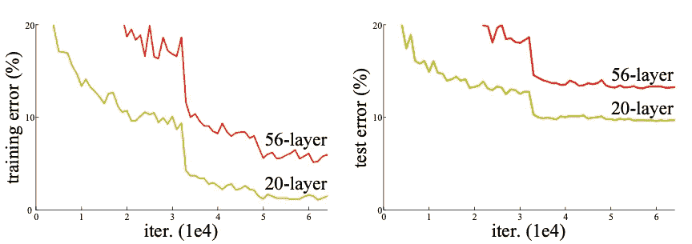
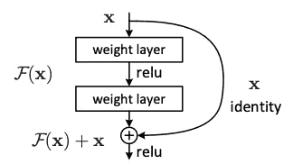
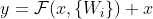
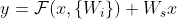
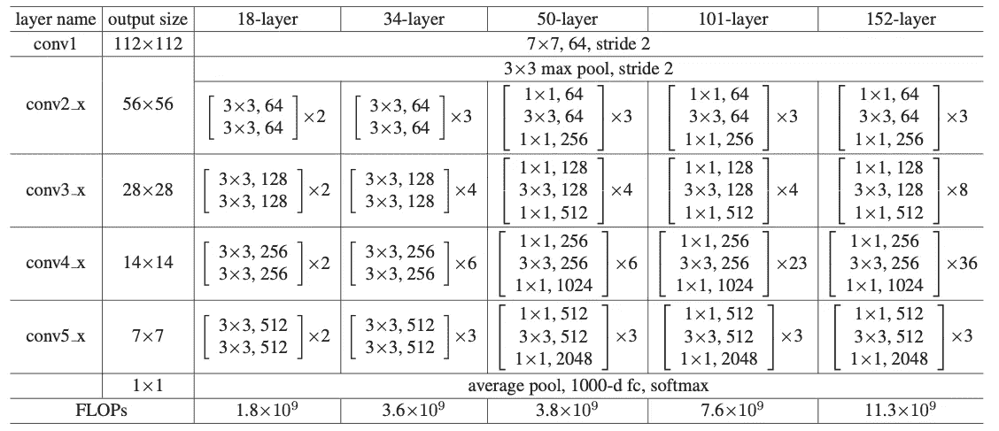
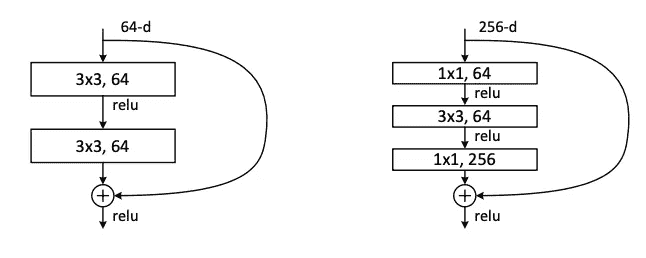
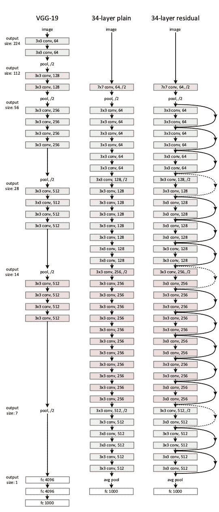

# ResNet 模型的快速概述

> 原文：<https://medium.com/mlearning-ai/a-quick-overview-of-resnet-models-f8ed277ae81e?source=collection_archive---------0----------------------->

# 一.导言

在之前的帖子中，我们发现了一些流行的卷积神经网络(CNN)，如 [LeNet](https://lekhuyen.medium.com/lenet-and-mnist-handwritten-digit-classification-354f5646c590) 、 [AlexNet](https://lekhuyen.medium.com/alexnet-and-image-classification-8cd8511548b4) 、 [VGG、NiN](https://lekhuyen.medium.com/an-overview-of-vgg16-and-nin-models-96e4bf398484) 、 [GoogLeNet](https://lekhuyen.medium.com/implementation-of-googlenet-on-keras-d9873aeed83c) ，在这些网络中，模型性能随着层数的增加而成比例增加。有人可能会问，模型的层数越多，学习效果越好吗？一般来说，它并不总是正确的。因为具有大量层数的模型中的消失梯度现象从一开始就损害了这些模型的收敛性。下图就是一个具体的证据。56 层的模型表现不如 20 层的模型。



Figure 1: Training error (left) and test error (right) on CIFAR-10 dataset of “plain” networks with 20 layers and 56 layers. Source [1]

为了克服这一缺点，微软的一个研究小组在 2015 年提出了一种深度卷积神经网络，即 ResNet。该网络由关于输入层的多个残差块组成，并且它们的操作原理与优化残差函数有关。这种特殊的架构允许通过增加层深度来获得精度。因此，该模型在 ILSVRC 和 COCO 2015 竞赛中获得了关于 ImageNet 检测、ImageNet 定位、COCO 检测和 COCO 分割任务的第一名。

在原始论文中，作者提出通过残差映射来拟合附加层。通常，如果我们用底层映射来表示 H(x)，那么残差映射由 *F(x) := H(x) - x* 来确定。剩余学习模块具有以下形式(图 2):



Figure 2: The architecture of a residual building block. Source [1]

该块的一部分由身份映射层组成，其他层从学习的较浅模型复制。

*   当输入 x 和输出 y = H(x)具有相同的维数时，残差块函数由下式定义:



其中 F(x，{W_i})表示要学习的残差映射，W_i 表示该块中 i^{th}层的权重。

*   当输入 x 和输出 y 不具有相同的维数时，我们可以使用线性投影 W_s 到恒等函数中来匹配维数:



残余块可具有两层或更多层。在最初的文章中，作者使用大小为二和三层的残差块构建了不同的网络(表 1):



Table 1: Architectures of Resnet for ImageNet dataset. The residual building blocks are shown in brackets with the numbers of stacked blocks. Source [1]

上表显示了用于分类 ImageNet 数据集的 ResNet 的不同架构。层数从 18 到 152 不等。剩余块有两层或三层(图 3):



Figure 3: The architecture of a residual block with two layers (Left) and three layers (Right). Source [1]

下图显示了 34 层架构残差网络(ResNet-34)与 34 层普通网络和 VGG-19 模型的对比。



Figure 4: **Left:** VG-19 model, **Middle:** a plain network with 34 layers, **Right:** ResNet-34\. Source [1]

总而言之:

*   在 ResNet 模型中，所有卷积层都应用大小为 3 × 3 的相同卷积窗口，滤波器的数量随着网络的深度而增加，从 64 到 512(对于 ResNet-18 和 ResNet-34)，从 64 到 2048(对于 ResNet-50、ResNet-101 和 ResNet-152)。
*   在所有模型中，只有一个最大池层，池大小为 3 × 3，在第一个层之后应用步长 2。因此，在训练过程中，降低输入的分辨率受到很大限制。
*   在所有模型的末尾，应用平均池层来替换完全连接的层。这种替换有一些优点。首先，在这一层中没有要优化的参数，因此它有助于降低模型的复杂性。其次，这一层更自然地加强了特征图和类别之间的对应关系。
*   输出层有 1000 个神经元，对应于 ImageNet 数据集中的类别数。此外，在该层中应用了 softmax 激活函数，以给出输入属于每个类的概率。

# 二。在 Keras 上导入一些可用的 ResNet 模型

Keras 平台上有不同版本的 ResNet 模型，如 ResNet-50、ResNet-101 和 ResNet-152。可以很容易地从模块***tensor flow . keras . applications:***中导入

**进口 ResNet-50 型号:**

```
from **tensorflow.keras.applications** import **ResNet50**ResNet_50 = ResNet50(weights = None)*# parameter number:* ResNet_50.count_params()
>>> 25 636 712
```

**导入 ResNet-101 型号:**

```
from tensorflow.keras.applications import ResNet101ResNet_101 = ResNet101(weights = None)*# parameter number:* 
ResNet_101.count_params()
>>> 44 707 176
```

**导入 ResNet-152 型号:**

```
from tensorflow.keras.applications import ResNet152ResNet_152 = ResNet152()*# parameter number:*
ResNet_152.count_params()
>>> 60 419 944
```

# 三。结论

在这篇文章中，我们发现了不同 ResNet 模型的架构。它们由多个剩余块组成，剩余块的构造与学习剩余函数有关。这种架构允许避免额外层的过度配合。特别是一些 ResNet 型号，如 ResNet-50、ResNet-101 和 ResNet-152 在 Keras 上有售。因此，它们可以很容易地导入，而不需要像我们在以前的文章中那样从头实现。:-)

希望这篇帖子对你有帮助。如果您有任何问题，请随时联系我。

感谢阅读！

***Github 代码****:*[https://Github . com/khu yenle-maths/A-quick-overview-of-ResNet-models/blob/main/A _ quick _ overview _ of _ ResNet _ models . ipynb](https://github.com/KhuyenLE-maths/A-quick-overview-of-ResNet-models/blob/main/A_quick_overview_of_ResNet_models.ipynb)

**我的博客页面:**[https://lekhuyen.medium.com/](https://lekhuyen.medium.com/)

____________________________________________________________

**参考文献:**

[1]何，，等.“用于图像识别的深度残差学习”IEEE 计算机视觉和模式识别会议论文集。2016.

[](/mlearning-ai/mlearning-ai-submission-suggestions-b51e2b130bfb) [## Mlearning.ai 提交建议

### 如何成为 Mlearning.ai 上的作家

medium.com](/mlearning-ai/mlearning-ai-submission-suggestions-b51e2b130bfb)