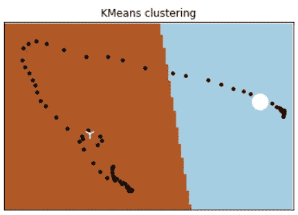
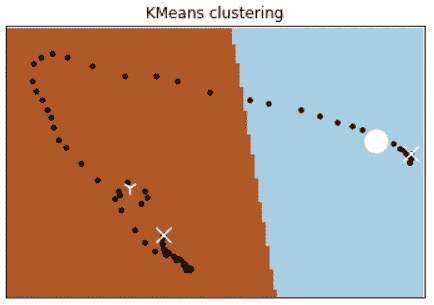
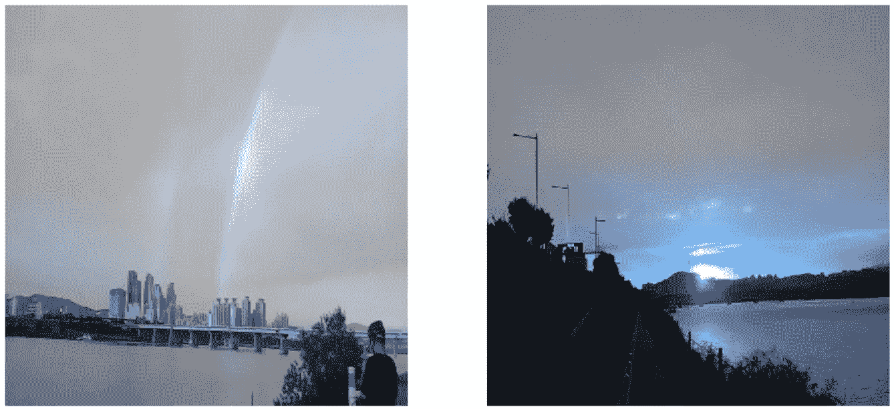
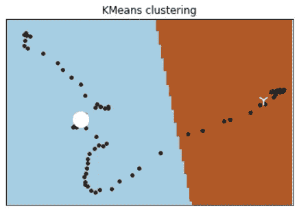
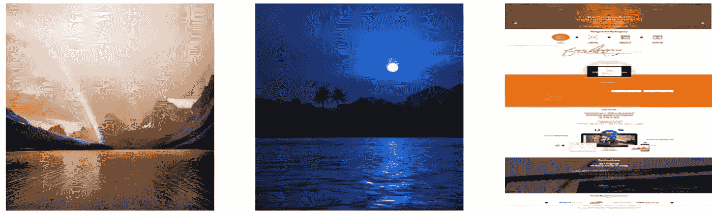
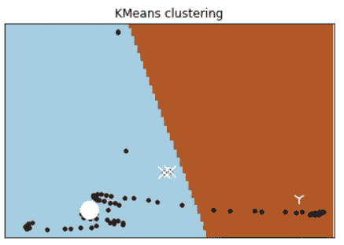
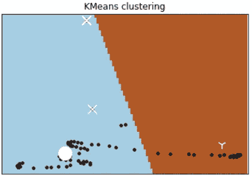
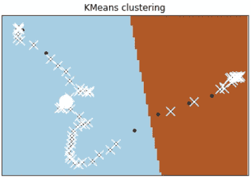
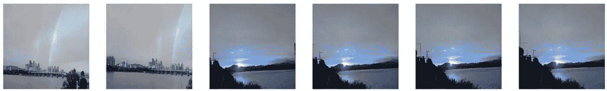

# 一种可扩展的重复图像检测方案

> 原文：<https://medium.com/mlearning-ai/a-scalable-solution-to-detect-duplicate-images-97d431c2726d?source=collection_archive---------1----------------------->

在训练模型之前，删除重复数据是一个必要的步骤。问题是如何以一种可扩展的方式来实现它。

[问题](#d824)
[现有方法](#60bc)
[要求](#3420)
[解决方案](#0a51)
[实施](#9609)
∘ [1 .聚类](#0ddb)
∘ [2。保存质心](#d788)
∘ [3。根据到形心](#8240)
∘ [4 的距离找到群集。与集群内的其他图像进行比较](#4019)
[结论](#da88)
[参考文献](#de7f)


Photo by [David Brooke Martin](https://unsplash.com/@dbmartin00?utm_source=unsplash&utm_medium=referral&utm_content=creditCopyText) on [Unsplash](https://unsplash.com/s/photos/double-rainbow?utm_source=unsplash&utm_medium=referral&utm_content=creditCopyText)

如果同一性意味着像素方面的同一性，则相同的图像更容易被检测到。例如，我们可以使用图像散列来编码每个图像，并快速比较两个图像的散列值。但是，如果要比较两幅图像有多相似，或者两幅图像是否“非常相似”到人类无法分辨的地步，那么问题就难多了。后者是“重复”的工作定义，我想告诉你如何检测重复的图像。完整的代码示例可从[这里](https://github.com/changsin/ClassifyImages/blob/main/notebooks/dedupe_images.ipynb)获得。

# 问题

要问的第一个问题是为什么要检测重复图像。可能有很多原因，但让我列出几个机器学习的原因。

1.  **偏差:**有重复数据意味着模型将更多地根据该类型的数据进行训练，因此会有偏差。一个或多个重复数据可能没问题，但如果有很多重复数据，模型将无法对新数据进行归纳。
2.  **成本:**每一条数据都需要手工标注，并以某种方式进行审查。拥有重复数据意味着增加了不必要的数据处理、存储和计算成本。
3.  **噪音:**如果标记不一致或不正确，重复数据也会导致训练集中出现细微的噪音。

出于这些原因，我们希望删除尽可能多的重复数据。然而，手动检测和删除重复是不可扩展的，因此需要一种更好的方法。

# 现有方法

有一些已知的解决方案来检测重复。

1.  **图像散列:**将每个图像编码为一个散列值，然后比较散列值，这是一种检查相同图像的快速简单的方法。但是，正如您将看到的，如果图像被轻微改变(例如，图像像素向左移动一个像素)，此方法不起作用。此外，图像哈希只提供了一个二元答案:相同或不同。我们需要的是一个相似性度量，这样我们就可以决定如何将相似的图像归类为“副本”(伴随笔记本的[有一个演示，说明为什么这种方法在只有一个像素改变时会失败。)](https://github.com/changsin/ClassifyImages/blob/main/notebooks/dedupe_images.ipynb)
2.  **传统方法:**然后是传统的检测图像相似性的方法，比如取像素值的差值，比较直方图，计算结构相似性指数 [SSIM](https://en.wikipedia.org/wiki/Structural_similarity) ，或者[特征匹配](/data-breach/introduction-to-feature-detection-and-matching-65e27179885d)。每种方法的优缺点超出了本文的范围，但一般来说，它们适合一次比较两个或几个图像，但很难大规模使用。
3.  **神经网络:**第三种方法是利用深度学习来寻找副本:例如[连体网络](https://conferences.oreilly.com/strata/strata-eu-2018/cdn.oreillystatic.com/en/assets/1/event/267/Using%20Siamese%20CNNs%20for%20removing%20duplicate%20entries%20from%20real%20estate%20listing%20databases%20Presentation.pdf)。虽然这种方法是最鲁棒的，并且甚至可以处理旋转的复制图像，但是它需要使用另一个神经网络来进行繁重的训练和推理。

# 要求

根据对其他方法的调查，我们希望满足以下要求:

1.  **相似性度量:**我们想要能够告诉我们两个给定图像有多相似的度量，而不是匹配或不匹配的单一二元决策。
2.  **可扩展:**该解决方案应该能够处理两幅图像、多幅图像和一个大型图像数据集。
3.  **轻量级:**删除重复是为了预处理深度学习的训练数据，所以我们希望解决方案尽可能轻量级。

# 解决办法

我提出的解决方案是一种改进的聚类算法。这些步骤是:

1.  基于要素地图对初始数据集进行聚类。
2.  保存并加载质心值，以处理其他图像数据。
3.  对于每幅图像，找到最近的质心。
4.  将相似性度量与该组中的其他图像进行比较。

作为聚类的副产品，您可以计算数据点之间的距离，这可以用作我们要寻找的相似性度量。然而，聚类算法的一个缺点和限制是它不能用于大量数据。在我的实验中，如果图像列表超过几百个，那么 Colab 会由于内存不足错误而崩溃。哎哟。

为了解决可伸缩性问题，建议的解决方案包括两个步骤。首先，要使用聚类作为查找相似性的方法，每个聚类应该保持在几百个图像上。第二，保存质心，并在处理一组新图像时使用它们。换句话说，在对不到几百幅图像进行初始聚类后，我们使用质心作为附加图像的比较点。

对于每幅新图像，计算与现有质心的距离，以找到最接近的聚类。确定最接近的聚类后，您可以与聚类中的所有数据点进行比较，以查找是否存在重复数据。让我们详细看看这是如何在代码中实现的。

# 履行

这是我正在使用的一个示例视频剪辑。

Double rainbow and the sunset

在这个特殊的日子里，我有幸目睹了太阳下山时，首尔汉江上悬挂的一道双彩虹。视频剪辑显示了一次拍摄中的双彩虹和日落。我期望的是应该有两个集群。第一个应该围绕双彩虹，第二个围绕日落场景。让我们看看聚类算法是否能做到这一点。

## 1.使聚集

使用 Sklearn 的知识管理工具很容易进行聚类。只需指定集群的数量并传递数据:

```
from sklearn.cluster import KMeanskmeans = KMeans(n_clusters=2, random_state=0)
X_clusters = kmeans.fit(X)
```

使用 KMeans 的一个警告是输入必须是二维数组。如果使用 CV2 的 imread()方法加载图像，则形状可能如下所示，即 73 个图像，每个图像在 3 个通道上的分辨率为 320x320:

```
X.shape
>(73, 320, 320, 3)
```

数据需要像这样重塑:

```
X_reshaped = preprocessing.normalize(X.reshape(X.shape[0], -1))
X_reshaped.shape>(73, 307200)
```

在传递重新成形的图像数据之后，聚类结果是图像的看起来奇怪的连通点(两个白色标记是质心):



KMeans clustering result of a video clip

这是可以理解的，因为剪辑是一个相连的帧流。

为了验证这两个聚类是否如我们所期望的那样，让我们挑选剪辑中的第一帧和最后一帧，并在聚类上用“X”标记它们:



The first and the last frames are marked with X

相应的图像有:



The first and the last frame of the clip

结果正是我们所希望的，现在我们可以确定聚类工作如预期。

聚类也可以用 CNN(回旋神经网络)特征图来完成。事实上，在大多数情况下，这种方法会给你更稳健的结果，因为特征图包含图像的结构信息，因此结果不容易受到亮度或颜色等其他因素的影响。

获取美国有线电视新闻网的专题地图需要一点额外的工作。基本上，您正在将图像数据馈送到 CNN 的卷积层。在我们的案例中，我们使用的是 VGG16。

```
from keras.applications.vgg16 import VGG16
from keras.applications.vgg16 import preprocess_input
from keras.models import Modeldef to_feature_maps(X):
  #include_top=False == not getting VGG16 last 3 layers
  model = VGG16(weights="imagenet", include_top=False) #Convert to VGG input format
  X_processed = preprocess_input(X) return model.predict(X_processed)
```

数据点的可视化看起来有所不同，但在我们的例子中，聚类结果保持不变:



无论您使用的是普通图像数组还是特征映射，聚类结果都是一个索引列表，该列表引用每个图像所属的聚类 id(X _ clusters 是 KMeans fit()返回的结果):

```
X_clusters.labels_>array([1, 1, 1, 1, 1, 1, 1, 1, 1, 1, 1, 1, 1, 1, 1, 1, 1, 1, 1, 1, 1, 1, 1, 1, 1, 1, 1, 1, 1, 1, 1, 1, 1, 1, 1, 1, 1, 1, 1, 1, 1, 1, 1, 1, 1, 1, 1, 1, 1, 1, 1, 0, 0, 0, 0, 0, 0, 0, 0, 0, 0, 0, 0, 0, 0, 0,        0, 0, 0, 0, 0, 0, 0], dtype=int32)
```

## 2.保存质心

聚类结果(在我们的例子中是 X_clusters)也有质心，它们是每个聚类的中心点。

```
X_clusters.cluster_centers_>array([[0.00180476, 0.00186183, 0.00188041, ..., 0.00079254, 0.00096068, 0.00138107], [0.00198384, 0.0019629 , 0.00188658, ..., 0.00086894, 0.00091189, 0.0009721 ]])
```

我们可以将质心保存为 JSON 文件，并在以后反序列化它们以处理一组新的图像。

## 3.根据到质心的距离找到聚类

为了确定新图像是否与现有图像相似，我们首先将它与之前保存的质心进行比较。以下是一些测试图像:



A few test images

前两个图像与原始图像相似，因为它们都有水体，或者有双彩虹，或者有日落。让我们看看它们与两个质心相比如何。计算到一组点的距离的一种简单方法是 NumPy 的 [linalg.norm()](https://numpy.org/doc/stable/reference/generated/numpy.linalg.norm.html) 。从质心数组中减去图像数组得到距离列表:

```
import numpy as npnp.linalg.norm(X_clusters_fm.cluster_centers_ -X_test_reshaped_fm[0], ord=2, axis=1)>array([0.4173012, 0.3990866], dtype=float32)
```

从结果中，我们可以看到图像更接近第二个集群。如果我们把它们画在聚类图上，我们可以看到这种情况。这两幅河流图像标有“X ”,属于第二组:



Two new images plotted in the cluster map

另一方面，其他三个不相关的图像离原始图像更远:

```
np.linalg.norm(X_clusters_fm.cluster_centers_ - X_test_reshaped_fm[3], ord=2, axis=1)>array([0.55123425, 0.52316684], dtype=float32)
```



Unrelated images are further apart from the original images

您可以看到不相关的图像与原始图像有很大的距离，因此，在这一点上，您可以决定是创建一个新的集群还是简单地丢弃它们。

## 4.与群集内的其他映像进行比较

一旦确定了群集，您就可以与群集中的所有图像进行比较，以找到重复的图像。要计算距离的 NxN 矩阵，可以使用示例代码中的 scipy cdist()方法:

该方法返回一组“重复”的图像，因为它们与群集中的其他图像相似。你可以决定相似度阈值。对于原始样本图像，阈值 0.023 导致以下一组副本(在聚类图中标记为 X):



Duplicate images are marked as X in the cluster map

以下是其余被视为独特的图像:



Unique images

# 结论

检测重复图像是一个活跃的研究课题，因此可能有更好的方法。基于聚类和矩阵距离，给出的解决方案相对容易实现和理解，但我希望找到更好的解决方案。感谢阅读。

# 参考

*   完整的代码样本可在[这里](https://github.com/changsin/ClassifyImages/blob/main/notebooks/dedupe_images.ipynb)获得。
*   要了解集群工作的概况，请参考我的另一篇文章:[哦，你可以用集群做的事情](/analytics-vidhya/oh-the-things-you-can-do-with-clustering-5dd2eed9460b)
*   我的另一篇文章[理解 K 均值聚类图](https://changsin.medium.com/understanding-k-means-clustering-graphically-5b90beafc900)深入解释了 K 均值聚类是如何工作的。