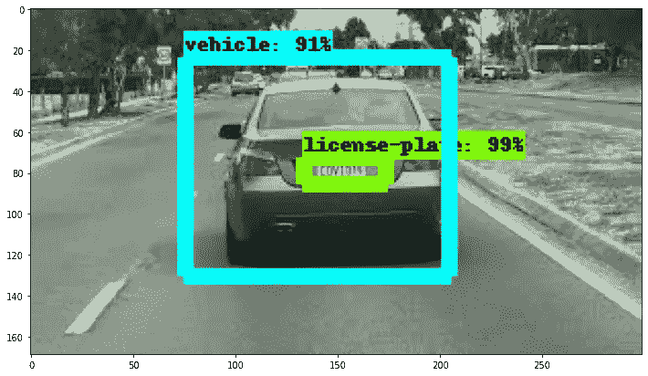

# YOLO 和固态硬盘的简单指南

> 原文：<https://medium.com/mlearning-ai/a-simple-guide-to-yolo-and-ssd-3172a0e876f?source=collection_archive---------0----------------------->

## 很难区分这两种强大的对象检测算法

在上一篇[文章](/mlearning-ai/region-proposal-network-rpn-roi-pooling-from-image-classification-to-object-detection-35f98bee0ddd)中，我们看了一下三种基于地区的 CNN (R-CNN ),现在我们知道它们是如何一起运作的，以及它们的缺点。考虑到这一点，让我们来探索两种比基于区域的网络优越得多的其他对象检测算法，以至于…