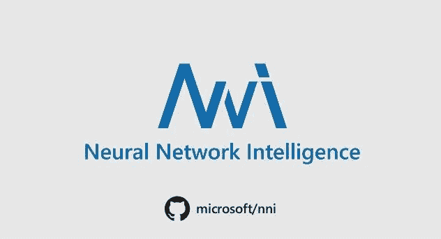
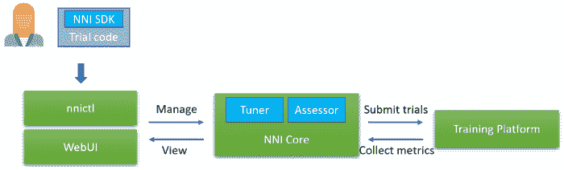
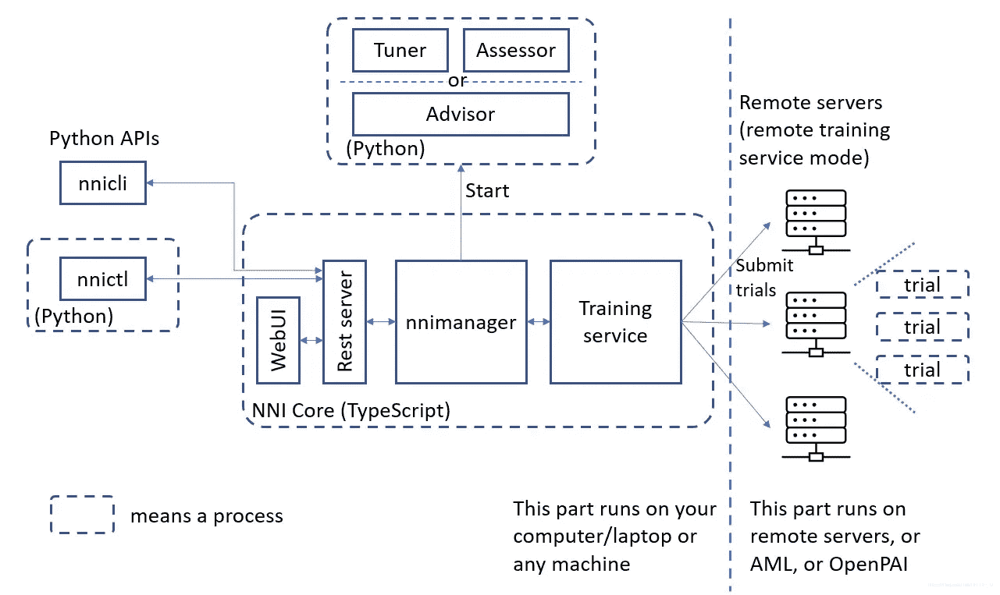
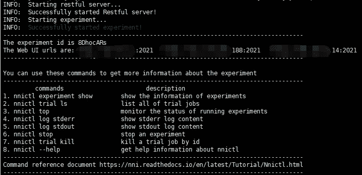
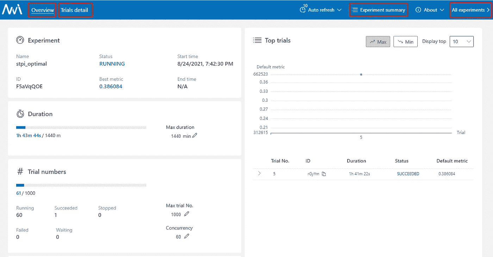

# 使用微软 NNI 软件调整超参数的简单教程

> 原文：<https://medium.com/mlearning-ai/a-simple-tutorial-of-hyperparameter-tuning-using-microsoft-nni-fe42e7859b7d?source=collection_archive---------0----------------------->

新奇的想法却没有了 **S** 泰特 **O** f **T** 何 **A** rt？别担心，你只需要一个叫做 NNI 的工具来帮助你找到你的模型的最佳超参数……



Source of image: [https://miro.medium.com/max/1264/1*hOyYrXiDL5v965xIq8PTIQ.jpeg](https://miro.medium.com/max/1264/1*hOyYrXiDL5v965xIq8PTIQ.jpeg)

# 介绍



Source of image: [https://miro.medium.com/max/2400/0*Vpssl5-F-MFe5wAX](https://miro.medium.com/max/2400/0*Vpssl5-F-MFe5wAX)

> **NNI(神经网络智能)**是一个轻量级但功能强大的工具包，帮助用户自动化[特征工程](https://nni.readthedocs.io/en/stable/FeatureEngineering/Overview.html)、[神经架构搜索](https://nni.readthedocs.io/en/stable/NAS/Overview.html)、[超参数调整](https://nni.readthedocs.io/en/stable/Tuner/BuiltinTuner.html)和[模型压缩](https://nni.readthedocs.io/en/stable/Compression/Overview.html)。
> 
> 该工具管理自动机器学习(AutoML)实验，调度并运行由调整算法生成的实验的试验作业，以在不同的训练环境中搜索最佳的神经架构和/或超参数，如[本地机器](https://nni.readthedocs.io/en/stable/TrainingService/LocalMode.html)、[远程服务器](https://nni.readthedocs.io/en/stable/TrainingService/RemoteMachineMode.html)、 [OpenPAI](https://nni.readthedocs.io/en/stable/TrainingService/PaiMode.html) 、 [Kubeflow](https://nni.readthedocs.io/en/stable/TrainingService/KubeflowMode.html) 、[K8S 上的 framework controller(AK 等。)](https://nni.readthedocs.io/en/stable/TrainingService/FrameworkControllerMode.html)， [DLWorkspace(又名。DLTS)](https://nni.readthedocs.io/en/stable/TrainingService/DLTSMode.html) 、 [AML (Azure 机器学习)](https://nni.readthedocs.io/en/stable/TrainingService/AMLMode.html)、 [AdaptDL(又名。ADL)](https://nni.readthedocs.io/en/stable/TrainingService/AdaptDLMode.html) ，其他云选项甚至[混合模式](https://nni.readthedocs.io/en/stable/TrainingService/HybridMode.html)。

## 基本概念

首先，我们需要预定义一个**搜索空间**(作为参数组合集查看)，然后我们使用`nni.get_next_parameter()`命令从搜索空间获取一个参数作为**配置**对象。其次，我们使用配置对象运行我们的代码一段时间，称为**试验**。第三，我们使用包含一些优化算法的**调谐器**为下一个**试验**产生新的**配置**，同时使用**评估器**评估中间结果以决定是否应该中止当前试验。最后，我们可以使用`nnictl`命令与 **Web UI** 进行交互，查看运行状态等。



Source of image: https://upload-images.jianshu.io/upload_images/5319108-27307edae0b2fe86?imageMogr2/auto-orient/strip|imageView2/2/format/webp

# 快速启动(仅 3 步)

**第一步:**在 **YAML 或 JSON** 文件中定义一个`Search Space`，包括你要搜索的所有超参数的`name`和`distribution` ( **离散值或连续值**)。更多细节可以在 [**这里**](https://nni.readthedocs.io/en/stable/Tutorial/SearchSpaceSpec.html) 找到。

search_space.yaml

search_space.json

**第二步:**将我们的代码修改为`Trial`代码，这样它就可以从 NNI 获取超参数集，并将最终结果报告给 NNI。

1.  当`main`函数需要字典对象中的`args`时，我们可以直接使用下面的例子来获取参数。

2.当`main` 函数需要来自`argparse.ArgumentParser()`对象的`args`时，我们需要用下面的例子来传递。

**第三步:**在 YAML 文件中定义一个`Config`来指定实验的关键信息，如试验文件、调优算法【8】、最大试验次数、最大持续时间等。更多细节可以在 [**这里找到**](https://nni.readthedocs.io/en/stable/reference/experiment_config.html) 。

# 启动和查看

> `nnictl`是一个命令行工具，可以用来控制实验，如**启动/停止/恢复**一个实验，启动/停止 NNIBoard 等。点击 [**此处**](https://nni.readthedocs.io/en/stable/Tutorial/Nnictl.html) 了解`nnictl`的更多用法。而`WebUI`更详细的用法，请参考本 [**文档**](https://nni.readthedocs.io/en/stable/Tutorial/WebUI.html) 。

*   Linux、macOS 和 Windows ->启动

```
nnictl create --config config.yaml -p xxxx
```

等待命令行中的消息`INFO: Successfully started experiment!`。此消息表明您的实验已经成功开始。这是我们期望得到的:



The successfully started experiment message output, and copy ‘The Web UI urls’ in your browser.

*   在你的浏览器中复制`Web UI urls`->视图

在浏览器中打开`Web UI urls`(显示在命令行界面中)，可以查看实验的详细信息以及所有提交的试用作业，如下图所示。



The different experiment pages.

# 参考

[0]https://github.com/microsoft/nni 微软-NNI

[1]在 NVIDIA A100 GPUs 上加速 tensor flow[https://developer . NVIDIA . com/blog/Accelerating-tensor flow-on-A100-GPU](https://developer.nvidia.com/blog/accelerating-tensorflow-on-a100-gpus)

[2]微软发布用于 AutoML 算法和训练的 NNI v 1.3[https://medium . com/synced review/Microsoft-Releases-nni-v1-3-for-AutoML-Algorithms-and-Training-9 F6 EB 57476 E0](/syncedreview/microsoft-releases-nni-v1-3-for-automl-algorithms-and-training-9f6eb57476e0)

[3]使用 AdaptDL 和 NNI 进行高性价比的超参数调整[https://medium . com/casl-project/Cost-effective-Hyper-parameter-Tuning-using-AdaptDL-with-nni-e 55642888761](/casl-project/cost-effective-hyper-parameter-tuning-using-adaptdl-with-nni-e55642888761)

[4]NNI 快速入门[https://nni . readthedocs . io/en/stable/Tutorial/quick start . html](https://nni.readthedocs.io/en/stable/Tutorial/QuickStart.html)

[5]Microsoft NNI 入门 [https://www.jianshu.com/p/0e622a97e20c](https://www.jianshu.com/p/0e622a97e20c)

[6]微软自动调参工具 — NNI — 安装与使用教程（附错误解决） [https://blog.csdn.net/weixin_43653494/article/details/101039198](https://blog.csdn.net/weixin_43653494/article/details/101039198)

[7]使用 NNI 进行自动超参数调优 [https://blog.csdn.net/csdn_yi_e/article/details/110428270](https://blog.csdn.net/csdn_yi_e/article/details/110428270)

[8]微软新工具 NNI 使用指南之 Tuner 篇 [https://www.jianshu.com/p/3587b24f1a6d](https://www.jianshu.com/p/3587b24f1a6d)

[9]错误:Restful 服务器启动失败！无法创建日志目录:范围错误:无效时间值[https://github.com/microsoft/nni/issues/4083](https://github.com/microsoft/nni/issues/4083)

[10] [Anaconda 使用总结](https://blog.csdn.net/qq_40263477/article/details/104289758?ops_request_misc=%257B%2522request%255Fid%2522%253A%2522162979868216780264045993%2522%252C%2522scm%2522%253A%252220140713.130102334.pc%255Fblog.%2522%257D&request_id=162979868216780264045993&biz_id=0&utm_medium=distribute.pc_search_result.none-task-blog-2~blog~first_rank_v2~rank_v29-3-104289758.pc_v2_rank_blog_default&utm_term=conda&spm=1018.2226.3001.4450)

[11][pip 和 conda 批量导出、安装包](https://blog.csdn.net/qq_40263477/article/details/104290133?ops_request_misc=%257B%2522request%255Fid%2522%253A%2522162979868216780264045993%2522%252C%2522scm%2522%253A%252220140713.130102334.pc%255Fblog.%2522%257D&request_id=162979868216780264045993&biz_id=0&utm_medium=distribute.pc_search_result.none-task-blog-2~blog~first_rank_v2~rank_v29-1-104290133.pc_v2_rank_blog_default&utm_term=conda&spm=1018.2226.3001.4450)

[12] [值错误:变量嵌入已经存在，不允许。你的意思是在 VarScope 中设置 reuse=True 吗？原定义](https://stackoverflow.com/questions/47717317/valueerror-variable-embedding-already-exists-disallowed-did-you-mean-to-set-r)[https://stack overflow . com/questions/47717317/value error-variable-embedding-already-exists-disallowed-do-you-mean-to-set-r](https://stackoverflow.com/questions/47717317/valueerror-variable-embedding-already-exists-disallowed-did-you-mean-to-set-r)