# 使用 Python 分五步进行网站抓取 Craigslist 数据的数据科学第 2 部分

> 原文：<https://medium.com/mlearning-ai/a-step-by-step-how-to-do-a-data-science-project-with-craigslist-data-part-2-website-scraping-d352351655ee?source=collection_archive---------1----------------------->

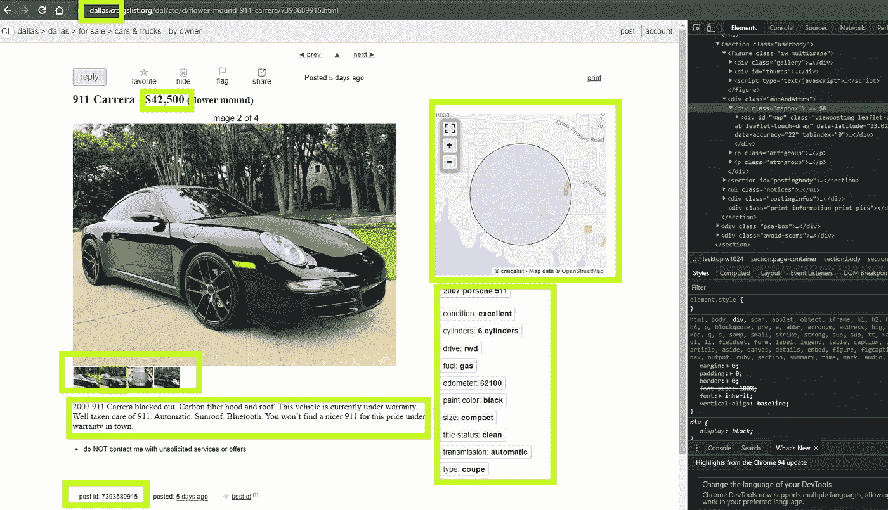

在这篇文章中，我将带你一步一步地了解我从 Craigslist 收集车辆发布数据的步骤。我使用 Python 和 BeautifulSoup 库进行 web scrape，这只是从网站获取数据的众多方法之一。理想情况下，一个 API 最适合这个目的，但是 Craigslist 没有一个 API 可以让我得到我需要的数据。

如果你想在 Jupyter 笔记本上继续学习，完整的代码贴在我的 GitHub 上。

如果在 Craigslist 上导航到任何城市的*汽车&卡车*，你将可以选择查看来自私人卖家和经销商的广告。我选择只从私人卖家那里收集数据，因为这些帖子包含了更多关于待售汽车的可靠信息。我还选择了带图片的帖子，因为我想下载高级项目部分的图片，如图像识别或 NLP。

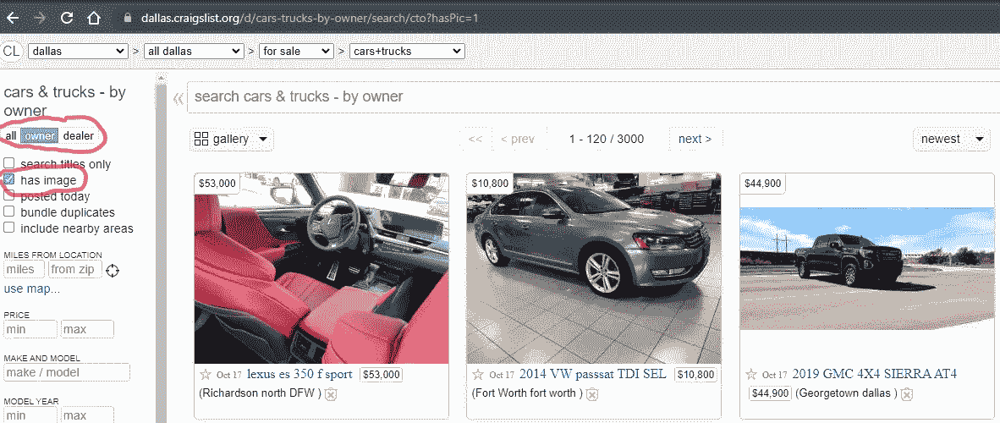

然后，我需要的数据被嵌入到每个车辆帖子页面中，如下图右侧所示。不要担心，如果不是下面的图像中的一切都有意义。我们很快就会谈到这一点。

在视觉上检查了网站之后，我能够想出我将如何构造我的代码的游戏计划。

# 概括地说，我抓取网站的五步工作流程如下:

1.  **第一步:**创建一个我想要获取数据的城市列表
2.  **第二步:**导航至每个城市的*汽车&卡车，由车主*出售
3.  **第三步:**对于每个城市，导航至每个可用页面
4.  **第四步:**对于每个可用页面，导航到每个帖子
5.  **第五步:**对于每个帖子，获取帖子属性

这是 sudo 代码的工作版本。

# 代码

首先，我启动了一个 Jupyter notebook 实例并导入了必要的库。我们从 *bs4* 中导入 *requests* 模块来处理 http 请求和 *BeautifulSoup* ，后者是从网站获取数据的模块。

下一步是在 Craigslist 上创建一个我们想要导航到的城市列表。这些城市名称必须与 Craigslist 上的拼写相同。例如旧金山是旧金山湾否则你会得到一个页面没有找到错误。

我们现在将获得城市内每个页面的链接，然后我们将拥有每个城市的所有页面的列表。每个页面有 120 个帖子。因此，要转到下一页，我们只需要创建一个页面占位符，并将它递增 120，就可以得到下一页。我们继续这个迭代，直到我们到达 1800 页或更少。我选择 1800 是因为页面上的帖子通常在 30 天左右。最终结果是一个包含每个城市所有页面链接的列表。

为了获得每个城市页面的链接，我们将使用一个循环来更改来自*城市*列表的基本城市链接中的城市名称，并将其存储在一个名为 *city_link 的变量中。*我们所做的只是从网站上获取任何一个城市链接，并创建一个占位符链接，该链接带有一个更改城市名称和页码的选项。类似这样的"[https://**SF bay**.craigslist.org/d/cars-trucks-by-owner/search/cto？s= **1**](https://sfbay.craigslist.org/d/cars-trucks-by-owner/search/cto?s=120&hasPic=1)

运行上述代码后，我们现在有了一个链接列表，这些链接指向 out *cities* 列表中每个城市的可用页面。下面是页面链接的一部分。对于所有 15 个城市，我们总共得到 225 个页面链接，每个包含 120 个单独的汽车帖子。

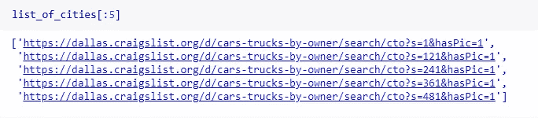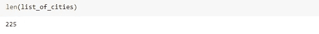

现在我们已经有了这个包含在每个城市的*车主出售汽车*部分的所有页面的长列表，我们需要导航到每个页面并获得每个单独汽车帖子的链接。也就是 120 篇文章乘以 225 页。总之，我们应该结束了大约 27，000 个链接。所有 27，000 条都代表 Craigslist 上的一个特定车辆帖子。

为了获得车辆链接，我们循环遍历上面创建的列表中的每个页面链接，并获得每页的所有 120 个帖子。我们将这些链接存储在一个名为 *car_urls* 的列表变量中。

为了获得每篇文章的链接，我们将使用 BeautifulSoup 来解析网页中的链接。为此，我们从请求库中传递一个到 get 方法的链接，如果链接存在，它应该返回一个响应代码*<Response[200】>*。然后我们将请求对象传递给 BeautifulSoup 的一个实例，并添加一个 *html.parser* 标志。然后返回一个 html 对象，如下所示。

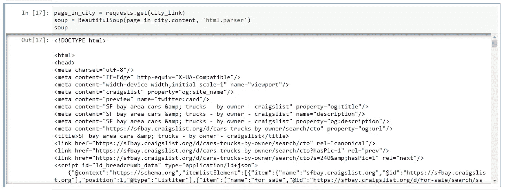

This is the html object returned by BeautifulSoup

然后我们可以告诉 *soup* 对象使用 *find_all* 方法在返回的 *html* 对象中查找我们的车辆链接。

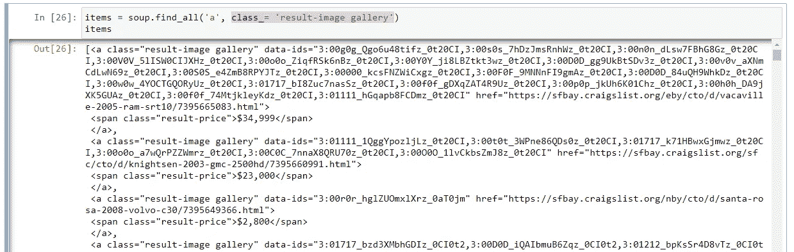

This is the find_all results

你可以通过右击你的 chrome 浏览器并选择 inspect 很容易地找出链接在哪里。这将打开如下所示的带有页面 html 结构的面板。

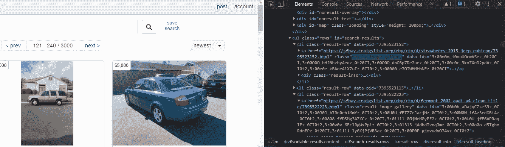

The class_= ‘result-image gallery’ houses all vehicle links in the page

html 链接由 *href* 标记表示，但是由于 html 对象中有许多 href，我们还想告诉 soup 应该查看哪个*类*。从上面的例子中，我们想要查看的*类*是*结果-图像库*类。所有包含的 hrefs 都指向该页面上的单个车辆帖子，如下所示。

hrefs contained within the “result-image gallery” class

然后，我们可以将这些链接存储到数据框或 csv 中，供以后查看。获取所有车辆链接的完整代码如下所示。

我们看到，现在我们有 24706 个汽车帖子的链接，我们现在可以指向 BeautifulSoup 来抓取数据，但首先我们保存一个副本，以便我们可以随时稍后返回。这一步很简单，我们只需将其保存为 csv 文件。

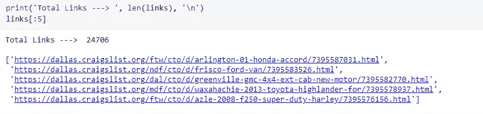

然后将文件读回熊猫数据框。

好了，现在我们已经有了所有我们需要的链接，让我们开始刮车辆的细节。为此，我们将再次使用 BeautifulSoup，但这一次我们将浏览每个车辆帖子页面。

Some visible vehicle attributes that we want to scrape

同样，我们将每个车辆链接传递给*请求*模块，并将结果传递给一个 BeautifulSoup 对象。然后，我们使用 BS 对象的 find 方法从页面中获取车辆属性和任何其他数据。例如，对于价格，我们发现价格*类*如下。

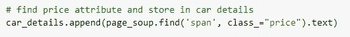

为了找到日期时间，我们使用下面的。

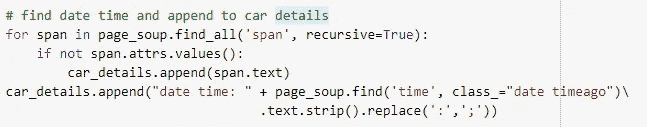

对于地理位置，我们从 html 的*地图框类*中解析它们，如下所示。

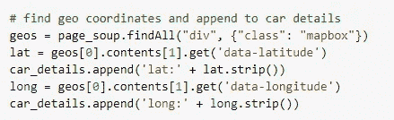

这里是从每个车辆链接获取车辆属性的完整代码。

现在，我们从 27K 车辆链接中获得了所有车辆属性，并将其存储在一个列表列表中。一些最小的清理也是动态完成的，比如创建属性标签，从价格中删除美元符号和逗号。

每辆车及其属性都存储在列表 *car_final 中。*

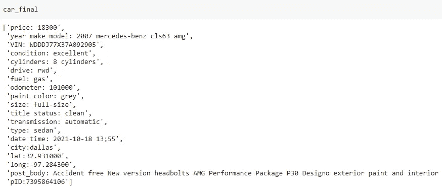

Each vehicle’s attributes stored in a list

并且每个列表都存储在列表*汽车*中。

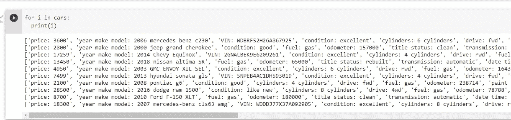

接下来，我们必须存储这些数据以供将来分析。我所做的是用属性标签作为键名来创建字典。为此，我创建了一个键/值对字典，其中每个键代表一个列名，然后将字典存储在列表 *car_dicts* 中。

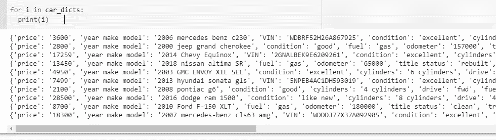

最后将字典列表写入熊猫数据框。

然后预览数据框，看看我们的数据是否存储正确。

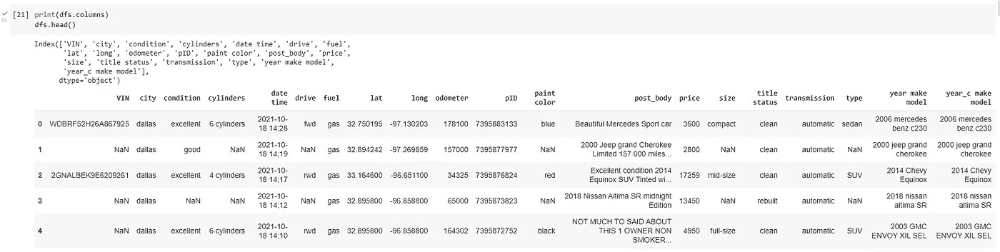

最后将数据帧保存到 csv 或转储到数据库。

这是所有的乡亲。至少现在是这样。我们已经成功地从 Craigslist 收集了数据。我们现在有一个月内全美 15 个城市的 24000 多辆汽车的数据。

请加入我的下一部分，**C**[**raigs list Cars For Sale 数据项目:第 3 部分—数据清理**](/p/2d49bf39dbde) ，因为我们执行了一些非常需要的数据清理，如修复数据类型和创建新列。如果您对上述过程有任何反馈，也请告诉我。谢谢大家！