# Python 中需求预测的随机模型

> 原文：<https://medium.com/mlearning-ai/a-stochastic-model-for-demand-forecating-in-python-a1b568b80b94?source=collection_archive---------0----------------------->

## 利用时间序列 SARIMA 模型和蒙特卡罗模拟

**什么是需求预测？**

简而言之——预测产品/服务的未来需求。

需求预测是供应链中非常重要的领域，因为整个供应链的其他计划都依赖于它。例如，生产计划(时间安排、个人计划)、库存(仓库)、财务(预算计划、工厂/设备投资)、营销(促销、新生产计划)、原材料计划等。需求预测是供应链所有战略和计划决策的基础，因为它们减少了不确定性。

需求预测方法:

1.  定性-

*   在这种方法中，预测主要依靠人和判断。
*   当几乎没有可用的历史数据或当专家有可能影响预测的市场情报时，最适合。

2.时间序列-

*   使用历史需求进行预测
*   假设过去的需求历史是未来需求的良好指标

3.因果-

*   该方法假设需求预测与环境中的某些因素(利率、油价等)高度相关
*   因果需求预测方法发现需求和这些环境因素之间的这种相关性，并利用对环境因素的估计来预测未来的需求。

**为什么我们要应用** [**蒙特卡洛模拟**](/@juee_thete/understanding-monte-carlo-simulation-and-its-implementation-with-python-3ecacb958cd4) **？**

以上所有的预测方法都会给我们未来需求的点估计(确定性模型)。如果我们想要找到不同的可能结果以及它们发生的可能性，我们可以通过使用 MCS 来实现。它可以帮助我们评估达到目标的可能性。我们可以更好地计划我们的安全库存。我们可以得到一个最低和最高水平的范围，这将有助于供应链规划决策，因为我们知道我们的需求可能波动的范围，从而减少不确定性。

示例:

我们将使用流行的航空乘客数据集。你可以从- [Kaggle](https://www.kaggle.com/rakannimer/air-passengers) 下载数据集。这是一家航空公司每月乘客的数据。

1.  **导入必要的库:**

```
import pandas as pd
import numpy as np
import matplotlib.pyplot as plt
import matplotlib as mlp
```

**2。加载数据集:**

我们将在示例中使用的数据集是时间序列格式的。时间序列是按时间顺序 排列的一系列 ***数据点。简而言之，及时收集数据，例如每天记录温度，每月或每年记录销售额。时间序列数据集不同于其他数据集，因为我们给数据点的权重不相似。***

时间序列预测包括采用适合历史数据的模型，并使用它们来预测未来的观测值。

```
#Loading data
data = pd.read_csv('Datasets/AirPassengers.csv', index_col='Month', parse_dates=['Month'])
data = data.rename(columns ={'#Passengers':'no_passengers'})
data
```

*   每当处理时间序列数据时，请确保您的索引是日期时间索引。默认情况下，从 CSV 文件加载数据时，*月/日*列表示为*对象*。*月*列作为*对象*数据类型被读取。使用默认的`read_csv().`来正确读取*日期*列，我们可以使用参数`parse_dates`来指定日期列的列表。为此，我们使用了参数 parse_dates =['Month']。我们也可以用熊猫`to_datetime().`把它转换成 datetime64
*   `index_col='Month'`用于强制熊猫使用
    列作为索引。
*   我们已经将该列的名称从#passengers 更改为' no_passengers ',以便于选择该列。

我们的数据看起来是这样的:

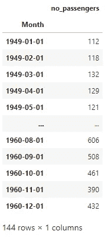

Air Pasenger dataset

我们可以看到我们的索引列是“*月*”，格式为*日期时间*。我们有 144 个观察值(144 个月的数据)，no_passergers 列表示每个月的 passerger 数。

让我们绘制我们的数据:

```
plt.plot(data)
plt.show()
```

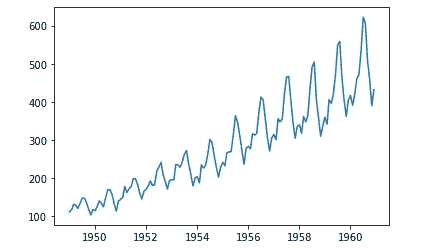

Airpassenger data -plot

从上面我们可以看到，有一个积极的趋势，也是每年重复的季节性模式。

**3。数据部**

通常我们将训练集和测试集中的数据分为*训练*模型和*训练*数据以及*测试*我们的模型在*测试*数据。这里我们要应用蒙特卡罗模拟，所以我们需要一些数据来推导随机数的分布。

让我们把数据分成三部分

1.  训练数据
2.  MCS 分布拟合数据
3.  测试数据

我们采用过去 70 个月的数据进行数据拟合:

```
data_for_dist_fitting = data[-70:]
```

我们将从原始数据中移除过去 70 个月的数据，以获得训练数据集

```
data_train = data[~data.isin(data_for_dist_fitting).all(1)]
```

对于测试数据，我们将采用最近 20 个月的数据

```
test_data = data_for_dist_fitting[-20:]
```

从数据分布拟合中删除测试数据。因此，在训练集之后和测试集之前，我们将有 50 周的数据。

```
data_for_dist_fitting=data_for_dist_fitting[~data_for_dist_fitting.isin(test_data).all(1)]
```

绘图数据分区:

```
train = plt.plot(data_train,color='blue', label = 'Train data')data_f_mc = plt.plot(data_for_dist_fitting, color ='red', label ='Data for distribution fitting')test = plt.plot(test_data, color ='black', label = 'Test data')plt.legend(loc='best') 
plt.title('Data division')
plt.show(block=False)
```

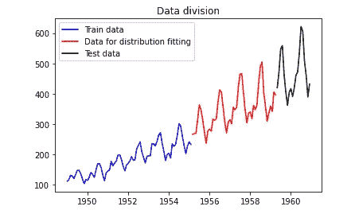

Data Division

从上面的图中，我们可以清楚地看到数据划分。

**4。我们将如何在本例中应用 MCS**

> 运行蒙特卡洛模拟有两个组成部分:
> 
> 1)要评估的方程
> 
> 2)输入的随机变量

任何预测方法总有一个随机因素不能用历史需求模式来解释。任何观察到的需求都可以分为两部分:

观察到的需求=系统成分+随机成分(误差)

我们将首先尝试找出要评估的方程，为此我们将使用 AR/ MA/ ARIMA/ SARIMA 等时间序列统计预测方法。使用哪个模型取决于我们时间序列的平稳性。

**5。检查平稳性和时间序列分解**:

一个平稳的时间序列是*,它的性质不依赖于序列被观察的时间。*

时间序列数据由水平、趋势、季节性和随机噪声组成。

1.  **Level-** 如果是直线，则为系列的值。
2.  **趋势-** 系列随时间变化的可选且通常是线性的增加或减少行为。
3.  **季节性**。随着时间的推移，可选的重复模式或行为周期。季节性总是有一个固定和已知的频率。
4.  **循环 *:*** 当数据显示非固定频率的上升和下降时，出现*循环*。如果波动不是固定频率的，那么它们就是周期性的
5.  **噪音**。模型无法解释的观测值的可选可变性。

如果一个时间序列没有趋势性、季节性和周期性，我们可以说我们的时间序列是平稳的。我们的大多数时间序列预测方法都假设我们的数据是平稳的(不随时间变化)。

我们可以通过绘制滚动平均值和滚动标准差来检查时间序列的平稳性，也可以通过 dickey fuller 检验来检查，如下所示:

```
from statsmodels.tsa.stattools import adfuller
def test_stationarity(timeseries):
    #Determining rolling statistics
    rolmean = timeseries.rolling(window=12).mean()
    rolstd = timeseries.rolling(window=12).std()

    #plot rolling statistics:
    orig = plt.plot(timeseries,color='blue', label = 'Original')
    mean = plt.plot(rolmean, color ='red', label ='Rolling Mean')
    std = plt.plot(rolstd, color ='black', label = 'Rolling Std')
    plt.legend(loc='best')
    plt.title('Rolling Mean and Standard Deviation')
    plt.show(block=False) 

    #Perform Dickey Fuller test:
    print('Results of Dickey Fuller Test:')
    dftest = adfuller(timeseries, autolag= 'AIC')
    dfoutput = pd.Series(dftest[0:4], index=['Test Statistic','p-value','#Lags Used','Number of Observations Used'])

    for key,value in dftest[4].items():
        dfoutput['Critical Value (%s)'%key] = value
    print (dfoutput)
```

调用函数检查稳定性:

```
test_stationarity(data_train)
```

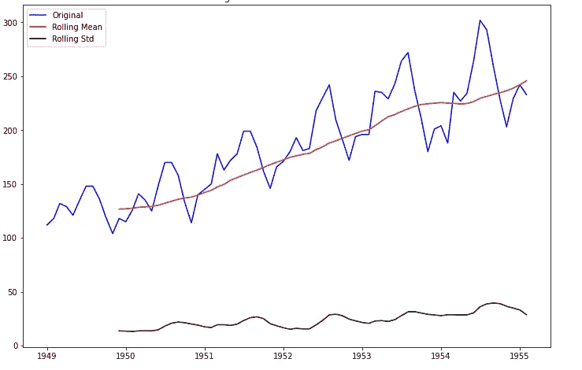

Plot of rolling mean and standard deviation of time series

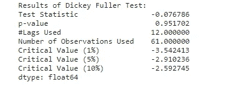

Results of Dickey Fuller

从上述滚动平均值和标准偏差图中，我们可以说我们的时间序列不是平稳的。我们有增加的滚动平均值，这表明我们有积极的趋势，波动的滚动标准差表明我们的时间序列有季节性。同样根据迪基富勒测试的结果，p 值为 0.951..这是非常高的。如果它低于 0.05，那么我们可以说我们的时间序列是平稳的

我们可以通过使用`statsmodels` `seasonal_decompose`来可视化我们的数据。它将时间序列分解成几个部分——趋势、季节性和随机噪声，并绘制如下:

```
from statsmodels.tsa.seasonal import seasonal_decompose
decomposition = seasonal_decompose(data_train)trend = decomposition.trend
seasonal = decomposition.seasonal
residual = decomposition.residplt.subplot(411)
plt.plot(ts_log, label='Original')
plt.legend(loc='best')
plt.subplot(412)
plt.plot(trend, label='Trend')
plt.legend(loc='best')
plt.subplot(413)
plt.plot(seasonal,label='Seasonality')
plt.legend(loc='best')
plt.subplot(414)
plt.plot(residual, label='Residuals')
plt.legend(loc='best')
plt.tight_layout() 
```

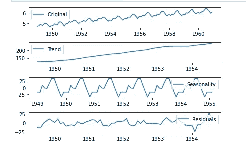

Time Series Decomposition

从上面的图中，我们可以分别看到时间序列的趋势、季节性和噪声成分。我们有一个为期一年的积极趋势和季节性。由于我们的时间序列有季节性，我们将使用 SARIMA 模型。

6。萨里玛模型:

萨里玛代表 **S** 季节 **A** uto **R** 过度 **I** 整合 **M** 移动 **A** 平均值。它是 ARIMA 模型的扩展。SARIMA 模型还考虑了时间序列的季节性成分。

**自回归**:类似于常规回归。在自回归中，它使用以前时间步长的观测值作为回归方程的输入，来预测下一个时间步长的值。

**综合**:这个步长差分是为了使时间序列更加平稳。

**移动平均**:计算移动平均是为了减少误差。

对于序列的趋势和季节元素，SARIMA 模型被表示为`SARIMA(p,d,q).(P,D,Q).m`超参数。

*趋势元素(模型的非季节性部分)*

有三个趋势元素:

*   **p** :趋势自回归顺序。它是模型中包含的滞后观测值的数量。
*   **d** :趋势差序。原始观测值有差异的次数。
*   **q** :趋势移动平均线下单。指定移动平均窗口的大小。

*季节要素*

*   **P** :季节性自回归顺序。
*   **D** :季节差单。
*   **Q** :季节性移动平均订单。
*   **m** :单个季节周期的时间步数。

让我们找出超参数的所有组合:

```
import itertools
p = d = q = range(0, 2)
pdq = list(itertools.product(p, d, q))
seasonal_pdq = [(x[0], x[1], x[2], 12) for x in list(itertools.product(p, d, q))]
print('Examples of parameter for SARIMA...')
print('SARIMAX: {} x {}'.format(pdq[1], seasonal_pdq[1]))
print('SARIMAX: {} x {}'.format(pdq[1], seasonal_pdq[2]))
print('SARIMAX: {} x {}'.format(pdq[2], seasonal_pdq[3]))
print('SARIMAX: {} x {}'.format(pdq[2], seasonal_pdq[4]))
```

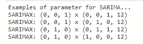

Examples of parameter for SARIMA

为了选择 SARIMA 模型的超材料，我们将使用“网格搜索”。这将为我们提供一组最佳参数，为我们的模型带来最佳性能。

```
import warnings
warnings.filterwarnings('ignore')
import statsmodels.api as sm
for param in pdq:
    for param_seasonal in seasonal_pdq:
        try:
            mod = sm.tsa.statespace.SARIMAX(data_train,order=param,seasonal_order=param_seasonal,enforce_stationarity=False,enforce_invertibility=False)
            results = mod.fit()
            print('SARIMA{}x{}12 - AIC:{}'.format(param,param_seasonal,results.aic))
        except Exception as E: 
            print(E)
            continue
```

结果如下:

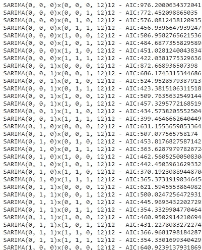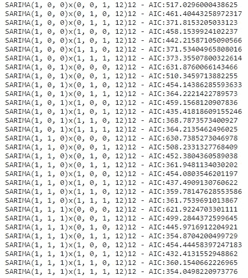

从上面的结果，我们有最小的 AIC 为`SARIMAX(1, 1, 1)x(1, 1, 1, 12).` AIC 是赤池的信息标准。

在训练数据集上训练模型:

```
from statsmodels.tsa.statespace.sarimax import SARIMAXmod= SARIMAX(data_train,order=(1,1,1),seasonal_order=(1, 1, 1, 12),enforce_invertibility=False, enforce_stationarity=False)
results = mod.fit(disp=0)
print(results.summary())
```

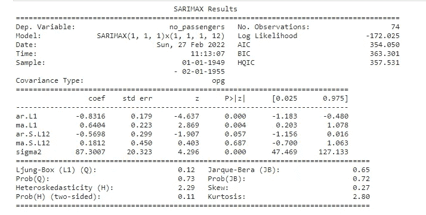

SARIMA Results

绘制我们的结果:

```
pred_sarima = results.forecast(50)
predicted =plt.plot(pred_sarima,label='Prediction by SARIMA', color='red')
Actual = plt.plot(data_for_dist_fitting,label='Actual data')
plt.legend(loc='best') 
plt.title('SARIMA MODEL')
plt.show(block=False)
```

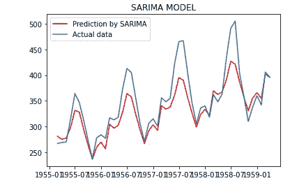

Prediction by SARIMA Model

我们将绘制残差的线图，表明可能仍有一些趋势信息未被模型捕捉到。

```
# plot residual errors of the training data
residual_error = pd.DataFrame(results.resid)
residual_error.plot()
plt.show()
```

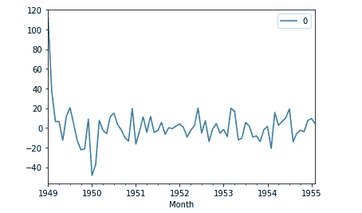

SARIMA fit residual error line plot

现在我们将得到残差值的密度图，表明误差是高斯的，但可能不以零为中心。

```
residual_error.plot(kind='kde')
plt.show()
print(residual_error.describe())
```

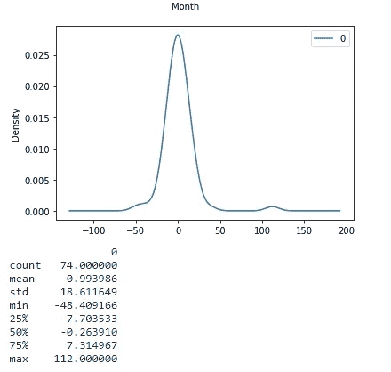

SARIMA fit residual error density plot

从残差的分布可以看出，由于均值不为零(均值=0.993986~1)，我们的模型存在偏差

**7。滚动预测:**

为了减少这种误差并避免偏差，我们可以进行滚动预测，在滚动预测中，我们将在下一个时间段的预测中使用最新的预测值。这可以通过在接收到每个观察值后重新创建 SARIMA 模型来完成。我们将在一个名为 history 的列表中手动跟踪所有的观察结果，该列表以训练数据为种子，并且每次迭代都会向其追加新的观察结果。

```
#to suppress warnings
warnings.filterwarnings('ignore')from sklearn.metrics import mean_squared_error#creating new dataframe for rolling forescast
history = np.log(data_train.astype(float))
predictions = list()for i in range(len(data_for_dist_fitting)): 
    model = SARIMAX(history,order=(1,1,1),seasonal_order=(1, 1, 1, 12),enforce_invertibility=False, enforce_stationarity=False)
    model_fit = model.fit(disp = 0)
    # generate forcecast for next period
    output = model_fit.forecast()
    #Save the prediction value in yhat
    yhat = np.e ** output[0]
    #Append yhat to the list of prediction
    predictions.append(yhat)
    # grabs the observation at the ith index
    obs = data_for_dist_fitting[i : i + 1]
    # appends the observation to the estimation data set
    history = history.append(np.log(obs.astype(float)))

# prints the MSE of the model for the rolling forecast period
error = mean_squared_error(data_for_dist_fitting, predictions)
print('Test MSE: %.3f' % error)# converts the predictions list to a pandas dataframe with the same index as the actual values
# for plotting purposes
predictions = pd.DataFrame(predictions)
predictions.index = data_for_dist_fitting.index# sets the plot size to 12x8
mlp.rcParams['figure.figsize'] = (12,8)# plots the predicted and actual stock prices 
plt.plot(data_for_dist_fitting,label='Actual values')
plt.plot(predictions, color = 'red', label='predicted rolling forecast')
plt.legend(loc='best')
plt.xlabel('week')
plt.ylabel('#passengers')
plt.title('Predicted vs. Actual #of passengers')
plt.show()
```

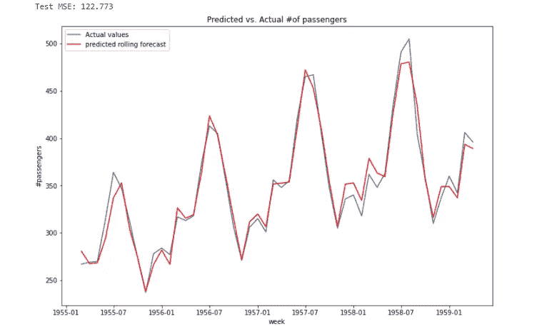

Rolling Forecast prediction vs Actual Demand

我们现在将绘制一个误差图:

```
# to suppress warnings
warnings.filterwarnings('ignore')# sets the plot size to 12x8
mlp.rcParams['figure.figsize'] = (12,8)# plots the rolling forecast error 
rf_errors = data_for_dist_fitting.no_passengers - predictions[0]
rf_errors.plot(kind = 'kde')# produces a summary of rolling forecast error 
rf_errors.astype(float).describe()
```

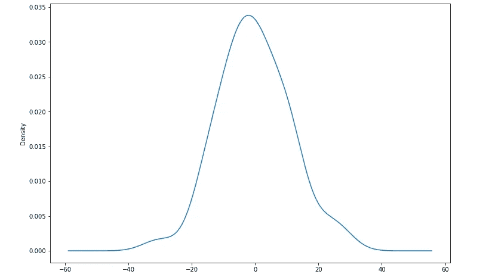

Rolling forecast (SARIMA) fit residual error density plot

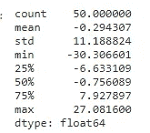

Rolling forecast (SARIMA) fit residual error description

**8。选择用于预测的分布:**

对于 MCS 的第二部分-生成随机数，我们将使用这个密度图。它大致呈钟形，似乎以 0°为中心。查看分布函数，我们可以说正态分布或拉普拉斯分布可能适合。我们也可以用钳工来检查。 **fitter** 包提供了一个简单的类来识别一个数据样本是从哪个分布中生成的。它使用来自 Scipy 的 80 个分布，并允许您绘制结果以检查什么是最可能的分布和最佳参数。

```
# to suppress warnings
import warnings
warnings.filterwarnings('ignore')# imports the fitter function and produces estimated fits for our rsarima_errors
from fitter import Fitter,get_common_distributions,get_distributionsf = Fitter(rf_errors, distributions=['binomial','norm','laplace','uniform'])
f.fit()
f.summary()
```

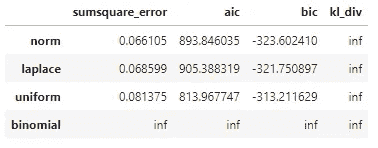

Summary of distribution fit

sum 函数根据 sumsquare_error 值按升序排列最佳的五个分布。它还提供了直方图上不同分布的图示。

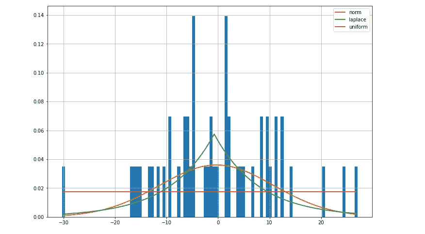

Different distributions fitted over a histogram

从上面的函数可以看出，正态分布是最合适的。我已经尝试应用正态分布和拉普拉斯分布，拉普拉斯分布在这个例子中给出了更好的结果，所以我们将使用拉普拉斯分布。拉普拉斯分布类似于高斯/正态分布，但是在峰值处更尖锐，并且具有更宽的尾部。

**9。创建一个函数用拉普拉斯分布进行蒙特卡罗模拟:**

所以在这里我们首先找出了滚动预测的残差密度图(预测的时间段为- `data_for_dist_fitting`(这是数据划分的线图中红色的数据)。然后我们将定义一个拉普拉斯分布函数来得到随机数的估计范围。计算滚动预测误差的方差。我们将把它作为拉普拉斯分布中的一个标度——第二个参数`np.random.laplace(loc,scale,size)`。

```
def lapace_mc_randv_distribution(mean, rf_errors, n_sim): #gets the estimated beta or mean absolute distance from the mean
    var = (sum(abs(rf_errors - np.mean(rf_errors))) 
                           / len(rf_errors)) # uses the numpy function to generate an array of simulated values
    est_range = np.random.laplace(mean,var,n_sim)
    # converts the array to a list
    est_range = list(est_range)
    # returns the simulated values
    return(est_range)
```

**10。创建 MC 分配函数:**

我们为滚动预测蒙特卡罗模拟创建了一个函数，类似于滚动预测函数。我们可以使用我们选择的分布(拉普拉斯分布)生成经验推导的预测区间，平均值将是我们的预测需求，比例将根据残差计算，作为与平均值的平均绝对距离，以及由用户选择的模拟数量。

```
def rolling_forecast_MC(train, test, std_dev, n_sims):

 # create a new dataframe that will be added to as the forecast rolls 
    history = np.log(data_train.astype(float))

# create an empty list that will hold predictions
    predictions = list()# loops through the indexes of the set being forecasted
    for i in range(len(test_data)): 
        model = SARIMAX(history,order=(1,1,1),seasonal_order=(1, 1, 1, 12),enforce_invertibility=False, enforce_stationarity=False)
        model_fit = model.fit(disp = 0) # generate forcecast for next period
        output = model_fit.forecast().values #Save the prediction value in yhat       
        yhat = np.e ** output[0]

       # performs monte carlo simulation using the predicted price as the mean, user-specified
        # standard deviation, and number of simulations
       randv_range = lapace_mc_randv_distribution(yhat,std_dev,n_sims)

        #Append yhat to the list of prediction
        predictions.append([float(i) for i in randv_range])

        # grabs the observation at the ith index
        obs = test_data[i : i + 1]

        # appends the observation to the estimation data set
        history = history.append(np.log(obs.astype(float)))

        # converts the predictions list to a pandas dataframe with the same index as the actual 
    # values for plotting purposes
    predictions = pd.DataFrame(predictions)
    predictions.index = test_data.index

    # returns predictions
    return(predictions)
```

好了，现在我们已经为蒙特卡洛模拟定义了函数，现在我们将把为调查预测残差而保留的数据附加回训练数据集，以避免第一次预测出现较大误差。

```
data_train = data_train.append(data_for_dist_fitting)
```

使用 1000 MC 模拟生成带有预测间隔的滚动预测:

```
test_preds = rolling_forecast_MC(data_train, 
                               test_data, 
                               rf_errors,
                              1000)
```

让我们画出我们的预测:

```
MC = plt.plot(test_preds)
Actual=plt.plot(test_data,color='black',label='Actual Demand')
plt.legend(loc='best')
plt.show()
```

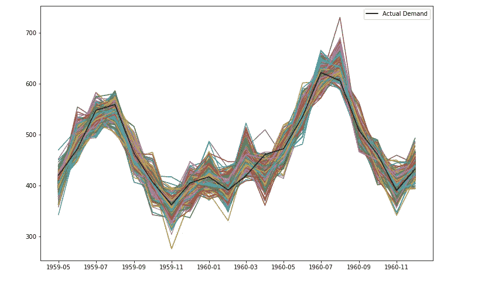

Monte carlo Simulations and Actual Demand line plot

在上图中，黑线代表实际需求，其他线代表通过蒙特卡洛模拟预测的不同需求。

让我们计算模拟需求的平均值，模拟需求的分位数(5%)和分位数(95%)。

```
print('Expected demand:',np.mean(test_preds.values))
print('Quantile(5%):',np.percentile(test_preds,5))
print('Quantile(95%):',np.percentile(test_preds,95))
```

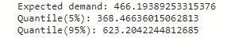

Analysis of simulated demand forecast

从上面的结果中，我们可以看到有 5%的概率需求会低于 368，有 5%的概率需求会高于 623。我们的预期需求。

我们可以继续下一步，绘制需求的最小-最大范围，并计算模型的准确性。为此，我们需要每行(时间段)的列表格式的预测数据。

因此，我们将创建上述函数的副本，并通过使用预测`predictions.values.tolist().`在每行列表中获得结果

```
def rolling_forecast_MC_for_minmax_range(train, test, std_dev, n_sims):
    # create a new dataframe that will be added to as the forecast rolls 
    history = np.log(data_train.astype(float))
    # create an empty list that will hold predictions
    predictions = list()# loops through the indexes of the set being forecasted
    for i in range(len(test_data)): 
        model = SARIMAX(history,order=(1,1,1),seasonal_order=(1, 1, 1, 12),enforce_invertibility=False, enforce_stationarity=False)
        model_fit = model.fit(disp = 0) # generate forcecast for next period
        output = model_fit.forecast().values

        #Save the prediction value in yhat       
        yhat = np.e ** output[0]

       # performs monte carlo simulation using the predicted price as the mean, user-specified
        # standard deviation, and number of simulations
        randv_range = lapace_mc_randv_distribution(yhat,std_dev,n_sims)

        #Append yhat to the list of prediction
        predictions.append([float(i) for i in randv_range])

       # grabs the observation at the ith index
        obs = test_data[i : i + 1]

      # appends the observation to the estimation data set
        history = history.append(np.log(obs.astype(float)))

    # converts the predictions list to a pandas dataframe with the same index as the actual 
    # values for plotting purposes predictions = pd.DataFrame(predictions)
    # converts all the estimated yhats in each column to one list per row
    predictions['predicted_range'] = predictions.values.tolist()

   # grabs only the column with all values in a list
    predictions = pd.DataFrame(predictions['predicted_range'])
    predictions.index = test_data.index

    # returns predictions
    return(predictions)
```

使用 1000 MC 模拟生成带有预测间隔的滚动预测:

```
# produces a rolling forecast with prediction intervals using 1000 MC sims
test_preds_minmax = rolling_forecast_MC_for_minmax_range(data_train, 
                               test_data, 
                               rf_errors,
                              1000)
```

让我们来看看我们的预测数据是怎样的:

```
test_preds_minmax.head()
```

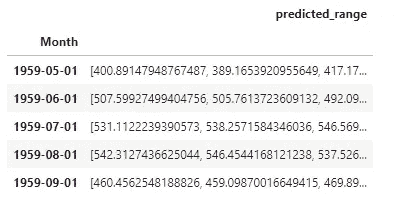

Prediction data with MCS

要检查模型的准确性:

```
# creates an empty list
prediction_interval = []
# loops through the rows in the testing data set
for i in range(len(test_data)):
    # appends true if the actual price is in the interval of predicted prices and false
    # otherwise
    prediction_interval.append(np.where(min(test_preds_minmax.predicted_range[i]) <= 
                                           test_data.no_passengers[i]
                                          <= max(test_preds_minmax.predicted_range[i]), 
                                           True, False))
# prints the percentage of actual prices in the prediction intervals    
print('Percentage of Demand in Predicted Demand Range: %f' % 
      (100 * sum(prediction_interval) / len(prediction_interval)))
```

结果:

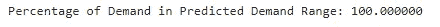

Accuracy of the model

上述结果告诉我们，我们的需求将 100%低于模拟预测范围的最小和最大范围。我们也可以这样绘制:

```
# creates empty lists to append to with minimum and maximum values for each weeks prediction
min_range = []
max_range = []# loops through the rows in test_preds
for i in range(len(test_preds_minmax)):
    # appends to the list the min or max value as appropriate
    min_range.append(min(test_preds_minmax.predicted_range[i]))
    max_range.append(max(test_preds_minmax.predicted_range[i]))

# converts the lists to data frames and makes their indexes match up with the dates they're
# predicting
min_range = pd.DataFrame(min_range)
min_range.index = test_data.index
max_range = pd.DataFrame(max_range)
max_range.index = test_data.index# plots the actual stock price with prediction intervals
plt.plot(test_data, color ='red',label='Actual Data')
plt.plot(min_range, color = 'm', label='Min range')
plt.plot(max_range, color = 'b', label ='Max range')
plt.legend(loc='best')
plt.xlabel('Month')
plt.ylabel('No of Passengers')
plt.title('Actual Demand with Prediction Intervals')
plt.show()
```

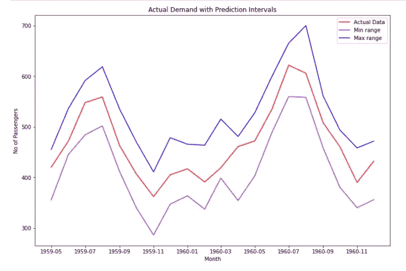

Prediction interval vs Actual demand

在本文中，我们应用蒙特卡罗模拟法来预测航空旅客的未来需求。通过这样做，获得了需求的概率预测，以及每个时间段(月)的最小和最大需求范围的估计。

我希望你喜欢阅读这篇文章。

参考资料:

对于滚动预测-[https://machine learning mastery . com/ARIMA-for-time-series-forecasting-with-python/](https://machinelearningmastery.com/arima-for-time-series-forecasting-with-python/)

对于 SARIMA 模型-[https://machine learning mastery . com/SARIMA-for-time-series-forecasting-in-python/](https://machinelearningmastery.com/sarima-for-time-series-forecasting-in-python/)

用于网格搜索 SARIMA 模型超参数- [如何网格搜索 SARIMA 超参数进行时间序列预测(machinelearningmastery.com)](https://machinelearningmastery.com/how-to-grid-search-sarima-model-hyperparameters-for-time-series-forecasting-in-python/)

[](/mlearning-ai/mlearning-ai-submission-suggestions-b51e2b130bfb) [## Mlearning.ai 提交建议

### 如何成为 Mlearning.ai 上的作家

medium.com](/mlearning-ai/mlearning-ai-submission-suggestions-b51e2b130bfb)