# 适用于 Mac M1 的 Tensorflow 解决方案非常有效。在 Mac M1 和 Mac Pro 3,1 系统上安装 Tensorflow 2.7

> 原文：<https://medium.com/mlearning-ai/a-tensorflow-solution-for-mac-m1-that-really-works-dae20c5e5dce?source=collection_archive---------1----------------------->

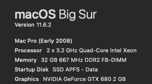

A machine configuration that was struggling to run Tensorflow

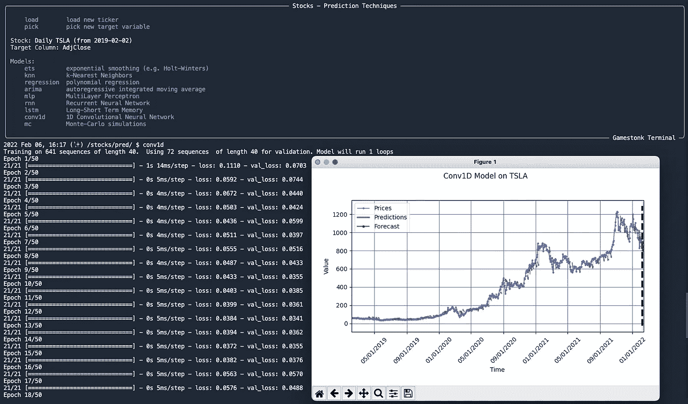

Tensorflow deployed in Gamestonk Terminal ([https://github.com/GamestonkTerminal/GamestonkTerminal](https://github.com/GamestonkTerminal/GamestonkTerminal))

如果您是在各种 Mac 电脑中使用新一代 CPU/GPU 芯片的众多用户之一，您可能会在尝试使用 Tensorflow 时遇到兼容性问题。网上有很多关于如何让 Tensforflow 在 M1 机器上工作的问题，最后我很高兴地说，我有一个适用于运行 Mac OS 11.6.2 或更高版本的机器的解决方案，不管 CPU/GPU 架构如何。

非法操作:4

这是几个月来我在尝试所有我能找到的关于这个已知问题的教程时遇到的错误。一切都不工作，这变得相当令人沮丧，但最终我收到了一个提示，让我走上了正确的道路。这一切都从您的虚拟环境处理程序开始。

互联网上有很多使用 MiniConda3 的建议，但是他们都没有强调需要下载一个非常特殊的版本。虽然有专门为 M1 架构构建的版本，但不明显的是，Tensorflow 不能与 M1 版本的 MiniConda、Anaconda、Docker 等一起工作。通过我所有的修补，在任何 Mac 机器上成功运行 Tensorflow 的唯一方法是使用 Python 3.9 的 x86_64 版本。

[https://repo . anaconda . com/miniconda/miniconda 3-py39 _ 4 . 10 . 3-ma cosx-x86 _ 64 . pkg](https://repo.anaconda.com/miniconda/Miniconda3-py39_4.10.3-MacOSX-x86_64.pkg)

如果不在新的沙盒环境中安装 Miniconda，请在继续之前卸载任何以前版本的 Anaconda 或 Miniconda。这与传统的 Mac Pro 3,1 塔式机和 M1 机器兼容。

唯一需要注意的是 Tensorflow 包的源代码很重要，银弹是通过源代码/命令:conda install-c conda-forge tensor flow

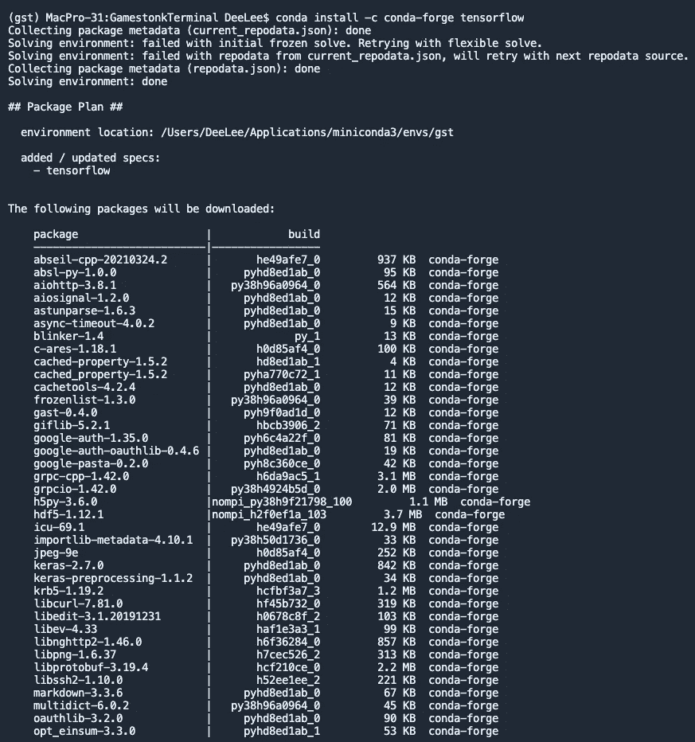

Installing Tensorflow 2.7 on M1 & Mac Pro 3,1 Towers

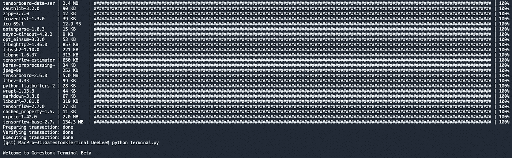

Installing Tensorflow 2.7 on M1 & Mac Pro 3,1 Towers

Gamestonk 终端包中一个令人难以置信的功能是能够导入任何 CSV 文件进行绘图或定量和预测分析。这为任何人提供了进入 Tensorflow 的低摩擦切入点，而不仅仅是股市怪人。最好的部分是 Gamestonk 终端是完全免费的，MIT 开源许可。安装过程并不简单，但是按照说明操作很简单，所以我在下面列出了这个简短的过程:

1.  注册一个 GitHub 帐户。如果你还没有，这是免费的。去项目:【https://github.com/GamestonkTerminal/GamestonkTerminal】T2—给它一颗星。
2.  使用此版本安装 miniconda 3:[https://repo . anaconda . com/miniconda/miniconda 3-py39 _ 4 . 10 . 3-ma cosx-x86 _ 64 . pkg](https://repo.anaconda.com/miniconda/Miniconda3-py39_4.10.3-MacOSX-x86_64.pkg)
3.  打开终端窗口并验证安装:conda -V
4.  复制并粘贴到命令提示符下，当出现提示时选择 yes:conda install-c anaconda git
5.  导航到一个文件夹，如/Users，复制并粘贴:`git clone [https://github.com/GamestonkTerminal/GamestonkTerminal.git](https://github.com/GamestonkTerminal/GamestonkTerminal.git)`
6.  导航到克隆的项目文件夹:cd GamestonkTerminal/
7.  复制并粘贴到命令行:conda env create-n GST-file build/conda/conda-3–8-env . YAML
8.  完成后，输入:conda activate gst
9.  然后输入:诗歌安装
10.  安装张量流:conda install -c conda-forge 张量流
11.  准备运行:python terminal.py

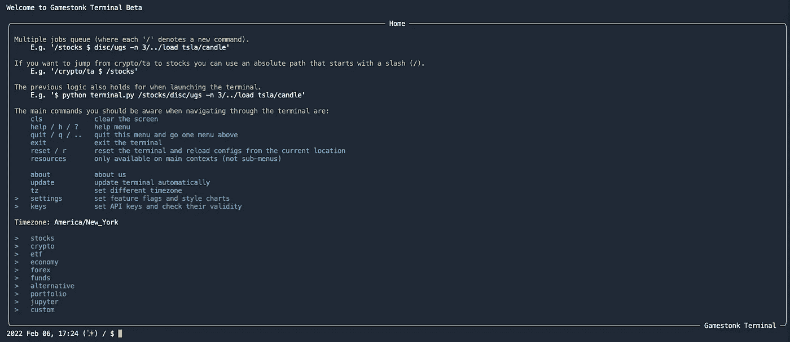

A successful installation of Gamestonk Terminal will require over 2GB of free disk space.

要使用 Tensorflow 功能，请导航到股票菜单并加载一个股票行情分析工具。

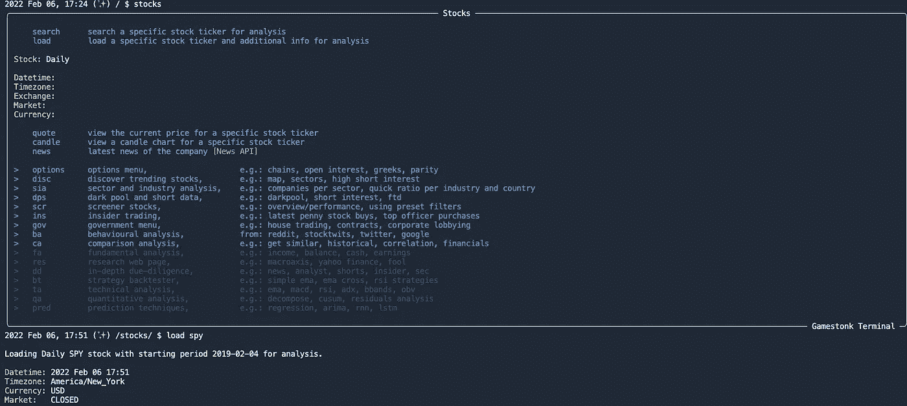

The stocks menu in Gamestonk Terminal ([https://github.com/GamestonkTerminal/GamestonkTerminal](https://github.com/GamestonkTerminal/GamestonkTerminal))

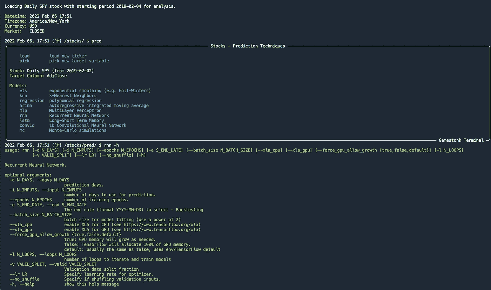

The prediction menu and the options available for a Recurrent Neural Network engine

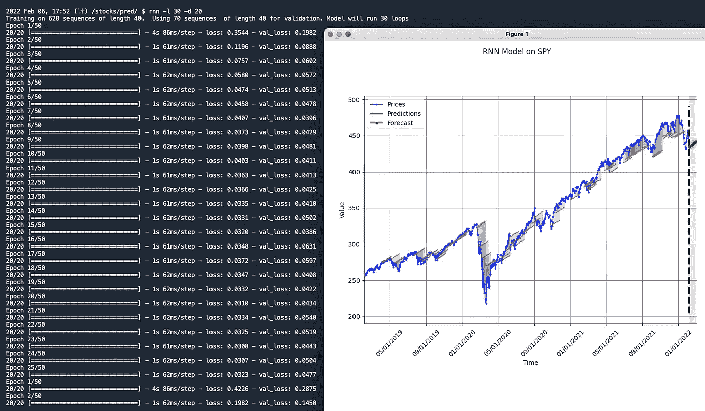

A sample output using SPY daily adjusted close price

使用/custom 菜单导入 CSV 进行分析和绘图。

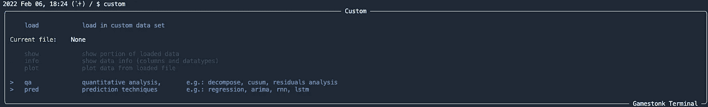

/custom allows the user to import their own CSV files for analysis and plotting.

虽然不是必需的，但获取单独的 API 密钥将充分利用 Gamestonk 终端套件中的大量功能集。个人用户必须获得这些密钥才能使用某些功能。使用的 API 列表和免费获取它们的链接可以在 GitHub 的安装说明底部找到:[https://github.com/GamestonkTerminal/GamestonkTerminal](https://github.com/GamestonkTerminal/GamestonkTerminal)

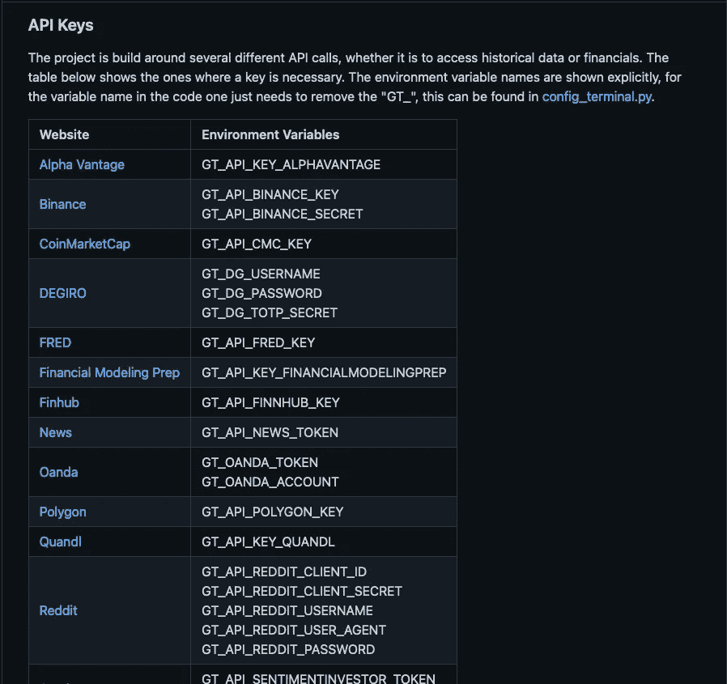

[API keys used to retrieve data from a variety of sources (https://github.com/GamestonkTerminal/GamestonkTerminal](https://github.com/GamestonkTerminal/GamestonkTerminal))

可以通过导航到/keys 来设置和测试按键

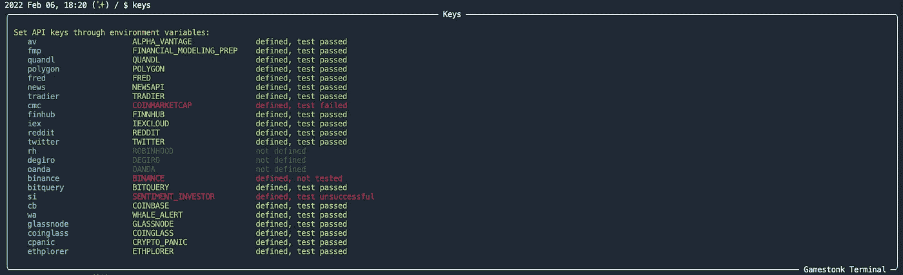

The keys manager in Gamestonk Terminal [(https://github.com/GamestonkTerminal/GamestonkTerminal](https://github.com/GamestonkTerminal/GamestonkTerminal))

这个项目的维护者为有需要的人提供了巨大的技术支持。任何问题都可以直接发送到 Discord 服务器，社区的友好成员很乐意帮助和讨论:[https://discord.com/invite/Up2QGbMKHY](https://discord.com/invite/Up2QGbMKHY)

在 Twitter 上关注 Gamestonk 终端:[https://twitter.com/gamestonkt](https://twitter.com/gamestonkt)

感谢阅读，我希望这有助于那些挣扎于 Tensorflow 和 M1 兼容性问题的人。

 [## Mlearning.ai 提交建议

### 如何成为 Mlearning.ai 上的作家

medium.com](/mlearning-ai/mlearning-ai-submission-suggestions-b51e2b130bfb) 

[成为作家](/mlearning-ai/mlearning-ai-submission-suggestions-b51e2b130bfb)