# 在 Power BI 中用报告工具提示显示数据的好方法

> 原文：<https://medium.com/mlearning-ai/a-terrific-way-to-show-data-with-report-tooltips-in-power-bi-560e31c639cd?source=collection_archive---------3----------------------->

# 工具提示是什么？

简而言之，当您将鼠标指针悬停在仪表板上时，会显示一个小框。

当您试图在可视化中包含尽可能多的信息时，您的仪表板可能会感到不堪重负。

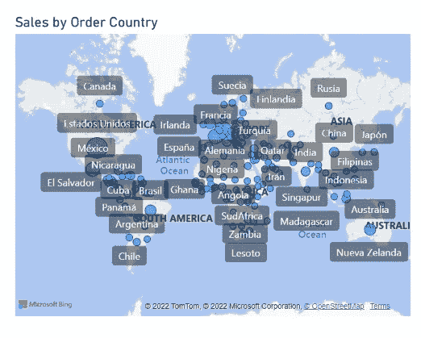

Map visualization without a tooltip

工具提示被设计为仅在需要时显示信息，因此仪表板可以变得更加直观，用户将不会费力地在仪表板上找到特定的数据。

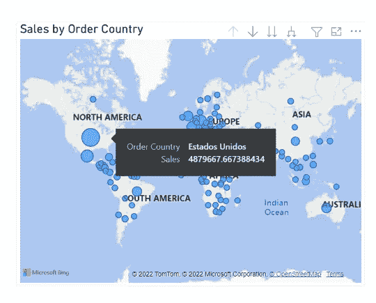

Map visualization with a tooltip

# 本文的内容

*   如何让工具提示更有见地？
*   设置工具提示页面
*   设置主页

# 如何让工具提示更有见地？

Power BI 将自动为仪表板中的所有可视化效果生成工具提示。该工具提示将说明可视化中字段的值。

例如，说明每个市场销售额的条形图将有一个工具提示，显示市场和销售额的值。

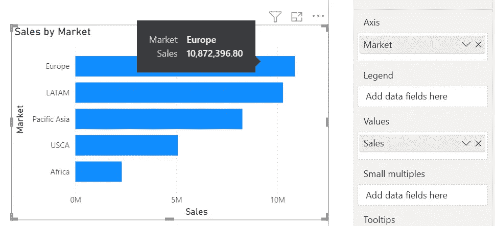

Default tooltip

通过将字段拖到工具提示框中，可以自定义工具提示中显示的文本。

在前面的例子中，我将“Count-Transaction”字段拖到了工具提示框中。目前，工具提示还将显示每个国家的交易数量。

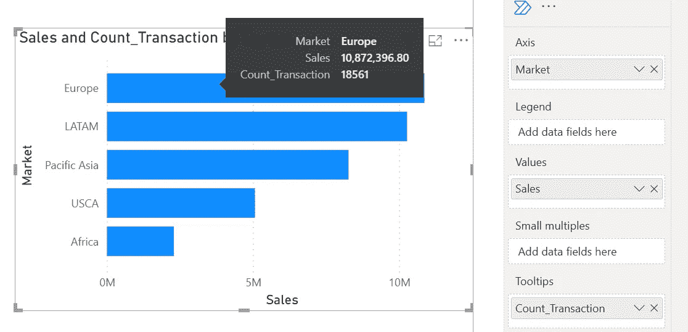

Custom tooltip field

您还可以在工具提示中打印图表！

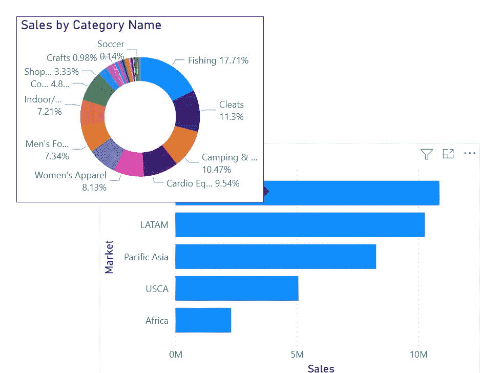

Report tooltip

用户只需将鼠标指针移动到可视化中的一个点，就可以获得更多的洞察力。此外，工具提示中的图形将被过滤为它们所属的数据点。

这被称为报告工具提示，我将在本文中告诉你如何做。

> 创建报告工具提示有两个主要步骤:设置工具提示页面和设置主页

# 设置工具提示页面

**1。创建新页面**

单击程序底部的加号按钮创建一个新页面。

我把这个页面命名为“工具提示”。

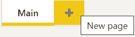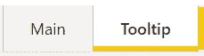

**2。设置 Tooltip = On 和 Canvas type = Tooltip**

转到可视化平原，然后单击格式化您的报告页面。

在页面信息中，将“允许用作工具提示”更改为“打开”。
在画布上输入修改工具提示。

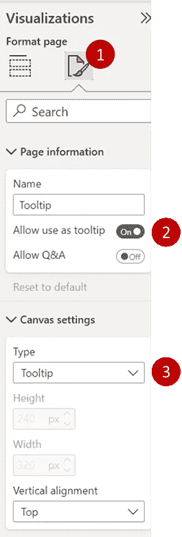

**3。将页面视图更改为实际大小**

这不是一个强制性的步骤，但我建议这样做，以确保你的工具提示是精心设计的。

转到菜单栏中的视图，并将页面视图更改为实际大小。

然后，可视化区域将更改为工具提示大小(小房间)。

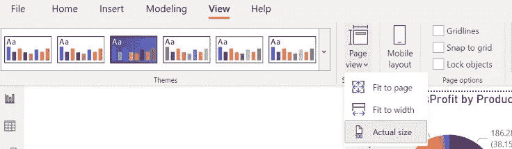

**4。自定义工具提示**

您可以在工具提示区域内添加可视化效果、文本、形状或按钮。

我尝试在工具提示中添加所有内容，它在主页上运行良好！！(仅供举例。不要在实际的仪表板中这样做)

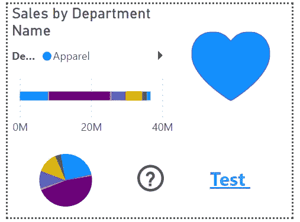

Tooltip page

Main page

# 设置主页

**1。转到主仪表板页面，并选择要在其中更改工具提示的可视化。**

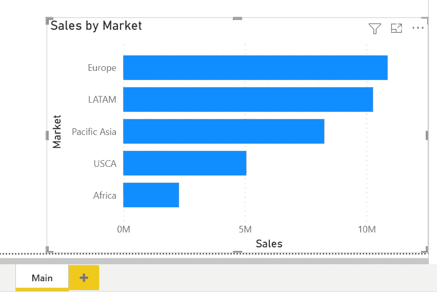

**2。将“工具提示中的页面”选项更改为工具提示页面。**

转到可视化平原，并单击格式化您的视觉。

在“工具提示将类型更改为报告”页面中，选择工具提示页面

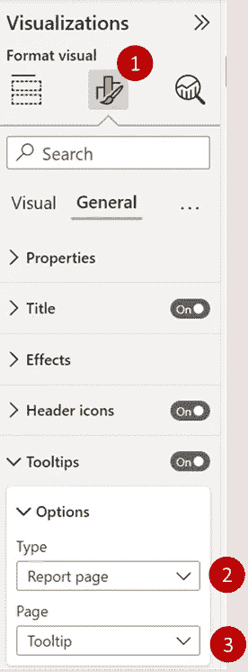

**3。搞定了。！**

Report tooltip example

现在，您将有一个报告工具提示，显示悬停对象的详细信息。当我们改变在可视化上的悬停位置时，它将被自动过滤。

# 建议

*   工具提示并不大，所以不要在工具提示中包含所有内容。
*   首先想到用户。如果他们只想在工具提示中看到文本，这样做是没问题的。
*   显示复杂的工具提示可能需要一些时间来加载。
*   来自市场的自定义可视化工具提示可能会更复杂。

# 结论

报告工具提示是在 Power BI 仪表板中展示数据的绝佳方式。它平衡了仪表板的简单性和数据量。您必须创建一个工具提示页面，并在主仪表板中设置工具提示选项，以便从默认工具提示更改为报告工具提示。

如果您想阅读更多数据分析内容，请鼓掌并关注我。

**我的文章可能对你有用**

*   [巨蟒之力匕](/mlearning-ai/python-in-power-bi-66a80590ecc0)
*   [Power BI 中的字云可视化](/mlearning-ai/word-cloud-visualization-in-power-bi-a993dc4afb77)
*   [用于 Power BI 流程可视化的 Sankey 图](/mlearning-ai/sankey-chart-for-flow-visualization-in-power-bi-828e62da4c0)
*   [电力 BI 中的聚类](/mlearning-ai/clustering-in-power-bi-e1c7fd5700e)

 [## Mlearning.ai 提交建议

### 如何成为 Mlearning.ai 上的作家

medium.com](/mlearning-ai/mlearning-ai-submission-suggestions-b51e2b130bfb)