# 对艾姆斯衣阿华州住房数据的深入研究。第 1 部分，共 4 部分。

> 原文：<https://medium.com/mlearning-ai/a-thorough-dive-into-the-ames-iowa-housing-dataset-part-1-of-5-7205093a5a53?source=collection_archive---------1----------------------->

# 第 1 部分:处理空值和非数值。

Ames Iowa housing 数据集是一个广泛使用的数据集，用于向数据科学专业的学生教授回归分析的基础知识，同时提供清理和探索数据集的良好实践。

这篇文章是为机器学习准备艾姆斯爱荷华数据集的一步一步的演练。在本笔记结束时，我们将通过删除所有空值、验证数据类型、将序号数据转换为数值类型以及执行一些初步 EDA，为功能工程准备好数据集。我们将很快拥有一个可以在我们选择的机器学习算法中处理的数据集！

[**本系列的第 2 部分**](https://jesservillines.medium.com/a-thorough-dive-into-the-ames-iowa-housing-dataset-part-2-of-5-3e24ea276e1c) 包含额外的 EDA、特征工程和用于建模的特征选择。 [**本系列的第 3 部分**](https://jesservillines.medium.com/a-thorough-dive-into-the-ames-iowa-housing-dataset-part-3-of-4-2c00e0a0eacf) 介绍了各种线性回归模型(OLS、岭、Lasso 和 ElasticNet)的构建、数据管道的实现以及优化模型超参数的网格搜索。 [**第 4 部分**](https://jesservillines.medium.com/a-thorough-dive-into-the-ames-iowa-housing-dataset-part-4-of-4-e127321885da) **，**最后一部分，将向您展示如何将选择的模型部署到 Streamlit 在线应用程序。所有代码都包含在最终的 Github 存储库中。在这篇文章底部的 Github 知识库中有 [**数据集**](https://github.com/jesservillines/Housing-Prices/tree/master/datasets) ，这样读者就可以跟随并复制这项工作。由于对所有功能的深入研究的细节，其中一些可能看起来是重复的，但彻底检查数据集是数据科学工作流程不可或缺的一部分，也是回答所选问题陈述的必要条件。

在本演练中，您是一名数据科学家，在爱荷华州埃姆斯市的虚拟公共利益现实公司工作。你是一个团队中的一员，该团队致力于开发一个在线购房者工具箱，以帮助潜在购房者简化购房过程。这是一项非常重要的任务，因为研究表明，普通购房者在选定合适的房子之前，会在 10 周内参观 10 所房子。这是一个重大的财务和人生决定，因为购房者会在新买的房子里住上大约 13 年。【[消息来源](https://www.nar.realtor/blogs/economists-outlook/how-long-do-homeowners-stay-in-their-homes#:~:text=As%20of%202018%2C%20the%20median,U.S.%20is%2013%20years1)该项目的目标是减少寻求住房者寻找合适住房的时间，从而增加公司销售额，减少我们的房地产经纪人在每个客户身上花费的时间，并通过为每个客户的预算提供更好的住房匹配来提高公司的推荐率。

给你一个数据集，包括过去几十年的 2051 条房屋销售记录，有 81 个特征列。您的目标是创建一个具有特定于在线平台的功能的准确模型。总之，我们最终将使用 28 个特性列，其中许多都是为了满足上述问题陈述而设计的，只删除了 13 条记录，实现了 92%的 R。完整的数据字典可以在[这里](http://jse.amstat.org/v19n3/decock/DataDocumentation.txt)找到。打开 Jupyter Lab 的副本，按照提供的代码片段进行操作。

第一步是导入所有必需的库。这应该总是在你的笔记本顶部完成。

```
import pandas as pd
import numpy as np
import matplotlib.pyplot as plt
import seaborn as sns#set_style
plt.style.use('fivethirtyeight')#configure for retina display
%config InlineBackend.figure_format = 'retina'
```

使用相对路径导入数据集，并为数据框指定一个描述性名称。

```
# Read in data
ames = pd.read_csv('../datasets/train.csv')#want to change columns names to lower/snake_case so a little easier to work with
ames.columns = ames.columns.str.lower().str.replace(' ', '_')#increase pandas default max_rows so I can view all columns at once
pd.options.display.max_rows = 250
pd.options.display.max_columns = 250
```

然后，我们将看看数据集的形状、信息和汇总统计数据。

```
ames.shape #81 columns and 2051 recordsames.info() # There are a lot of columnsames.describe().T #Summary statistics 
```

下一步是处理空值，也就是缺失值。

```
#Investigate nulls
ames.isnull().sum()[0:90]
```

地段临街:

```
ames['lot_frontage'].value_counts().head() #Linear feet of street connected to property
```

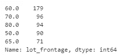

output

```
# Apply mask/filter to examine only null values.
lot_nulls = ames[ames['lot_frontage'].isna()] #lots with no linear feet of street connected to property# These appear to be real properties. Setting to average for the corrosponding type of lot_config.lot_nulls.head()
```

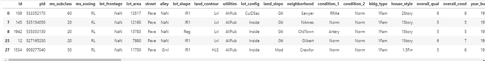

output

```
# Group lots by configuration
grouped_lots = ames.groupby(['lot_config']).agg({
   'lot_frontage' : 'mean', 
})grouped_lots
```

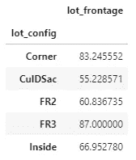

output

我决定用该批次配置类型的平均值来估算缺失值。这里有另外两种方法没有在本笔记本中探讨，但是可能值得研究一下，包括线性回归和 K-means 聚类。

```
#replace np.nan with average for lot_config of that type
ames.loc[(ames['lot_frontage'].isna()) & (ames['lot_config'] == 'Corner'), 'lot_frontage'] = 83.25
ames.loc[(ames['lot_frontage'].isna()) & (ames['lot_config'] == 'CulDSac'), 'lot_frontage'] = 54.734375        
ames.loc[(ames['lot_frontage'].isna()) & (ames['lot_config'] == 'FR2'), 'lot_frontage'] = 60.836735        
ames.loc[(ames['lot_frontage'].isna()) & (ames['lot_config'] == 'FR3'), 'lot_frontage'] = 87.000000        
ames.loc[(ames['lot_frontage'].isna()) & (ames['lot_config'] == 'Inside'), 'lot_frontage'] = 66.759571
```

检查以确保所有空值都得到处理:

```
ames[‘lot_frontage’].isna().sum()
```

寻找异常值:

```
# looking at outliers
ames['lot_frontage'].sort_values().tail()
```

记下要剔除的潜在异常值:

```
x_frontage_maybe_drop = ames[ames['lot_frontage'] == 313]
x_frontage_maybe_drop
```

然后进入下一个专栏“小巷”:

```
ames[‘alley’].value_counts()
```

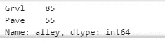

output

```
ames[‘alley’].isnull().sum() #1911 null values
```

这就是查阅我们的数据字典提供有价值的见解的地方。根据数据字典，这些值应该是 NA，意味着这些房子没有小巷。我将一个热编码(OHE)/虚拟这个变量稍后。1 如果有胡同，0 如果房子没有胡同。

```
ames['alley'] = ames['alley'].replace(np.nan, 'NA')
```

对特征的最终检查:

```
ames['alley'].value_counts()
```

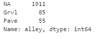

output

接下来，mas_vnr_type & mas_vnr_area 也称为砖石饰面类型和面积。

```
print(ames['mas_vnr_type'].value_counts())
print(ames['mas_vnr_area'].value_counts())ames[ames['mas_vnr_type'].isna()].head()
```

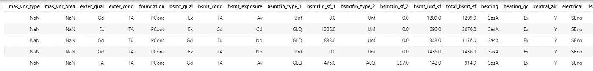

output

同样，数据字典是我们的朋友，我们知道下面的代码片段将解决我们缺少值的问题。

```
ames['mas_vnr_type'] = ames['mas_vnr_type'].replace(np.nan, 'None') #replace masonry np.nan with None
ames['mas_vnr_area'] = ames['mas_vnr_area'].replace(np.nan, 0) #replace masonry np.nan with 0
```

接下来，我们检查与地下室相关的变量:
* bsmt_qual(评估地下室的高度)、
* bsmt_cond(评估地下室的总体状况)、
* bsmt_exposure(指步行区或花园水平墙)
* bsmtfin _ type _ 1
* bsmtfin _ SF _ 1
* bsmtfin _ type _ 2
* bsmtfin _ SF _ 2
* bsmt _ UNF _ SF
* total _ total

```
ames['bsmt_qual'].value_counts() #missing NA for no basement
```

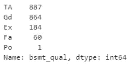

output

```
ames[['bsmt_qual', 'bsmt_cond', 'bsmt_exposure', 'bsmtfin_type_1', 'bsmtfin_sf_1', 'bsmtfin_type_2', 'bsmtfin_sf_2', 'bsmt_unf_sf', 'total_bsmt_sf','bsmt_full_bath', 'bsmt_half_bath']].isnull().sum()
```

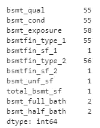

output

```
#these all receive an NA if no basement
basement_to_na = [‘bsmt_qual’, ‘bsmt_cond’, ‘bsmt_exposure’, ‘bsmtfin_type_1’, 
 ‘bsmtfin_type_2’]#these receive 0sqft if basement is NA
basement_to_zero = [‘bsmtfin_sf_2’, ‘bsmt_unf_sf’, ‘total_bsmt_sf’, ‘bsmtfin_sf_1’, ‘bsmt_full_bath’,
 ‘bsmt_half_bath’]for i in basement_to_na:
 ames[i] = ames[i].replace(np.nan, ‘NA’)ames[ames['bsmtfin_sf_1'].isna()] #the missing records are for NA basement properties. Setting to sqft value to zero.#set basement sqft to 0 IF basement is NA, else drop as incomplete basement data and only 1 null record for each    
for i in basement_to_zero:
    ames[i] = ames[i].replace(np.nan, 0)
```

接下来，壁炉 _ 曲或壁炉质量。

```
print(ames['fireplace_qu'].isnull().sum()) # There are 1000 missing valuesprint(len(ames['fireplace_qu'])) # Remember we only have 2051 records. This is nearly half of the dataset
```

该数据集中有许多序数值。为了使用这些特性进行建模，我们必须将 dtype=object 转换为 numeric 数据类型，但是只能在处理所有空值之后。在整个过程中，关注数据类型是非常重要的。计算机喜欢数字，但不喜欢别的。一切最终都需要简化成某种数字形式。在数据科学中，有许多方法可以做到这一点，甚至对于应用了自然语言处理(NLP)的复杂文本文档也是如此。这个数据集不需要任何 NLP，但我们必须将序数特征转换为数字特征，以便我们的机器学习算法能够正确运行。

```
ames['fireplace_qu'].unique()
```

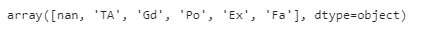

output, an example of ordinal values

```
ames[‘fireplaces’].unique()
```

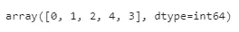

output, an example of discrete numeric values

确认没有壁炉的房子也是壁炉质量缺失的房子。使用多个列(如果可能的话)是一个非常好的主意，这样可以更好地了解为什么数据集中缺少信息。在这种情况下，我们确认可以用 NA 替换缺失值。

```
len(ames[(ames['fireplace_qu'].isna()) & (ames['fireplaces'] < 1)]) #number of houses w/o fireplace = fireplace_qu np.nan is 1000!
```

执行更换:

```
ames['fireplace_qu'] = ames['fireplace_qu'].replace(np.nan, 'NA') #NA for 'No Fireplace'
```

现在为车库相关的功能栏:

*   车库 _ 类型
    *车库 _yr_blt
    *车库 _ 完成
    *车库 _ 汽车
    *车库 _ 面积
    *车库 _ 质量
    *车库 _ 条件

```
ames[['garage_type','garage_finish','garage_qual','garage_cond']].isnull().sum()
```

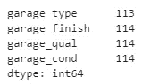

output

```
#create two lists, one for catagorical and one for numericgarage_to_na = ['garage_type','garage_finish','garage_qual','garage_cond']
garage_to_0 = ['garage_yr_blt','garage_cars', 'garage_area']
```

基于数据字典用 NA 替换序数列。

```
for i in garage_to_na:
    ames[i] = ames[i].replace(np.nan, 'NA')
```

近距离观察数字车库的功能:

```
ames[(ames[‘garage_yr_blt’].isna()) & (ames[‘garage_type’] ==’NA’)] #113 rows, whats up with the missing 1 to make 114?garage_to_0.isnull().sum()
```

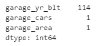

output

```
ames[ames['garage_cars'].isna()] #it has a garage type, but no more infor. I'm going to set this value to zero. This is an educated guess.
```

最后一次检查，仔细检查你的工作总是一个好主意。

```
ames[['garage_type','garage_finish','garage_qual','garage_cond','garage_yr_blt','garage_cars', 'garage_area']].isnull().sum()
```

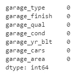

output, all garage nulls dealt with!

接下来，pool_qc

```
ames['pool_qc'].isnull().sum() #mostly empty column. There are only 2051 records and 2042 of these are null values.
```

从池特征中获得的信息很少。

```
print(ames['pool_qc'].unique()) #almost no information on pool. Going to set to a default 'TA' for average/typical IF pool YES.
#Will probably end up dropping this column. May be important if pool dummy to YES/NO, but less so for pool quality.for i in ames[(ames['pool_qc'].isna()) & (ames['pool_area'] == 0)]:
    ames['pool_qc'] = ames['pool_qc'].replace(np.nan, 'NA')
```

栅栏特征:

```
print(ames['fence'].isnull().sum()) # There are 1651 nulls for this feature#This replacement should feel like second nature by now.ames['fence'] = ames['fence'].replace(np.nan, 'NA')ames['fence'].isnull().sum() #Zero nulls remain
```

杂项功能:

```
ames['misc_feature'].isnull().sum() #not surprise most do not have a 'Tennis court' or 'Elevator' on their property... 1986 nulls here. for i in ames[(ames['misc_feature'].isna()) & (ames['misc_val'] == 0)]:
    ames['misc_feature'] = ames['misc_feature'].replace(np.nan, 'NA')ames['misc_feature'].isnull().sum() #no remaining null values
```

最后一次检查:

```
ames.isnull().sum()
```

接下来，我们对照数据字典检查数据类型，以确保我们的数据框正确读取数据，并创建用于 EDA 的每种数据类型的列表。

```
ames_indexing = [['id', 'pid']]#ordinal data. 
#Will want to convert these to numeric lists. 
#Note:'overall_qual','overall_cond' are already numericames_ordinal = ames[['saleprice','lot_shape','utilities','land_slope','overall_qual','overall_cond','exter_qual', exter_cond','bsmt_qual', 'bsmt_cond', 'bsmt_exposure','bsmtfin_type_1','bsmtfin_type_2','heating_qc','electrical','kitchen_qual','functional', 'fireplace_qu','garage_finish', 'garage_qual','garage_cond','paved_drive','pool_qc','fence']]ames_nominal = ames[['ms_subclass','ms_zoning','street','alley','land_contour','lot_config','neighborhood','condition_1', 'condition_2', 'bldg_type','house_style','roof_style','roof_matl', 'exterior_1st', 'exterior_2nd','mas_vnr_type','foundation','heating','central_air','garage_type','misc_feature','sale_type'     
]]ames_catagorical = ames[['street','alley', 'lot_shape', 'land_contour','utilities', 'lot_config', 'land_slope', 'neighborhood','condition_1', 'condition_2', 'bldg_type','house_style','roof_style', 'roof_matl', 'exterior_1st', 'exterior_2nd', 'mas_vnr_type','exter_qual', 'exter_cond', 'foundation', 'bsmt_qual','bsmt_cond', 'bsmt_exposure', 'bsmtfin_type_1','bsmtfin_type_2','heating', 'heating_qc', 'central_air', 'electrical','kitchen_qual', 'functional', 'fireplace_qu','garage_type','garage_finish','garage_qual',
'garage_cond', 'paved_drive','pool_qc','fence', 'misc_feature','sale_type']]ames_numeric_catagory = ames[['saleprice','ms_subclass', 'ms_zoning', 'overall_qual','overall_cond', 'mo_sold'                ]]ames_numeric = ames[['saleprice','lot_frontage', 'lot_area','year_built','year_remod/add','mas_vnr_area','bsmtfin_sf_2', 'bsmt_unf_sf', 'total_bsmt_sf','1st_flr_sf', '2nd_flr_sf', 'low_qual_fin_sf', 'gr_liv_area', 'bsmt_full_bath',
 'bsmt_half_bath', 'full_bath', 'half_bath', 'bedroom_abvgr',
'kitchen_abvgr','totrms_abvgrd','fireplaces','garage_yr_blt','garage_cars', 'garage_area','wood_deck_sf', 'open_porch_sf', 'enclosed_porch', '3ssn_porch','screen_porch', 'pool_area','misc_val','yr_sold']]y = ames['saleprice'] # our target variable
```

现在进行一些初步的探索性数据分析。在这里，我们着眼于视觉上检查我们的变量的洞察力可能不容易显而易见。

```
sns.pairplot(ames_numeric_catagory) #initial eda on numeric features
```

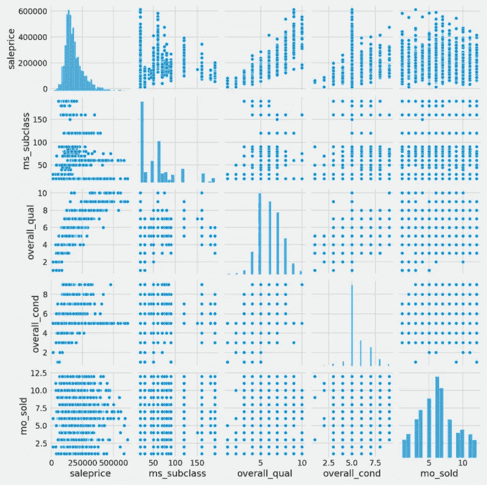

output, what trends stand out to you?

在这个初步的视觉检查之后，我们看到夏季月份有更多的销售，销售价格(我们的目标)有一个明显的倾斜，并且有更多的房子比其他月份有平均的整体状况。

让我们将我们的顺序特性列转换成数字，这样我们也可以看看这些特性的相关性。

```
#ordinal columns
ames_ordinal.head()
```

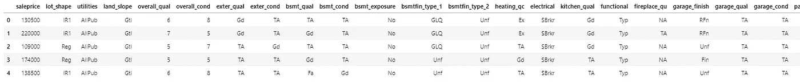

output

我选择了字典替换法，因为这是一种简单的映射技术，初级分析师可以很容易地接受培训来更新，以防 Common Good Reality 决定将购房者工具箱的这一部分扩展到其他城市或使用最近的房屋销售来更新我们的数据集。现在的情况是，高质量或高权重的值被赋予比小数值更大的数值。在这里，数字是基于对特征列中每个值的分布的视觉检查来选择的。可以使用一种更复杂的方法来研究标准偏差和分布，以改进这一部分。

```
#ordinal data. Will want to convert these to ordinal lists.#columns I want to replace values in
ames_ordinal_str_columns = ames[['lot_shape','utilities','land_slope','exter_qual', 
                 'exter_cond','bsmt_qual',
       'bsmt_cond', 'bsmt_exposure', 'bsmtfin_type_1','bsmtfin_type_2','heating_qc','electrical','kitchen_qual',
                'functional','fireplace_qu','garage_finish','garage_qual','garage_cond','paved_drive','pool_qc','fence']]#dictionary of values I want to replace
dict_ordinal = {
    #overall_qual, overall_cond,exter_qual,exter_cond,bsmt_qual,bsmt_cond,bsmt_exposure,heatingqc,kitchenqual
    #firplacequ,garage_qual,garage_cond,pool_qc,fence
    'Ex': 5,
    'Gd': 4,
    'TA': 3,
    'Fa': 2,
    'Po': 1,
    'NA': 0,
     #lot_shape
    'Reg':4,
    'IR1':3,
    'IR2':2,
    'IR3':1,
    #utilities
    'AllPub':4,
    'NoSewr':3,
    'NoSeWa':2,
    'ELO':1,
    #land_slope
    'Gtl':3,
    'Mod':2,
    'Sev':1,
    #bsmt_exposure
    'Av': 3,
    'Mn': 2,
    'No': 1,
    #bsmtfin_type_1, bsmtfin_type_1
    'GLQ':6,
    'ALQ':5,
    'BLQ':4,
    'Rec':3,
    'LwQ':2,
    'Unf':1,
    #Electrical
    'SBrkr':1,
    'FuseA':0,
    'FuseF':0,
    'FuseP':0,
    'Mix':0,
    #Functional
    'Typ':1,
    'Min1':0,
    'Min2':0,
    'Mod':0,
    'Maj1':0,
    'Maj2':0,
    'Sev':0,
    'Sal':0,
    #garage_finish    
    'Fin': 3,
    'RFn': 2,
    'Unf':1,
    #paved_drive
    'Y' : 2,
    'P' : 1,
    'N' : 0,
    #fence
    'GdPrv':4,
    'MnPrv':3,
    'GdWo':2,
    'MnWw':1   
}#loop to get the job done
for i in ames_ordinal_str_columns.columns:
    ames.replace({i: dict_ordinal},inplace = True)
```

这些特性列现在应该都是数字，让我们来看看:

```
#visually inspect that the change took
ames[['lot_shape','utilities','land_slope','exter_qual', 'exter_cond','bsmt_qual','bsmt_cond', 'bsmt_exposure', 'bsmtfin_type_1','bsmtfin_type_2','heating_qc','electrical','kitchen_qual','functional','fireplace_qu','garage_finish','garage_qual','garage_cond','paved_drive','pool_qc','fence']].head(3)
```

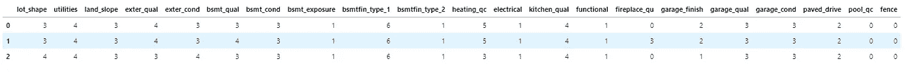

output, exactly what we want!

直观地检查数据类型，所有数据类型都返回 int64:

```
#checking to see if all dtypes now numeric
ames[['lot_shape','utilities','land_slope','exter_qual', 'exter_cond','bsmt_qual','bsmt_cond', 'bsmt_exposure', 'bsmtfin_type_1','bsmtfin_type_2','heating_qc','electrical','kitchen_qual','functional','fireplace_qu','garage_finish','garage_qual','garage_cond','paved_drive','pool_qc','fence']].dtypes
```

现在让我们对邻域特征做同样的操作。直觉上，这将是一个重要的特性。谈到房价，位置很重要。

```
#I don't want to dummy neighboorhood, but I do want to bin it into oridinal columns based on mean price
ames['neighborhood_order'] = ames['neighborhood']
ames_ordinal_str_columns = ames[['neighborhood_order']]dict_ordinal = {
    'MeadowV': 1,
    'IDOTRR' : 1,
    'BrDale' : 1,
    'OldTown': 1,
    'BrkSide': 1,
    'Edwards': 1,
    'SWISU': 1,
    'Landmrk':2,
    'Sawyer':2,
    'NPkVill':2,
    'Blueste':2,
    'NAmes':2,
    'Mitchel':2,
    'SawyerW':2,
    'Greens':3,
    'Gilbert':3,
    'NWAmes':3,
    'Blmngtn':3,
    'CollgCr':3,
    'Crawfor':3,
    'ClearCr':3,
    'Somerst':4,
    'Timber':4,
    'Veenker':4,
    'GrnHill':4,
    'StoneBr':4,
    'NoRidge':4,
    'NridgHt':4,
        }#loop to get the job done
for i in ames_ordinal_str_columns.columns:
    ames.replace({i: dict_ordinal},inplace = True)
```

请注意，我决定将它分成四个独立的箱，而不是为所有的邻域使用一个唯一的箱。这是特征工程的一部分，也是数据科学的一部分，与其说是科学，不如说是艺术。这也是进入本系列下一部分的完美过渡。

查看这个四部分系列的 [**第二部分**](https://jesservillines.medium.com/a-thorough-dive-into-the-ames-iowa-housing-dataset-part-2-of-5-3e24ea276e1c) ，在这里我们将继续深入研究艾姆斯衣阿华数据集，其中包括额外的 EDA、特征工程和用于建模的特征选择。

Github 资源库:【https://github.com/jesservillines/Housing-Prices 

作者的领英:[https://www.linkedin.com/in/jesse-villines/](https://www.linkedin.com/in/jesse-villines/)

如果你喜欢这项工作，请直接在 LinkedIn 上提出问题或想法，以便进一步合作！