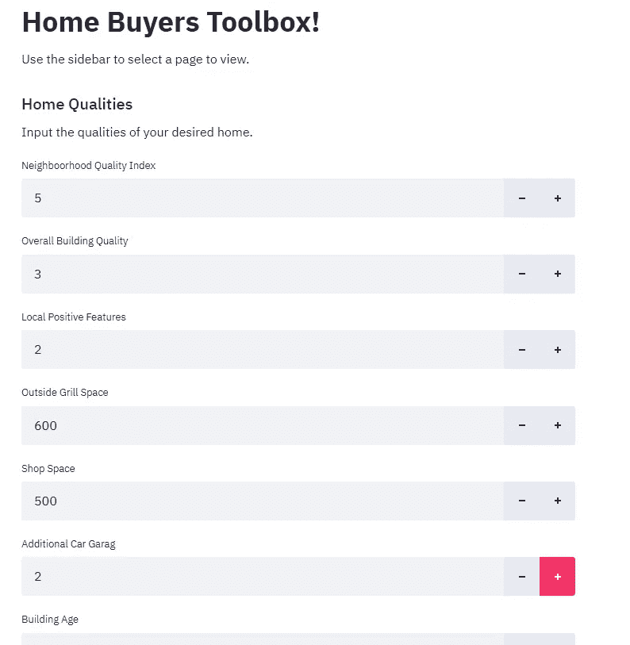

# 对艾姆斯衣阿华州住房数据的深入研究。第 4 部分，共 4 部分。

> 原文：<https://medium.com/mlearning-ai/a-thorough-dive-into-the-ames-iowa-housing-dataset-part-4-of-4-e127321885da?source=collection_archive---------2----------------------->

在本系列的最后一部分，我们将在第 3 部分中创建的回归模型部署到一个 Streamlit web 应用程序中。为此，你需要一个 [Streamlit](https://www.streamlit.io/) 账户。点击这里查看源代码。



The Home Buyers Toolbox

使用以下代码创建一个 st_app.py 文件，并将其放在主文件夹中:

```
import numpy as np
import pandas as pd
import…
```