# A30:逻辑回归(下)>>幕后！

> 原文：<https://medium.com/mlearning-ai/a30-logistic-regression-part-2-behind-the-scene-38a98b70192a?source=collection_archive---------4----------------------->

## 概率和赔率、e 和自然对数、logit 链接函数、对数赔率、决策界限、基线准确度、逻辑回归系数、假设检验、准确度悖论、功效分析、混淆矩阵、真阳性/真阴性、准确度、特异性、精确度、错误/未分类率…！

> *本文是**[***数据科学从无到有—我能我能***](https://leanpub.com/u/junaidsqazi) ***”、*** *系列的一篇讲义书。(* [*)今天点击这里领取你的文案*](https://leanpub.com/u/junaidsqazi) *！)**
> 
> *[*点击此处查看之前的文章/讲座“A29:逻辑回归(Part-1) > >理论幻灯片/讲座！!"*](https://junaidsqazi.medium.com/a29-logistic-regression-part-1-theory-slides-lecture-8c8fcd3dc98d)*

> *[💐点击这里关注我的新内容💐](https://junaidsqazi.medium.com)*

*⚠️这是一个学习讲座，代码是主观的，为学习目的。*

*✅一个建议:*打开一个新的 jupyter 笔记本，边读这篇文章边输入代码，边做边学，是的，“请阅读评论，它们非常有用…..!"**

# *逻辑回归>>幕后*

*1.概率和赔率*

*2.e 和自然对数——快速回顾*

*3.理解逻辑回归*

*   *3.1:导言*
*   *3.2:Logit 链接功能*
*   *3.3:获取概率*
*   *3.4:衍生—(可选)*
*   *3.5:从对数优势到概率的转换*

*4.逻辑回归实现*

*   *4.1:数据及其概述*
*   *4.2:线性回归与逻辑回归——视觉比较*
*   *4.3:决策界限*
*   *4.4:系数的解释*

*5.模型评估*

*   *5.1:基线精度*
*   *5.2:混淆矩阵*
*   *5.3:分类报告*
*   *5.4:更改预测阈值*

*6.最后的话*

*7.额外材料——供你空闲时阅读*

*   *7.1:假设检验和混淆矩阵*
*   *7.2:建筑分类报告*
*   *> > > 7.2.1:准确率和误分类率*
*   *> > > > > > > > > > > >准确性悖论*
*   *> > > 7.2.2:精确度/阳性预测值*
*   *> > > 7.2.3:召回率/敏感度/真阳性率(TPR)*
*   *> > > 7.2.4:假阳性率(FPR)*
*   *> > > 7.2.5:特异性/真阴性率(TNR)*
*   *> > > 7 . 2 . 6:F1-得分*
*   *> > > > > > > > > > >评论家*
*   *7.3:求解贝塔系数*
*   *7.4:几个功能的说明*
*   *> > > 7.4.1:概率与赔率*
*   *> > > 7.4.2:赔率的对数——对数赔率*
*   *> > > 7.4.3:概率的对数*
*   *7.5:额外资源*
*   *7.6:统计测试、功效分析和样本量*

*让我们从所需的导入开始。*

```
*# We are already familiar with these libraries!
import pandas as pd
import numpy as np
import matplotlib.pyplot as plt
%matplotlib inline# scikit-learn imports
from sklearn.linear_model import LinearRegression, LogisticRegression
from sklearn.preprocessing import StandardScaler#Retina display to see better quality images.
%config InlineBackend.figure_format = ‘retina’from scipy import stats# Lines below are just to ignore warnings
import warnings
warnings.filterwarnings(‘ignore’)*
```

# *1.概率和赔率*

*在我们继续使用逻辑回归之前，我们必须对这些非常重要的统计概念有清楚的了解。*

*🧘🏻‍♂️ **> >概率< <** 🧘🏻‍♂️*

*概率是描述某个事件在`0 (impossible) & 1 (certain)`之间发生的可能性。概率越高，事件发生的可能性越大。*

> *投掷一枚公平的硬币或掷骰子，并期待我们多久会在骰子上得到一个头和某个数字，它只是结果除以总的选项或可能性。*

**

*   *在公平硬币的情况下，获得正面或反面的概率是相同的， **1/2 (0.5 或 50%的机会)**，同样，对于骰子，获得某个数字的机会是 **1/6** 。*

*🧘🏻‍♂️ **> >赔率< <** 🧘🏻‍♂️*

*一个事件的概率代表了:*

*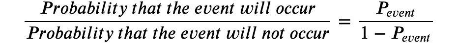*

*例如:*

**

*所以我们可以写:*

**

> ****把数字赔率想成一个比率是有帮助的，比如:****
> 
> *`1/5`的意思是> > `1 "three-side"`对`5 "no-three-sides"` *(我们在一个骰子中有 1 到 6 个数字共六个面，按所需结果考虑三个)**

*这个图片描述([来源](https://en.wikipedia.org/wiki/Odds#/media/File:Probability_vs_odds.svg))可能有助于理解概率和赔率之间的关系。*

**

**𝑝* is an event under observation and *𝑞* is for all other possible events. (image [source](https://en.wikipedia.org/wiki/Odds#/media/File:Probability_vs_odds.svg))*

***> >例题—概率和赔率:< <***

*掷骰子，掷出 1 或任何数字:*

*   *`Probability = 1/6`*
*   *`Odds = 1/5`*

*偶数掷骰子:*

*   *`Probability = 3/6`*
*   *`Odds = 3/3`*

*掷骰子少于 5:*

*   *`Probability = 4/6`*
*   *`Odds = 4/2`*

> *[**赔率常用于赌博**](https://www.investopedia.com/articles/investing/042115/betting-basics-fractional-decimal-american-moneyline-odds.asp) **，例如** `**3/2**` **的意思是，三胜二负，** `**4/1**` **的意思是四胜一负！在这两种情况下，总共有 5 个行动。***

> *概率和赔率以不同的方式代表同一件事。*

*因此，概率也可以表示为赔率，这将有助于理解它们之间的关系。*

**

*让我们创建一个特定事件的概率及其赔率的表格。*

*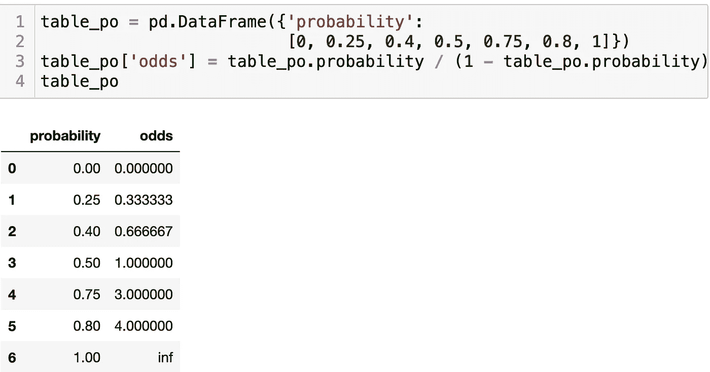*

*Probabilities and their odds are presented in the table (dataframe) above.*

*如上表所示，当我们有分数比时:*

*   *对于`**p = 0.25**` : `**odds = 0.333..**` -为 0.333..发生的可能性比不发生的可能性大。*
*   *对于`**p = 0.5**`:`**odds = 1**`——发生的可能性和不发生的可能性一样大。*
*   *对于`**p = 0.75**`:`**odds = 3**`——发生的可能性是不发生的 3 倍。*

# *2.e 和自然对数——快速回顾*

*🧘🏻***>>‍♂️<<***🧘🏻‍♂️*

*   *`e ~ 2.71828.....`又称 ***欧拉数*** ，是**中最重要的无理数** *(像𝜋；两者都不能写成分数)*数学上。`e`是自然日志的底数`ln` *(回忆学校数学-* [*一个好的链接*](https://www.mathsisfun.com/numbers/e-eulers-number.html) *)* 。*

*🧘🏻‍♂️ **> >自然日志— *𝑙𝑛* 或 *𝑙𝑜𝑔_𝑒 < <*** 🧘🏻‍♂️*

*   *基数为 *𝑒* 的对数是自然对数。 *< <* [*链接好*](https://www.mathsisfun.com/definitions/natural-logarithm.html)*[*维基*](https://en.wikipedia.org/wiki/Natural_logarithm) *> >***

> ***𝑒* 是所有持续增长过程[环节](https://mathbitsnotebook.com/Algebra2/Exponential/EXExpMoreFunctions.html)共享的基本增长率，而 *𝑙𝑛* 给出了达到某一增长水平[环节](https://betterexplained.com/articles/demystifying-the-natural-logarithm-ln/)所需的时间。**
> 
> **自然日志 *𝑙𝑛* 是*𝑒*=>t65】𝑙𝑛(*𝑒^𝑥*)=*𝑥***

**我们试试吧！**

**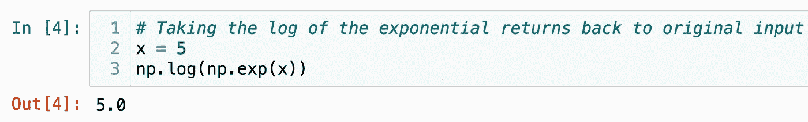**

**现在，是时候回去用`ln(odds)`在我们的`table_po`中添加一个新的专栏了。**

**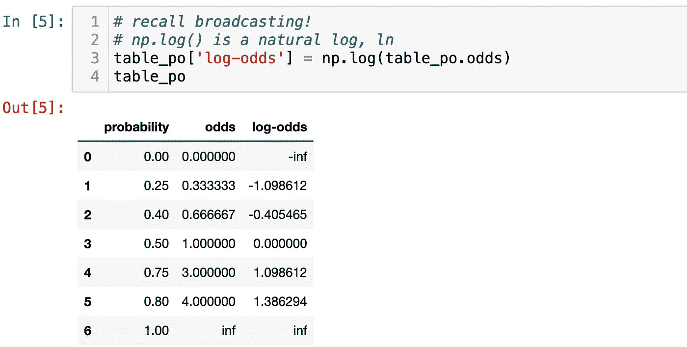**

**With log-odds transformation, we get the range [−∞,∞]**

> *****对数几率*变换有一个非常重要的性质，我们有区间[∞，∞]。这对于比值比来说是不成立的，它永远不可能是负数。****

*   **<<[为什么天然原木的对数比…点击此 stackexchange 链接](https://stats.stackexchange.com/questions/271511/why-do-we-need-natural-log-of-odds-in-logistic-regression) > >**

# **3.理解逻辑回归**

**好了，现在是时候继续理解逻辑回归了！**

## **3.1:导言**

**逻辑回归是**最常用的分类算法**(分类器)之一。 ***逻辑回归估计类别成员的概率*** ，这实际上是通过**从一种回归模型预测对数几率**来完成的。**

**逻辑回归可以推广到多类分类，但是，让我们从 ***二元结果*** 开始，例如:**

*   *****根据症状预测患者患某种疾病的可能性*****
*   *****根据学生的成绩和医学院的特点预测学生能否获得住院医师资格*****

**嗯，你可以想出很多例子……!>>>现实中，大多数时候我们都在处理二元结果！**

## **3.2:logit“链接功能”**

**我们使用逻辑回归来预测类别成员，而不是连续结果，但是我们仍然可以用制定线性回归的方式来制定逻辑回归。我们会有截距和系数！**

**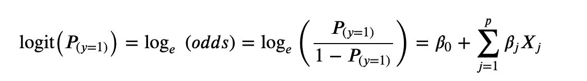**

**在预测器的帮助下，我们获得属于类别 1 的 *𝑦* 的概率的对数优势值，或者，用另一个名字，为 logit 函数(它是逻辑函数的逆函数)。**

**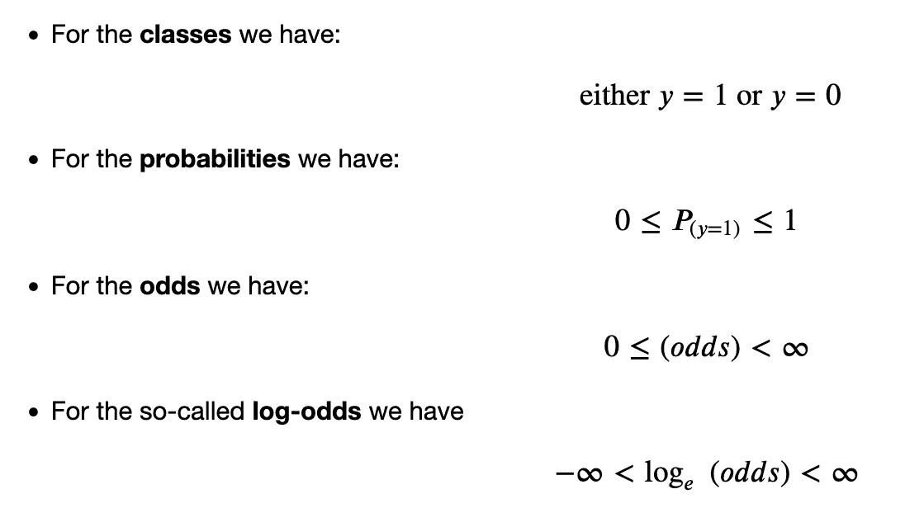**

> **对数赔率可以取任何正值或负值，logit 链接的[目的是取∞和∞之间协变量(因变量或响应值)的线性组合，并将其转换为概率范围，即 0 和 1 之间。](https://www.sciencedirect.com/topics/mathematics/logit-link-function)**

## **3.3:获取概率**

> **我们如何得出概率？用“逻辑”功能反转 logit 链接功能**

**logit 的反函数称为**逻辑函数**。**

**通过反转 logit，我们可以显式求解 *𝑃* ( *𝑦* =1):**

**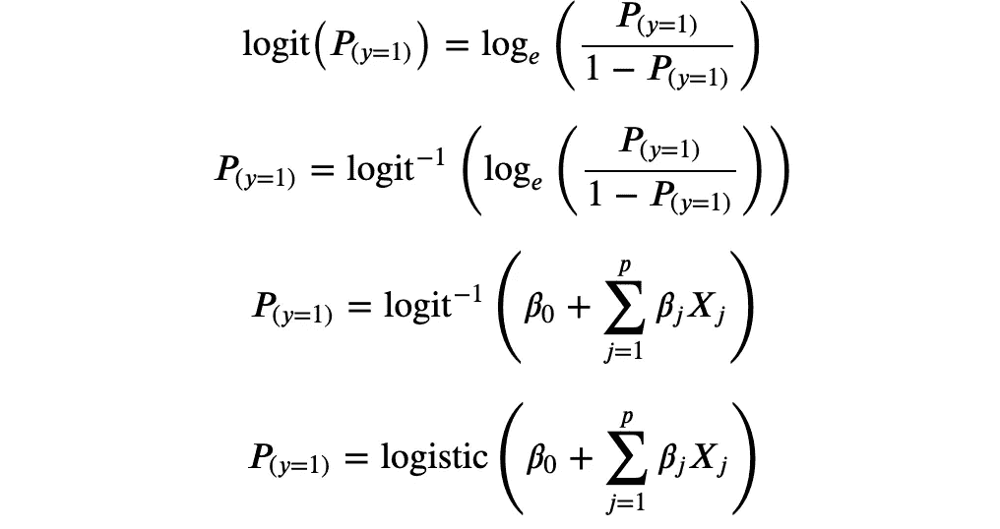**

**并且[逻辑函数](https://en.wikipedia.org/wiki/Logistic_function)是 sigmoid (S 形)函数，则最终方程可以写成:**

****

## **3.4:衍生—(可选)**

**为了推导我们如何从对数优势中获得概率，让我们设定**

**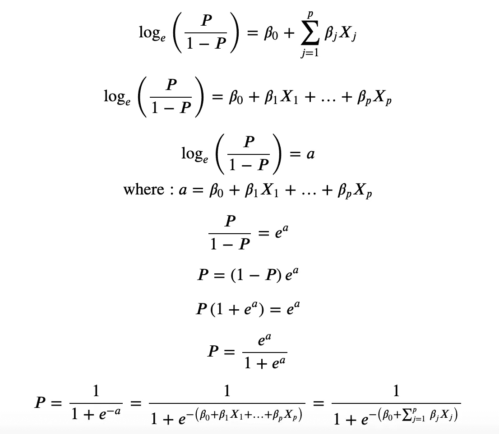**

## **3.5:从对数优势到概率的转换**

**让我们为这个转换创建一个图，如果我们可视化，它会更容易。把下面的代码抄在你自己的 jupyter 笔记本上，创造一个情节。**

**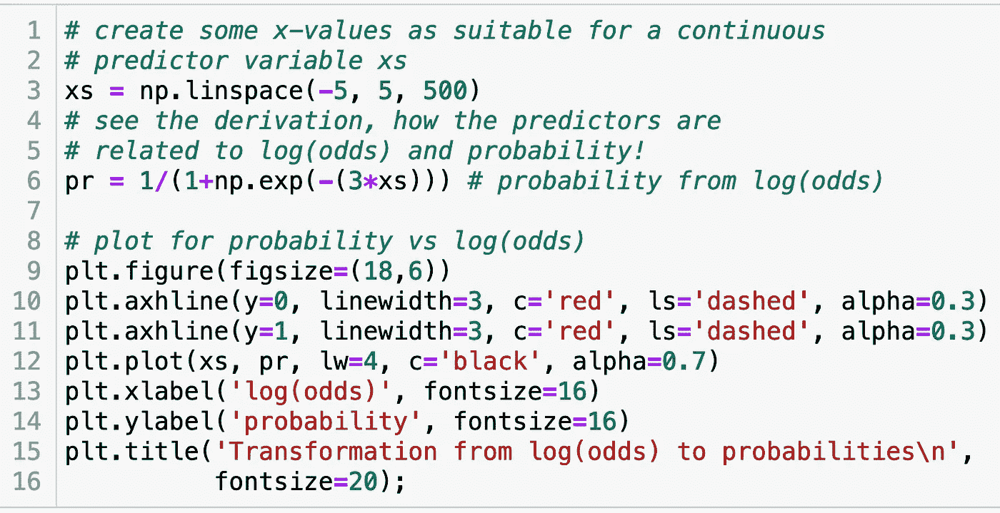****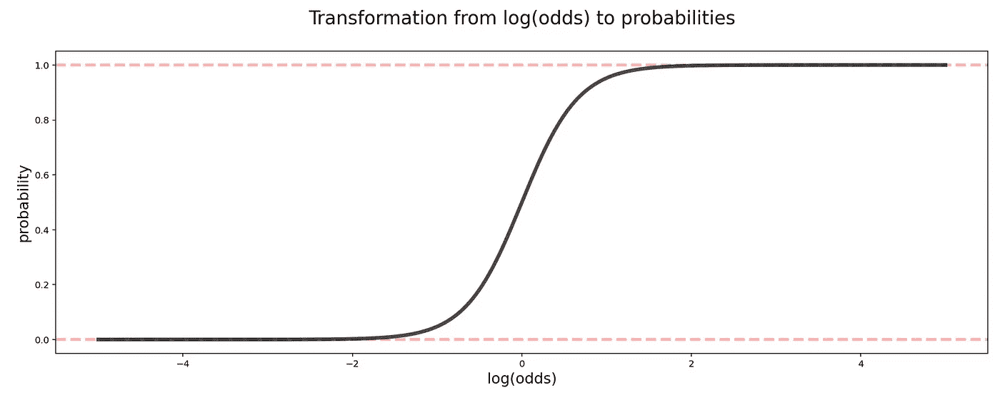**

# **5.4:逻辑回归实现**

## **4.1:数据及其概述**

**是时候实施我们所学的知识了，看看如何在商业中使用逻辑回归。**

**我们可以考虑这样一种情况，一所大学必须根据申请人的 GRE 和/或 GPA 来筛选入学申请人。该学院提供一些专业，代码在字段列中提供。我们尽量保持简单，只考虑几列:**

*   **`gre`:申请人的 GRE 成绩**
*   **`gpa`:申请人的平均绩点**
*   **`field`:学生申请的学习领域**
*   **`admit`:二进制 1-0 结果的目标栏显示学生是否成功**

***您可以直接从提供的 github 链接中读取数据，也可以下载并保存在您的机器上，然后开始工作。***

```
**url='[https://raw.githubusercontent.com/junaidqazi/DataSets_Practice_ScienceAcademy/master/admissions.csv](https://raw.githubusercontent.com/junaidqazi/DataSets_Practice_ScienceAcademy/master/admissions.csv)'# Let's read the data directly from the github 
adm = pd.read_csv(url)# Checking the head 
adm.head(2)**
```

**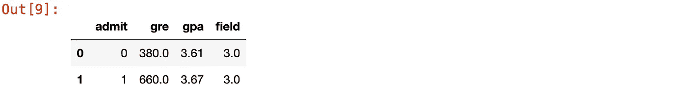**

**This how the data head look like. (output from the above code)**

```
**adm.info()**
```

**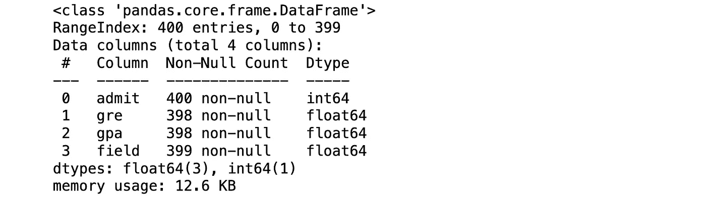**

**Overview of the data using info() on data frame**

**我们可以看到一些**缺失数据**，这是一个小数据集，我们也可以计算出数字。**

```
**# How much (%) data is missing
adm.isnull().sum()/len(adm)*100 # % of missing data**
```

**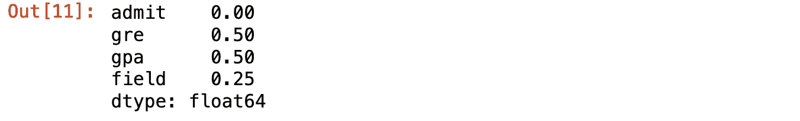**

**There is missing data but not much. (output from the code above)**

**嗯，只有一小部分数据丢失，我们可以忽略它！**

```
**adm.dropna(inplace=True) # inplace = True for the permanent change**
```

****> >让我们根据研究领域< <** 计算录取的概率和赔率**

```
**adm.field.value_counts() #unique()**
```

**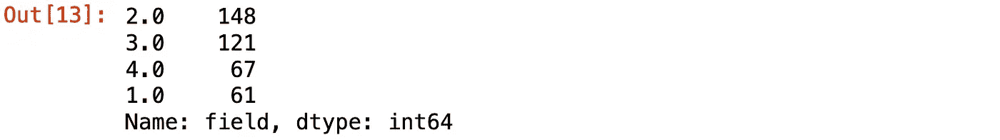**

**因此，我们总共有 4 个字段可供申请人使用，大多数学生都是在代码为 2 的字段中被录取的。让我们计算概率和录取几率！**

**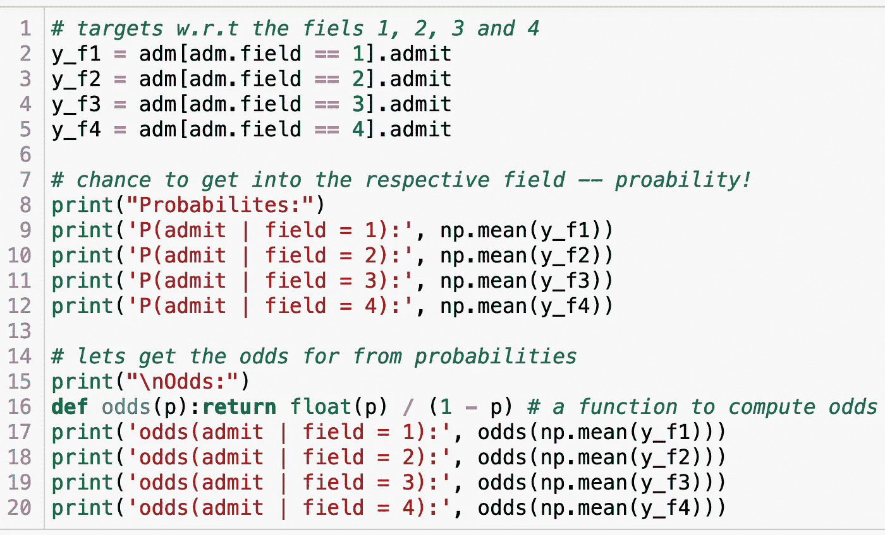****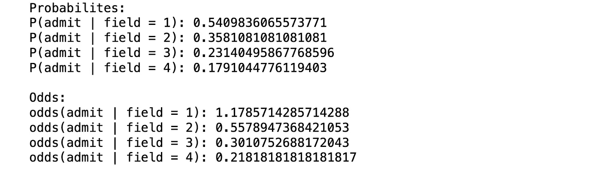**

**Output from the above code >> probabilities and the odds for admission based on the filed of study.**

## **4.2:线性回归与逻辑回归——视觉比较**

**与线性回归类似，我们需要为逻辑回归创建实例，并在数据集上训练模型。一旦模型被训练，我们就可以获取模型系数、预测概率以及它们的标签。**

> **先把特性标准化吧。这也很重要，因为 Scikit-learn 在默认情况下实现逻辑回归时应用了`l2`正则化。**

**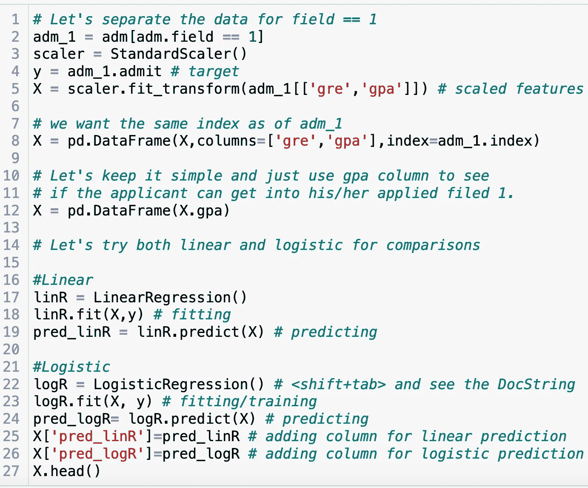****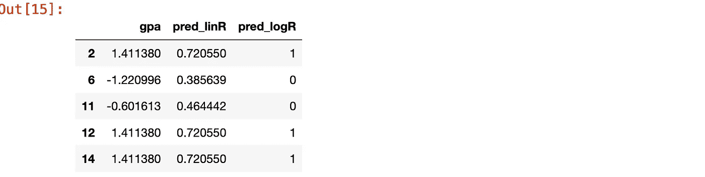**

> **我们在 X 中的特征(gpa)是标准化的(0 均值 1 方差)，因此`*gpa=0*`表示平均值`*gpa*`并且`*gpa=1*`表示比平均值大一个标准差的值，平均值为 0。**

**因此，我们从上述数据框架中的线性回归和逻辑回归模型中获得了预测，让我们将它们绘制出来以进行可视化。**

**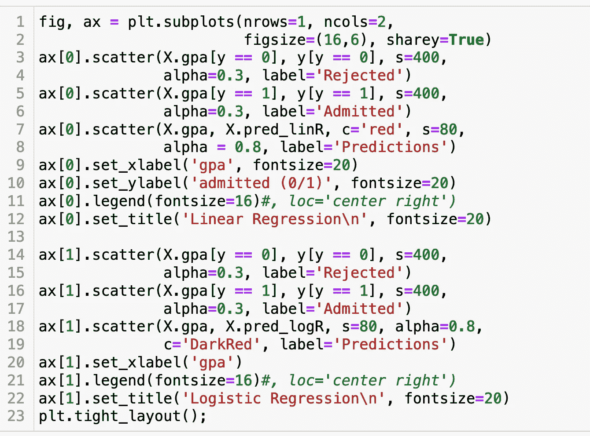****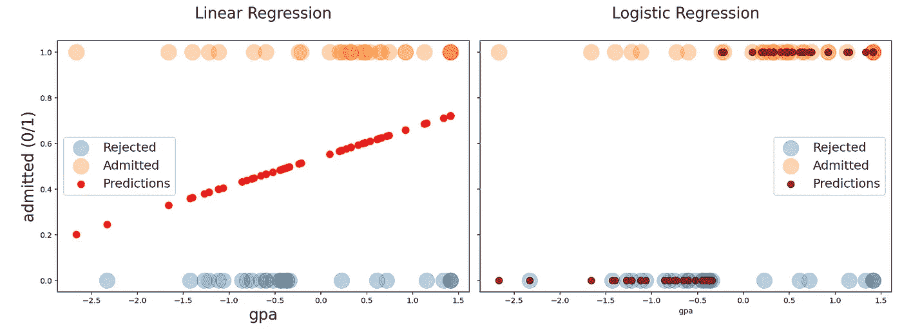**

**On left, in red, we got predictions from linear regression <<>> on right, the dark red are predictions from logistic regression — — which one makes sense to you?**

**因此，我们可以看到，在左边的线性回归图中，预测没有任何意义。**

**右边的图，使用逻辑回归解决问题和类预测有意义。**

## **4.3:决策界限**

*****(赔率、概率、系数、截距和特征)*****

**让我们看看，对于什么样的 **gpa** 值， **log odds 为 0** :**

**我们可以从下面的等式手动计算**

***> > > > log(赔率)= b_0 + b_1 x***

**我们需要的是 *x* 的值，其中*log(odds)= 0*
*>>>>0 = b _ 0+b _ 1 x
>>>>-b _ 0 = b _ 1 x
>>>>-b _ 0/b _ 1 = x*** 

**所以 *x* 就是 *log(odds) = 0* 的值**

**嗯，我们不需要手动这样做，我们可以从我们训练好的逻辑回归模型 **logR** 中抓取 *b_0* 和 *b_1* ，并计算出 *log(odds) = 0* 的决策边界**

> **请阅读下面代码中的注释并查看输出，您需要花费一些时间来获得完整的理解。**

**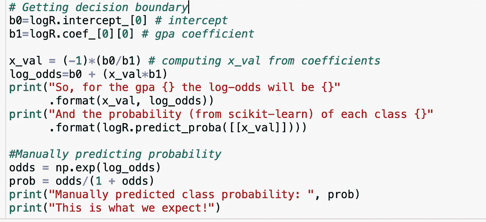****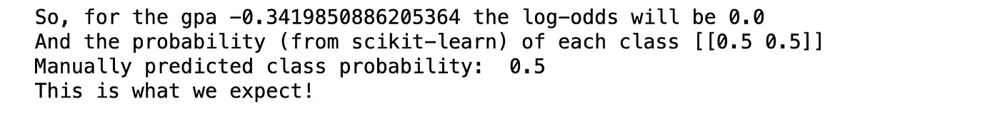**

**So, we got the value of gpa where log(odds) = 0.**

**让我们继续，想象边界和数据以及预测。**

**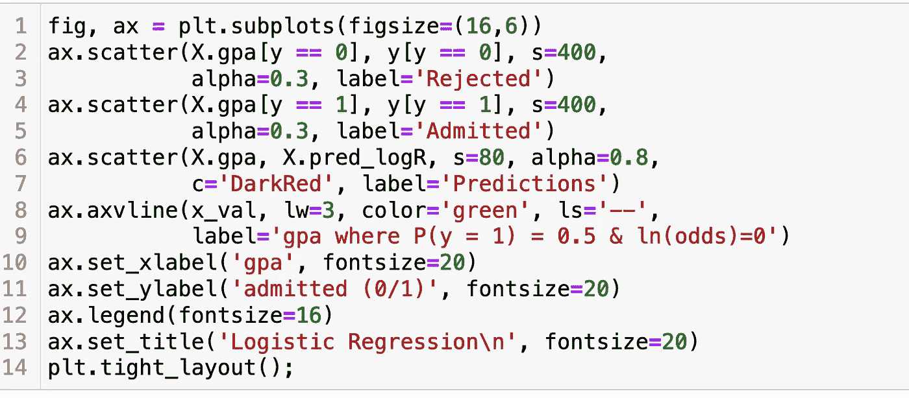****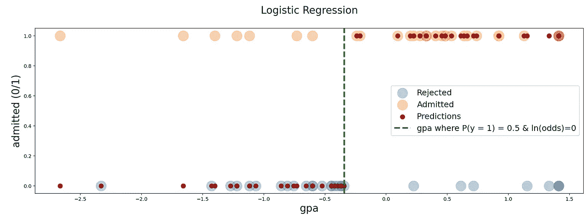**

**Green dashed line is the value of gpa where log(odds)=0**

**我们可以预测数据的概率，以得到逻辑曲线并绘制在上面的图上。让我们完成它。**

```
**# Generating Data for the curve 
x_vals = np.linspace(-10.,10.,3000)
y_pp = logR.predict_proba(x_vals[:, np.newaxis])[:,1]#plotting the probabilities (black cure)
ax.plot(x_vals, y_pp, color=’black’, alpha=0.7, lw=4)# adding blue line for probability cut-off (0.5)
ax.axhline(0.5, lw=3, color=’blue’, ls=’ — ‘, label=’probability = 0.5')
fig**
```

**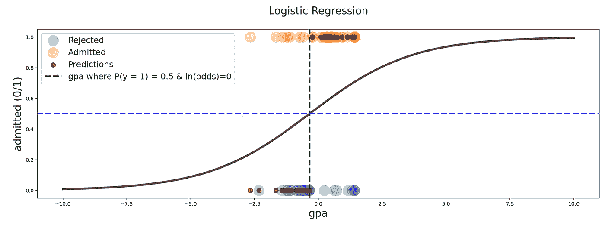**

**Please see the labels for respective curves.**

## **4.4:系数的解释**

**万一你想从训练好的 logistic 回归模型中看到 B0 和 B1 系数值！**

```
**print(“The logistic regression beta’s are:”)
print(“beta_1 = {} and beta_0 = {}.”.format(logR.coef_[0][0], logR.intercept_[0]))**
```

****

****> >日志中贝塔系数的含义< <****

**系数对对数优势有线性影响(回想一下公式)。**

*   **如果 *𝛽_* 1 是 0，那么 *𝛽_* 0 代表一个平均绩点学生被录取的对数几率。**
*   ***𝛽_* 1 是重标 gpa 单位增长对录取几率的影响。**

****对数赔率很难解读**。幸运的是，我们可以应用逻辑变换来获得不同 *𝛽* 值下的导纳概率。**

**从上图的曲线中，我们可以看到，平均值的 2 到 3 个标准偏差内的`gpa`值导致入院概率几乎呈线性增加。**

**当曲线变得非常平坦时，非常向左或向右的值几乎不会进一步增加或减少接纳的概率(s 形曲线)。**

*****逻辑回归系数可以进行指数运算，得到*** 、 ***的比值比，这样更容易解读这些系数。我们将在下节课中尝试使用泰坦尼克号数据集。与此同时，探索这些链接可能是有用的:*****

*   **[解释系数—逻辑回归中的奇数比率](https://stats.idre.ucla.edu/other/mult-pkg/faq/general/faq-how-do-i-interpret-odds-ratios-in-logistic-regression/)**
*   **[对数回归系数求幂](https://stats.stackexchange.com/questions/35013/exponentiated-logistic-regression-coefficient-different-than-odds-ratio)**

# **5.模型评估**

## **5.1:基线精度**

**基线精度是非常重要的计算，在我们评估训练模型的性能时非常重要。**

> *****基线精度*** *:模型通过简单猜测每次观测的多数类所能达到的精度。***

> **`***baseline_accuracy = majority_class_N / total_N***`**

**典型的人类猜测倾向于认为在二进制分类问题中，两个类的准确率为 50%,机会相等。事实上，如果我们有相同比率的两个类，或者在多类分类问题中，如果我们有构成大约 50%标签的多数类，这只是偶然猜测。**

> ***> >经验之谈；基线精度绝不能低于 50% < <***

**在现实生活中的二元类问题中，大多数时候，数据集并不是真正平衡的，我们的基线准确率高于 50%。例如，在 100 个观察值中，如果 70 个属于第 1 类，30 个属于第 0 类，则基线精度为 70%。创建一个精度低于基线的模型并不是我们真正想要的！**

> ***如果 99%的观察值(极度不平衡的数据)属于第 1 类，那么预测其中 99%正确的模型是随机执行的。高质量的数据很重要，99%准确率的模型可能是最差的模型！***

```
**# Well, we can easily find the baseline accuracy using value_counts()!
y.value_counts(normalize=True)**
```

****

**因此，在我们的数据集中，多数类是 1，有 54%的观察值，这是我们工作示例中的基线精度！**

```
**baseline_acc = y.value_counts(normalize=True).values[0]*100
print(“Baseline accuracy is: “, baseline_acc)**
```

****

## **5.2:混淆矩阵**

**回想一下上节课的幻灯片[中的混淆矩阵或错误矩阵，让我们首先手动计算混淆矩阵，然后我们将使用 using](https://junaidsqazi.medium.com/a29-logistic-regression-part-1-theory-slides-lecture-8c8fcd3dc98d) [scikit-learn](https://scikit-learn.org/stable/modules/generated/sklearn.metrics.confusion_matrix.html) 来实现这一目的。**

```
**# Manually calculate confusion matrix metrics for our model, we need predictions from the model first. predicted = logR.predict(np.array(X['gpa']).reshape(-1,1))# Manually calculating confusion matrix
tn = np.sum((y == 0) & (predicted == 0))
tp = np.sum((y == 1) & (predicted == 1))
fp = np.sum((y == 0) & (predicted == 1))
fn = np.sum((y == 1) & (predicted == 0))
print("tn:", tn) 
print("tp:", tp)
print("fp:", fp)
print("fn:", fn)
print("Number of classification errors (fp+fn):", fp+fn)**
```

**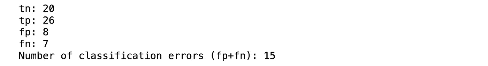**

**让我们使用 scikit-learn 来获得混淆矩阵…！**

```
**#Verify from sklearn’s metrics.confusion_matrix
# We need this import 
from sklearn.metrics import confusion_matrix
print(confusion_matrix(y, predicted))#,labels=[1,0])) # Try labels yourself**
```

**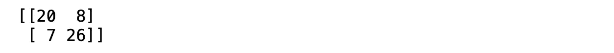**

**Our confusion matrix using scikit-learn, the numbers are same as computed manually above.**

## **5.3:分类报告**

**分类报告有助于诊断分类器的有效性。**

**sci kit-learn '`[metrics.classification_report](https://scikit-learn.org/stable/modules/generated/sklearn.metrics.classification_report.html)`返回三个非常有用的评估指标的报告；`***precision, recall and f1-score***`两个班(如果有多班问题，则为多个班)上的“T2”是指每个班的观察总数。**

*   **每个单独类的 0 行和 1 行**
*   **加权平均行，顾名思义，给出了两个类的加权平均。**

```
**from sklearn.metrics import classification_reportprint(classification_report(y, predicted))**
```

**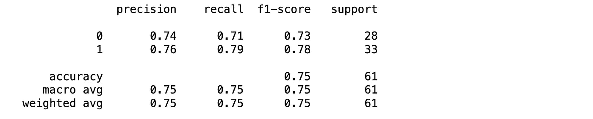**

## **5.4:更改预测阈值**

**分类器的预测默认为猜测具有最高预测概率的类。这必然导致最高可能的准确度(**只是训练数据的保证！**)。**

**然而，事实上，最大限度地提高精度并不是我们的最终目标。考虑以下场景:**

> **C ***癌症检测:*** *基于一些医学测量，我们开发了一个分类模型(分类器)来检测一个人是否患有癌性肿瘤。与 60%的基线准确度相比，该分类器的准确度为 96%。***
> 
> **> > >我们的分类器性能很好，但是在这种情况下，仅仅最大化准确度会有什么问题呢？**
> 
> ****> > >认为回到混乱矩阵的目标应该是在还来得及治疗癌症患者之前。****

# **6.最后一句话**

**逻辑回归是一个非常受欢迎和有吸引力的机器学习分类器，原因有很多:**

*   **与线性回归具有相似的性质**
*   **非常快速高效**
*   ****系数**是可解释的(尽管有些复杂):它们**表示由于输入变量**导致的对数比值的变化**
*   **也可以在少量观察中表现良好**

> **一般来说，在与其他竞争监督机器学习算法进行比较时，逻辑回归被认为是低端的。**

# **7.额外材料——供您闲暇时阅读！**

**在这一部分，我们将修正一些重要的统计概念。我们还会得到一些有用的图来理解概率、几率、对数几率、统计检验、幂分析等等概念。**

## **7.1:假设检验与混淆矩阵**

**在假设检验的上下文中`false positives`和`false negatives`分别被称为`Type I`和`Type II`错误。**

*   ****第一类错误是错误拒绝原假设**，而事实上原假设为真。这相当于分类中的假阳性率:> >一个模型将一个观测标注为“真”而实际上它是“假”的比率。**

****I 型**误差直接对应 p 值:**p 值是错误拒绝零假设的概率。****

*   **另一方面，II 型错误直接对应于假阴性。假设检验中的第二类错误是接受零假设，而事实上另一个假设是真的。**

> ****统计显著性**和**统计功效**是两个基本概念，你可以从任何基础统计学书籍中读到更多。**

## **7.2:建筑分类报告**

## ****> > 7.2.1:准确率和误判率< <****

> **`***accuracy = (tp + tn) / total_population***`**

**只是猜对的比例，不分阶级。**

> **`***misclassification_rate = (fp + fn) / total_population***`**

**只是一个和准确度的区别。**

```
**from sklearn.metrics import accuracy_scoretotal_population = tp + fp + tn + fnprint(“Manually canculating score: “, 
 float(tp + tn) / total_population) # manual
print(“scikit-learns accuracy_score module: “, 
 accuracy_score(y, predicted)) # scikit-learns matrix
print(“model’s score function: “, 
 logR.score(np.array(X[‘gpa’]).reshape(-1,1),y))
print(“Three options returing the same results.”)**
```

**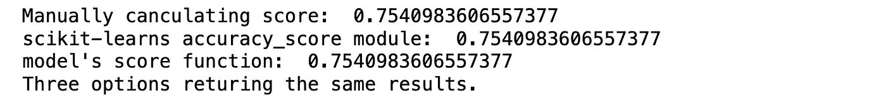**

****>><<**[维基](https://en.wikipedia.org/wiki/Accuracy_paradox)**

**准确度是一个非常直观的指标——我们可以想到一个考试分数，在那里我们得到`total_correct/total_attempted`。然而，在应用中，精确度通常是一个很差的指标。这有许多原因:**

*   **基线中 95%阳性的不平衡数据即使没有预测能力也有 95%的准确性。**
*   **这就是悖论；追求准确性往往意味着预测最普通的类，而不是做最有用的工作。**

**按照正确的顺序排列预测比让它们正确更重要。**

**在许多情况下，我们需要知道一个肯定和否定的确切概率，例如:**

*   **来计算预期收益。**
*   **对临界阳性的观察结果进行分类(决定治疗顺序的紧急程度)。**

****解决这些问题的一些最有用的指标是:****

****> >分类精度/误差< <****

*   **分类准确度是正确预测的百分比(越高越好)。**
*   **分类误差是不正确预测的百分比(越低越好)。**
*   **最容易理解的分类标准。**

****> >混淆矩阵< <****

*   **让我们更好地了解分类器的性能。**
*   **允许我们计算`sensitivity, specificity`和许多其他指标，这些指标可能比准确性更符合我们的业务目标。**
*   **`Precision`和`recall`有利于平衡误分类代价。**

****>>【ROC 曲线与曲线下面积(AUC)】<<****

*   **适用于排序和优先级问题。**
*   *****允许我们在所有可能的分类阈值*** 上可视化我们的分类器的性能，从而有助于选择一个阈值`appropriately balances sensitivity and specificity`。**
*   **当存在高类别不平衡时仍然有用(不同于分类准确度/误差)。**
*   **当有两个以上的响应类时更难使用(多类-尝试一个对所有！).**

****>><<****

*   **当精确校准的预测概率对您的业务目标很重要时最有用。**
*   **期望值计算**
*   **按性质分类**

**所有这些都可以很容易地用 Python 计算出来，知道我们在寻找什么是很重要的。**

## ****> > 7.2.2:精度/阳性预测值< <****

> **`***precision = tp / (tp + fp)***`**

**分类器精确*的想法*与精确*的想法*略有不同。**

***Precision 仅是对其正类预测正确性的度量，而 accuracy 是对所有猜测正确性的度量。***

```
**from sklearn.metrics import precision_scoreprint(“Precision using scikit-learn:”, 
 precision_score(y, predicted))
print(“Precision computed manually: “, 
 float(tp) / (tp + fp))**
```

****

## ****> > 7.2.3:召回率/敏感度/真阳性率(TPR) < <****

****召回**测量出真实标签为阳性的所有时间，预测标签也为阳性。**

> **`***recall = tp / (tp + fn)***`**

**这也称为**灵敏度**或**真阳性率**。这三个名字指的是同一个量。**

```
**from sklearn.metrics import recall_scoreprint(“Recall using scikit-learn: “, recall_score(y, predicted))
print(“Recall manual calculations: “, float(tp) / (tp + fn))**
```

****

**`***Precision***`可以看作是`***quality***`的度量，`***recall***`可以看作是`***quantity***`的度量。**

## ****> > 7.2.4:假阳性率(FPR) < <****

**或者，假阳性率测量真实标记为阴性的所有时间，预测标记为阳性。**

> **`***fpr = fp / (tn + fp)***`**

```
**##Calculate the FPR using the confusion matrix cells.
print(“FPR: “, float(fp) / (tn + fp))
# alternative way to calculate the same
print(“FPR:”, 1 — recall_score(y==0, predicted==0))**
```

****

****> > 7.2.5:特异性/真阴性率(TNR) < <****

> **`***specificity = tn / (tn + fp)***`**

**回想一下，这是一个姐妹指标，测量的是相同的，但都是积极的。**

**测量真实标签为阴性的所有时间，预测标签也为阴性。**

```
**specificity = float(tn) / (tn + fp)
print(“Manually: Specificity / True Negative Rate (TNR)”, specificity)# alternative way to calculate the same
print(“Specificity / True Negative Rate (TNR) Using recall_score module: “, recall_score(y==0, predicted==0))**
```

**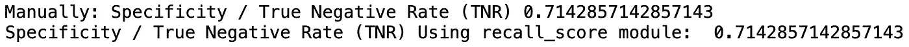**

## ****>>7 . 2 . 6:F1-得分< <****

**F1 分数是**精度**和**召回**指标的[调和平均值](https://en.wikipedia.org/wiki/Harmonic_mean)。**

****

***F 值的最高可能值是 1.0，表示完美的精度和召回率，如果精度或召回率为零，则最低可能值是 0。***

```
**from sklearn.metrics import f1_score# Manual calculation
precision_1 = float(tp)/(tp+fp)
recall_1 = float(tp)/(tp+fn)
f1_1 = 2/(1/recall_1+1/precision_1)
print(“F1-Score: “, f1_1)
# using scikit-learn
print(“F1-Score: “, f1_score(y==1, predicted==1))**
```

**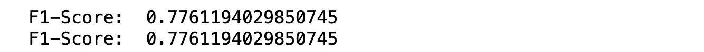**

*****将两者融合是有用的。*** *通过将两者结合起来，我们可以衡量分类器发现阳性标记观察结果的能力，以及对这些标记上的识别错误的容许程度。***

## **>>批评者<<**

**It is also important to consider that f1-score have been criticized by well know statisticians/scientists.**

*   **In their paper [《关于使用 F-measure 评估记录链接算法的说明》](https://link.springer.com/article/10.1007/s11222-017-9746-6)，2017 年出版，[戴维·汉德](https://en.wikipedia.org/wiki/David_Hand_(statistician))和[彼得克里斯滕](https://researchers.anu.edu.au/researchers/christen-pj#publications)批评使用 f1-score，因为在等式中对精度和召回同等重要。实际上，不同类型的错误分类会导致不同的代价。在他们的研究中，他们表明 f-measure 也可以表示为精度和召回率的加权和，这种分配给精度和召回率的相对重要性应该是问题的一个方面。**

**其他一些阅读材料也很有用:**

*   **由 Davide Chicco 和 Giuseppe Jurman 于 2020 年发表— [马修斯相关系数(MCC)相对于 f1-score 的优势以及二分类评估的准确性](https://www.ncbi.nlm.nih.gov/pmc/articles/PMC6941312/pdf/12864_2019_Article_6413.pdf)。**
*   **[MCC 最初发表于 1975 年](https://www.sciencedirect.com/science/article/abs/pii/0005279575901099?via%3Dihub)由生物化学家[布莱恩·马修斯](https://en.wikipedia.org/wiki/Brian_Matthews_(biochemist))测量二元分类的质量。**
*   **由 David Power 于 2011 年— [评价:从精度、召回率和 F-measure 到 ROC、信息量、标记性和相关性](https://dspace.flinders.edu.au/xmlui/bitstream/handle/2328/27165/Powers%20Evaluation.pdf?sequence=1&isAllowed=y)。他认为 [kappa](https://en.wikipedia.org/wiki/Cohen%27s_kappa) 和相关性是对称的，而 f1-score 忽略了真正的负值，这对于不平衡的类是误导的。**

## **7.3:求解贝塔系数**

**逻辑回归最大化了预测概率给出正确类别的可能性。**

****为此，**考虑所有数据点的预测概率的乘积*(这被称为* ***似然函数*** *，它是每类预测概率的* ***联合概率分布****)*:**

****

**选择 *𝛽* 系数，使**函数最大化**。**

**最佳情况是**

*   **所有第一类观察的预测概率实际上是 1**
*   **所有零类观测值的预测概率实际上为零**

***贝塔系数没有线性回归那样的封闭解，贝塔系数是通过优化程序找到的。***

**如果您对数学特别感兴趣，这两个资源很好:**

**[一篇关于 logistic 回归 beta 系数推导的好博文。](http://www.win-vector.com/blog/2011/09/the-simpler-derivation-of-logistic-regression/)**

**[这篇论文也是很好的参考。](https://www.stat.cmu.edu/~cshalizi/402/lectures/14-logistic-regression/lecture-14.pdf)**

## **7.4:几个功能的说明**

## **> > 7.4.1:概率 vs 赔率<<**

```
**# Function to calculate the odds of success.
def odds(p):return(p/(1-p))# Generating a range of probabilities.
probabilities=np.linspace(0.001,0.99,200)# Generate list of odds.
odds_list = [odds(proba) for proba in probabilities]# Create figure.
plt.figure(figsize=(18,6))# Plot blue line for odds as probability goes from 0.1% (0.001) to 99% (0.99).
plt.plot(probabilities,odds_list,lw=4,color=’DarkBlue’)# Plot red dashed line to visualize odds when probability is 50%.
plt.vlines(0.5,0.0,100,ls=”dashed”,lw=3,color=’DarkRed’)
plt.text(0.33,50.0,”odds(P=0.5) = 1",fontsize=18,color=’DarkRed’)# Plot orange dotted line to visualize odds when probability is 66.67%.
plt.vlines(0.6667,0.0,100,ls=” — “,lw=3,color=’DarkOrange’)
plt.text(0.68,50,”odds(P=2/3) = 2",fontsize=18,color=’DarkOrange’)# Annotate blue line when probability is 100%.
plt.text(0.84,100,”odds(P=1) = $\infty$”,fontsize=18,color=’DarkBlue’)# Title, labels…..1
plt.title(“If the probability of success is 50%, then the odds of success are 1.\n\
If the probability of success is 100%, then the odds of success are $\infty$.”, 
 ha=’left’,position=(0,1), fontsize=18)
plt.xlabel(“Probability (P)”,fontsize=20)
plt.ylabel(“Odds”,fontsize=20);**
```

****

## **> > 7.4.2:赔率的对数—对数赔率<<**

```
**# Creating some positive x-values as suitable for odds
odds = np.linspace(start=0.001, stop=5, num=500) 
# if start=0 ==> RuntimeWarning: divide by zero encountered in log below 
log_odds = np.log(odds)plt.figure(figsize=(18,6)); plt.axhline(y=0, linewidth=3, 
 color=’DarkRed’, ls=’ — ‘, alpha=0.4)
plt.plot(odds, log_odds, lw=4, color=’DarkBlue’, alpha=0.7)
plt.xlabel(‘odds’, fontsize=16); plt.ylabel(‘log(odds)’, fontsize=16)
plt.title(‘Transformation from odds to log(odds)\n’,fontsize=18);**
```

**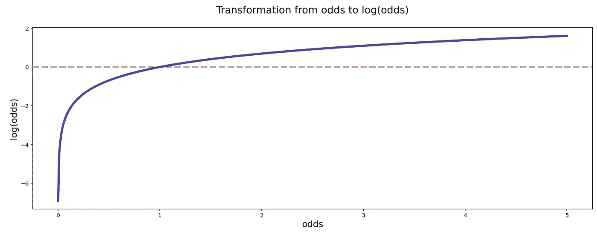**

**log-odds can take any value between −∞ and ∞**

## **>> 7–4–3)概率的对数<<**

```
**# Creating some x-values between 0 and 1 as suitable for probabilities
pr = np.linspace(start=0.001, stop=0.999, num=500) # p_min=0, p_max=1
log_it = np.log(pr/(1-pr)) # odds=P/1-Pplt.figure(figsize=(18,6)); plt.axhline(y=0, linewidth=3, color=’DarkRed’,
 ls=’ — ‘, alpha=0.4)
plt.plot(pr, log_it, lw=4, color=’DarkBlue’, alpha=0.7)
plt.xlabel(‘P’, fontsize=16); plt.ylabel(‘log (P/(1-P))’, fontsize=16)
plt.title(“Transformation from probability to — log (P/(1-P)) — \n”,
 fontsize=18);**
```

**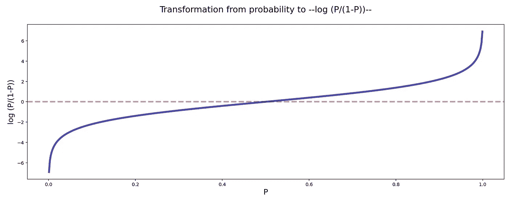**

## **7.5: Additional Resources**

*   **[逻辑回归视频演练](https://www.youtube.com/watch?v=zAULhNrnuL4&noredirect=1)**
*   **[逻辑回归预排](http://www.mc.vanderbilt.edu/gcrc/workshop_files/2004-11-12.pdf)**
*   **[使用 Statsmodels 的逻辑回归—孟加拉国的油井转换](http://nbviewer.ipython.org/urls/raw.github.com/carljv/Will_it_Python/master/ARM/ch5/arsenic_wells_switching.ipynb)**
*   **0 和 1 不是概率**
*   **[零假设](https://www.statisticshowto.com/probability-and-statistics/null-hypothesis/#state)**
*   **[假设检验](https://www.statisticshowto.com/probability-and-statistics/hypothesis-testing/)**
*   **[Python 中的统计功耗和功耗分析](https://machinelearningmastery.com/statistical-power-and-power-analysis-in-python/)**

## **> > ROC —提醒一下，我们接下来将介绍:<<**

*   **A deeper [ROC 简介](http://people.inf.elte.hu/kiss/13dwhdm/roc.pdf)**
*   **互动[玩 ROC 曲线](http://www.navan.name/roc/)**
*   **数据学校在 [ROC/AUC](http://www.dataschool.io/roc-curves-and-auc-explained/) 上的视频和文字记录**
*   **观看 Rahul Patwari 在 ROC 曲线上的[视频](https://www.youtube.com/watch?v=21Igj5Pr6u4)**

## **7.6:统计测试、功效分析和样本量**

****> >统计测试< <****

*****逻辑回归是少数几个我们可以获得全面统计数据的机器学习模型之一。*** 通过执行假设检验，我们可以了解我们是否有足够的数据来对单个系数和模型整体做出有力的结论。statsmodels 是一个非常有用的 Python 库，只用几行代码就可以提供这些统计数据。**

****> >力量分析< <****

**正如我们可能会怀疑的，许多因素会影响逻辑回归结果的统计显著性。估计样本大小以检测给定置信度下给定大小的影响的技术称为功效分析。[阅读本链接描述的最后一段:](https://en.wikipedia.org/wiki/Power_of_a_test#Description)**

**影响我们最终模型准确性的一些因素有:**

*   **期望的统计显著性(p 值)**
*   **效果的大小**
*   **从噪音中分辨出一个小的影响是比较困难的。因此，需要更多的数据！**
*   **测量精度**
*   **抽样误差**
*   **在较小的样本中更难检测到影响。**
*   **试验设计**

**所以，很多因素，除了样本数量，都有助于产生*的统计功效。因此，没有更全面的分析，很难给出一个绝对数字。***

*****>>II 型错误< <*****

***I 型误差对应于 [***的概念***](https://en.wikipedia.org/wiki/Statistical_significance)***

***第二类错误对应于 [***的概念***](https://en.wikipedia.org/wiki/Power_of_a_test) ***。******

***测试的力量在于:***

******

***更直观地说，**能力衡量的是我们察觉一种存在的效果的能力。表示避免第二类错误的概率。*****

******统计功效的范围从 0 到 1，随着它的增加，犯第二类错误(错误地未能拒绝零假设)的概率降低。******

***我们可以将重要性、功效和错误类型的概念形象化为一个矩阵，与上面的混淆矩阵相同:***

******

*   ***alpha 是任何假设检验中第一类错误的概率——错误地拒绝零假设。***
*   ****beta* 是任何假设检验中第二类错误的概率——错误地拒绝零假设。***

*****> >需要多少样品？<*****

***我们经常问，我们的数据集应该有多大才能得到合理的逻辑回归结果。下面，将介绍一些方法来确定最终模型的精确度。***

*****经验法则*****

*   *****快速:**总共至少 100 个样本。每个特征至少 10 个样本。***

***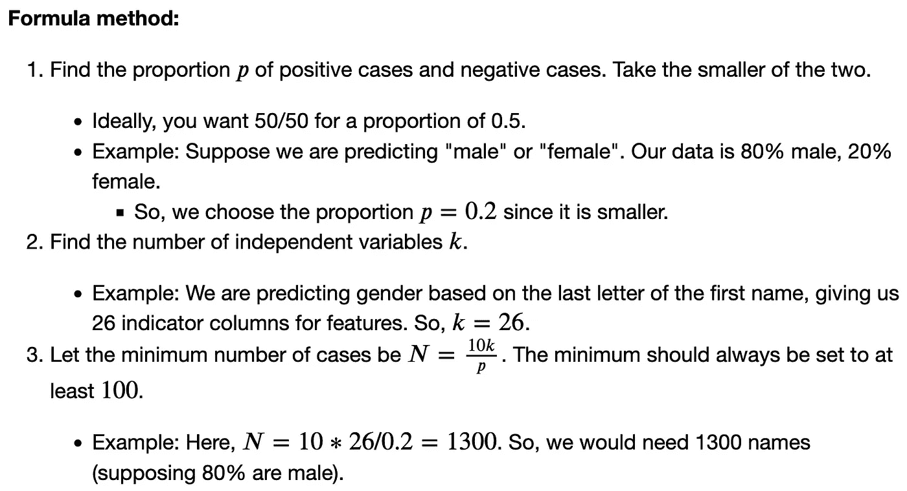***

> ***以上两种方法均来自于:> > > >*Long，J. S. (1997)的分类和有限因变量的回归模型*。千橡，加州:圣人出版社。***

> ***[💐点击这里关注我的新内容💐](https://junaidsqazi.medium.com)***
> 
> ***🌹坚持练习，提高和增加新技能🌹***

> ****✅🌹💐💐💐🌹✅* ***请鼓掌并分享> >*** *你可以帮助我们接触到正在努力学习这些概念的人。✅🌹💐💐💐🌹✅****

***祝你好运！***

> ****见* ***下期讲座*** *上****“A31:逻辑回归> >死或活> >循序渐进完成机器学习项目！”。******
> 
> ******注:*** *此完整课程包括视频讲座和 jupyter 笔记本，可通过以下链接获得:****

*   ***leanpub 上的书***
*   ***[*SkillShare link(新用户两个月免费)*](https://www.skillshare.com/r/user/junaidqazi)***
*   ***YouTube 上的免费视频***
*   ***科学院***

***[**关于朱奈德·卡齐博士:**](https://www.linkedin.com/in/jqazi/)***

> ***[***Junaid Qazi***](https://www.linkedin.com/in/jqazi/)*博士是学科专家，数据科学&机器学习顾问，团队建设者。他是专业发展教练、导师、作家、技术作家和特邀演讲者。* [***卡齐博士***](https://www.linkedin.com/in/jqazi/) ***可通过***[***LinkedIn***](https://www.linkedin.com/in/jqazi/)***获得咨询项目、技术写作和/或职业发展培训。******

*********[](/mlearning-ai/mlearning-ai-submission-suggestions-b51e2b130bfb) [## Mlearning.ai 提交建议

### 如何成为 Mlearning.ai 上的作家

medium.com](/mlearning-ai/mlearning-ai-submission-suggestions-b51e2b130bfb)***