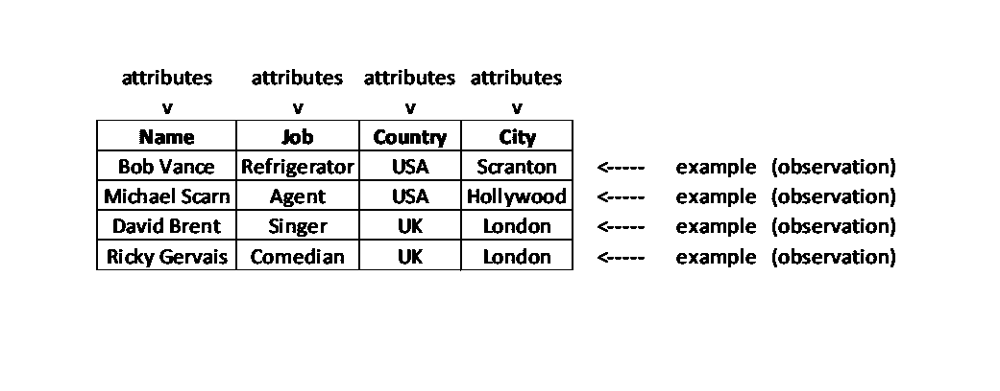
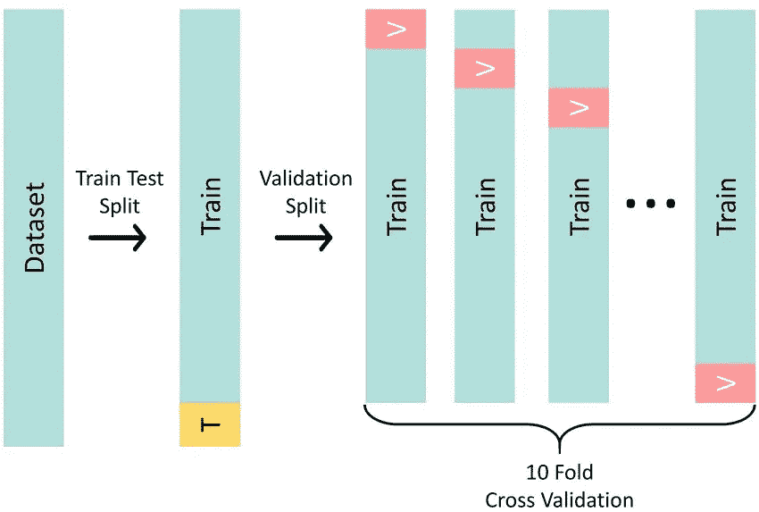
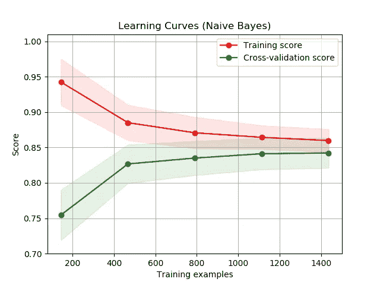

# 关于数据在机器学习中的重要性

> 原文：<https://medium.com/mlearning-ai/about-the-importance-of-data-in-machine-learning-ffa66657ee77?source=collection_archive---------2----------------------->

## 你一直想知道但不敢问的关于数据的一切

Photo by [ThisisEngineering RAEng](https://unsplash.com/@thisisengineering?utm_source=unsplash&utm_medium=referral&utm_content=creditCopyText) on [Unsplash](https://unsplash.com/?utm_source=unsplash&utm_medium=referral&utm_content=creditCopyText)

数据是存储和未处理的信息。我们生活在“数据时代”。每一秒，每一个地方，都在不断产生数据。据说每人每秒产生 1.7 MB 的数据。

对于 AI 或机器学习设备来说，数据是点燃它们的燃料，让它们持续工作。提供给他们的数据质量对于设备的良好服务非常重要。每一个学习设备的好坏取决于它所输入的数据。

我们先从数据术语说起；

# 术语

*   **直接数据**从一个来源收集并直接使用。
*   **间接数据**是指用于非收集目的的数据。

例如，在翻译应用程序中，输入是单词序列。这些发送到应用程序的字序列是直接数据。当在后端执行必要的操作时，可以从一些引用表、字典或数据库中的一些其他数据中获取应用程序。这些都是间接数据。

直接数据的来源和收集方式都很清楚。获得了准确的数据。但是，收集的数据量很难很大，通常只采集少量数据。访问数据时可能会有中断，数据可能并不总是准备就绪。

间接数据的量可能非常大。不间断访问是可能的。数据收集过程中可能出现的偏差或测量误差无法得知。

*   **静态数据**是固定的，采集后保持不变。它是历史的，它被存储在一个精确的时间里，并没有说任何关于现在的事情。
*   **动态数据**不断自我更新。当有更新时，整个数据集被转换。总是试图保持最新的信息。

你可以把你去年在公司做的演示想象成静态数据。这是你做演示那天的信息。当你今天看它的时候，它没有给出任何新的信息。把谷歌分析想象成动态数据。有一个关于你的网站产生的流量的持续的数据流。你得到的信息总是最新的。

*   **原始数据**是存储的原始数据。它可以是照片、word 文档或未处理的 IOT 信号。
*   **衍生数据**通过处理原始数据获得。使用了诸如合并和连接之类的操作。例如，通过映射多个 excel 文件中的一些列来创建新的大型 excel 文件。
*   **整理数据**是数据集的最终版本，可用于任何统计分析或机器学习项目。

我们收集原始数据，导出新的数据集，并对它们进行处理以获得整洁的数据。

*   **属性**:数据集中的特征或列。
*   **示例**:数据集中的观察值或行。

Attributes and examples. Image by the author.

在机器学习项目中，数据是分区的。

*   **训练数据**设置是最大的部分。学习算法使用它进行训练。
*   **测试数据**从算法训练中保留。它用于衡量训练模型的无偏成功。基于测试数据和实际标签的观察的模型的预测被比较。
*   **验证数据**集用于改进最终调整后的模型。模型的超参数通过验证数据集性能的评估来调整。它也用于避免过度拟合。

Train-test-validation split. [Source](https://www.researchgate.net/figure/Train-test-cross-validation-split-methodology-used-in-this-paper-The-first-operation_fig2_340567535)

数据分区过程必须满足一些条件。

*   除法运算应该应用于**原始数据**。数据处理操作应该分别应用于分割数据。这可以防止数据泄漏。
*   在分割之前先洗牌。
*   验证数据集和测试数据集具有相似的分布。
*   如果有几个相同的观察值，所有这些组应该在同一个分割中收集。否则，如果它们中的一个包含在训练数据集中，则模型从该观察中学习，并且错误地成功通过测试。

在实践中，70% — 15% — 15%或 80% — 10% — 10%的分流比是优选的。

# 数据收集

在数据收集过程中，出现了一些需要回答的问题。这些问题的答案揭示了一些关于数据和数据收集的参数。

你能访问你需要的数据吗？您要使用的数据是现有数据吗？我们是一次性使用，还是您可以续订？是购买的数据吗？受版权保护吗？在伦理上有问题吗？是符合个人资料法还是应该匿名？诸如此类的问题是你在访问数据时应该考虑的一些问题。

假设您已经解决了访问问题。您的下一个挑战是数据的可扩展性。您多久能够创建一次新数据？您的模型需要多少数据才能产生有用的结果，数据量有多大？

Learning curves vs Training examples. [Source](https://commons.wikimedia.org/wiki/File:Learning_Curves_%28Naive_Bayes%29.png)

通过利用学习曲线，您可以获得工作模型所需的数据量。如果模型性能在图上开始趋于平稳，我们可以推断添加新数据不会影响模型的性能。在这种情况下，我们要么没有提供足够信息的功能。因此，我们已经达到了数据集所能提供的最大信息量。在这种情况下，我们可以进行功能工程，或者专注于添加、发现或创建新功能。高原的另一个原因可能是我们使用的模型太简单了。我们可以转向更复杂的算法。

实际上，关于数据集的最小大小有一些经验法则。你应该有的最低限度的观察；

*   特征数量的 10 倍
*   100 或 1000 次的课
*   可训练参数的 10 倍

请记住，这些规则是非常普遍的假设。每个问题都有它自己的特点，所以它不可能在每种情况下都有效。

下一步是检查数据的**可用性**。数据集的质量如何？任何特征中是否有任何缺失值？如果有，比例是多少？每个特征的类型是否一致和正确？数据集有多整齐，有多原始？有重复的吗？如果问题是监督学习，班级分布均衡吗？还是一个类别分布不均衡的数据集？

数据集是否足够包容？例如，您将用于人脸识别系统的数据集中有足够多的种类吗？还是只有男性照片？

你必须**理解**你的数据。我们需要知道数据集中的要素与领域问题之间的关系。哪个特征给了我们关于问题的什么信息？

最后也是最关键和最基本的。数据**可靠吗**？假设您正在从物联网系统收集信号。测量系统可靠吗？它们是否得到了适当的维护，测试是否已经完成？如果你考虑到测量不正确的信号并建立一个模型，当你将模型投入生产时，它就会崩溃。

# 问题

获取数据是一项艰苦的工作。在这个过程中你很有可能会遇到一些问题。

获取标签数据通常是一项**昂贵的**任务。获取未标记的数据也是一项工作，但标记需要额外的努力。例如，我们想要准备一个关于街道上商店区域的数据集。我们在一辆车上装了一个摄像头，开着它在街上走，我们有很多图像数据。我们这里有商店的照片，所以我们有未标记的数据。但是，为了给商店的各个部分贴标签，我们要么将这项工作交给一名员工，她会以手动方式给它们贴标签。或者我们将开发一个自动标签系统，并将工作委托给它。如您所见，贴标作业将需要另一个作业。

在某些情况下，你的数据集可能是低质量的。例如，上面例子中提到的相机拍摄的照片质量很差，一些商店也显示失真的图像。或者是我们给标签工作的员工忽略了这项工作，标签工作充满了错误。

**噪音**。模糊的图像，扭曲的文本，淹没在论坛欢呼声中的对话录音，嘲弄的调查问卷，测量得出的碘信号。尤其是在小容量数据集中，噪声会导致过拟合。

你的数据集不够有表现力，它的预测能力非常低。你想向你的用户推荐合适的电影，但是你所拥有的唯一信息是用户的姓名和电子邮件地址。对不起，它不起作用。

你必须在实时应用程序中保持你的数据**是最新的**。你预测了第二天的比特币价格，并把这些信息作为服务卖给了你的客户。然而，第二天，美联储提高了利率。如果您不在数据集中更新此内容，您的下一次预测将会失败。

与这个话题相关的另一个问题是**概念漂移**。你定期提取数据并刷新你的模型，这也是可行的，模型的准确性不会改变太多。但是，数据集中的一个要素发生了概念上的转变。例如，某个年龄以下的人无法访问你的网站。因此，在这一时刻之后，年龄特征的分布将会改变。过一段时间，也许模型不会显示旧的性能。在这种情况下，应该启动新的学习研究，也许应该更新超参数。

**离群值**对一些算法影响相当大。创建数据集后，在特征工程阶段处理异常值。但是，如果可能的话，在数据集创建阶段对异常数据采取预防措施或应对措施是合适的。例如，我们可以在物联网系统中实现异常检测系统。它会过滤离群值。

## 偏见

偏倚是数据与领域问题的不一致。有不同类型的偏见。

当从总体中选择样本时，我们在选择中可能犯的错误可能会导致**选择偏差**。

这个问题最著名的例子之一发生在 1936 年美国总统选举期间。《文学文摘》杂志是当时著名的杂志之一。在艾尔弗·兰登和富兰克林·罗斯福的总统竞选中，他们通过询问读者的意见来进行民意调查。兰登在他们的邮寄民意测验中领先。但是当选举发生时，情况恰恰相反。罗斯福已经遥遥领先。

这里的问题是，杂志的读者群并不能反映全部人口。由于杂志的质量，被选样本中的人更多的是中上层阶级。然而，美国人口并不都处于相同的分布。例如，今天，我们甚至无法仅仅通过查看 Twitter 上的人数来想象特朗普会当选总统。

为了不遇到这样的错误，我们应该质疑我们是如何创建数据集的，以及我们是如何做出选择的。我们应该检查我们的样本在多大程度上覆盖了领域空间中的人群，以及它包括哪些场景，并尝试增加和改善这些问题的包容性。

另一种变化是**自我选择偏差**。例如，让我们考虑为一家餐馆写的评论。这里的评论不是随意的。反过来，在这里评论的人已经表明了在这里评论的决心。因此，这里的评论并不反映一般人群。

**抽样偏差**也是类似的情况。假设在一个多类问题中有 10 个不同的类。然而，其中两个类包含了 85%的数据集。该模型倾向于将每个输入分类为这两类中的一类。我们应该努力保持班级比例的平衡。

从数据集中遗漏一个重要特征是另一种类型的偏差，**省略变量偏差**。此处的更改会影响其他功能和模型的成功。

Socrates quotes. [Source](https://www.azquotes.com/quote/671716)

我们如何知道我们不知道的事情？在这种情况下，一个解决方案可能是从包含我们拥有的所有数据开始。我们应该深入研究特征的消除，并在模型中包含尽可能多的特征。当然，在这种情况下，我们的数据集可能非常稀疏。

调查中提出的问题应该是格式良好的。有必要问一些能促使被调查者回答的问题。如果受访者由于对问题的判断态度而不想回答某些问题，我们称之为**实验者** **偏差**的错误就发生了。

**如果测量装置有误差，会出现系统值失真**。例如，当太阳下山时，照相机显示绿色为黄色。测量仪器的维护和测试应完整。最佳解决方案是使用多种测量仪器。所以，我们可以交叉验证。

**偏见偏见**在历史来源的数据集中尤其明显。像性别不平等、种族主义等深层问题。如果我们正在处理这些类型的原始数据，我们可以欠采样或过采样必要的数据，或者完全删除它们。

还有一个概念叫做**资金偏向**。假设你在公共领域收集数据。一些机构可以通过资助这个公共空间来改变秩序。例如，一家电池制造商资助了一名记者，以便他可以不断地制作有关电动汽车的新闻，并通过这种方式创建一个议程。

在这种情况下，了解公司之间的关系并关注公共空间和议程是非常重要的。试图获得内部信息，如举报者或记者，也可以将研究引向成功。

在上面的例子中，我们的一名员工负责贴标签。考虑到这个人对他正在研究的主题有偏见，在这种情况下，在标记过程中会有**标记偏见**。

## 数据泄露

也称为目标泄漏是模型成功的一个非常关键的问题。简单来说，如果训练数据集是在训练过程中从外部泄露的，那就叫数据泄露。在这种泄漏的情况下，该模型学习该模型通常不应该知道的信息。在这种情况下，我们在测试环境中获得了成功的、乐观的模型。然而，该模型在发布到生产时表现不佳。

泄漏可能以多种不同的方式发生。三个最常见的原因是:

**目标是任何特征**的函数。在爱因斯坦著名的公式中，能量等于物质的质量乘以光速的平方。假设我们的目标是估算能量，但我们的数据集中也有大量信息。如果光速已经被认为是恒定的，这个模型将会非常成功地完成它的预测。然而，在这里，目标实际上已经通过质量泄漏。在这种情况下，我们无论如何都不需要开发机器学习模型。

E = mc2\. [Source](https://mc2haber.com/dunyaca-unlu-e-mc²-denklemi-nedir)

**特征是隐藏目标**。我们将预测性别，但数据集有一个名称特征。*迈克尔*已经是男的了。

Bankruptcy. [Source](https://laptrinhx.com/news/programming-memes-to-laugh-at-while-your-code-is-compiling-YqKEDYp/)

**有些功能来自未来！**这种泄漏的典型例子如下:

假设你试图预测客户是否会向银行偿还债务。您正在处理的数据集中有一个名为 *late_payment_reminder* 的功能。您也可以在模型中包含此特征。一切都很好，结果很好。但是一旦你的模型投入生产，它就失败了。

后来，你发现 late_payment_reminder 特性在生产中总是为零。因为银行在给客户任何贷款之前都在使用你的模型。所以，没有提醒。

# 数据质量

我们如何知道我们的数据有多好？质量数据具有某些属性。

*   好的数据足够信息丰富。
*   它充分概括了这个问题。
*   它反映了生产中的投入。
*   没有偏见
*   无泄漏或反馈回路
*   具有一致的标签
*   体积应该够了。

# 结论

数据越多越好。

正如我在开头提到的，数据是所有智能系统的燃料。数据管理通常比模型本身更重要。许多机器学习项目包括处理数据，而不是算法。

收集数据时应遵循一些标准做法。应该避免偏见。数据泄露是一个非常关键的问题，请注意。

目前就这些。感谢阅读到目前为止。欢迎给我写信或评论。

# 阅读更多内容…

 [## 如何处理缺失值？

### 处理丢失数据所需的一切

python .平原英语. io](https://python.plainenglish.io/how-to-handle-missing-values-ef4abd02673f)  [## 特征变换技术有哪些？

### 特征转换技术的浏览

python .平原英语. io](https://python.plainenglish.io/what-are-the-feature-transformation-techniques-ba594b523ec4)  [## 什么是异常值和异常值？

### 对异常世界的探索

python .平原英语. io](https://python.plainenglish.io/outliers-and-anomalies-210eefc51aa)  [## 最常用的特征选择方法

### 机器学习中常用特征选择方法的解释。

towardsdev.com](https://towardsdev.com/the-most-used-feature-selection-methods-c117273759f8)  [## 降维的详细目录

### 用 Python 语言解释的多种降维方法

medium.com](/mlearning-ai/a-detailed-catalog-of-dimensionality-reduction-ca33d6f2744) 

# 参考

安德烈·布尔科夫的机器学习工程

[https://as-ICT-RIA-Yves . weebly . com/direct-and-indirect-data . html](https://as-ict-ria-yves.weebly.com/direct-and-indirect-data.html)

[https://www . science . com/blog/static-vs-dynamic-data-in-B2B-sales](https://www.cience.com/blog/static-vs-dynamic-data-in-b2b-sales)

【https://www.jarad.me/consulting/2019/12/20/data 

[https://en.wikipedia.org/wiki/Selection_bias](https://en.wikipedia.org/wiki/Selection_bias)

[https://en . Wikipedia . org/wiki/1936 _ 美国 _ 总统选举](https://en.wikipedia.org/wiki/1936_United_States_presidential_election)

 [## 什么是数据质量，为什么它很重要？

### 数据质量是基于准确性、完整性、一致性等因素对数据状况的衡量

www.techtarget.com](https://www.techtarget.com/searchdatamanagement/definition/data-quality)  [## Mlearning.ai 提交建议

### 如何成为 Mlearning.ai 上的作家

medium.com](/mlearning-ai/mlearning-ai-submission-suggestions-b51e2b130bfb)