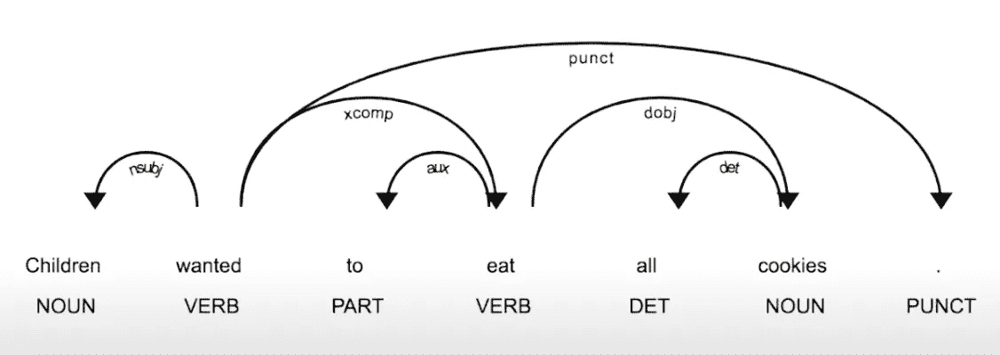
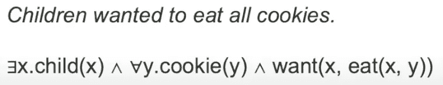
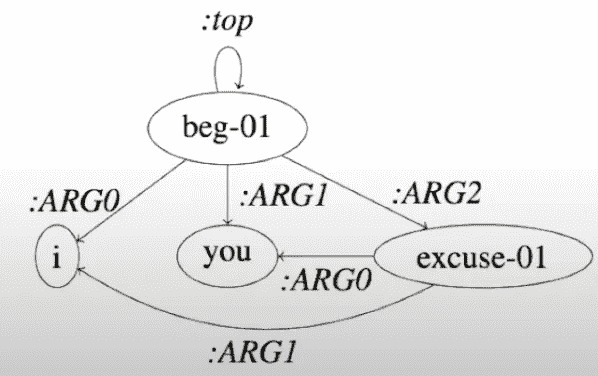
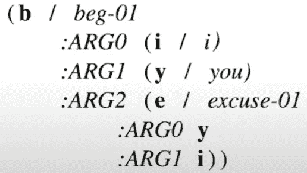
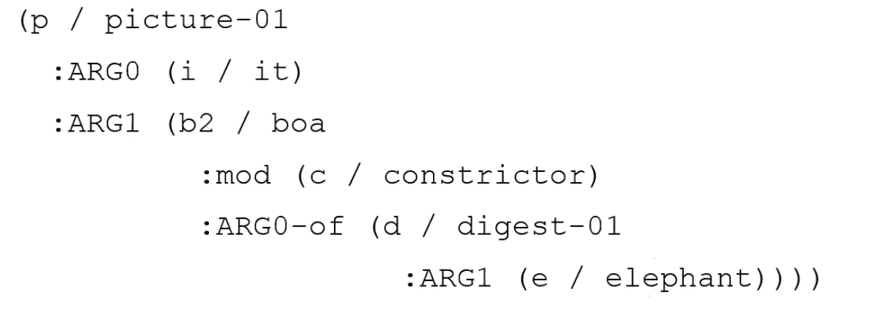

# 抽象意义表征

> 原文：<https://medium.com/mlearning-ai/abstract-meaning-representation-f27aa3f48bbb?source=collection_archive---------1----------------------->

## 什么是自然语言处理中的意义表征？

这篇文章的主要内容来自 Mariana Romanyshyn 在 2019 年欧洲 ODSC 的演讲。欢迎直接点击查看该演讲。

Photo by [Rohit Tandon](https://unsplash.com/@rohittandon?utm_source=unsplash&utm_medium=referral&utm_content=creditCopyText) on [Unsplash](https://unsplash.com/s/photos/mountain?utm_source=unsplash&utm_medium=referral&utm_content=creditCopyText)

# 意义表征导论

我们如何理解一个句子的意思？我们必须知道单词的意思，单词之间是如何相互联系的，句子的上下文，以及我们周围的世界(利用不足但很重要)。教计算机理解人类语言语料库(句子、段落或文章)的一些基本技巧。让我们以这句话为例:

> 孩子们想吃掉所有的饼干。它们很好吃。

## 单词袋(蝴蝶结)

BoW 统计语料库中单词的频率。频率是唯一能告诉计算机语料库是关于什么的度量。这对于主题建模(或文本分类)很有用，但这种表示的粒度相当高，因此我们无法执行其他复杂的 NLP 任务，如文本摘要或问答任务。

此外，即使是文本分类任务，事情也会变得棘手。想象另一个句子，它有同样的一组单词，但是它是这样写的:

> 饼干想吃掉所有的孩子。它们很好吃。

shutterstock.com

由 BoW 技术表示，语料库可以具有相同的输出。但前一句显然属于纪实文学，后一句更多的是虚构。

## 句法分析

Mariana Romanyshyn’s talk, [Link](https://www.youtube.com/watch?v=uCZ9nAe76Ss)

我们首先定义句子中每个单词的词性(PoS)标签，然后尝试对依存结构进行建模。这样，我们将更多的信息编码到表征中，这样我们就知道句子中的主事件是“孩子→想要→吃”。关于依赖解析的更多解释在我之前的博客中的[这里](/mlearning-ai/dependency-parsing-with-neural-networks-e36f5166628d)。

这样做的缺点是，句子的实际含义和依存结构之间的关系是多对多的。如果我们人类用同样的意思重新表达句子，计算机很可能会把它看成一个不同的结构。

我们希望计算机能够真正理解其中的含义。为了澄清同一个例子，我们需要一种形式主义，可以过滤掉释义，并识别出改变潜在含义的修改。

> 孩子们想吃掉所有的饼干。
> 
> 饼干想吃掉所有的孩子。
> 
> 孩子们的愿望是吃掉所有的饼干。

## 语义分析

有许多意义表示形式:

*   类型化的 lambda 演算表达式(广泛用于问答领域)

lambda 演算的思想是通过一个逻辑表达式说出一句话。在下图中，我们可以看到它将任意一个孩子定义为 x，将任意一个 cookie 定义为 y，然后用定义的变量(x 和 y)之间的后续关系来描述主事件“want”。

Mariana Romanyshyn’s talk, [Link](https://www.youtube.com/watch?v=uCZ9nAe76Ss)

这种形式主义的优点是，我们可以形成一个由一组“真理”组成的知识库(KB)。给定一个像“德国的首都是哪里”这样的问题，或者任何类似的意译版本，我们可以将它们解析成唯一的逻辑表达式，并在知识库中搜索答案。

*   语义角色标注(用于信息抽取)

这也叫[浅层语义解析](https://nlp.stanford.edu/projects/shallow-parsing.shtml)，检测**谁**做了**什么**到**谁**。“who/what/who”的成分以主要动词为中心。在信息抽取(文本挖掘)的应用中，当我们想要找到所有的动作和围绕这个动作的实体时，我们可以采用这种技术。

例如:给定包含整个哈利波特系列的语料库，我们想要解析它并提取伏地魔对某人施咒的所有事件。

语义角色和事件一起被称为框架。框架定义了单词在句子中所有可能的角色。PropBank 项目致力于创建有助于改善语义表示的框架。

> 一个有用的 NLP 研究库: [AllenNLP](https://allennlp.org/)

# 抽象意义表征

首先，每个句子都是一个有根的、有向的、无环的图，其中

*   节点是概念
*   边是语义关系
*   省略了功能词

设计的直觉是消除由语法或雄辩引起的歧义，只关注实际意义。

> 我请求你原谅我。

这句话的 AMR 描述如下:

Mariana Romanyshyn’s talk, [Link](https://www.youtube.com/watch?v=uCZ9nAe76Ss)

“我”和“我”代表相同的概念，因此只有一个节点。“to”被省略了，因为虚词无助于表达它的意思。因为那些 AMR 节点将捕获概念，许多优点在那之后而来。AMR 可以处理许多情况，

*   语义角色
*   实体类型
*   共指(伏地魔/神秘人/神秘人)
*   形式
*   极性(像“天气不好”这样的句子中的否定。)
*   维基化(维基文章之间的链接来表示相同的概念)

## AMR 符号

每个 AMR 节点被分配一个变量。(简单来说，取单词的第一个字母作为变量名)对于同一个句子，我们可以看到我们在重用变量“I”和“y”。

冒号后的单词，如:arg0，:arg1，:arg2)，是 AMR 的固定关系。根据最初的[论文](https://aclanthology.org/W13-2322.pdf)，AMR 使用了大约 100 种关系:

*   **框架参数**，遵循 PropBank 约定:(:arg0，:arg1，:arg2，:arg3，:arg4，:arg5)
*   一般**语义关系**:(:伴随者，:年龄，:受益者，:原因，:对比，
    :让步，:条件，:组成，:程度，:目的地，:方向，:领域，:持续时间)
*   **数量**的关系:(:数量，:单位，:比例)
*   **日期实体**关系:(:日，:月，
    :年，:星期，:时间，:时区，:季度，
    :日期间，:季节，:年 2，:十年，:世纪，:日历，:纪元)
*   **列表**的关系:(:op1，:op2，:op3，:op4，
    :op5，:op6，:op7，:op8，:op9，:op10)

## AMR 解析

有两种主要的解析算法:基于图的解析和基于变迁的解析。

对于基于图的解析，我们必须首先识别概念，然后识别概念之间的关系。可以使用开源的 JAMR 解析器来完成这项任务。

对于基于转换的解析，我们基本上利用了依赖结构和 AMR 之间的相似性。然后我们将依赖树转换成 AMR。这也分两步:首先遍历依赖树；然后在每个节点/边，基于特征预测动作。可以使用 [CAMR 解析器](https://github.com/c-amr/camr)来完成这个任务。

Let's try if you can read from an AMR!

AMR 是关于谓词-论元的。从上面的 AMR 中，我们知道主要事件是“某人描绘某物”，其他一些概念依赖于“某物”。此外，该操作应该在所有级别上从 ARG0 指向 ARG1。

> 这幅画描绘了一条大蟒蛇正在消化一头大象。

你拿到了吗？:)

## 自动抄表的应用

我在这里引用了一些作品供进一步阅读:

*   [基于语义的机器翻译，链接](http://aclanthology)
*   抽象概括(SOTA 概述)，[链接](https://www.sciencedirect.com/science/article/pii/S0957417418307735)
*   文本压缩(文本到文本的生成)，[链接](http://www.cs.columbia.edu/nlp/theses/kapil_thadani.pdf)

参考资料:

*   [https://aclanthology.org/W13-2322.pdf](https://aclanthology.org/W13-2322.pdf)
*   [https://www.youtube.com/watch?v=uCZ9nAe76Ss](https://www.youtube.com/watch?v=uCZ9nAe76Ss)
*   [https://amr.isi.edu/](https://amr.isi.edu/)
*   https://github.com/jflanigan/jamr

 [## Mlearning.ai 提交建议

### 如何成为 Mlearning.ai 上的作家

medium.com](/mlearning-ai/mlearning-ai-submission-suggestions-b51e2b130bfb)