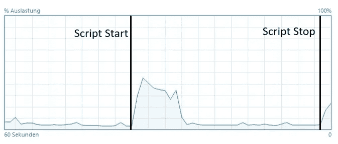

# 通过 USB 加速机器学习推理

> 原文：<https://medium.com/mlearning-ai/accelerated-ml-inference-via-usb-31fe6a927d92?source=collection_archive---------4----------------------->


Photo from Pexels by Jonathan Petersson

你曾经…

*   …有一台旧笔记本电脑，如果你能让它运行一些更重的 ML 推理，它会有很大用处？
*   …有一个没有足够 ML 计算能力的树莓 Pi，而你又不想买一个昂贵的 Jetson Nano？

这里是你能做的！

你所需要的只是这台旧笔记本电脑或者树莓 Pi，对我来说，它是一台联想 ThinkPad，配有 i5 内核，没有 GPU 或任何其他花哨的配件。还有一个你要用的东西:一个 USB 加速器！

想象一下，它就像一个 u 盘，可以在进行并行计算时提高 PC 的速度。听起来好得难以置信？

事实上，这个“u 盘”通过添加一个 TPU 协处理器来为您的系统提供额外的资源。就像显卡一样，但 USB 加速器，顾名思义，只是插入 USB 端口。有各种各样的型号，其中英特尔的 Neural Compute Stick II 和谷歌的 CoralAI Compute Stick 是最著名的，也是我正在使用的。

这篇文章介绍了 CoralAI 计算棒。如果你对推理比较感兴趣，比如说，神经计算棒 II，请告诉我。

# CoralAI 电脑棒—体验


Photo by [Lukas](https://www.pexels.com/photo/close-up-photo-of-survey-spreadsheet-590022/)

根据 Coral 产品页面([https://coral.ai/](https://coral.ai/))的说法，协处理器能够执行 4 次 top 运算( **t** 万亿次运算 o**p**er**s**秒)，这导致使用 MobileNet v2 时接近 400 FPS。(更多基准测试[此处](https://coral.ai/docs/edgetpu/benchmarks/))

阅读这个引起了我的兴趣，我立即订购了一个。在撰写本文时，我已经收到了计算棒，并进行了第一次测试。在 Windows 操作系统上安装和运行是非常简单的。

在详细展示测试步骤之前，我想预测另一个我最感兴趣的结果:

***我的系统的 CPU 在加速杆上做推断的时候实际要承载多少负载？***

## 推断过程中的 CPU 工作负载

这个结果让我大吃一惊。除了加载和卸载记忆棒之外，它基本上不消耗任何 CPU 工作负载，如下图所示。



CPU Workload in %

在脚本开始之后，在将工作负荷降低到静止水平之前，会出现一个工作负荷峰值。停止脚本后，另一个高峰出现了。

这真是一个糟糕的结果。尤其是如果您的目标是使用系统 CPU 进行后处理或并行执行其他任务。

好吧，让我们回到我是如何到达那里的。

## 入门指南

安装非常简单，在 coralAI 页面上有详细的步骤说明，适用于 Linux、IOS、Windows 和 Raspberry PI。对于 Windows 操作系统设置，我大致做了以下工作:

1.  确保您拥有最新版本的 Visual Studio C++ 2019
2.  下载[压缩文件](https://github.com/google-coral/libedgetpu/releases/download/release-grouper/edgetpu_runtime_20221024.zip)
3.  双击 install.bat 进行解压和安装
4.  将设备插入 USB 3.0 端口

> 注:USB 2.0 也可以工作，但性能较低

5.安装 PyCoral 库(Python 3.6 或更新版本)

```
python -m pip install --extra-index-url https://google-coral.github.io/py-repo/ pycoral~=2.0
```

现在你已经准备好了。对于 MobileNet V2 示例，请执行以下步骤。

*   获取示例代码

```
mkdir coral && cd coral

git clone https://github.com/google-coral/pycoral.git

cd pycoral
```

*   获取模型、标签和样本输入

```
bash examples/install_requirements.sh classify_image.py
```

*   奔跑

```
python examples/classify_image.py \
--model test_data/mobilenet_v2_1.0_224_inat_bird_quant_edgetpu.tflite \
--labels test_data/inat_bird_labels.txt \
--input test_data/parrot.jpg
```

输出如下所示:

```
----INFERENCE TIME----
Note: The first inference on Edge TPU is slow because it includes loading the model into Edge TPU memory.
11.6ms
3.2ms
2.9ms
2.7ms
2.8ms
-------RESULTS--------
Ara macao (Scarlet Macaw): 0.75
```

# 摘要

CoralAI Compute Stick 的产品页面让我渴望了解这款设备。在这篇文章中，我使用入门指南检查了设置，并进行了第一次推理测试。设置是直截了当的，棍子的表现和广告宣传的一样。然而，最值得注意的是，在加速杆的 TPU 推断过程中，CPU 没有使用任何工作负载，这是一个积极的副作用。总之，我看到了一个巨大的潜力，特别是 IOT 应用程序，因为它非常灵活，易于设置，实际上加速了 ML 模型。

下一步是通过部署自制的姿态估计网络来实际检查 CoralAI 加速棒的性能。我将比较使用和不使用加速杆时的性能。我还计划用神经计算棒 II 做一个比较。

因此，请继续关注使用 CoralAI 计算棒的更重推理的更新，以及与神经计算棒 II 的比较。如果您对任何其他分析感兴趣，请告诉我。

[](/mlearning-ai/mlearning-ai-submission-suggestions-b51e2b130bfb) [## Mlearning.ai 提交建议

### 如何成为 Mlearning.ai 上的作家

medium.com](/mlearning-ai/mlearning-ai-submission-suggestions-b51e2b130bfb)