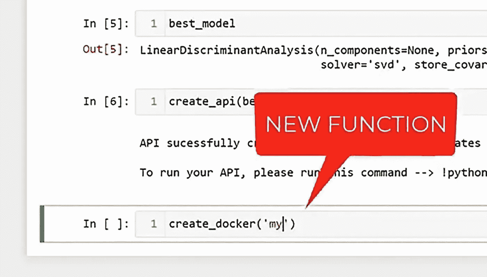

# 从您的笔记本电脑访问您的整个 ML 渠道！

> 原文：<https://medium.com/mlearning-ai/access-your-entire-ml-pipeline-from-your-notebook-1f8a86acf260?source=collection_archive---------11----------------------->

## 机器学习

## 2022 年 1 月

screenshot PyCaret 2.3.6

“厌倦了在笔记本电脑前花费数小时制作 ML、输入代码？正在寻找一种方法来最大限度地利用您的下一个机器学习实验吗？您有兴趣在旅途中练习您的 ML 技巧吗？”