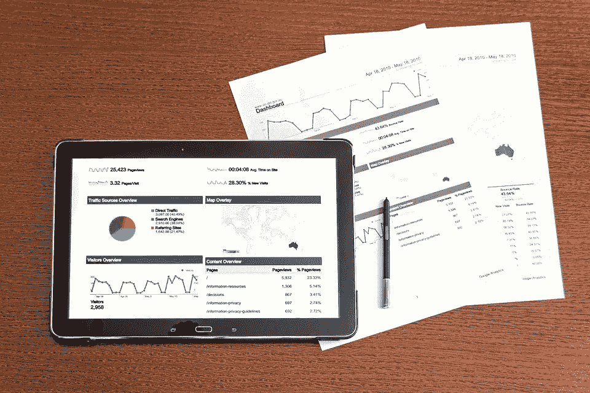

# 据专家称，这些建议会让你成为一名优秀的数据科学家

> 原文：<https://medium.com/mlearning-ai/according-to-experts-these-tips-should-make-you-a-good-data-scientist-6cbb722a7353?source=collection_archive---------3----------------------->

在过去的几年里，对数据科学的宣传越来越多。但随着竞争的加剧，随着时间的推移，爱好者和自学者走上错误的学习道路并变得不适合数据科学已经变得很常见。许多博客和社交媒体都有专家在谈论成为一名优秀的数据科学家所需的技能。在本文中，我们将讨论一些专家提出的在数据领域取得成功的常见技巧。

**懂数学和统计学**

数据科学的基础是数学和统计学——这可能是一个苦涩的事实，但最好你有必要的数学和统计学知识。如果不是一个数学怪胎，至少记下所需的概念并理解正在发生的事情——你不会在纸上解决任何问题，这都是由图书馆完成的。

**理解商业问题的能力**

任何分析解决方案都从分析和理解业务问题开始。经常有专家说，有时候，甚至不需要 ML 来解决问题！是的，创造商业价值可以通过多种方式实现。如果你想成为一名优秀的数据科学家，就要学会理解需求，然后相应地去做工作。摆脱每次都跳到 ML 的倾向。

**正确的工具知识**

要成为一名优秀的数据科学家，你必须成为所谓的“万事通”。你应该了解可用的工具。不是每次，东西都是手写的。数据科学作为一个领域依赖于许多其他领域和工具。这也并不意味着“去记住所有的图书馆”。记下常用的工具，然后用它们来完成你的任务。

**理解数据和选择正确模型的技能**

想成为一名优秀的数据科学家？做一个优秀的数据工程师。当然，这是两个不同的角色，但是根据专家的说法，成为一名优秀的数据工程师有很多优势。作为一名数据科学家，理解数据并将其与业务问题联系起来的能力是最大的幸事。如果使用 ML，选择正确的模型是有助于你创造商业价值的最大因素之一。此外，你应该能够证明任何 ML 模型的输出，以及它将如何影响业务——“有效地解决问题是关键，无论技术是新的还是旧的”。

**理解领域的能力**

数据科学作为一个领域应用于各个部门和领域。解决方案的类型取决于领域和具体问题。要成为一名优秀的数据科学家，你应该具备理解某个领域的一般能力。没有这一点，任何优秀的数据科学家都无法继续前进。您处理的数据、您制定的解决方案和模型都取决于领域、问题、数据及其重要性。数据科学在医疗保健领域的应用需要高精度的建模和严格的测试，而用于图像分类的移动应用中的相同数据科学只要求至少 90%及以上。这同样适用于非基于 ML 的问题。

感谢您的阅读！

## 有用的链接:

*   在 LinkedIn 上找到我:[https://linkedin.com/in/vishnuu0399](https://linkedin.com/in/vishnuu0399)
*   更了解我:【https://bit.ly/vishnu-u】T2
*   数据科学的数学基础 MOOC 课程:[https://www . coursera . org/specializations/mathematics-for-Data-Science？skipBrowseRedirect=true](https://www.coursera.org/specializations/mathematics-for-data-science?skipBrowseRedirect=true)
*   数据科学基础统计学 MOOC 课程:[https://www.coursera.org/learn/stanford-statistics?skipBrowseRedirect=true](https://www.coursera.org/learn/stanford-statistics?skipBrowseRedirect=true)

 [## Mlearning.ai 提交建议

### 如何成为 Mlearning.ai 上的作家

medium.com](/mlearning-ai/mlearning-ai-submission-suggestions-b51e2b130bfb)