# 激活功能

> 原文：<https://medium.com/mlearning-ai/activation-functions-17f8e7d5fcf8?source=collection_archive---------7----------------------->

激活函数是附属于网络中每个神经元的数学函数，并确定它是否应该被激活。通常，在每一层中，神经元使用权重和偏差对输入执行线性变换:

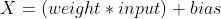

然后，将激活函数应用于上述结果:

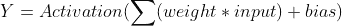

当前层的输出成为下一层的输入。这个过程与网络中的所有隐藏层一起重复。这种信息的前向运动称为 ***前向传播*** 。

激活函数有一些重要的意义:

*   它在神经网络中引入非线性变换，使网络具有学习和执行更复杂任务的能力。想象没有激活函数的神经网络，因此使用权重作为偏差对输入只有线性变换。在这种情况下，神经网络作为线性回归模型工作，那么它的功能将会减弱，并且不能执行复杂的任务。
*   此外，一些激活函数也有助于将每个神经元的输出标准化到一个新的范围，在 0 和 1 之间，或在-1 和 1 之间。

现在，我们将发现一些流行的激活功能:

# **1。乙状结肠功能(逻辑激活功能)**

该功能定义如下:

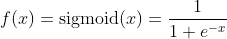

```
import matplotlib.pyplot as plt
import numpy as npx = np.arange(-6,6, 0.01)def plot(func, ylim):
  plt.plot(x, func(x), c = 'r', lw = 3)
  plt.xticks(fontsize = 14)
  plt.yticks(fontsize = 14)
  plt.axhline(c = 'k', lw = 1)
  plt.axvline(c = 'k', lw = 1)
  plt.ylim(ylim)
  plt.box(on = None)
  plt.grid(alpha = 0.4, ls = '-.')
```

乙状结肠功能的可视化:

```
def sigmoid(x):
  return 1/ (1 + np.exp(-x))plot(sigmoid, ylim = (-0.25, 1.25))
```

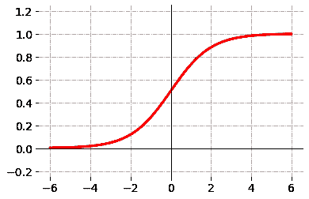

*   由于输出值介于 0 和 1 之间，因此该函数尤其适用于需要预测输出概率的模型。
*   该函数可微分，其导数由下式给出:

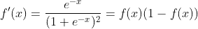

```
def derivative_sigmoid(x):
  return sigmoid(x)*(1-sigmoid(x))plot(derivative_sigmoid, ylim=(-0.02, 0.35))
```

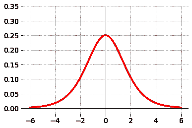

**优点:**

*   输出在范围 0 和 1 内标准化
*   平滑渐变

**缺点:**

*   消失渐变:根据上图，当 x > 6 或 x < -6\. The vanishing gradient may stop the neural network from further training.
*   The outputs are not centered.
*   The computational complexity is large.

# 2\. Tanh function

Tanh function is defined as:

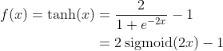

This function is very similar to the sigmoid function. However, it is symmetric around the origin. The outputs of this function are centered and range between -1 and 1.

```
def tanh(x):
  return 2*sigmoid(2*x) - 1plot(tanh, ylim = (-1.4, 1.4))
```

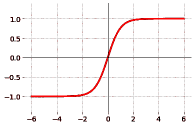

tanh(x) is a monotone, continuous and differentiable function. Its derivation is determined by:

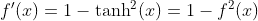

```
def derivative_tanh(x):
  return 1 - (tanh(x))**2plot(derivative_tanh, ylim = (-0.2, 1.2))
```

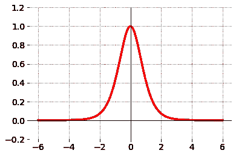

Similar to the sigmoid function, the derivation of this function is closed to zero when x > 3 或 x < -3\. Hence, that also leads to vanishing gradient phenomena during training neural networks.

# 3\. Rectified Linear Unit (ReLU) function

This function has been used widely in the deep learning domain. Its formula is defined by:

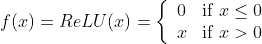

```
relu = np.vectorize(lambda x: x if x > 0 else 0, otypes=[np.float])plot(relu, ylim=(-0.3, 1.5))
```

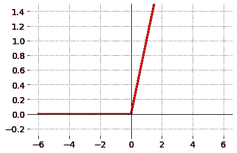

This function is continuous, monotone in ℝ, and differentiable for all x ≠ 0.

The derivation of the ReLU function is determined by:

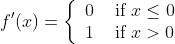

```
derivative_relu = np.vectorize(lambda x:1 if x > 0 else 0, otypes=[np.float])plot(derivative_relu, ylim = (-0.5, 1.5))
```

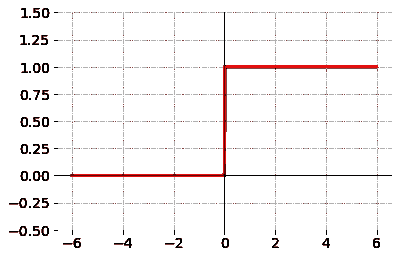

**时，渐变值接近 0 优点:**

*   与 sigmoid 和 tanh 函数相比，此函数的计算效率更高。因此，使用该功能可以加快训练时间。

**缺点:**

*   输出既不是标准化的，也不是居中的。
*   这个函数在原点不可微
*   由于 ReLU 只激活正信号，而去激活所有负信号，因此它不能为负输入值提供一致的预测。
*   当输入接近零或负值时，导数值为零。因此，在反向传播期间，一些神经元的权重和偏差没有被更新。

# 4.泄漏 ReLU 函数

这个函数是 ReLU 函数的改进版本，克服了 ReLU 的一些缺点。

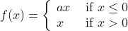

```
a = 0.01
leaky_relu = np.vectorize(lambda x: x if x > 0 else a*x, otypes= [np.float])plot(leaky_relu, ylim = (-0.5, 1.5))
```

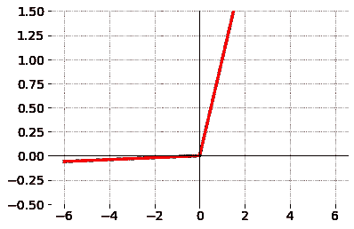

在这种情况下，所有负值 x 都被 ax 代替，其中 a ∈ (0，1)。这允许我们不断更新所有神经元的权重和偏差。

**优势:**

*   这个函数很简单，其计算复杂度仍然小于 sigmoid 和 tanh 函数。
*   不断更新所有神经元的权重和偏差，因此它确实支持反向传播。

**缺点:**虽然它保持了负向神经元的活跃，但是这些神经元被重新调节成了一个很小的值。换句话说，对应于这些负向神经元的信号显著减少。因此，漏 ReLU 不能为负输入值提供一致的预测。

# 5.Softmax 函数

softmax 函数由下式定义:

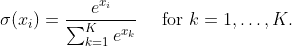

```
def softmax(x):
  z = np.exp(x)
  return z/z.sum()softmax([0.4, 2, 5])>>> array([0.00948431, 0.04697607, 0.94353962])
```

softmax 函数的导数:

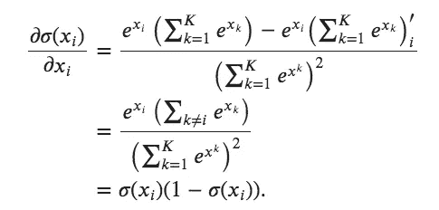

当 j ≠ i 时:

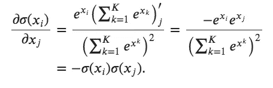

让我们来表示:

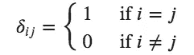

然后，softmax 函数的导数可以重写为:

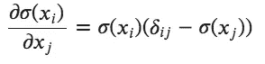

softmax 函数返回介于 0 和 1 之间的输出值，这些输出的总和等于 1。因此，此函数对于多类分类非常有用，我们的目标是预测数据点属于特定类的概率。

**结论:**我们发现了一些在构建卷积神经网络时经常出现的激活函数。希望这篇帖子对你有帮助。

如果你有任何问题，请随意写在评论区。

谢谢大家！

***我的博客页面:***[https://lekhuyen.medium.com/](https://lekhuyen.medium.com/)