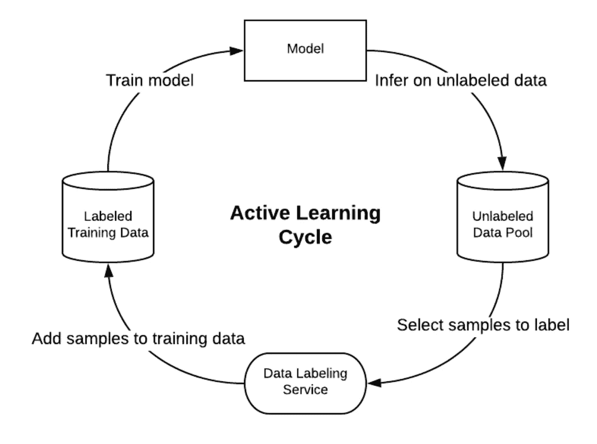
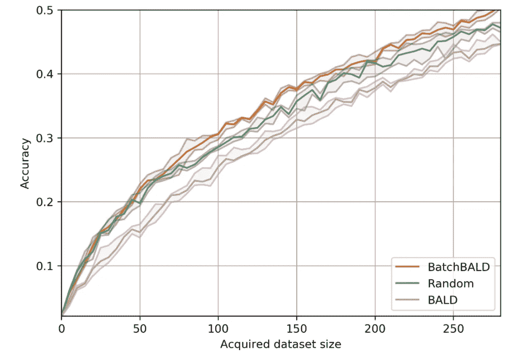

# 面向深度学习的主动学习

> 原文：<https://medium.com/mlearning-ai/active-learning-for-deep-learning-312a1657c4c1?source=collection_archive---------1----------------------->

如何选择要标记的数据点？

以数据为中心的人工智能突然风靡一时，人工智能社区的知名人士如安格鲁·吴(Angrew Ng)和周剑(Stanford)已经站出来试图结束模型炎(将最新最伟大的模型架构扔向一个问题)。他们正在推动一个更加可持续和系统化的方法来提高 ML 系统的性能。

然而，关于可以应用的确切技术却很少被提及。

以数据为中心的人工智能有三个主要组成部分:

*   **高度细化的评估集**专注于特定问题。在计算机视觉的背景下，这可以通过根据数据集大小使用 torch.cdist、airy 或 faiss 的最近邻嵌入来实现。

 [## 以数据为中心的人工智能矢量数据库

### 为什么您应该将矢量数据库作为 MLOps 平台的一部分。

medium.com](/mlearning-ai/the-many-uses-of-a-vector-database-65cb6cc70b3f) 

*   **数据集清洗。**删除贴错标签或脱离相关分布的实例。通常涉及 ***数据评估*** 技术，在训练集中对数据集的许多排列进行采样，以确定它们对于特定任务的价值。示例包括留一法(LOO)、数据 Shapley 值的近似值以及用于数据评估的强化学习。

 [## 用强化学习估计训练数据的影响

### 最近的工作表明，不是所有的数据样本对训练都同样有用，特别是对深度神经网络…

ai.googleblog.com](https://ai.googleblog.com/2020/10/estimating-impact-of-training-data-with.html) 

*   **主动学习。**选择标记哪些数据点的任务，以最大化每个数据点模型的改进。

本文将关注主动学习。

[https://product.hubspot.com/blog/bayesian-active-learning](https://product.hubspot.com/blog/bayesian-active-learning)

当标记很昂贵时，主动学习是最有用的，例如，需要该领域的专家，并且有大量未标记的实例可供选择。

在主动学习中，三个要素可以混合搭配:

*   选择具有高模型“不确定性”的数据点。
*   选择要标记的数据点以代表整个集合。
*   选择数据点以最大化多样性。

后两者听起来可能相似，但代表性采样应被视为匹配全部人口的分布(标记和未标记都一样)，而多样性采样则侧重于最大化给定**潜在空间**的覆盖范围(异常值在这样的系统中排名很高)。

> 潜在空间，也称为潜在特征空间或嵌入空间，是一组项目在流形中的嵌入，其中彼此更相似的项目在潜在空间中彼此更接近

由于深度神经网络的长训练时间和单个数据点对模型行为的不重要性，主动学习往往应用于提交一批数据进行标记的环境中。这增加了多样性成分的重要性。以批量形式应用的不确定性采样技术可能会“过度解决”特定问题。对于设计用于检测骨折的模型，该模型目前在识别腕部骨折方面特别弱，基于模型不确定性的技术可能仅选择腕部骨折，即使仅少量的例子就足以纠正该问题。

这就像一个学生部分由于长除法问题而没有通过模拟考试，从那时起只学习长除法，而忽略了其他任何弱点。[https://oatml.cs.ox.ac.uk/blog/2019/06/24/batchbald.html](https://oatml.cs.ox.ac.uk/blog/2019/06/24/batchbald.html)这篇文章很好地解释了这个问题，并展示了基于不确定性的技术在批量设置中被随机选择所超越。

Random selection outperforms BALD when selecting data-points in batch. [https://oatml.cs.ox.ac.uk/blog/2019/06/24/batchbald.html](https://oatml.cs.ox.ac.uk/blog/2019/06/24/batchbald.html)

批量设置中的最佳技术往往是不确定性采样和多样性采样的结合。如果你需要将主动学习应用到你自己的问题中。深度学习背景下主动学习最成熟的包是 BAAL。

 [## GitHub——Baal-org/Baal:在你的研究或标记中支持贝叶斯主动学习的库…

### Baal 是一个主动学习库，最初由 ElementAI 开发(2021 年被 ServiceNow 收购)。我们的目标是…

github.com](https://github.com/baal-org/baal) 

这是一个非常活跃的领域，新工具不断涌现。你可以查看 https://github.com/stars/GeorgePearse/lists/active-learning[的回购清单，在这方面值得进一步研究。](https://github.com/stars/GeorgePearse/lists/active-learning)

让我知道你的想法。如果您对内容感兴趣，请点击关注。我目前正在寻找我的下一个角色。

# 参考

*   【https://oatml.cs.ox.ac.uk/blog/2019/06/24/batchbald.html 

# 进一步阅读

*   [https://towards data science . com/advanced-active-learning-cheat sheet-d 6710 CBA 7667](https://towardsdatascience.com/advanced-active-learning-cheatsheet-d6710cba7667)。《人在回路的机器学习》作者写的(强烈推荐)。
*   [https://jacobgil.github.io/deeplearning/activelearning](https://jacobgil.github.io/deeplearning/activelearning)。精彩的博文涵盖了最新最棒的主动学习以及最有用的情况。
*   [https://dev blog . pytorchlightning . ai/active-learning-made-simple-using-flash-and-Baal-2216 df 6 f 872 c](https://devblog.pytorchlightning.ai/active-learning-made-simple-using-flash-and-baal-2216df6f872c)。PyTorch 闪电队写的。
*   [https://medium . com/@ ODSC/active-learning-your-models-new-personal-trainer-a 89722 c 0 db 5a](/@ODSC/active-learning-your-models-new-personal-trainer-a89722c0db5a)

 [## Mlearning.ai 提交建议

### 如何成为 Mlearning.ai 上的作家

medium.com](/mlearning-ai/mlearning-ai-submission-suggestions-b51e2b130bfb)