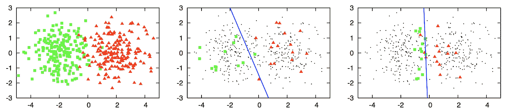
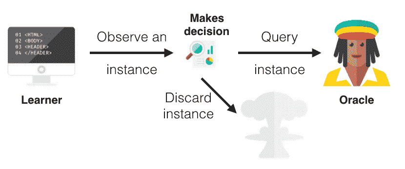
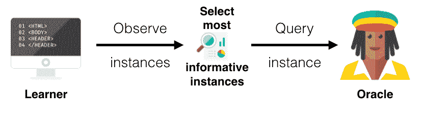
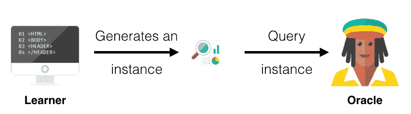

# 主动学习策略:利弊

> 原文：<https://medium.com/mlearning-ai/active-learning-strategies-pros-and-cons-802e010302d?source=collection_archive---------2----------------------->

Source: [Unsplash](https://unsplash.com/photos/3y1zF4hIPCg)

在获得大量未标记的数据集后，数据科学家发现**手动标记这些数据集既繁琐又耗时**。这就是主动学习出现的地方。

1.  什么是 ML 中的主动学习？
2.  主动学习询问策略，利弊。
3.  主动学习框架和工具。
4.  结论。

> ***注:*** *查看* [*本文*](/mlearning-ai/ml-ops-tools-for-nlp-f836a3fdc30a) *了解更多关于 NLP 项目的 MLOps 工具和最佳实践，其中我们提出了一个* ***建议的自动标注工具*** *。*

# 1.什么是 ML 中的主动学习？

到目前为止，标记数据是整个机器学习项目中花费时间最多的过程，约占整个项目的 80%。主动学习将非结构化数据的不利数量转化为优势:这是一种半监督学习，其中一小组标记数据和大量未标记数据共同用于训练监督模型。

主动学习技术从一小组被称为“种子”的人工标记数据开始。然后，根据收集的标记数据训练模型，这些数据的选择是有选择性的，因为它将为模型提供最大的学习机会。在被训练之后，学习者将预测剩余的未标记数据，并且将分配一个优先级分数。将顺序重复该过程:建立基于优先级分数的新的一组标记数据。一旦新模型被训练，优先级分数再次被更新以继续标记。

The prediction accuracy difference between random sampling -second graph- and active learning -last graph- (By [Datacamp](https://res.cloudinary.com/dyd911kmh/image/upload/f_auto,q_auto:best/v1518178638/al-eg_pbwzob.png))

# 2.主动学习查询策略的利弊

正如我们前面提到的，主动学习是一个主动的过程，因为它允许模型在训练期间提出查询。查询通常是即将由 oracle(人类注释者/专家/科学家)注释的未标记的数据实例。

三种主要的主动学习策略是:

## 基于流的选择性采样:

当我们有一个大的数据库时，使用这种方法。来自数据库的一小组数据专用于要训练的模型:它是训练数据集。模型从这个未标记的池中选择是否向用户查询实例的标签。

这种方法是一种低成本的方法，但是仍然存在一个主要的缺点，即由于单独的决策而导致的有限的性能。

Stream-based Selective Sampling (By [Datacamp](https://res.cloudinary.com/dyd911kmh/image/upload/f_auto,q_auto:best/v1518178638/stream_kdlsz2.png))

## 基于池的采样:

在基于池的采样中，模型可以从大量未标记的数据中选择一批 X 个样本。然后，X 个样本基于某种“信息含量”度量进行排序。排名最好的样本将由先知标记。这种方法的缺点是它需要大量的内存。

Pool-based sampling (By [Datacamp](https://res.cloudinary.com/dyd911kmh/image/upload/f_auto,q_auto:best/v1518178638/pool_guqwfe.png))

## 成员查询合成:

通常，当我们有一个最小的数据集时，使用这种方法。该算法首先生成自己的一组实例，它认为这些实例对模型的训练最有益。然后，未标记的实例被发送到 oracle 进行标记。这种方法的缺点是数据误识别的可能性很高，而它的优点是可以兼容容易生成数据实例的问题。

Membership query synthesis (By [Datacamp](https://res.cloudinary.com/dyd911kmh/image/upload/f_auto,q_auto:best/v1518178638/membership_wzptzh.png))

# 3.主动学习框架和工具

*   [**CRFsuite**](https://sklearn-crfsuite.readthedocs.io/en/latest/) :是标记顺序数据的条件随机场(CRF)实现。在 CRF 的不同实现中，该工具的主要目标是尽可能快地训练和使用 CRF 模型，使用简单的数据格式进行训练和标记，类似于其他机器学习工具中使用的数据格式；其中每行由一个标签和一个项目的特征组成。
*   [**模态**](https://modal-python.readthedocs.io/en/latest/) :是 python 3 的主动学习框架。它是由 scikit-learn 构建的，使其灵活易用。模态优先来自于这样一个事实，即它支持许多主动学习策略，比如基于池的采样、选择性采样和查询合成。

UBIAI labeling tool (Source: [UBIAI](https://ubiai.tools/features/r1-auto-labeling))

*   [**Libact**](https://github.com/ntucllab/libact) :是 Python 中基于池的主动学习。作为一个 python 包，注定让一般用户的主动学习更容易。该软件包不仅实现了几种流行的主动学习策略，而且还具有通过学习进行主动学习的元算法，可以帮助用户在运行中自动选择最佳策略。
*   [**AlpacaTag**](https://github.com/INK-USC/AlpacaTag) :是一个基于 web 的数据标注框架，用于序列标注。它是一个实用的工具，具有主动智能推荐功能，可以动态地建议注释和自动群体合并，从而通过合并来自多个注释者的不一致标签来增强实时的注释者间一致性。
*   [**ALiPy**](https://github.com/NUAA-AL/ALiPy) :是一个基于模块的实现框架，允许用户不断地分析和评估主动学习方法的性能。它以友好的用户界面和对比其他框架更主动的学习算法的支持而著称。

# 4.结论

主动学习方法不仅席卷了机器学习领域，还席卷了生物医学、文本分类和图像识别……在一个不受监管的数据随处可见的时代，通过以有效的半监督方法使用带有标签数据样本的大型非结构化数据池来充分利用这些数据是势在必行的。

 [## Mlearning.ai 提交建议

### 如何成为 Mlearning.ai 上的作家

medium.com](/mlearning-ai/mlearning-ai-submission-suggestions-b51e2b130bfb)