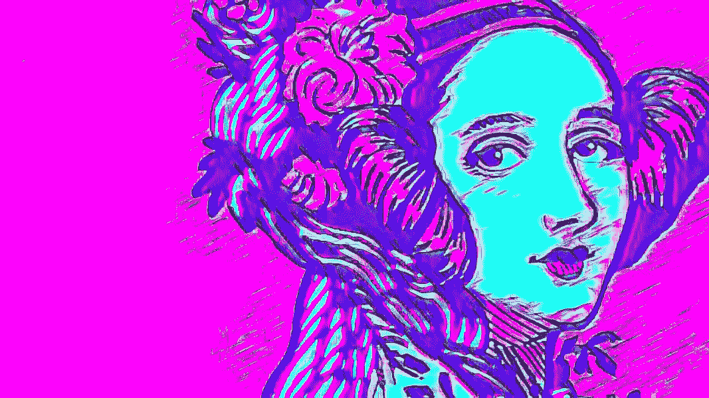

# 艾达，人工智能艺术的先驱

> 原文：<https://medium.com/mlearning-ai/ada-the-precursor-of-ai-art-eb3be069a178?source=collection_archive---------3----------------------->

## 人工智能

## 世界上第一个人工智能背后的计算机天才

**Augusta Ada King, Countess of Lovelace** (**Byron**; 10 December 1815–27 November 1852)

她出生于 1815 年，去世时只有 36 岁，但是她在这里的时候做了许多令人惊奇的事情。你可以在网上很多地方了解她，但是你实际了解多少呢？