# 从头开始

> 原文：<https://medium.com/mlearning-ai/adaboost-from-scratch-f8979d961948?source=collection_archive---------3----------------------->

## AdaBoost 算法的解释和实现


Photo by [Tim Marshall](https://unsplash.com/@timmarshall?utm_source=unsplash&utm_medium=referral&utm_content=creditCopyText) on [Unsplash](https://unsplash.com/?utm_source=unsplash&utm_medium=referral&utm_content=creditCopyText)

AdaBoost (Adaptive Boosting)是由 Yoav Freund 和 Robert Schapire 于 1995 年开发的一种分类 Boosting 算法。他们因此获得了 2003 年的哥德尔奖。AdaBoost(以及其他助推方法)从大量弱学习者中创建强学习者。

弱学习器(或分类器)是可以给出比随机猜测更好的结果，但是仍然不能提供足够的性能的模型。使用 Adaboost，我们可以组合许多弱分类器。这些弱分类器从彼此的错误中逐步学习，整体上创建了一个强模型。这些弱单元分类器被称为基分类器，通常是决策树。

# 伪代码

为每次观察设置相等的权重(w=1/n)

对于 t=1:T:

训练弱分类器

选择系数α(重要性)

更新权重

结束于

输出:

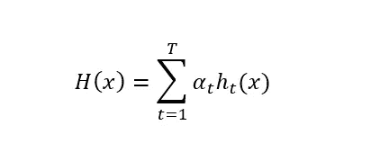

# 算法

让我们通过一个例子来更好地理解这个算法。如下表所示，我们有一个由 8 个观察值和 3 个特征(2 个分类特征和 1 个连续特征)组成的数据集。4 个观察值为正值，4 个为负值。

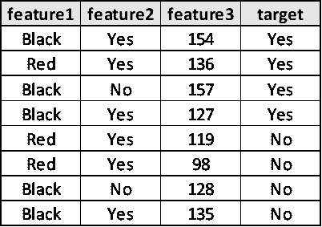

Dataset

首先，我们相等地初始化权重；w = (1/n) = 0.125

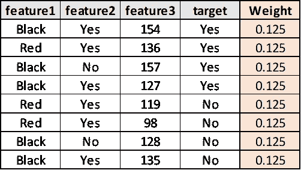

Weights initialized.

现在，我们创建我们的基础学习者(决策树)。每个决策树只有一个深度。这些树被称为树桩。

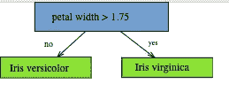

Stump. Source: [Wikipedia](https://en.wikipedia.org/wiki/Decision_stump)

对于每个特征，我们创建一个树桩。为了选择在序列中首先从哪个基础学习者开始，计算树桩的熵(或基尼指数，无论你选择哪个)。选择具有最低熵的树桩。

如果你想记住决策树；

[](https://python.plainenglish.io/decision-tree-parameters-explanations-tuning-a2b0749976e5) [## 决策树参数解释

### Sklearn 的决策树参数解释

python .平原英语. io](https://python.plainenglish.io/decision-tree-parameters-explanations-tuning-a2b0749976e5) 

## **创造树桩**

对于分类特征；

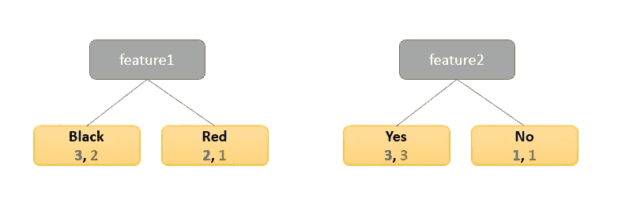

First stumps for categorical features

如果我们根据特征 1 分割目标；

*   对于黑色类别:3 个正确的预测和 2 个错误的预测。
*   红色类别:2 个正确预测和 1 个错误预测。

**为连续的数值特征；**

*   对要素进行排序
*   获取相邻值的中点
*   计算每个分割点的基尼系数(或信息增益)

在我们的情况下；

*   排序:98，119，127，128，135，136，154，157
*   中点:108.5，123，127.5，131.5， **135.5，** 145，155.5
*   基尼系数:0.429，0.333，0.467，0.375， **0.2** ，0.333，0.429

135.5 是分割的最佳值，因为它具有最低的杂质。

3 个树桩的基尼系数分别为:

S1= 0.47，S2=0.5，S3=0.2

具有最低基尼值的树桩将是序列中的第一个树桩。

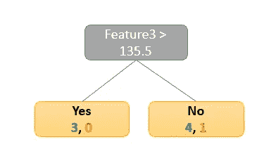

## 总误差

总误差是不正确预测的权重之和。我们有 1 个不正确的预测，因此总误差为 0.125。

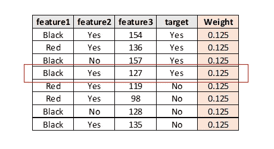

## 重要

我们现在将计算基本分类器(stump)的重要性(发言权或影响力的数量)。从公式中可以理解，总误差越小，基本分类器的重要性越大。

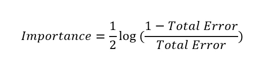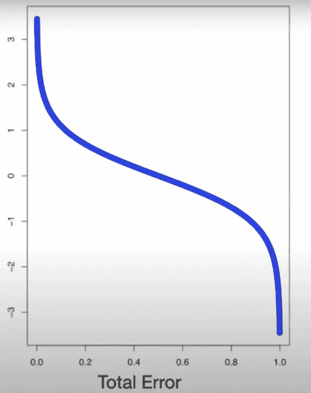

Total error vs importance. [Source](https://vitalflux.com/adaboost-algorithm-explained-with-python-example/)

当总误差为 0.5 时，分类器的显著值为 0(抛硬币)。如果树桩一直做得不好，它的重要性就变成了负数。

在我们的例子中；总误差为 0.125。所以，重要性= 0.97

现在，我们将更新权重，以便下一个树桩将当前树桩犯下的错误计入帐户。

第一个树桩误判了一个观察。我们现在将增加错误观察的权重，减少其他的权重，以便下一个 stump 考虑到这一点。

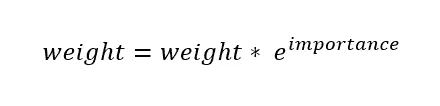

重量= (1/8 x 2.64) = 0.33 = >要增加的新重量。

为了减轻重量，我们将使用重要性的负值(^-importance).)

重量= (1/8 * 0.38) = 0.5 = >要减少的新重量

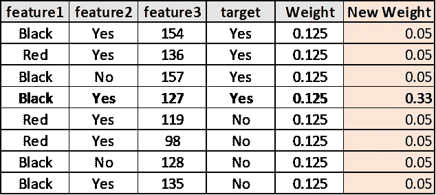

我们应该把新的权重归一化，使之加起来等于 1。

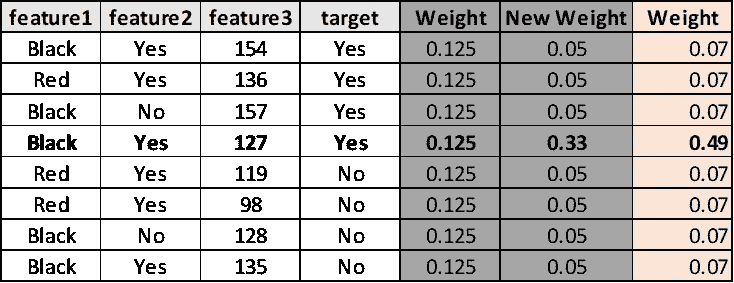

现在，在这一阶段，我们将随机选择值，当该值落在权重的累积分布中时，我们将该观察值移动到新创建的空数据集。也就是说，我们创建一个随机选择的新数据集。例如，如果随机选择的值在 0.14 和 0.21 之间，我们将移动第三个观察值。

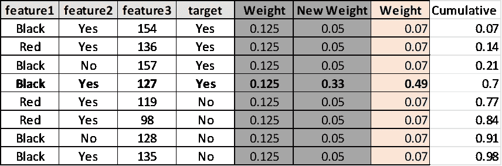

权重较高的观测值在新数据集中出现的概率较高。

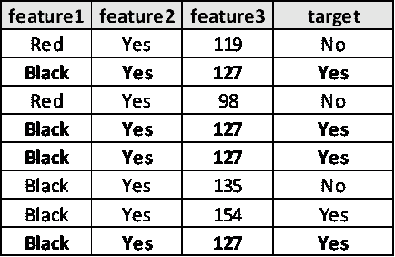

Random dataset

从这一点上，我们从头开始我们的新数据集。

# Python 代码

## 从头做起

让我们创建一个虚拟数据集进行测试；

```
from sklearn.datasets import make_gaussian_quantilesdef generate_dummy(n):
    n_per_class = int(n/2)
    X, y = make_gaussian_quantiles(n_samples=n, n_features=2, n_classes=2)
    return X, y*2-1X, y = make_toy_dataset(n=100)
```

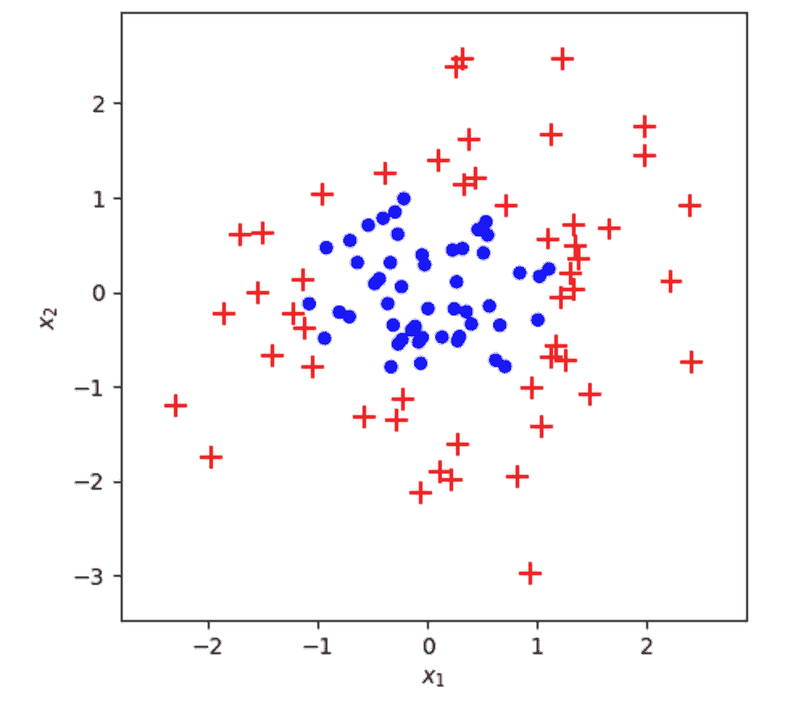

Plot of dummy data

测试:

```
from sklearn.model_selection import train_test_split
from sklearn.metrics import roc_auc_scoreX_train, X_test, y_train, y_test = train_test_split(X,y,test_size=0.2)A = AdaBooster(400)
A.fit(X_train, y_train)
y_pred = A.predict(X_test)
print('The ROC-AUC:', round(roc_auc_score(y_test, y_pred), 4))#OUT: 
0th iteration; error: 0.3500000000000007
100th iteration; error: 0.388889913934225
200th iteration; error: 0.43300048902688026
300th iteration; error: 0.4141223413353688
The ROC-AUC score of the model is: 0.9286
```

## Sklearn

```
from sklearn.ensemble import AdaBoostClassifier
```

**参数**；

base_estimator: *对象* = >模型类型；默认为决策树。

n_estimators: *int = >* 迭代次数；默认值为 50。

learning _ rate:*float*=>应用于基本分类器的权重可以通过此参数进行调整。较高的值会增加每个树桩的贡献。默认值为 1。

```
A = **AdaBoostClassifier**(n_estimators = 400)
A.fit(X_train, y_train)
y_pred_sk = A.predict(X_test)
print('The ROC-AUC:', round(roc_auc_score(y_test, y_pred), 4))#OUT:
The ROC-AUC: 0.9286
```

# 阅读更多内容…

[](https://python.plainenglish.io/random-forest-implementation-980b2d2c3c84) [## 随机森林实现

### Sklearn 实现和参数解释

python .平原英语. io](https://python.plainenglish.io/random-forest-implementation-980b2d2c3c84) [](https://python.plainenglish.io/decision-tree-parameters-explanations-tuning-a2b0749976e5) [## 决策树参数解释

### Sklearn 的决策树参数解释

python .平原英语. io](https://python.plainenglish.io/decision-tree-parameters-explanations-tuning-a2b0749976e5) [](https://python.plainenglish.io/logistic-regression-from-scratch-7b707662c8b9) [## 从零开始的逻辑回归

### 解释和实施

python .平原英语. io](https://python.plainenglish.io/logistic-regression-from-scratch-7b707662c8b9) [](https://python.plainenglish.io/ridge-lasso-elasticnet-regressions-from-scratch-32bf9f1a03be) [## 山脊，套索和弹性网从零开始回归

### Python 代码从头开始和 Sklearn 实现

python .平原英语. io](https://python.plainenglish.io/ridge-lasso-elasticnet-regressions-from-scratch-32bf9f1a03be) [](https://towardsdev.com/modeling-interactions-and-behavior-915901d1266e) [## 交互和行为建模

### 对建模图的简单介绍

towardsdev.com](https://towardsdev.com/modeling-interactions-and-behavior-915901d1266e) 

# 参考

[https://blog.paperspace.com/adaboost-optimizer/](https://blog.paperspace.com/adaboost-optimizer/)

[https://sci kit-learn . org/stable/modules/generated/sk learn . ensemble . adaboostclassifier . html](https://scikit-learn.org/stable/modules/generated/sklearn.ensemble.AdaBoostClassifier.html)

[https://www.youtube.com/watch?v=LsK-xG1cLYA](https://www.youtube.com/watch?v=LsK-xG1cLYA)

[](https://www.analyticsvidhya.com/blog/2021/09/adaboost-algorithm-a-complete-guide-for-beginners/) [## AdaBoost 算法-初学者完全指南-分析

### Boosting 是一种集合建模技术，由 Freund 和 Schapire 于 1997 年首次提出，自…

www.analyticsvidhya.com](https://www.analyticsvidhya.com/blog/2021/09/adaboost-algorithm-a-complete-guide-for-beginners/) [](/mlearning-ai/mlearning-ai-submission-suggestions-b51e2b130bfb) [## Mlearning.ai 提交建议

### 如何成为 Mlearning.ai 上的作家

medium.com](/mlearning-ai/mlearning-ai-submission-suggestions-b51e2b130bfb)