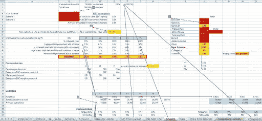
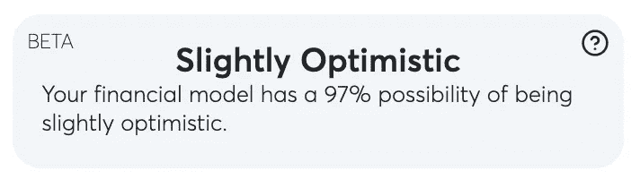

# 将人工智能加入金融建模

> 原文：<https://medium.com/mlearning-ai/adding-ai-to-financial-modeling-6f965b7b002a?source=collection_archive---------0----------------------->

using AI in financial modeling

# 金融建模是一个非常有趣的学科，因为即使你是专家或者你有完美的模板，你仍然需要做一些猜测。没有更好的选择吗？

老实说，我认为那些没有“正确”答案或者“正确”答案只有在你尝试过之后才知道(基本上是在未来)的学科是最迷人也是最难的。像这样的工作有*研究员*、*企业家*或*金融模型师*。

# 猜测在哪里？

财务模型基本上由两部分组成:假设和预测。*假设*是您输入的所有数据(基本上是输入)，而*预测*是财务模型自己计算并显示给您的所有数据(输出)。
假设是猜测发生的地方。当您创建财务模型时，您必须输入特定于您的业务的数据，如每个客户的平均收入，这是您事先知道的数据，但有时您必须输入您可能只能估计的数据，如增长率、客户获取成本、ecc。

# 现在是如何处理的

首先，假设通常都保存在一起，很容易编辑，所以如果你想尝试不同的假设，你可以很快改变它们。然后，这些假设通常来自历史数据、行业数据或经验:你知道“通常”流失率在 10%左右，所以你估计你的初创公司的流失率也将在 10%左右。
这是最好的做事方式，主要是因为没有更好的方式，历史+部门+经验通常会给出最好的结果。

# 增长熵

你可以想象，每次我们在财务模型中增加一个假设的新输入，我们就增加了财务模型的“误差范围”，基本上就是预测与现实的差异。
举个例子很容易理解:如果你只有一个假设，你只需要把它做对，但是如果有十个假设，你需要把它们都做对，这就大大增加了难度，并产生更大的误差。

# 问题是

不幸的是，(目前)没有更好的做事方式，这就是创业的不确定性*，不管你计划得多好，都没有真正的办法提前知道它是否会盈利。
不幸的是，许多创始人都有一个财务模型(你有一个对吗？)对他们的业务，但他们过于乐观(非常危险)或过于悲观，这是因为在启动你的创业之前提出好的假设是非常困难的。这就是人工智能可以帮忙的地方。*

# *给金融建模者和创始人一个新的工具*

*人工智能正被应用于各个领域，它已经帮助了很多过程。它已经被应用于金融领域，但之前从未被应用于金融建模。人工智能可以帮助做出更好的预测或更好的假设，这将导致更好的预测。
我们设想的人工智能是用来**检查你插入的假设**并告诉你你的假设是*太乐观、稍微乐观、现实、稍微悲观还是太悲观*。这将证明对每个试图创建新金融模型的人都非常有用。当然，它不能解决所有可能的问题，但它将是一个前所未见的非常有用的工具。这个人工智能可以用现有企业的公开可用信息以及它检查的每个金融模型的数据来训练，因此它可以不断进化。*

# *我们的解决方案*

*我们认为我们能够解决这个问题，我们也确实解决了。我们成功地创造了人工智能，它正在我们的平台 Sturppy 上运行。在 **Sturppy** 上，你可以**超级简单快捷地为你的企业创建一个财务模型**，并且**获得你的预测有多现实的估计**，帮助创始人消除他们财务模型中的不确定性。
我们也相信这个工具对于**投资者**也是超级有用的，事实上，投资者可以快速检查发送给他的金融模型上所做的假设是乐观还是悲观。对于需要检查许多不同业务或想要真正深入特定创业公司的投资者来说，这可能是一个令人惊叹的工具。*

**

# *最先进的*

*到目前为止，人工智能(我们称之为*“Paolo”*)已经被训练为只为 **saas 公司**提供估算，因为它们是最常见的，并且它们的训练数据是最好的。我们希望包括我们的其他商业模式(移动应用程序，电子商务)，我们正在努力。
评估处于测试阶段，你也会收到一个与之相关的**信心分数**，告诉你我们对自己的评估有多有信心。您的财务模型“略微乐观”，信心为 86%)。*

# *“现实主义乐谱”*

*我们希望你明白，估算只是一种让你知道自己的假设是过于乐观还是过于悲观的方式，而不是一个你应该优化的指标。
例如，如果你在 Sturppy 中插入脸书金融模型的假设，它会告诉你*“非常乐观”*这并不意味着你的金融模型是错误的，而是它是乐观的，可能会**更难执行**，但绝对不是不可能。*

# *结论*

*如果你已经有了一个用 Sturppy 制作的财务模型，只需转到 *Projections* 选项卡，你就会看到估算。如果你还没有财务模型或者已经在 Sturppy 之外做了一个，做一个 [**自由账户**](http://sturppy.com/signup) ，创建你的**财务模型**，看看你的预测**的现实性**，让你知道你是现实还是过于乐观。*

*如果您有任何问题，请随时联系我们，我们总是很高兴与志同道合的人交谈。此外，如果你是一家初创公司的创始人，或者对未来经营一家初创公司感兴趣，你可能会喜欢我们在 [Sturppy 这里建立的东西，这是一款**针对初创公司的财务建模工具**](http://sturppy.com) ，既快速又简单。*

*祝你旅途好运。*