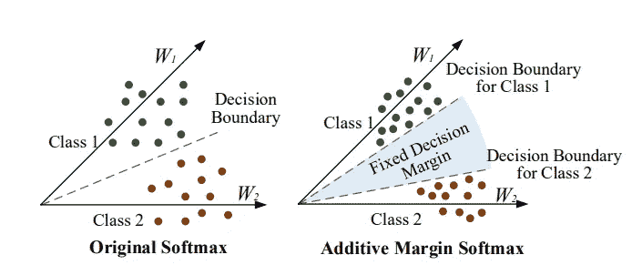
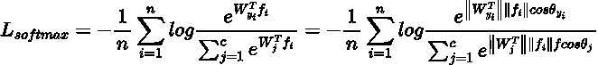
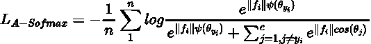
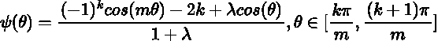
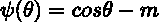
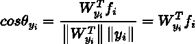
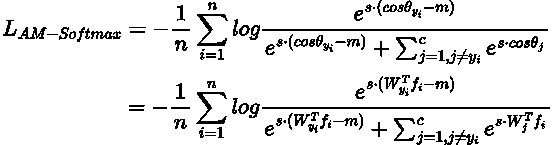
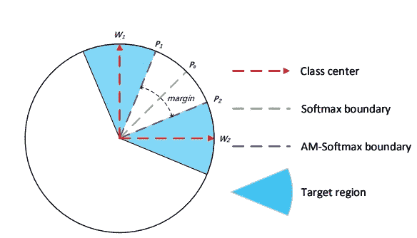

# 附加保证金软最大损失

> 原文：<https://medium.com/mlearning-ai/additive-margin-softmax-loss-3c78e37b08ed?source=collection_archive---------5----------------------->

这个故事是为了记录我最近对加性保证金 Softmax (AM-softmax)损失的认识。

source: [https://arxiv.org/abs/1801.05599](https://arxiv.org/abs/1801.05599)

在说 AM-Softmax 之前，我们需要先回顾一下什么是 Angular Softmax (A-Softmax)。

# **原始 Softmax**

这里 *f* 是最后一个全连接层的输入。 *W* 是最后一层的参数。

# **角度最大值**

[https://arxiv.org/pdf/1704.08063.pdf](https://arxiv.org/pdf/1704.08063.pdf)

与最初的 softmax 相比，作者做了以下更改:

1.  归一化权重‖ *W* ‖ = 1
2.  更新目标逻辑计算

因此，A-Softmax 损失变为:

在两者之间， *ψ(θ)* 是一个分段函数，其定义为:

正常情况下，m 是大于 1 的整数，λ是超参数，用于控制推动分类边界的难度。在训练阶段，λ从 1000 退火到一个小值，使每一类的角空间变得更大更紧凑。

# **附加余量最大值**

[https://arxiv.org/abs/1801.05599](https://arxiv.org/abs/1801.05599)

作者提出了一个特定的函数，该函数在 softmax 损失函数中引入了一个附加余量。

与 L-Softmax 和 A-Softmax 相比，这个定义更简单但更有用。在特征和权重都归一化之后， *cos(θ)* 可以进一步定义为:

最后，整个损失函数是:

这里有一个超参数。最初，作者试图让它变得可以学习。但是，整个网络收敛速度非常慢。因此，他们决定将 *s* 固定为一个大值(30)，这样可以使优化更加稳定。

Decision boundary comparion between convenitional Softmax and AM-Softmax ([source](https://arxiv.org/abs/1801.05599))

这个 *-m* 试图将嵌入推离其他类中心。超级直观。

这个 AM-Softmax 也可以用于句子相似性任务。

# **问题**

我们是否也可以在对比学习中使用 AM-Softmax？这个损失相当接近 InfoNCE。不确定 AM-Softmax 在对比学习中能不能很好的发挥作用。

 [## Mlearning.ai 提交建议

### 如何成为 Mlearning.ai 上的作家

medium.com](/mlearning-ai/mlearning-ai-submission-suggestions-b51e2b130bfb)