# 《R》中阿黛尔的歌词分析

> 原文：<https://medium.com/mlearning-ai/adeles-lyrics-analysis-in-r-dbca81a80487?source=collection_archive---------2----------------------->

## “你好，是我”背后站着什么？

阿黛尔是音乐界有史以来最伟大的歌手之一。爱黛儿·劳丽·布鲁·亚金斯是一位英国创作型歌手，已经赢得了 15 项格莱美奖(共 18 项提名)！她的音乐以独特著称，而她的歌词丰富而深刻。作为一个 Adele 和音乐分析的粉丝，我不能错过这个借助 r 中的文本分析工具来分析歌手歌词的机会。

本次分析的重点是阿黛尔在整个职业生涯中制作的三张专辑(让我们期待第四张即将到来)。每张专辑在制作过程中都以歌手的年龄命名。

*   **19 是首张录音室专辑。** [阿黛尔独自创作了这张专辑的大部分素材，但也与一些精选的作家和制作人合作，包括吉姆·艾比斯、Eg·怀特和萨莎·斯卡贝克。他们的合作创造了一个蓝眼睛的灵魂专辑，歌词描述了心碎，怀旧和关系。](https://archive.ph/20090404132447/http://blogcritics.org/archives/2008/07/16/084115.php)
*   **21 是第二张录音室专辑。21 分享了她 2008 年首张专辑《19》中的民谣和摩城灵魂音乐的影响，但她在 2008-2009 年与阿黛尔的北美巡演中接触到的美国乡村和南方布鲁斯音乐进一步激发了她的灵感。这张专辑是在这位歌手与当时的伴侣分手后创作的，代表了忏悔型创作歌手在探索心碎、自省和宽恕方面近乎休眠的传统。**
*   **25 是第三张录音室专辑。她的上一张专辑《21 岁》(2011)在国际上大获成功，五年后发行，这张专辑的标题是她 25 岁时的生活和心态的反映，被称为“化妆记录”。根据《滚石》杂志对阿黛尔的采访，其抒情内容以阿黛尔“对旧日自我的向往，她的怀旧”和“关于时间流逝的忧郁”为主题。**

# 摘要

在加载必要的包之后，Adele 的三个相册中的数据被加载和清理。然后，我继续对歌曲和专辑及其各个方面进行文本挖掘。接下来，我运用三种不同的方法来分析阿黛尔歌曲中的情感。最后，构建了阿黛尔的歌曲网络，并强调了一些关键的见解。

# 装载包

首先，我们需要下载相应的软件包。

```
**library(dplyr)** #God of all packages 
**library(tidyverse)** #Goddess of all packages 
**library(genius)** #lyrics
**library(tidytext)** #text tidying
**library(extrafont)** #personalizzed fonts to ggplot output
**library(scales)** #percentage scales in ggplot
**library(widyr)** #correlations between songs
**library(ggraph)** #network maps
**library(igraph)** #network analysis
**library(knitr)** #output formatting
**library(kableExtra)** #output formatting
**library(wordcloud2)** #word cloud visualization 
**library(formattable)** #output formatting
**library(textdata)** #working with lyrics 
**library(ggrepel)** #extra geoms for ggplot 
**library(yarrr)** #pirate plot
```

# 下载数据

借助 genius-package，我们可以从阿黛尔的专辑中获得歌词。在这里，我正在使用 **genius_album** 功能下载阿黛尔的一张张专辑。我们只需要给这个函数指定艺术家的名字和我们想要的专辑，它就会得到歌词。作为输出，我们得到一个 tible，每个句子占一行，包含曲目标题、曲目编号和歌曲行的信息，而专辑名称必须单独添加。

```
a_25 <- genius_album(artist = "Adele", album = "25") %>%
  mutate(album = "25")

a_21 <- genius_album(artist = "Adele", album = "21") %>%
  mutate(album = "21")

a_19 <- genius_album(artist = "Adele", album = "19") %>%
  mutate(album = "19")
```

此外，专辑“19”有歌曲的现场版本(从曲目 13 开始)，因此，它们需要被过滤掉，以避免相同的歌词出现两次。

```
a_19 <- a_19 %>%
  filter (!track_n %in% c(13:22))
```

下载完所有东西后，我把所有专辑的歌词放在一个叫做**的文件夹里。**

```
adele_data <- rbind(a_25, a_21, a_19)
```

最后，我保存数据集，因为再次下载数据可能会很耗时。

```
save(adele_data, file = "adele_data.Rdata")
```

# 数据准备

让我们来看看最终的数据集。

```
str(adele_data)
```

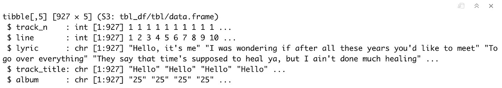

到目前为止，我们有阿黛尔歌曲的 927 行歌词，有 5 列，分别是曲目编号、歌词、曲目标题和专辑。我们还可以查看表格的摘要。

```
summary(adele_data)
```

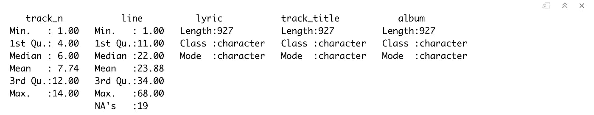

在摘要中，我们可以看到一些需要删除的 NA。

```
adele_data <- na.omit(adele_data)
```

所以现在我们有了一个包含阿黛尔 900 多行歌词的表格。但是根据**整齐的文本格式**，我们需要“每行每文档一个标记”的格式，在我们的例子中是一个单词。我们可以通过 tidytext 中的 **unnest_tokens 函数将歌曲转换成这种格式，这将获取我们的数据帧并逐字拆分每个句子。**

```
adele_tok <- adele_data%>%
  #word is the new column, lyric the column to retrieve the information from
  unnest_tokens(word, lyric)
```

我们的新数据集有**6474 个观察值**，每行代表歌词中的一个单独的单词。

```
adele_tok %>%
  mutate(album = color_tile("lightblue","lightblue")(album)) %>%
  mutate(word = color_tile("lightgreen", "lightgreen")(word)) %>%
  kable("html", escape = FALSE, align = "c", caption = "Lyrics in Adele's Songs") %>%
  kable_styling(bootstrap_options = 
                  c("striped", "condensed", "bordered"), 
                  full_width = FALSE)
```

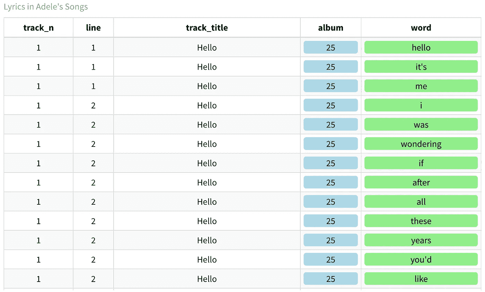

在这个输出中，我们已经可以看到许多代词、介词等。，这当然没有任何意义。这些就是所谓的**【停用词】**，可以用**停用词字典**从 **tidytext 包中轻松删除。**此外，我们还可以删除少于三个字符的**单词**(常用于音乐中的语音效果)和一些手动选择的**不需要的单词**(例如“耶”)。

```
adele_tidy <- adele_tok %>%
  filter(word != "lea",
         word != "aye",
         word != "yeah",
         word != "da",
         word != "after",
         word != "where",
         word != "were",
         word != "such",
         word != "from",
         word != "ooh",
         word != "set",
         word != "lay",
         word != "would've",
         word != "gonna") %>% 
  filter(!nchar(word) < 3) %>% 
  anti_join(stop_words)
```

# 文本挖掘

现在歌曲已经有了整齐的格式，我们可以分析它们了。文本挖掘的目的是在词频、密度和词汇多样性的层面上从阿黛尔的歌词中发现相关的见解。

首先，我们可以通过歌曲来检查词频(包括停用词和不必要的词)。

```
adele_data$album <- as.factor(adele_data$album)

word_count <- adele_data %>%
  unnest_tokens(word, lyric) %>%
  group_by(track_title,album) %>%
  summarise(num_words = n()) %>%
  arrange(desc(num_words))
```

这里我们来看看单词量最高的歌曲。

```
word_count[1:10,] %>%
  ungroup(num_words, track_title) %>%
  mutate(num_words = color_bar("skyblue")(num_words)) %>%
  kable("html", escape = FALSE, align = "c", caption = "Songs with the Highest Word Count") %>%
 kable_styling(bootstrap_options = 
                  c("striped", "condensed", "bordered"), 
                  full_width = TRUE)
```

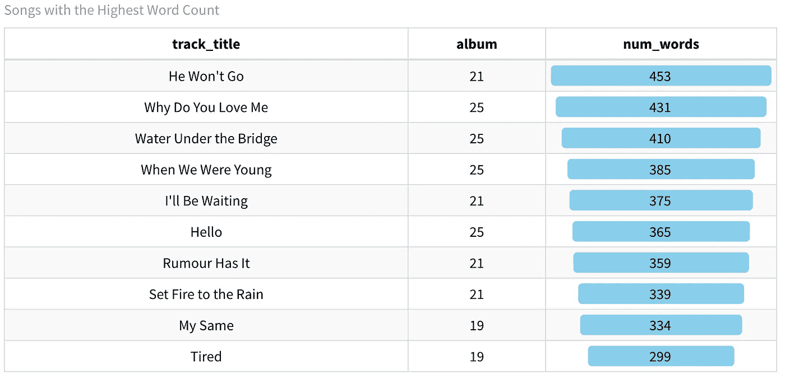

显然，阿黛尔的歌曲《他不会走》拥有最高的字数:453 个单词。据 genius.com 称，歌曲[的灵感主要来自阿黛尔的两个朋友，他们是在她的第一张唱片《19》发行后认识的。这名男性是一名海洛因成瘾者，一直在前往康复中心的途中。这对夫妇的关系帮助这只雄性克服了毒瘾，这真的让阿黛尔很感动，她说她为他们俩感到骄傲，因为这只雄性已经“戒了毒”一年多了。](https://genius.com/Adele-he-wont-go-lyrics#about)

而且我们还可以通过专辑直观的看到单词的分布。

```
word_count %>%
  ggplot() +
    geom_density(aes(x = num_words, fill = album), alpha = 0.5, position = 'stack') +
    ylab("Song Density") + 
    xlab("Word Count per Song") +
    ggtitle("Word Count Distribution") +
   theme_minimal()+
  theme(plot.title = element_text(hjust = 0.5,vjust = 1, face = "bold"), legend.position="bottom")
```

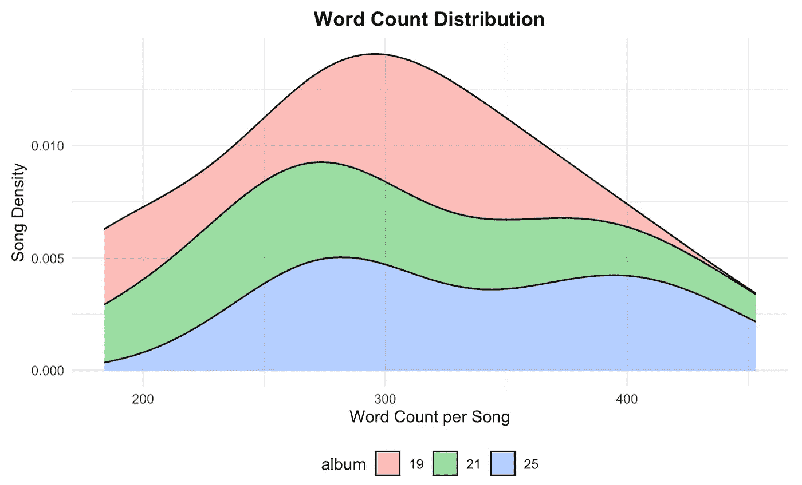

我们可以观察到，**字数最高的是专辑《19》**，后面的专辑字数较少。

让我们做一个简单的计数调用，看看哪些是基于“干净”数据集的最频繁的单词。

```
adele_tidy %>%
  count(word, sort = TRUE) %>%
  arrange(desc(n, .by_group = TRUE)) %>%
  top_n(10) %>%
  mutate(n = color_tile("#FFE4B5", "#FF4500")(n)) %>%
  kable("html", escape = FALSE, align = "c", caption = "The Most Frequent Words in Adele's Songs") %>%
  kable_styling(bootstrap_options = 
                  c("striped", "condensed", "bordered"), 
                  full_width = TRUE)
```

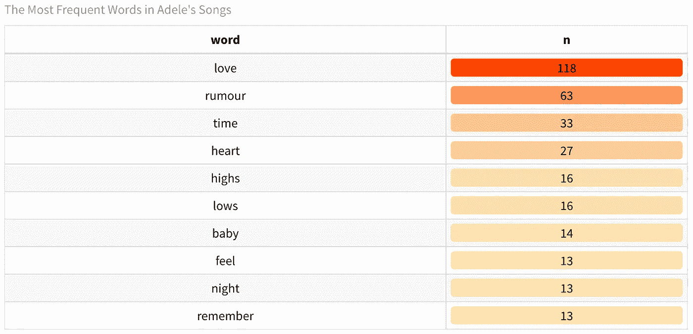

阿黛尔的歌曲中一个明显的主导是“爱”这个词(被提到 118 次！鉴于阿黛尔歌曲的总体特点，这也就不足为奇了。接下来常见的词是谣言(63 次)、时间(33 次)、心(27 次)和高低(都是 16 次)。令人兴奋，不是吗？

我们也可以画出最常用的词。

```
adele_tidy %>%
  count(word, sort = TRUE) %>%
  #filtering to get only the information we want on the plot
  filter(n > 13)%>%
ggplot(aes(x = reorder(word, n), y = n, fill = -n)) +
  #Use `fill = -word_count` to make the larger bars darker
  geom_col()+
  geom_text(aes(label = reorder(word, n)), 
            hjust = 1.2,vjust = 0.3, color = "white", 
            size = 5)+
  labs(y = "Number  of times mentioned", 
       x = NULL,
       title = "Most Frequent Words in Adele's Lyrics")+
  coord_flip()+
  ylim(c(0,130))+ 
  theme_minimal() + 
  theme(plot.title = element_text( hjust = 0.5,vjust = 1, face = "bold"),
        axis.text.y = element_blank(), legend.position = "none")
```

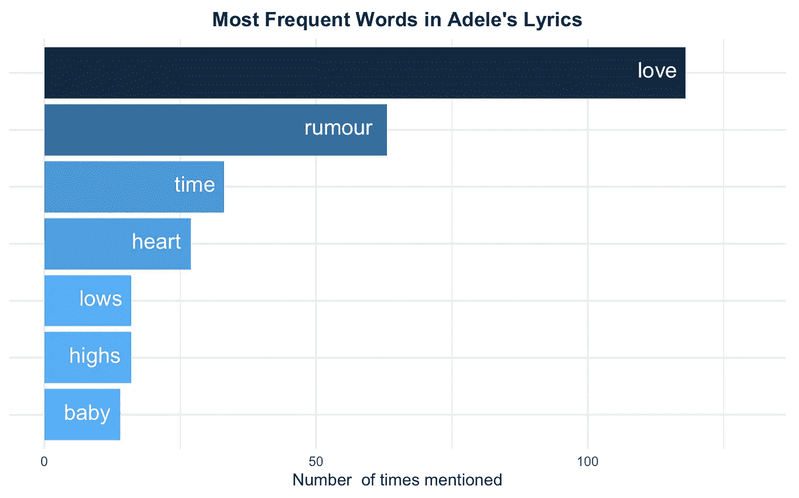

再者，我们可以用阿黛尔歌曲中出现频率最高的词创建一个词云。

```
adele_words_counts <- adele_tidy %>%
  count(word, sort = TRUE)wordcloud2(adele_words_counts[1:50, ], size = .5)
```

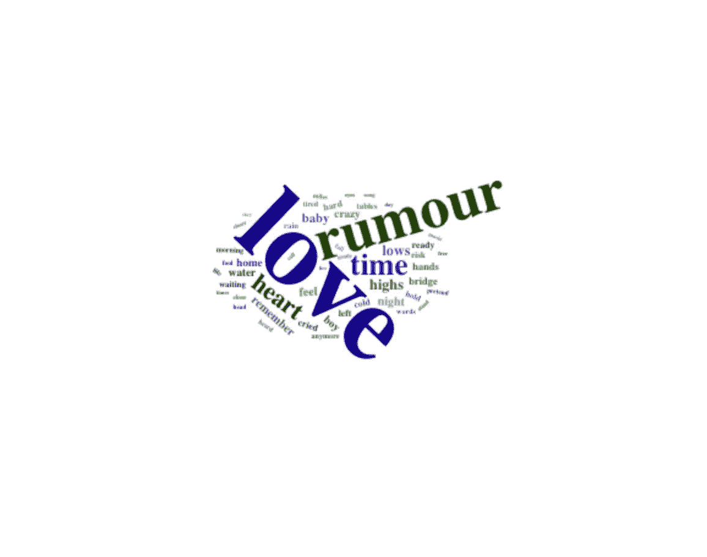

基于最常见的词，我们已经可以说阿黛尔的歌曲是忧郁的，并围绕着爱的主题。但是最常见的单词在不同专辑中的分布情况如何呢？

```
words_albums <- adele_tidy %>%
  group_by(album) %>%
  count(word, album, sort = TRUE) %>%
  slice(seq_len(10)) %>%
  ungroup() %>%
  arrange(album, n) %>%
  mutate(row = row_number())words_albums %>%
  ggplot(aes(row, n, fill = album)) +
    geom_col(show.legend = NULL) +
    labs(x = NULL, y = "Word count") +
    ggtitle("Words Across Albums") + 
    theme_minimal() +   
    facet_wrap(~album, scales = "free") +
   scale_x_continuous(  # This handles replacement of row 
      breaks = words_albums$row, # notice need to reuse data frame
      labels = words_albums$word) +
    coord_flip() +
  theme(plot.title = element_text(hjust = 0.5,vjust = 1, face = "bold"))
```

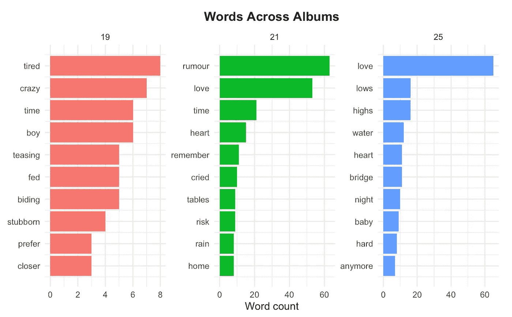

一个有趣的事实:**“爱”这个词在阿黛尔的最后两张专辑《21》和《25》中非常突出**，而在首张专辑《19》中，它甚至没有进入前 10 名。

最后但同样重要的是，我们可以检查每张专辑的词汇多样性，或者简单地说出每张专辑的词汇。为此，我们可以使用 yarrr 包中的**盗版情节。**该图是绘制连续因变量(如字数)作为分类自变量(如 album)函数的高级方法。同样，在这种情况下，我们使用的是“凌乱的”数据集，包含所有的停顿和短词。

```
word_summary <- adele_tok %>%
  group_by(album, track_title) %>%
  mutate(word_count = n_distinct(word)) %>%
  select(track_title, word_count) %>%
  distinct() %>% #To obtain one record per song
  ungroup()**pirateplot**(formula = word_count ~ album, 
             data = word_summary, #Data frame
   xlab = "Album", ylab = "Song Distinct Word Count", #Axis labels
   main = "Lexical Diversity Per Album", #Plot title
   pal = "google", #Color scheme
   point.o = .6, #Points
   avg.line.o = 1, #Turn on the Average/Mean line
   theme = 0, #Theme
   point.pch = 16, #Point `pch` type
   point.cex = 1.5, #Point size
   jitter.val = .1, #Turn on jitter to see the songs better
   cex.lab = .9, cex.names = .7) #Axis label size
```

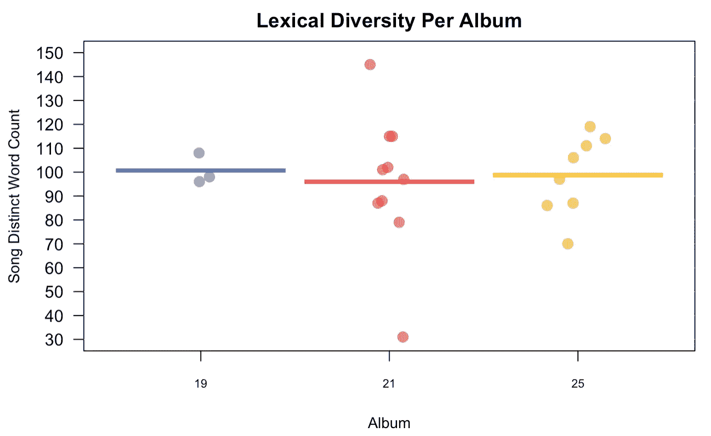

这个海盗情节中的每个彩色圆圈代表一首歌。在第二和第三张专辑中，每首歌曲的平均独特字数略有下降，然而，**总体而言，专辑的词汇多样性似乎几乎处于同一水平。**

## 术语频率-逆文档频率(TD-IDF)

到目前为止，我们已经查看了整个数据集，但没有分析歌词中某些词的重要性。衡量一个单词重要性的方法之一是它的**术语频率(tf)** ，即一个单词在文档中出现的频率。另一种方法是查看**术语的反向文档频率(idf)** ，这降低了常用单词的权重，增加了文档集中不常使用的单词的权重。这可以与术语频率相结合来计算术语的 TF-IDF(两个量相乘在一起)，术语的频率根据其使用频率进行调整。为此，我们首先需要计算每个相册中每个单词的 **tf、idf 和 tf_idf 度量**。

```
tfidf_words <- adele_tidy%>%
  count(album, word, sort = TRUE) %>%
  ungroup() %>%
  bind_tf_idf(word, album, n)tfidf_words [1:12,] %>%
  mutate(tf = color_tile("#FFA07A", "#FF0000")(tf)) %>%
  mutate(idf = color_tile("#98FB98", "#32CD32")(idf)) %>%
  mutate(tf_idf = color_tile("#E0FFFF", "#00BFFF")(tf_idf)) %>%
  kable("html", escape = FALSE, align = "c", caption = "Term Frequency-Inverse Document Frequency in Adele's Songs") %>%
  kable_styling(bootstrap_options = 
                  c("striped", "condensed", "bordered"), 
                  full_width = FALSE)
```

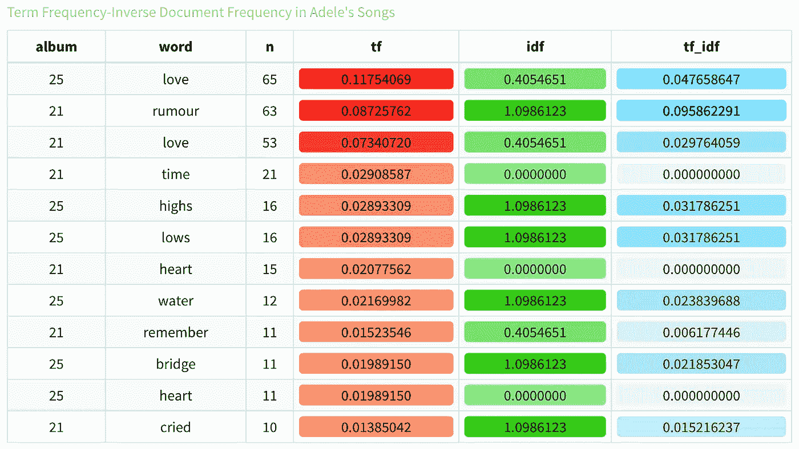

**不过，“爱”和“谣言”这两个词似乎有很高的 TF-ID 指标。**那么让我们选出每张专辑最重要的 10 个单词…

```
top_tfidf_words_album <- tfidf_words %>% 
  group_by(album) %>% 
  slice(seq_len(10)) %>%
  ungroup() %>%
  arrange(album, tf_idf) %>%
  mutate(row = row_number())
```

…我们也可以设计它们。

```
top_tfidf_words_album %>%
  ggplot(aes(x = row, tf_idf, fill = album)) +
  geom_col(show.legend = NULL) +
  labs(x = NULL, y = "TF-IDF") + 
  ggtitle("Important Words using TF-IDF by Album") +
  theme_minimal() +  
  facet_wrap(~album,
             scales = "free") +
  scale_x_continuous(  # this handles replacement of row 
    breaks = top_tfidf_words_album$row, # notice need to reuse data frame
    labels = top_tfidf_words_album$word) +
  coord_flip() +
  theme(plot.title = element_text(hjust = 0.5,vjust = 1, face = "bold"))
```

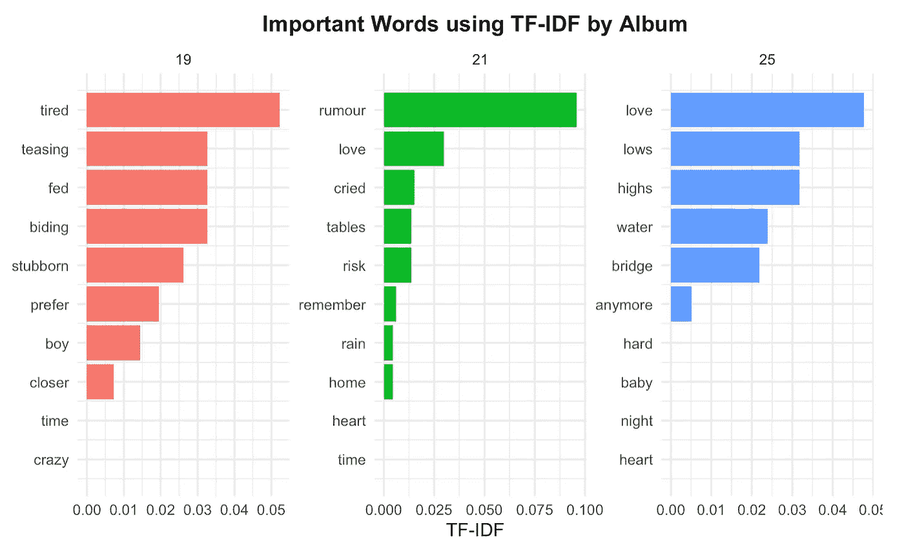

根据 TD-IDF 方法，专辑《19》中最重要的词是**“累了”**，而专辑《21》和《25》中最重要的词分别是**“谣言”**和**“爱”**。从“疲倦”到“谣言”,再到一些“爱”……多好的组合啊！

# 情绪分析

现在我们用 r 深入分析阿黛尔的歌曲内容。一个有趣的技巧是情感分析。情感分析是一种文本挖掘，用来识别文本内容的整体“情绪”，就歌词而言，它可以揭示艺术家的态度，甚至文化影响。R 中的情感分析可以通过 **tidytext package** 及其不同的情感词汇进行。三个通用词汇是:

*   Finn RUP Nielsen 的 AFINN
*   李冰来自刘冰及其合作者；
*   来自赛义夫·穆罕默德和彼得·特尼的 NRC。

> 所有这三个词汇都基于单个单词。

## 冰情

必应词典以二元方式将单词分为积极和消极两类。让我们先比较一下阿黛尔歌曲的积极和消极。

```
adele_bing_plot <- adele_tidy %>%
  inner_join(get_sentiments("bing"))

bing_plot <- adele_bing_plot %>%
  group_by(sentiment) %>%
  summarise(word_count = n()) %>%
  ungroup() %>%
  mutate(sentiment = reorder(sentiment, word_count)) %>%
  ggplot(aes(sentiment, word_count, fill = sentiment)) +
  geom_col() +
  guides(fill = FALSE) +
  labs(x = NULL, y = "Word Count") +
  ggtitle("Adele Bing Sentiment") +
  coord_flip() +
  theme_minimal()+
  theme(plot.title = element_text(hjust = 0.5,vjust = 1, face = "bold"), legend.position="bottom")bing_plot
```

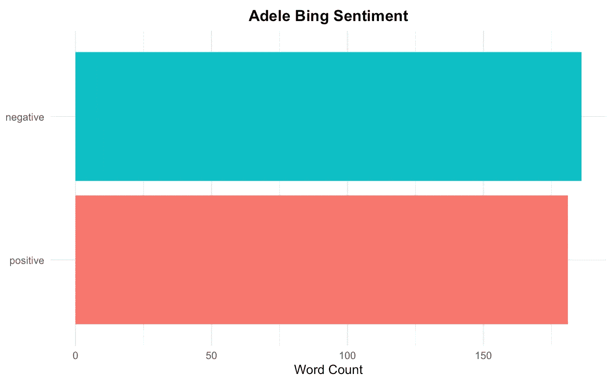

这里我们可以看到，根据 bing 方法，**阿黛尔的歌曲是消极的略多于积极的。**

在这一部分，我将通过计算积极情绪和消极情绪之间的差异，来计算阿黛尔每首歌中积极情绪和消极情绪的总量。首先，我将执行一个与所选词典的内部连接，这将添加一个列来指定一个单词是否具有与之相关的积极或消极情绪。然后，我用计数呼叫来计算一首歌中出现的正面和负面单词的总数。最后，我进行一些基本的数据争论来创建一个期望的表。更多关于 **tidytext 包**及其功能的信息，请咨询[本教程](https://www.tidytextmining.com/sentiment.html)，强烈推荐！

```
adele_bing<- adele_tidy%>%
  inner_join(get_sentiments("bing"))%>% 
  count(album, track_title, sentiment) %>%
  spread(sentiment, n, fill = 0) %>%
  mutate(sentiment = positive - negative)adele_bing [1:10,] %>%
  mutate(negative = color_tile("#FFA07A", "#FF0000")(negative)) %>%
  mutate(positive = color_tile("#98FB98", "#32CD32")(positive)) %>%
  mutate(sentiment = color_tile("#E0FFFF", "#00BFFF")(sentiment)) %>%
  kable("html", escape = FALSE, align = "c", caption = "Bing Sentiment of Adele's Songs") %>%
  kable_styling(bootstrap_options = 
                  c("striped", "condensed", "bordered"), 
                  full_width = TRUE)
```

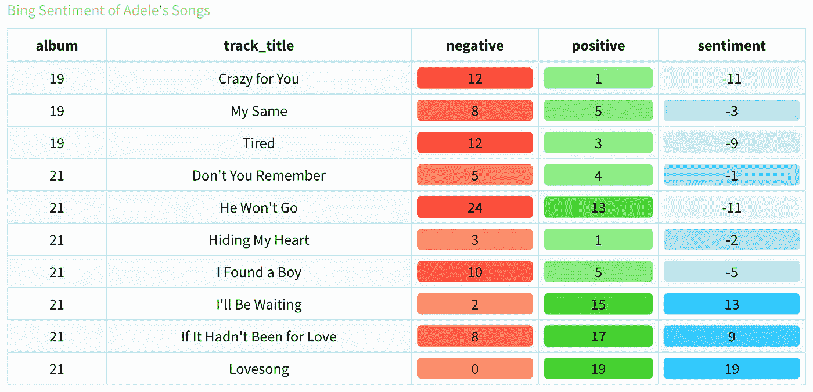

现在，我们可以根据 bing 词典绘制不同专辑和曲目的情感。

```
adele_bing%>%
  ggplot(aes(reorder(track_title, sentiment), sentiment, fill = album)) +
  geom_col(show.legend = TRUE) + 
  scale_fill_manual(values = c("#D8BFD8", "#FFD700", "#AFEEEE"))+
  labs(x = NULL,
       y = "Sentiment",
       title = "Adele's Songs Ranked by Bing Sentiment")+
  theme_minimal()+
  theme(plot.title = element_text(hjust = 0.5,vjust = 1, face = "bold"), legend.position="bottom")+
  coord_flip()
```


配合剧情**最正面的歌曲是《25》专辑中的《你为什么爱我》。这首歌的确有非常积极的基调。与其他专辑相比，专辑“21”有许多负面歌曲，这是有道理的，因为这张专辑是在艰难分手后创作的，象征着原谅和心碎。**

## NRC 情绪

NRC 情绪词典是一个英语单词列表，列出了八种基本情绪(愤怒、恐惧、期待、信任、惊讶、悲伤、快乐和厌恶)和两种情绪(消极和积极)。

```
adele_nrc <- adele_tidy %>%
  inner_join(get_sentiments("nrc"))
```

根据 NRC 的方法，现在我们可以看到阿黛尔的更多歌词是积极的还是消极的。

```
nrc_plot <- adele_nrc %>%
  group_by(sentiment) %>%
  summarise(word_count = n()) %>%
  ungroup() %>%
  mutate(sentiment = reorder(sentiment, word_count)) %>%
  #Use `fill = -word_count` to make the larger bars darker
  ggplot(aes(sentiment, word_count, fill = -word_count)) +
  geom_col() +
  geom_text(aes(label = word_count), 
            hjust = 1.3,vjust = 0.5, color = "white", 
            size = 4)+
  labs(x = NULL, y = "Word Count") +
  ggtitle("Adele NRC Sentiment") +
  coord_flip() +
  theme_minimal()+
  theme(plot.title = element_text(hjust = 0.5,vjust = 1, face = "bold"), legend.position="bottom")nrc_plot + guides(fill=FALSE)
```

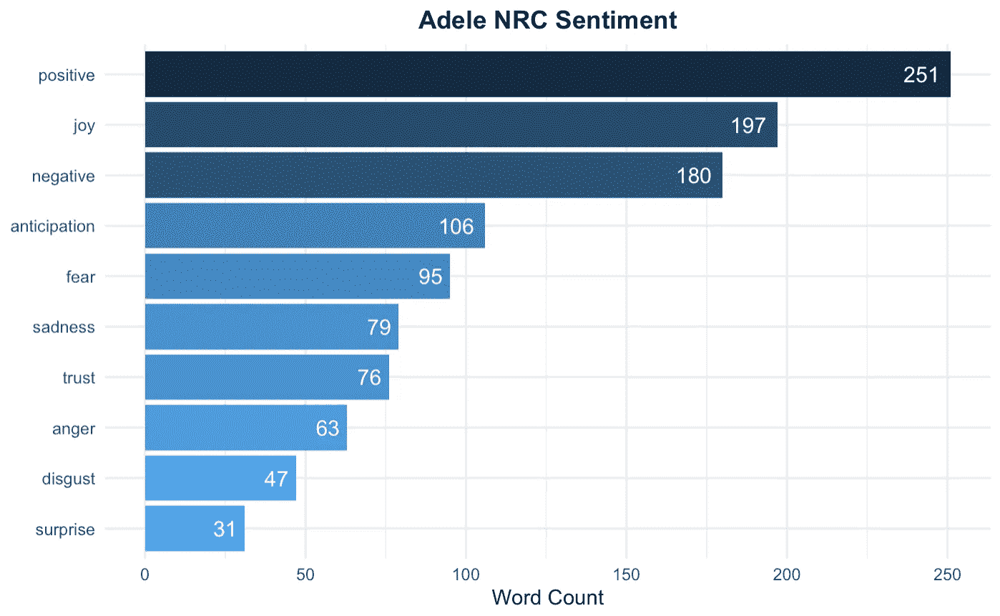

**与 bing 方法相反，这里正面情绪压倒负面情绪**，但是，必须记住，除了正面/负面情绪，还存在其他可能被归类为“正面”或“负面”的类别，例如，“快乐”或“悲伤”。

现在我们可以继续分析由 NRC 词典确定的属于不同情感的单词。

```
plot_words <- adele_nrc %>%
  group_by(sentiment) %>%
  count(word, sort = TRUE) %>%
  arrange(desc(n)) %>%
  slice(seq_len(8)) %>% #consider top_n() from dplyr also
  ungroup()
```

对于可视化，[可以创建一个特殊主题。](https://www.datacamp.com/community/tutorials/sentiment-analysis-R)

```
theme_lyrics <- function(aticks = element_blank(),
                         pgminor = element_blank(),
                         lt = element_blank(),
                         lp = "none")
{
  theme(plot.title = element_text(hjust = 0.5,vjust = 1, face = "bold"), #Center the title
        axis.ticks = aticks, #Set axis ticks to on or off
        panel.grid.minor = pgminor, #Turn the minor grid lines on or off
        legend.title = lt, #Turn the legend title on or off
        legend.position = lp) #Turn the legend on or off
}
```

现在我们可以想象单词本身。

```
plot_words %>%
  #Set `y = 1` to just plot one variable and use word as the label
  ggplot(aes(word, 1, label = word, fill = sentiment)) +
  #You want the words, not the points
  geom_point(color = "transparent") +
  #Make sure the labels don't overlap
  geom_label_repel(force = 1,nudge_y = .5,  
                   direction = "y",
                   box.padding = 0.04,
                   segment.color = "transparent",
                   size = 3) +
  facet_grid(~sentiment) +
  theme_lyrics() +
  theme(axis.text.y = element_blank(), axis.text.x = element_blank(),
        axis.title.x = element_text(size = 6),
        panel.grid = element_blank(), panel.background = element_blank(),
        panel.border = element_rect("lightgray", fill = NA),
        strip.text.x = element_text(size = 9)) +
  xlab(NULL) + ylab(NULL) +
  ggtitle("Adele NRC Sentiment") +
  coord_flip()
```

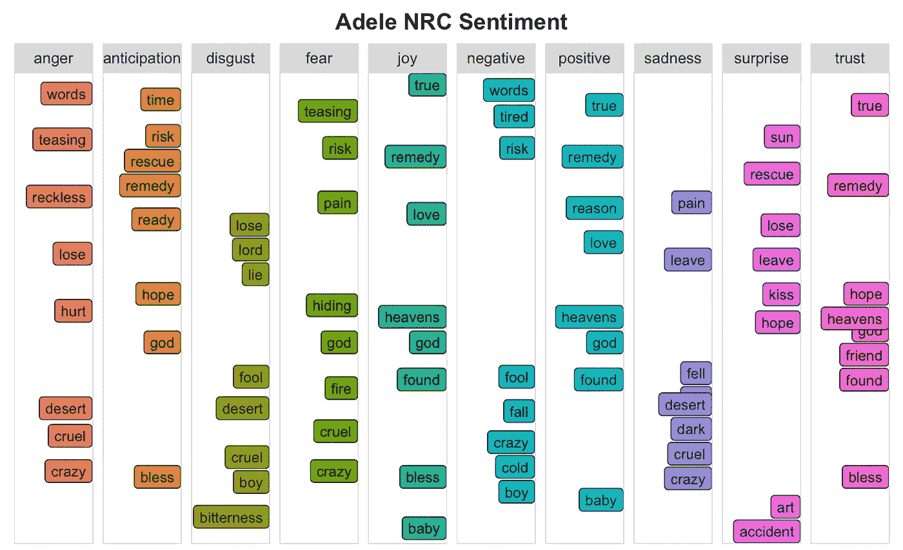

从情节上可以看出，将单词分配到预定义的情感中绝对有意义。**有些词，比如“终于”、“真”、“上帝”，同时以不同的情绪展现。**有趣的是，“男孩”这个词被归类为“消极”和“厌恶”。NRC 肯定知道些什么！

## 狂热的情绪

AFINN 词典给单词打分在-5 到 5 之间，负分表示消极情绪，正分表示积极情绪。

```
adele_afinn <- adele_tidy %>%
  inner_join(get_sentiments("afinn")) %>%
  group_by(album, track_title) %>%
  summarize(mean = mean(value, na.rm=TRUE))
```

现在让我们想象一下。

```
adele_afinn%>%
  ggplot(aes(reorder(track_title, mean), mean, fill = album)) +
  geom_col(show.legend = TRUE) + 
  scale_fill_manual(values = c("#D8BFD8", "#FFD700", "#AFEEEE"))+
  labs(x = NULL,
       y = "Sentiment",
       title = "Adele's Songs Ranked by AFINN Sentiment")+
  theme_minimal()+
  theme(plot.title = element_text(hjust = 0.5,vjust = 1, face = "bold"), legend.position="bottom")+
  coord_flip()
```

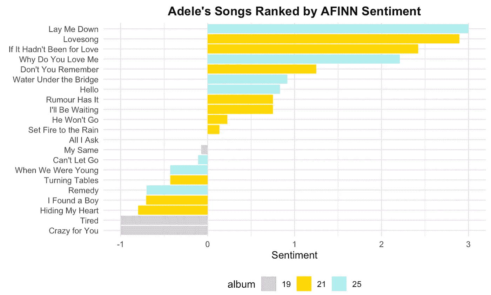

根据 AFINN lexicon，**最积极的阿黛尔的歌曲是专辑《25》中的《放下我》，而最消极的是《为你疯狂》和《19》中的《累了》。**在这里，专辑“25”中的歌曲被归类为积极的，尽管该专辑主要是关于遗憾和失去的时间。[阿黛尔说:“我的上一张唱片是分手唱片，如果非要给这张唱片贴上标签，我会称之为和好唱片。弥补失去的时间。弥补我做过和没做过的一切。25 岁是为了在不知不觉中了解自己变成了什么样的人。我很抱歉花了这么长时间，但是，你知道，生活发生了。”](https://phoenixsound.co.uk/products/adele-25-lp)

## 词汇的比较

最后，我们来比较一下这三个词典，以及它们是如何定义情绪的。

```
afinn <- adele_tidy %>% 
  inner_join(get_sentiments("afinn")) %>% 
  group_by(index = line) %>% 
  summarise(sentiment = sum(value)) %>% 
  mutate(method = "AFINN")bing_and_nrc <- bind_rows(
  adele_tidy %>% 
    inner_join(get_sentiments("bing")) %>%
    mutate(method = "Bing et al."),
  adele_tok %>% 
    inner_join(get_sentiments("nrc") %>% 
                 filter(sentiment %in% c("positive", 
                                         "negative"))
    ) %>%
    mutate(method = "NRC")) %>%
  count(method, index = line, sentiment) %>%
  spread(sentiment, n, fill = 0) %>%
  mutate(sentiment = positive - negative)
```

我们现在有了对每个情感词典的每一行歌曲中的净情感(正面-负面)的估计。让我们把它们捆绑起来，并把它们形象化。

```
bind_rows(afinn, 
          bing_and_nrc) %>%
  ggplot(aes(index, sentiment, fill = method)) +
  geom_col(show.legend = FALSE) +
  facet_wrap(~method, ncol = 1, scales = "free_y") + 
  labs(x = "Index",
       y = "Sentiment") + 
  theme_bw()
```

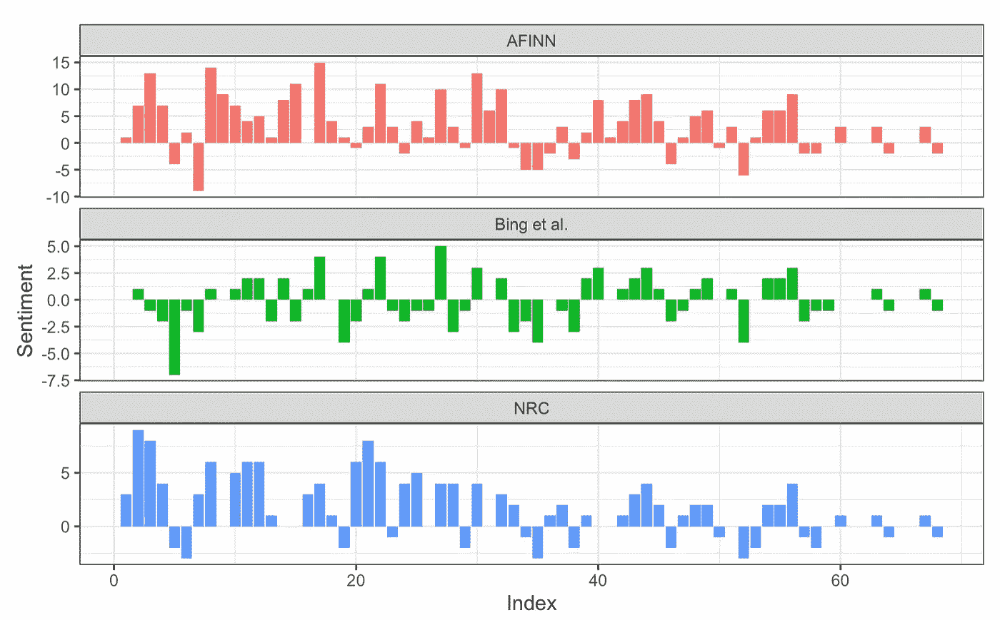

用于计算情感的三种词汇产生了不同的绝对结果，然而在阿黛尔的歌曲中却有着相似的轨迹。我们确实可以在歌曲的相同地方观察到相似的情绪低谷和高峰。AFINN 词典绝对值最大，正值高。Bing 等人的词典具有较低的绝对值。NRC 结果相对于其他两个结果偏移得更高，更积极地标记文本，但在文本中检测到类似的相对变化。

# 歌曲网络

在我们后面很远的地方！到目前为止，我们已经下载了歌词，整理了数据，进行了基本的文本挖掘，并通过不同的方法分析了阿黛尔歌曲的情感。现在我们可以检查一下阿黛尔的歌曲在歌词方面是如何相互关联的。为此，我们将采用网络分析法。[网络分析是一套综合技术，用于描述行动者之间的关系，并分析这些关系循环出现的社会结构。](https://www.sciencedirect.com/topics/social-sciences/network-analysis)

首先，我们需要检查歌曲的成对相关性。

```
adele_cor <- adele_tidy %>%
  pairwise_cor(track_title, word, sort = TRUE)adele_cor %>%
  arrange(desc(correlation, .by_group = TRUE)) %>%
  top_n(10) %>%
  mutate(correlation = color_tile("lightgreen", "skyblue")(correlation)) %>%
  kable("html", escape = FALSE, align = "c", caption = "Correlation between Adele's Songs") %>%
  kable_styling(bootstrap_options = 
                  c("striped", "condensed", "bordered"), 
                  full_width = TRUE)
```

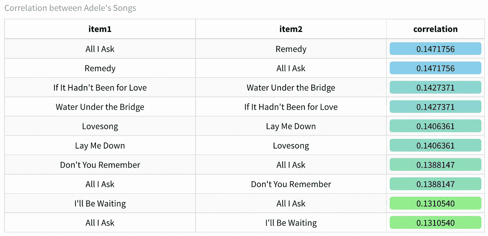

这么多的关联，会很难出好看的剧情。因此，首先我们需要过滤掉相关性，例如，让我们只留下那些相关性高于 0.1 的歌曲对。*快速提示:每次运行该函数时，R 可能会产生不同的图，因此，建议首先设置一个种子。*

```
set.seed(123)adele_cor %>%
  filter(correlation > .1) %>%
  graph_from_data_frame() %>%
  ggraph(layout = "fr") +
  geom_edge_link( show.legend = FALSE, aes(edge_alpha = correlation)) +
  geom_node_point(color = "#BA55D3", size = 5) +
  geom_node_text(aes(label = name), repel = TRUE, size = 3.5, color = "black") +
  theme_void()
```

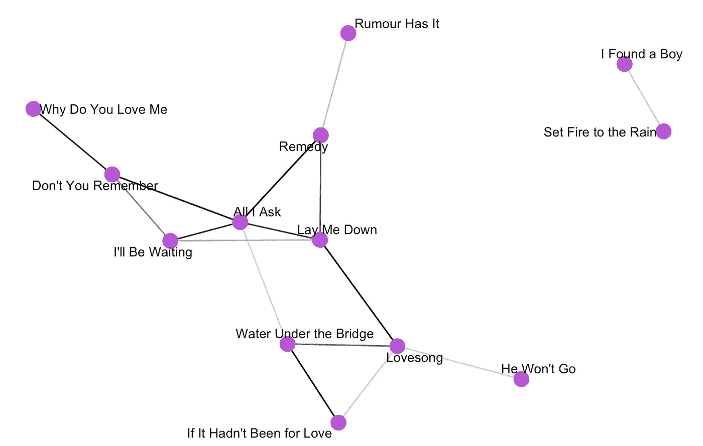

在这里我们可以看到，阿黛尔的歌曲在歌词方面没有那么紧密的联系，这意味着阿黛尔的歌曲的确是独一无二的，她不会重复自己。《我找到了一个男孩》和《放火烧雨》和网络其余部分根本没有联系。

# 关键见解

总而言之，以上对阿黛尔专辑的分析无疑提供了许多值得思考的东西。**以下是一些发现的摘要。**

1.阿黛尔的《他不会走》(专辑《21》)字数最高:453 字。

2.专辑《25》的词密度最高。

3.阿黛尔歌曲中出现频率最高的词是“爱”(118 次)，其次是“谣言”(63 次)和“时间”(33 次)。

4.在专辑《19》中最常用的词是“累”，而在专辑《21》和《25》中分别是“谣言”和“爱”。

5.所有三张专辑的词汇多样性水平几乎相同(歌词中独特词的比例)。

6.根据 TD-IDF 方法，每张专辑最重要的词仍然是“累”(专辑“19”)、“谣言”(专辑“21”)和“爱”(专辑“25”)。

7.对于情感分析，使用了三种不同的词汇。根据必应词典，阿黛尔的歌曲稍微消极一些，与阿芬方法相反。根据美国国家研究委员会的情感分析，阿黛尔歌曲中的许多词被归类为“积极”、“快乐”、“消极”和“期待”情感。

8.情感分析方法显示了一些相似性，然而，正面和负面情感的分布略有不同。

9.基于网络分析方法，阿黛尔的歌曲在歌词方面没有那么紧密地联系在一起。

# 用于进一步分析的有用链接

当然，以上分析并没有呈现歌词分析的方方面面。对于进一步的研究，Spotify 功能的集成将是相关的。此外，这里有几个链接，人们可以从中找到进一步工作的灵感和想法:
[https://www . data camp . com/community/tutorials/情操分析-R](https://www.datacamp.com/community/tutorials/sentiment-analysis-R)
[https://www.tidytextmining.com/index.html](https://www.tidytextmining.com/index.html)
[https://uc-r.github.io/sentiment_analysis](https://uc-r.github.io/sentiment_analysis)

**综上所述，阿黛尔歌曲的歌词远远超越了数字和统计，它们简直是永恒的！**