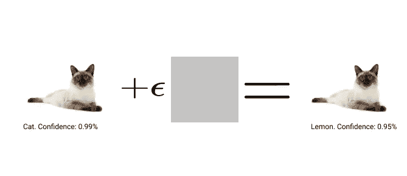
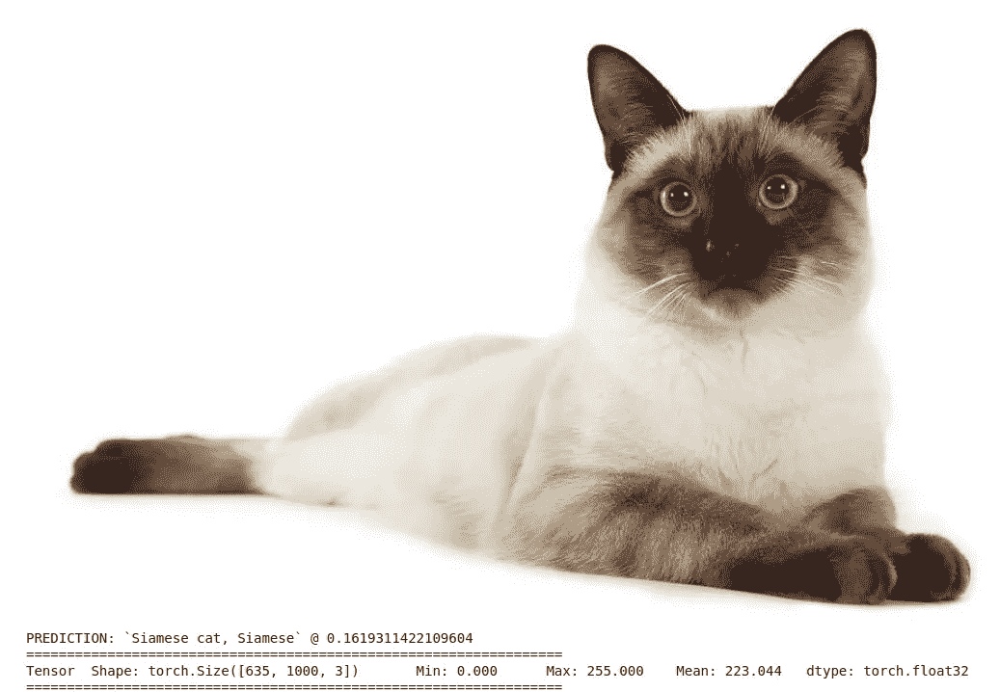
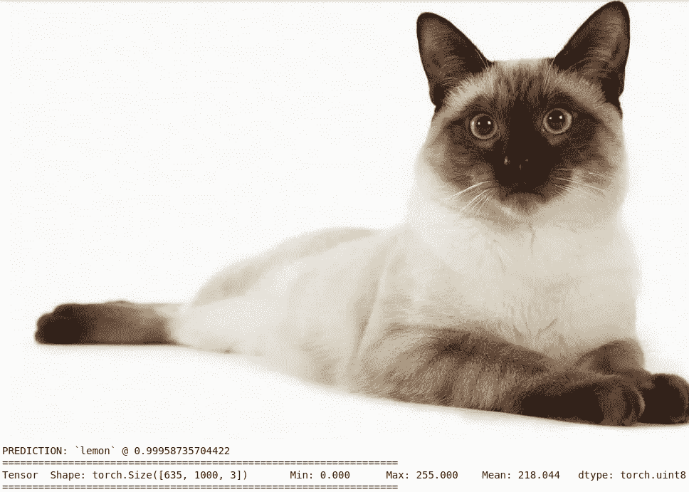
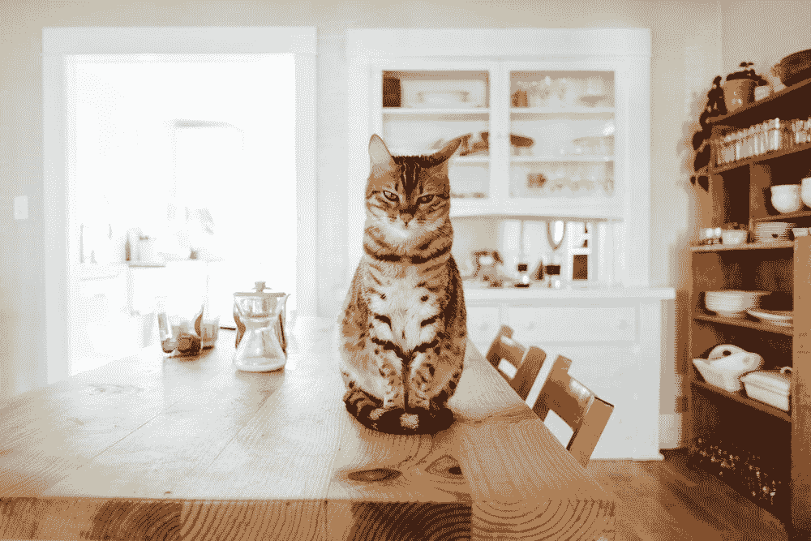

# 对抗性攻击:介绍和例子

> 原文：<https://medium.com/mlearning-ai/adversarial-attacks-introduction-and-example-3224ccffc720?source=collection_archive---------3----------------------->

攻击机器学习模型。把猫变成柠檬。

# 概念

对立的例子是特别设计的输入，被认为是欺骗机器学习(ML)模型，导致高置信度的错误分类。然而，有趣的是，对图像所做的修改是温和的，但却足以欺骗 ML 模型。在这篇文章中，我将展示微小的变化可能会导致灾难性的后果。下图总结了对抗性攻击的过程:

Image by the author.

考虑上面的一幅猫的图像，我们添加了一个小扰动，这个小扰动已经被计算过，以使图像被高置信度地识别为柠檬。更具体地说，我们将获取图像，并计算相对于所需标签的损失，在本例中是“柠檬”。因此，我们可以得到为输入图像计算的梯度的符号，并将其乘以某个小常数ε。经过多次这样的迭代，我们能够得到猫的图像，使我们的 ML 模型以很高的可信度将其归类为柠檬。

这种方法非常健壮，而且简单易懂。然而，对立的例子可能是非常危险的。例如，攻击者可能会让我的人工智能柠檬水制作机器人挤压我的猫，然后制作另一种柠檬水。那会很难过:(

# 例子

举个例子，我要考一个预先在 Imagenet 上培训过的 ResNet50。列表上总共有 1000 个类，我使用一只暹罗猫作为初始输入，我想要的标签是柠檬。

Image by the author.

正如所见，模型正确地将我的图像分类为“暹罗猫，暹罗猫”。注意，由于图像的尺寸大于用于训练的尺寸，所以置信度较低。现在，我们将试图欺骗我们的模型，将其归类为柠檬。

这是我用来做预测的辅助函数。输入是我的 PIL 猫的图像。它接受我的输入并打印出预测的类及其概率。

正如我已经描述过的，我如何攻击的过程被总结在“攻击”方法中。我运行这个函数 10 次，这足以让我们的 ResNet50 把它误归类为一个柠檬。注意，我们只取梯度的符号，要么是 1，要么是-1，然后乘以ε，也就是 1e-6。

Image by the author.

瞧！我实现了我们的目标。该模型现在以非常高的概率将我们的猫归类为柠檬，但是我们可以清楚地看到图像在视觉上仍然是一只猫。

by [Paul Hanaoka](https://unsplash.com/@plhnk) via [Unsplash](https://unsplash.com/photos/w2DsS-ZAP4U)

# 一些遗言

如你所见，对抗性攻击非常简单有趣。然而，这可能是潜在的危险，它可能会质疑人工智能的可靠性。这是最近的一个主要研究领域。强化学习代理也可以被对立的例子操纵。我会通过 OpenAI 留下一个有用的博客。如果我设法让你感兴趣，我鼓励你自己研究它。感谢您花时间阅读我的文章。保持自信，不要让小变化影响你:)

 [## 用对立的例子攻击机器学习

### 敌对的例子是攻击者有意设计的机器学习模型的输入，以引起…

openai.com](https://openai.com/blog/adversarial-example-research/)