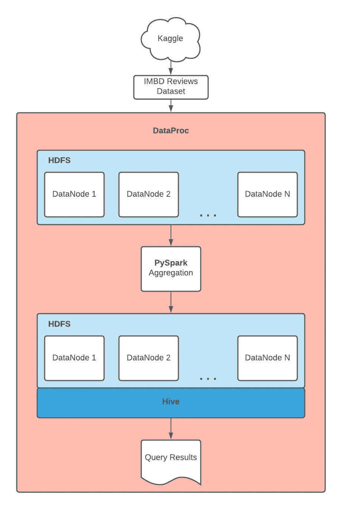
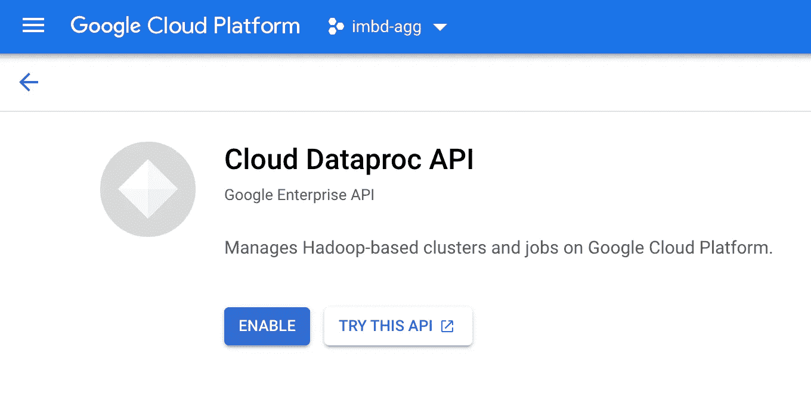
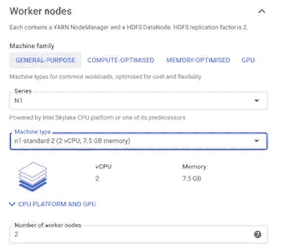
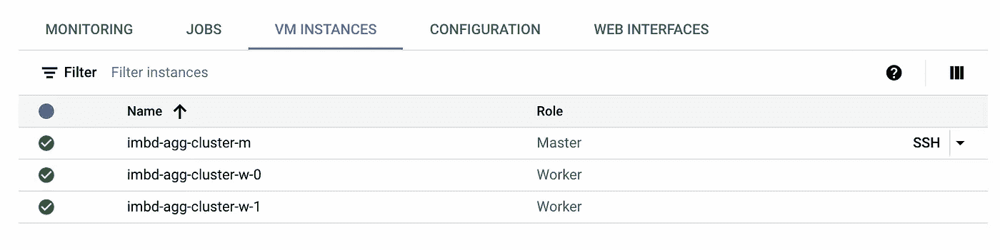
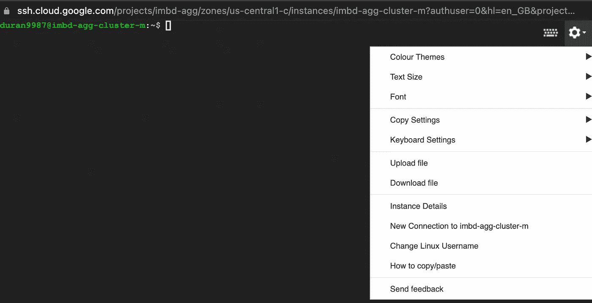
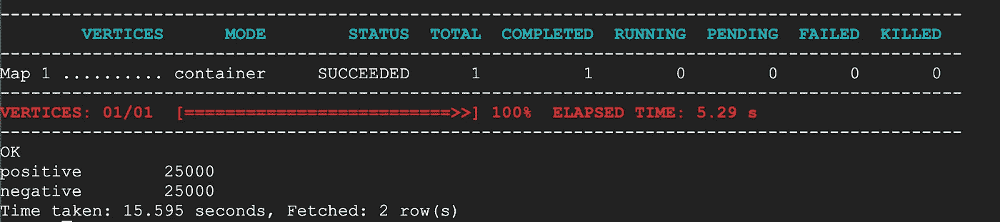

# 在 GCP 用 PySpark 聚合数据

> 原文：<https://medium.com/mlearning-ai/aggregating-data-with-pyspark-on-gcp-aed527a1e8bc?source=collection_archive---------0----------------------->


Photo by [Nana Smirnova](https://unsplash.com/@nananadolgo?utm_source=unsplash&utm_medium=referral&utm_content=creditCopyText) on [Unsplash](https://unsplash.com/s/photos/boxes?utm_source=unsplash&utm_medium=referral&utm_content=creditCopyText)

👋🏼大家好！

这篇文章是关于熟悉一些数据工程的基础工具。我们将从 Kaggle(手动)获取 IMBD 评论数据集，将其上传到 Hadoop 集群，使用 PySpark 聚合数据，并将结果加载到 Hive 表中。

这个练习不仅是为了熟悉工具，也是为了学习数据生命周期。

对于那些不熟悉上述技术的人，这里有一个简短的描述:



**Hadoop —** 一个允许我们在一个机器集群上处理(并行)和存储大型数据集的框架。处理框架称为 MapReduce，存储称为 Hadoop 文件系统(HDFS)。我们将使用 GCP 的 data proc——一种托管的 Hadoop 服务，而不是从头开始建立我们的集群。

**Spark** —与 Hadoop 非常相似，Spark 也是一个分布式数据处理框架(不包括存储)。这种处理发生在内存中，比 Hadoop 将数据从存储位置拉到计算位置的方法快得多。Spark 提供了许多 API 其中之一是 Python 接口 PySpark。

**Hive** —分布式数据仓库分析系统。Hive 构建在 Hadoop 之上，将用于查询我们的 PySpark 作业的结果。

🚨警告！！！GCP 不是免费的，为了完成这个项目，你将支付几分钱(除非你有信用)。

## Dataproc

让我们从前往 Google 云平台控制台并创建一个新项目`imbd-agg`开始。


在创建集群之前，您必须启用 Dataproc API(您可能必须首先启用 billing)。所以抓紧了；这一步需要几分钟时间。



在启用 Dataproc API 之后，继续创建集群，除了工作机之外，保持大部分默认值不变，在工作机上，我们将 4 个 vCPUs 更改为 2 个。



那么我们到底创造了什么？

Hadoop 的架构是由主节点和工作节点组成的网络。在很高的层次上，主节点(特别是 NameNode)负责协调由工作节点执行的 HDFS 功能。我们的集群由一个主机和两个工作机组成。

## IMBD 评论数据集

让我们暂时离开 GCP，下载我们的数据集。

前往[Kaggle.com](https://www.kaggle.com/lakshmi25npathi/imdb-dataset-of-50k-movie-reviews)，将电影评论下载到你的本地机器上。预计该数据集中有两列(评论和观点)和 50K 行。

这里的目标是使用 Spark 进行简单的聚合。我们将对数据进行分组，以找出正面和负面评论之间的计数。正面和负面评论的数量相当，因此我们预计每条评论的数量为 25K。我希望这篇文章支持数据生命周期，而不是任何特定的工具，但是可以随意查看 Spark 的文档，了解更复杂的转换。

## PySpark 脚本

```
""" main.py pyspark job to group and count positive and negative
reviews """from pyspark.sql import SparkSessionspark = SparkSession.builder.appName('sentiment').getOrCreate()reviews = spark \
  .read \
  .option('escape', '"') \
  .csv('/user/jduran9987/data/imbd_dataset.csv', *header*=True)sentiment_breakdown = reviews \
  .groupBy('sentiment') \
  .count()sentiment_breakdown.write.format('csv').save('sentiment_breakdown')
```

🚨仅供参考:我们所有的工作都将在 Dataproc 集群中的主节点内完成，因此没有必要为这个项目设计一个文件夹结构。届时，上述脚本将被添加到我们的主节点中，并从那里执行。

从脚本的顶部开始，我们导入 SparkSession 对象。这是 Spark 应用程序的入口点，用于(在我们的例子中)创建数据的抽象表示，称为 dataframe。

创建数据帧时有许多可用的方法，但是对于这个简单的项目，我们只需要从我们的文件系统中读取一个 csv 文件(稍后我们将在 HDFS 创建这个路径)。我们还包括一个转义引号的选项，因为我们的一些评论包含逗号，这将真正扰乱 Spark 解析 csv 文件的方式。

通过按情感对`reviews`数据帧进行分组并对值进行计数，创建新的数据帧`sentiment_breakdown`。Spark 提供了两种主要类型的操作——转换和操作。将数据分组是转换的一个例子，而执行计数是一个动作。每次我们转换数据时，我们可能会创建一个对数据进行分组的数据帧，并使用该结果创建另一个过滤数据的数据帧，这样就创建了一个新的不可变数据帧。实际上没有采取任何行动，相反，Spark 为如何最好地执行您的转换创建了一个逻辑计划。只有当你调用一个动作(比如 count)时，Spark 才会执行你的代码并产生结果。

最后，结果被写回我们的文件系统。

## 返回到 Dataproc

在“cluster details”页面中，导航到“VM instance”选项卡，然后单击 SSH 以进入主机。



终端应该打开，在右上角有一个齿轮菜单，包含上传文件的选项。继续将 main.py pyspark 作业和 IMBD 评论文件上传到实例。



一旦我们的文件在我们的机器上，我们可以通过执行下面的命令在 HDFS 上创建一个用户目录。

`$ hadoop fs -mkdir /user/<your-gcp-project-username>`

在我的例子中，命令是/user/jduran9987，但是您必须在@符号前使用终端上显示的用户名。

完美！我们现在创建一个数据目录，然后使用`put`命令将 reviews 数据集添加到 HDFS。

```
$ hadoop fs -mkdir /user/<your-gcp-project-username>/data
$ hadoop fs -put imbd_dataset.csv /user/<your-gcp-project-username>/data/
```

现在数据已经在 HDFS 了，是时候运行我们的 PySpark 作业了。

```
$ spark-submit main.py
```

您可以使用以下命令来验证结果。

```
$ hadoop fs -ls /user/<your-gcp-project-username>/sentiment_breakdown
```

成功！

## 储备

是时候创建一个 Hive 表来查询我们的结果了。我们只需在 hive 中键入，就可以在终端中访问 Hive。

```
$ hive
```

您现在应该能够看到`>hive`提示符。

最后，让我们创建一个数据库、表，并使用以下命令查询我们的 PySpark 作业的结果。

```
>hive create database if not exists sentiment;
>hive use sentiment;
>hive create table sentiment_breakdown
  > (sentiment string, review_count int)
  > row format delimited fields terminated by ','
  > location '/user/<your-gcp-username>/sentiment_breakdown';
>hive select * from sentiment_breakdown
```

这显示了 Hive 和 HDFS 之间的紧密关系。与其他仓库不同，我们不必将数据复制到表中。



## 包裹

*   确保您删除了您的 Dataproc 集群，以避免一个大的账单。这个项目的资源成本几乎为零，但是您不想让您的集群继续运行。
*   这种设置不适合生产。目标是熟悉 Hadoop、Spark、GCP 和 Hive。在现实世界中，使用类似 Airflow(它有一个 Dataproc 操作符)的东西来提供集群，提交 spark 作业，并按计划删除集群。
*   如果您是一名有抱负的数据工程师，并且被这些工具所淹没，不要担心。尝试在很高的水平上掌握这些概念，并在工作中学习细节。我从事这个行业已经有一段时间了，但仍然需要通过 transformation command 查找 PySpark 组🤷🏼‍♂️.我对记忆命令没有兴趣，你也不应该。

感谢阅读！