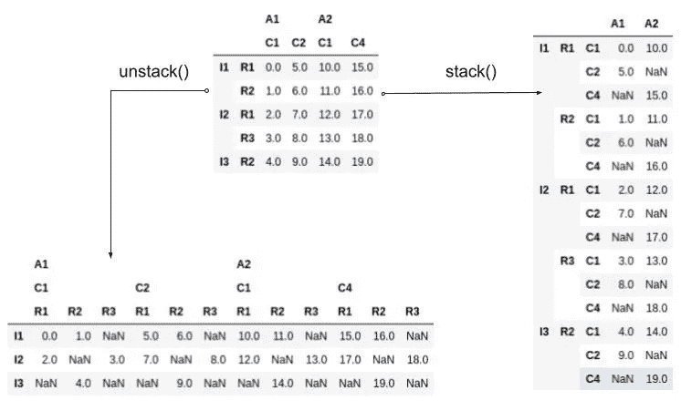
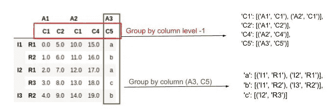
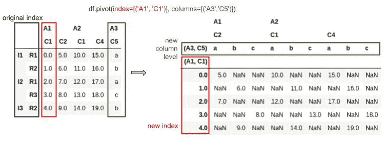

# 熊猫的聚集

> 原文：<https://medium.com/mlearning-ai/aggregation-in-pandas-d6cd37008752?source=collection_archive---------5----------------------->

我总是将数据操作视为乐高游戏——理解小片段将帮助你创建你想要的模型！

聚合是基于某些标准收集/拆分数据的过程(1)，然后对其应用统计方法，以便每个组都以一个数字表示(2)。(1)确定数据范围，(2)进行数学运算。本文将在 Pandas 中解释这些步骤，Pandas 是 Python 中操作数据最流行的库之一。

Photo by [Markus Spiske](https://unsplash.com/@markusspiske?utm_source=medium&utm_medium=referral) on [Unsplash](https://unsplash.com?utm_source=medium&utm_medium=referral)

# (1) —一切都与数据有关

如果我们想要聚合整个数据或特定的列，这一步没有太多的工作:我们通过从数据帧或序列中直接调用聚合函数来立即执行步骤(2)。不幸是，我们通常需要更多:我们希望通过数据组来计算这些统计数据。本文更侧重于这一步，通过对熊猫内置函数 **stack** 、 **unstack** 、 **groupby** 、 **pivot** 、 **pivot_table** 、 *when* 我们应该使用哪些*然后给大家展示一些它们的常见组合。*

**stack()* —最里面的列级别成为最里面的索引。如果只有一层列，则返回一个序列，否则返回一个数据帧。*

**unstack()* —与 *stack()* 相反，你最里面的索引变成了你最里面的列级。*

**

*Stack/Unstack Example*

**groupby()* —顾名思义，帮助您按一个或多个列值或列级别对数据进行分组。它**不会**重塑您的数据——相反，它会创建一个 *DataFrameGroupBy* 类型的实例来存储关于找到的组及其相关列/索引的所有细节。然后，您可以从特定组恢复数据，或者对它们应用聚合函数。您应该注意，数据的后续更改会影响表示和聚合结果，而不是组本身。*

**

*Groupby Example*

**pivot(index，columns，values) —* **根据列值对数据**进行整形，并返回新的 DataFrame。假设 *groupby()* 可以重塑数据，我们可以把这个函数理解为一个 *groupby(index，columns)* 后跟一系列 *unstack(columns[i])* 函数的组合，然后只选择*值*列来显示。该函数**不支持聚合。***

**

*Pivot Example*

*在这个例子中，如果我们添加参数 *values=('A1 '，' C2')* ，那么结果将只显示这一列的数据。*

**pivot_table()* —我们可以把它理解为 pivot()函数的一个聚合支持版本。*

*好了，现在我们知道它们是什么了，下面是一些常见的组合。*

1.  *groupby()和 unstack()
    在用 Pandas 分析数据时，我们可以大量使用这种组合。当根据列值对数据进行分组时，聚合结果按行返回，很难在它们之间进行其他计算。请记住，Pandas 是围绕 DataFrame 工作的，data frame 是一种列数据结构，所以最好是使用列。*
2.  *stack()和 unstack()
    当我们需要对一个列值进行聚合并以基于列的方式显示结果时，这很有用。用 *groupby(轴=1)* 和 *unstack()* 可以达到同样的效果。*

# *(2)关于聚合的一点看法*

*根据步骤(1)，我们有不同的方法对数据应用聚合函数。*

1.  *直接从 DataFrame、Series 或 GroupBy 对象调用聚合函数。还有很多内置函数像 *sum()、mean()、median()等。**
2.  *对于 GroupBy，我们有其他选择:
    - *apply()* :从技术上讲，我们将*每个组*传递到函数中，并将它们的结果组合在一起。如果可能的话，考虑使用 *pipe()* ，因为 *apply()* 在很多情况下并没有很好的性能。
    - *pipe():* 将 *GroupBy* 对象传递到函数中，这样所有的组上下文都可以从函数中访问。当我们需要做一系列的聚合时，管道也是有用的，一个的输出是另一个的输入。
    - *transform()* :类似于 *apply* ，但是一旦完成，它会用聚合数据替换原始数据。*
3.  *用 *pivot_table()* ，我们直接定义*我们要在*什么*列上执行哪些函数*作为参数。*

*我的收获:*

> *基于列级别/索引重塑数据，尝试堆叠/拆分。*
> 
> *基于列值重塑数据，想想透视。使用 pivot_table 处理重复。*
> 
> *如果只做聚合，可以考虑 groupby。*
> 
> *Pivot/pivot_table 是丰富的函数。如果您认为 groupby+stack+unstack 太复杂而无法转换数据，请尝试一下。*