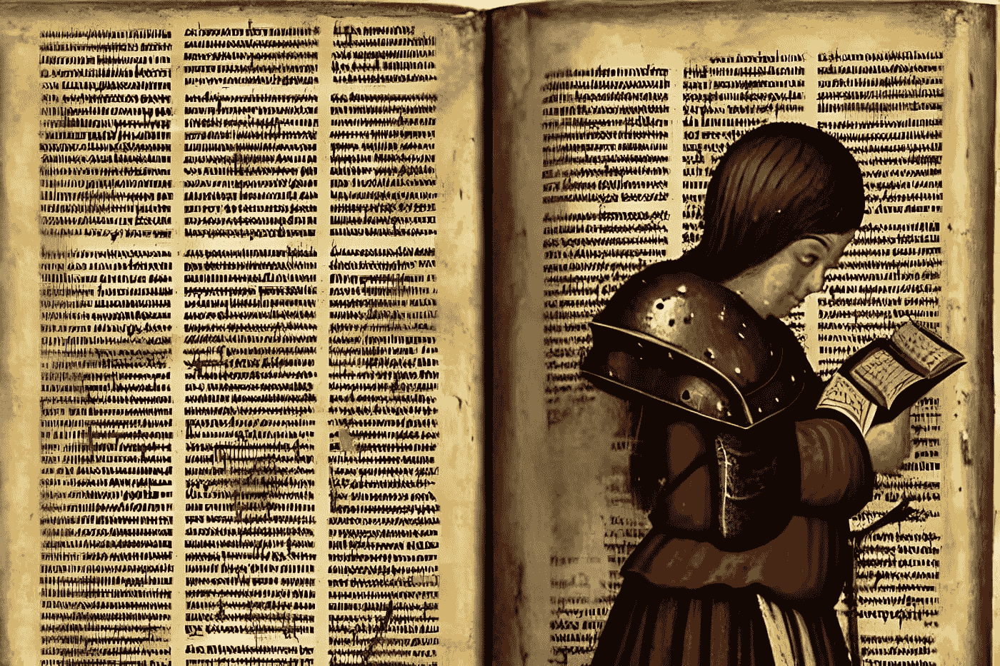

# 艾与圣经:六翼天使、基路伯和宝座

> 原文：<https://medium.com/mlearning-ai/ai-and-the-bible-seraphim-cherubim-and-thrones-3f37362b3837?source=collection_archive---------2----------------------->

天使的传统一直吸引着我。既因为我家有很强的精神内涵，也因为传统对天使的再现和他们的文字描述有很大的不同。有什么更好的论据来测试圣经中的天使对人工智能的看法呢？

今天我关注的是第一层天使，最重要也是最接近…