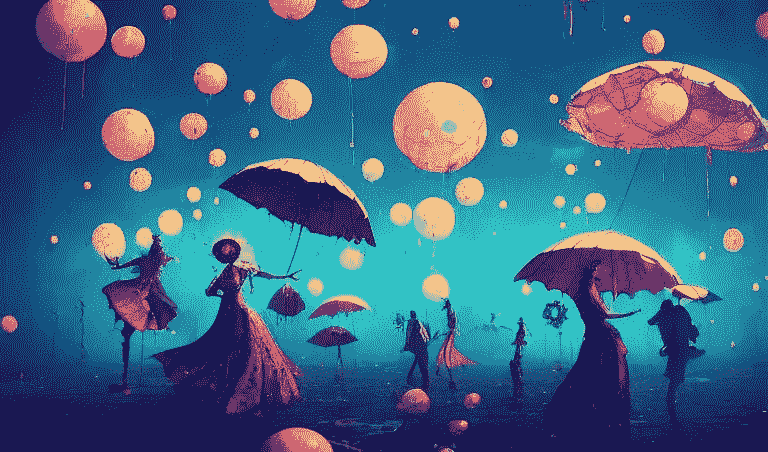

# 艾艺术与混搭文化

> 原文：<https://medium.com/mlearning-ai/ai-art-and-the-remix-culture-869e95d02297?source=collection_archive---------0----------------------->

© the dance, made on Midjourney

*“每一个新想法都只是一个或多个先前想法的混搭或混搭”*
——奥斯丁·克莱恩

混音一直是音乐行业的一个重要组成部分，始于 70 年代 DJ 的兴起，并由坎耶·韦斯特和克瑞丝·布朗等艺术家推广开来，他们制作的歌曲版本比原版更好。