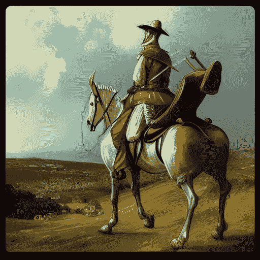
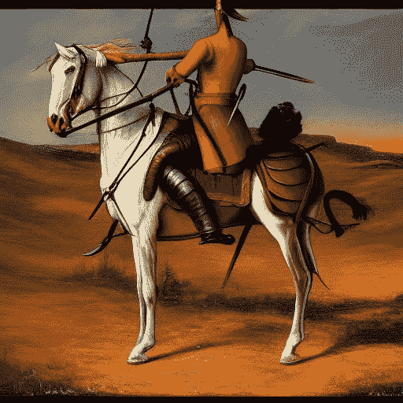
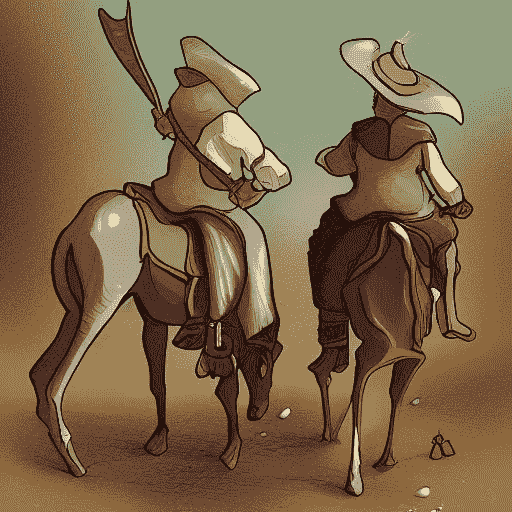
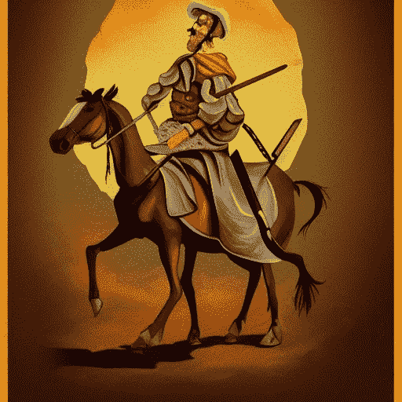

# 人工智能艺术生成器重新想象名著

> 原文：<https://medium.com/mlearning-ai/ai-art-generator-reimagines-famous-books-e441fe220c7f?source=collection_archive---------4----------------------->

*创作有*

***1。唐吉诃德***

********

***2。指环王***