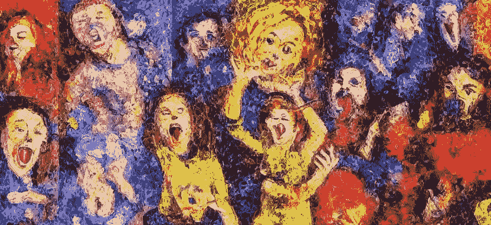

# 基于情感的人工智能生成艺术

> 原文：<https://medium.com/mlearning-ai/ai-art-interprets-emotions-78a921b770d5?source=collection_archive---------0----------------------->

**Prompt:** impressionist image of different emotions, absract, — made on Stable Diffusion

以下是一个测试四种流行的人工智能艺术生成工具如何在最纯粹的 意义上解释情绪的实验。这意味着每个提示只有一个单词，没有描述性文本，没有提到样式，没有参数，一切都是默认设置。

下面显示的结果是第一印象，对于以四个变体开始的两个工具，我选择了四个变体的第一个图像…