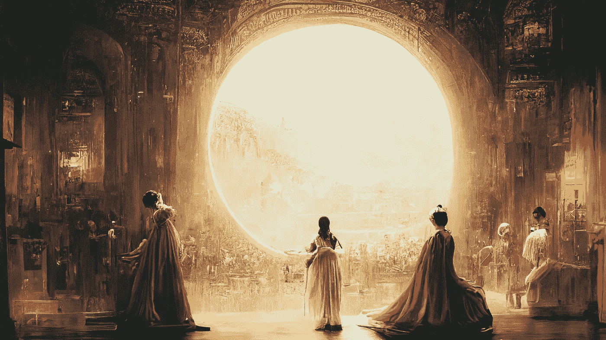

# 人工智能艺术赢得比赛并引发争议

> 原文：<https://medium.com/mlearning-ai/ai-art-wins-fine-arts-competition-and-sparks-controversy-882f9b4df98c?source=collection_archive---------1----------------------->

Jason Allen's art created on Midjourney titled “Space Opera Theater”

这可能是人工智能生成的艺术作品第一次在艺术比赛中获得第一名，这改变了一切。

杰森·m·艾伦(Jason M. Allen)在科罗拉多州博览会艺术展上提交了一件名为“*Theater D ' Opera Space*或 *Space Opera Theater* 的艺术作品，该作品是使用文本到图像的人工智能程序 MidJourney 创作的。这是他提交的三件作品之一，它赢得了第一名…