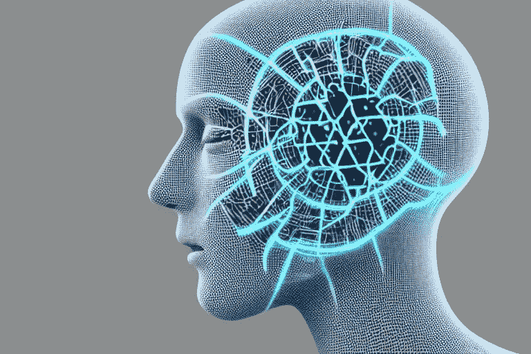

# 人工智能艺术家正在接管:稳定扩散

> 原文：<https://medium.com/mlearning-ai/ai-artists-are-taking-over-stable-diffusion-d92cadaaf67b?source=collection_archive---------2----------------------->

AI-generated image of an… AI — By Author

不到一个月前，StabilityAI 发布了一个开源的深度学习模型，可以让任何人生成艺术和图像。这是一个大新闻，因为即使你也可以访问它！我会向你展示它会生成什么样的图像，然后给你一个链接，你可以在那里自己生成艺术作品。让我们开始吧。

# 人类艺术家当心！