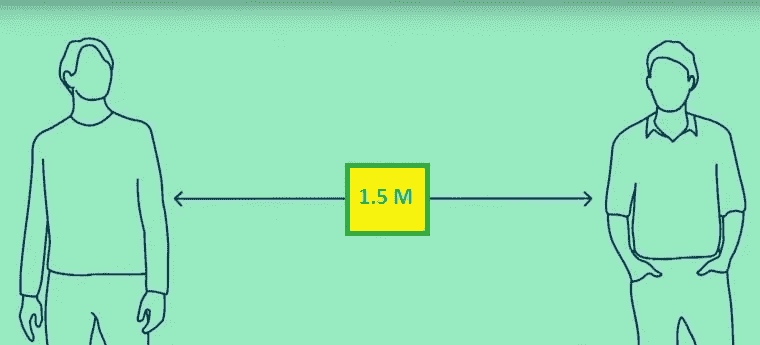

# “基于人工智能的 COVID 社交距离监控系统”:经济高效且易于部署的方法

> 原文：<https://medium.com/mlearning-ai/ai-based-covid-social-distance-monitoring-system-cost-effective-easy-deployable-approach-cbee1dbd37c7?source=collection_archive---------1----------------------->



疫情冠状病毒已经成为全球的主要威胁。事实证明，物理隔离和佩戴口罩能有效控制病毒传播。去年，我自己开发并在我的雇主、 [TVS Motor](https://www.tvsmotor.com/) 和 [Group of Companies](http://www.tvsgroup.com/pages/group.htm) 的各个工厂/办公室(印度/国外)部署了“基于人工智能的 COVID 社交距离监控系统&口罩佩戴检测系统”。我的软件仍然在所有显示违规警告的地方工作。我必须说，我在关键时刻完成的这项工作获得了多个奖项。

*先决条件:计算机视觉、行人检测、深度学习、YOLO、OpenCV、COVID 协议*

社交距离监控系统的基础取自吴恩达的 [Landing-AI](https://landing.ai/landing-ai-creates-an-ai-tool-to-help-customers-monitor-social-distancing-in-the-workplace/) 。在那里，提到了通过变形透视图来获得鸟瞰图；找出人与人之间的实际距离。
然而，由于高计算量，这是一个昂贵的过程；因为每一帧都需要变形。我们不需要两个人之间非常精确的距离，对吗？它应该大约是 6 英尺。
此外，摄像机校准需要部署团队在现场。
因此，为了消除上面的挑战，我对这个想法做了如下调整:&有了它，我可以在多个地方(印度/国外)远程部署，也就是说，实际上不用去现场。
基本原理是，当一个人离开摄像机时，他的高度会变小&它(大部分)随距离线性变化。当然，我假设，世界坐标系&相机坐标系有相同的轴方向，这是经常发生的。

Let，h->屏幕中要监控的人的最小高度(即屏幕中高度小于 h 的人将不被考虑)；d->屏幕中的最小安全距离(== 6 英尺。在现实世界中)；
H- >被检测的 2 个人在屏幕中的平均身高；
D- >检测到 2 个以上人员在屏幕上的投影安全距离；

然后，

> *(深/高)==(深/高)*

我们有边界框的坐标，所以 H 是可用的。因此，如果我们知道比率(d/h)，我们可以得到 d。对于大多数场景(我使用了放置在不同位置的大约 15 个不同类型/品牌的摄像机)，我发现(h/d) ~2.5(假设工作区域没有小孩；孩子身高较低)给出了相当好的结果。观察几个警报快照后，您可以微调该值。
现在如果，E- >上述两个人之间的欧几里德距离(我们可以从包围盒的坐标中得到)，那么当，E < D 时，将出现安全距离违反的警报。

我已经将这个解决方案部署到大约 100 台摄像机上，并且成功了；尽管如此，该系统在所有地方都能正常工作，对违规行为发出警报。不用说，会有几个误报(能说一下原因吗？写在评论里。);但是，在这个系统中，我们担心假阴性，对吗？只要人被检测到，假阴性将是零。

下面给出了使用 OPENCV DNN 模块的“PeopleDetector”的 python 类:

```
import itertools
import cv2
import numpy as np

class PeopleDetector:
    flag = 0
    def __init__(self, mindist, minheight,
                yolocfg='yolo_weights/yolov3.cfg',
                yoloweights='yolo_weights/yolov3.weights',
                labelpath='yolo_weights/coco.names',
                confidence=0.5,
                nmsthreshold=0.5,
                ):
        self._yolocfg = yolocfg
        self._yoloweights = yoloweights
        self._confidence = confidence
        self._nmsthreshold = nmsthreshold
        self._labels = open(labelpath).read().strip().split("\n")
        self._colors = np.random.randint(
            0, 255, size=(len(self._labels), 3), dtype="uint8")
        self._net = None
        self._layer_names = None
        self._boxes = []
        self._confidences = []
        self._classIDs = []
        self._centers = []
        self._layerouts = []
        self._MIN_DIST = mindist
        self._mindistances = {}
        self._heights = []
        self._MIN_HEIGHT = minheight

    def load_network(self):
        self._net = cv2.dnn.readNetFromDarknet(
            self._yolocfg, self._yoloweights)
        self._net.setPreferableBackend(cv2.dnn.DNN_BACKEND_OPENCV)
        self._net.setPreferableTarget(cv2.dnn.DNN_TARGET_CPU)
        self._layer_names = [self._net.getLayerNames()[i[0] - 1]
                             for i in self._net.getUnconnectedOutLayers()]
        print("people-detector model loaded successfully\n")

    def predict(self, image):
        blob = cv2.dnn.blobFromImage(image, 1 / 255.0, (416, 416),
                                     [0, 0, 0], 1, crop=False)
        self._net.setInput(blob)
        self._layerouts = self._net.forward(self._layer_names)
        return(self._layerouts)

    def process_preds(self, image, outs, bbox_flag):
        (frameHeight, frameWidth) = image.shape[:2]
        for out in outs:
            for detection in out:
                scores = detection[5:]
                classId = np.argmax(scores)
                if classId != 0:  # filter person class
                    continue
                confidence = scores[classId]
                if confidence > self._confidence:
                    center_x = int(detection[0] * frameWidth)
                    center_y = int(detection[1] * frameHeight)
                    width = int(detection[2] * frameWidth)
                    height = int(detection[3] * frameHeight)
                    left = int(center_x - width / 2.0)
                    top = int(center_y - height / 2.0)
                    if height>self._MIN_HEIGHT and width<frameWidth/2.0 and height<frameHeight/2.0:
                        self._classIDs.append(classId)
                        self._confidences.append(float(confidence))
                        self._boxes.append([left, top, width, height])
                        #self._centers.append((center_x, center_y))
                        #self._heights.append(height)
        indices = cv2.dnn.NMSBoxes(
            self._boxes, self._confidences, self._confidence, self._nmsthreshold)

        for j in indices:
            i = j[0]
            box = self._boxes[i]
            left = box[0]
            top = box[1]
            width = box[2]
            height = box[3]
            center_x = int(left + width/2.0)
            center_y = int(top + height/2.0)
            self._centers.append((center_x, center_y))
            self._heights.append(height)
            self.find_min_distance(self._centers, self._heights)
            if len(self._mindistances)>0: PeopleDetector.flag = 1
            else: PeopleDetector.flag = 0
            if bbox_flag:
                self.draw_pred(image, self._classIDs[i], self._confidences[i], left,
                           top, left + width, top + height)

        return PeopleDetector.flag #self._centers

    def clear_preds(self):
        self._boxes = []
        self._confidences = []
        self._classIDs = []
        self._centers = []
        self._layerouts = []
        self._mindistances = {}
        self._heights = []
        PeopleDetector.flag = 0

    def draw_pred(self, frame, classId, conf, left, top, right, bottom):
        cv2.rectangle(frame, (left, top), (right, bottom), (255, 178, 50), 2)
        for k in self._mindistances:
            cv2.line(frame, k[0], k[1], (0, 0, 255), 3)

    def find_min_distance(self, centers, heights):
        centers = self._centers
        heights = self._heights
        temp = list(itertools.combinations(heights, 2))
        comp = list(itertools.combinations(centers, 2))
        ecdist = []
        avghgt = []
        for pts in comp:
            ecdist.append(np.linalg.norm(np.asarray(pts[0])-np.asarray(pts[1])))
        for hts in temp:
            avghgt.append((hts[0]+hts[1])/2.0)
        for i in range(len(avghgt)):
            rel_dist = self._MIN_DIST*avghgt[i]/self._MIN_HEIGHT
            if ecdist[i] < rel_dist:
                self._mindistances.update({comp[i]: ecdist[i]})
```

**样本输出结果可以在** [**这里找到**](https://drive.google.com/drive/folders/131P928vQmHApWGeonw9MgHZDhYhJebKd?usp=sharing) **。请注意，图像/视频中的红线/方框表示违反了 COVID 协议。**

你可以用人的宽度来代替高度，但是不推荐这样做；能说说原因吗？写在评论里！