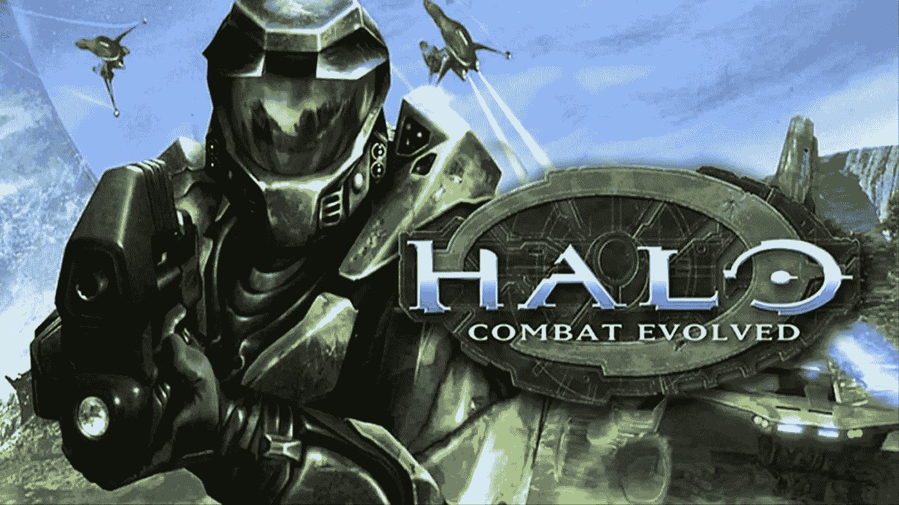
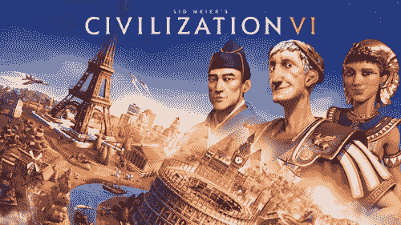

# AI 在游戏中作弊

> 原文：<https://medium.com/mlearning-ai/ai-cheating-in-games-583e333677ce?source=collection_archive---------5----------------------->

这篇文章将深入探讨人工智能作弊是如何在游戏行业中被用来使游戏变得更有趣的。

在游戏中，人工智能指的是电脑玩家在与人竞争时必须遵守的一套准则。找到一个人工智能真正公平的游戏是不寻常的。人工智能并不总是以同样的方式比赛；根据游戏、可用资源和开发者的能力，AI 偶尔会玩得很好，而其他时候会作弊。大多数时候，AI 不会以与人类相同的方式或相同的限制来玩游戏。玩家通常不知道人工智能作弊的技巧。

就该计划而言，人工智能(AI)作弊需要游戏开发商让代理访问玩家在相同情况下不会拥有的数据。作弊偶尔会被用来使游戏更加刺激和具有挑战性，并防止人类玩家轻松击败人工智能代理并赢得游戏。

为了降低难度，人工智能代理偶尔会故意欺骗玩家，给玩家比人工智能玩家更多的生命值、更多的伤害或更少的资源。此外，人工智能作弊偶尔会由游戏中的设计缺陷引起。当开发人员试图训练人工智能系统时，代理人会错误地学习。

在某种意义上，人工智能作弊正在演变成一个重要的游戏组件，无法阻止。一个 AI 智能体不是一个拥有超人智慧的人；相反，它是一个有限制和一套规则的程序。在一场比赛中做出决定之前，AI 必须完全知情。基于玩家的移动和游戏设置，做出决定。

## **人工智能如何作弊有时被用来使电脑游戏人工智能显得聪明**

人工智能作弊是一种至关重要的游戏策略，可以让玩家长时间参与进来，并使游戏更有趣和更具挑战性。如果游戏一开始就结束，或者如果人类玩家能够击败 AI 代理，那么游戏就不会特别刺激或复杂。既然人类玩家无法检测到 AI 作弊，那就应该使用。

在电子游戏的人工智能背景下，作弊是指程序员让代理获得玩家在相同情况下不会获得的知识和行为。根据 1994 年的《计算机游戏世界》，众所周知，许多人工智能“欺骗”(或者至少是“捏造”)来跟上人类玩家。

总的来说，如果不是这种优势，在战略创造力至关重要的游戏中，人类可能会在最少的试错后轻松击败 AI。人工智能中作弊的使用展示了人工创造的“智能”的局限性。作弊被用来提高日常表现；在很多情况下，只要玩家不知道结果，就可能被认为是合适的。

如果人工智能的固有优势导致代理人的行为与人类玩家不同，玩家可能会将这些优势视为作弊，即使计算机天生的惊人速度和准确性不被视为作弊。

2001 年发布的《光晕:战斗进化》(Halo: Combat Evolved)中有一些人工智能作弊，使游戏更刺激，玩家更专注于游戏。第一人称射击游戏，参与者扮演军士长的角色，与步行或乘坐车辆的各种外星敌人进行战斗。敌人部署压制火力和手榴弹，并相当聪明地使用掩护。某些对手在他们的领袖死亡后会逃跑，因为团队状况会影响个人。在小细节上有很多关注，对手回击手榴弹，当你扰乱他们时，团队成员进行报复。底层的“行为树”技术在游戏中变得广受欢迎。

同样，“*潜行者”*是一款第一人称射击生存恐怖游戏，参与者必须与军事人员、人工实验品以及被称为潜行者的雇佣兵战斗。假设难度等级设置到最大。在这种情况下，玩家将面对的许多敌人将采取各种战斗策略，包括治疗受伤的队友，发出命令，智胜对手，并在需要的地方使用武器。

在《文明》系列游戏中，无数人工智能作弊的例子被披露。像《文明》这样的回合制策略电子游戏从 1991 年就已经出现了。这些游戏的正式名称，像席德·梅尔的文明，通常包括席德·梅尔的名字。他创造了该系列的第一款游戏，并创造性地贡献给了其他大多数游戏。

## 结论

从我的角度来说，当我开发一个游戏时，我会有一些有偏见的算法来增加游戏的刺激性和快感。如果人工智能算法只在游戏中使用，人类玩家在习惯了游戏之后，有合理的可能性预测人工智能代理的运动。我们可以在游戏中加入一些人工智能作弊策略来增加游戏的复杂性和趣味性。然而，使用它们是至关重要的，因为人类玩家很容易发现它们。因此，当有一些作弊行为时，我们可以打破这一障碍，在游戏中获得一些令人兴奋的时刻，这将有助于玩家更好地参与游戏。例如，如果代理人想知道玩家是否在附近，他们可以获得类似人类的复杂传感器，或者通过向游戏引擎询问玩家的位置来绕过它。变化包括在第一人称射击游戏中的有利位置播种人工智能，或者在赛车游戏中提高人工智能的速度，以便它们可以赶上用户。如果没有，在玩了特定的时间后，玩家熟悉了算法，并开始预测即将到来的动作，这使得游戏体验很糟糕。所以我更喜欢在开发游戏算法的时候有一些偏见。

 [## Mlearning.ai 提交建议

### 如何成为 Mlearning.ai 上的作家

medium.com](/mlearning-ai/mlearning-ai-submission-suggestions-b51e2b130bfb)